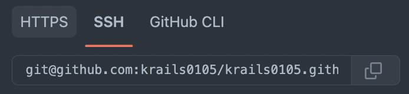

# Issue
git PR을 요청받을 때, 너무 많은 commit으로 인해 변경점을 추적하기 어려울 때가 많았다.
여러 commit을 하나로 합쳐 브랜치의 변경점을 보다 쉽게 추적하고 싶다.

# Resolution

## git rebase -i 

과거 커밋내역들을 통합하는 명령어이다.

```
git rebase -i HEAD~~
```

테스트를 위해 작업 중인 브랜치에 아래와 같이 5개의 file을 만든다

```shell
$ touch 1
$ touch 2
$ touch 3
$ touch 4
$ touch 5
$ git status
...
Untracked files:
  (use "git add <file>..." to include in what will be committed)
        1
        2
        3
        4
        5
```

5개의 commit을 만들기 위해 각 파일을 add할 때마다 commit을 만든다

```shell
$ git add 1
$ git commit -m "feature: add 1"
$ git add 2
$ git commit -m "feature: add 2"
$ git add 3
$ git commit -m "feature: add 3"
$ git add 4
$ git commit -m "feature: add 4"
$ git add 5
$ git commit -m "feature: add 5"
```

아래와 같이 5개의 커밋이 만들어 짐을 확인할 수 있다

```shell
$ git log --oneline
39f264ae (HEAD -> test/test) feature: add 5
a24b8a9c feature: add 4
0f33276d feature: add 3
d4b73b68 feature: add 2
3df3e3c7 feature: add 1
```


```
git config --global user.name krails0522
git config --global user.email shkim@gmail.com
```


이 경우에는 --local 인자를 이용하여 사용할 레포에 원하는 git user 설정을 설정을 해주면 된다.

```
git config --local user.name krails0105
git config --local user.email krails.kim@gmail.com
```

2. git URL를 추가 계정에 맞게 설정을 해줘야 함

아래와 같이 git clone에서 URL은 git@github.com:{your_id}/{repo_name}.git 형식으로 설정이 되어있다.



GitHub에서 복사한 URL: git@github.com:{your_id}/{repo_name}.git
수정해야 하는 URL:  git@github.com-{your_id}:{your_id}/{repo_name}.git  
수정 예:  git@github.com-kibua20:kibua20/test.git


```
git clone git@github.com-krailskim:krails0105/krails0105.github.io.git

git remote add origin git@github.com-krailskim:krails0105/krails0105.github.io.git
```

```shell 
Host github.com-krailskim
  HostName github.com
  User git
  IdentityFile ~/.ssh/id_rsa_krailskim
```

# Conclusion
이번에는 이전 index.html에 확장하여 jekyll을 이용한 페이지 생성을 하였다. 

여기서부터는 개발자가 아니면 더이상 일반인이 접근하기는 힘든 영역이라고 생각한다. 아직 페이지 구성만하고 있는데도 다른 블로그보다 난이도가 훨씬 어렵다. 익숙해지면 훨씬 수월하겠지..?

다음에는 한번 더 확장하여 jekyll의 오픈소스 테마를 적용하여 보겠다.


# Reference

https://kibua20.tistory.com/190

https://jekyllrb.com/docs/

https://zeddios.tistory.com/1222

https://leop0ld.tistory.com/17

https://ideveloper2.tistory.com/80


