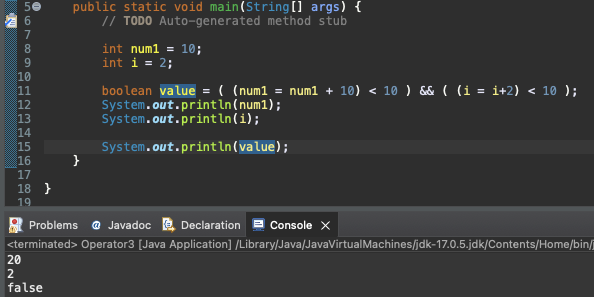

# Introduction

---

논리 연산에서 주의해야할 동작인 ***short-circuit evaluation(단축 평가 논리 계산 or 단락 회로 평가)***에 대하여 알아보자

# short-circuit evaluation

---

논리 곱( && ) 또는 논리 합( || ) 연산이 진행될 때, 앞의 항의 결과에 따라 뒤의 항의 평가 여부가 결정되는 동작

- 논리 곱( && )의 경우 두 항이 모두 true여야 결과가 true이기 때문에 앞의 항의 결과가 false이면 뒤의 항의 결과에 상관없이 연산 결과는 무조건 false가 된다.

- 논리 합( || )의 경우 두 항이 모두 false여야 결과가 false이기 때문에 앞의 항의 결과가 true이면 뒤의 항의 결과에 상관없이 연산 결과는 무조건 true가 된다.

- 아래 예제에서 value에 논리 값을 대입하기 위한 논리 연산이 진행되는데, ***&& 연산에서 앞의 항이 false이기 때문에 i =  i+2이 포함된 뒤의 항은 실행되지 않았다*** (i의 값이 그대로 2로 출력되는 것을 확인)



- 좀더 자세히 살펴보자

```java
int num1 = 10;
int i = 2
boolean value = (num1 = num1 + 10) < 10) && ((i = i+2) < 10) 
  
// 1. (num1 = num1 + 10)이 실행되어 num1변수가 20으로 대입됨
// 2. (num1 = num1 + 10) < 10)이 실행되는데 num1이 20으로 대입되었으므로 해당 항은 False
// 3. 다음 항인 ((i = i+2) < 10)은 생략되어 실행되지 않음, (i = i+2)가 실행되지 않았으므로 i는 그대로 2
// 4. value에 false가 대입
  
// 수행 결과 num1 == 20, i == 2, value == false  
```

#  Conclusion

---

이번 포스트에서는 논리 연산시 주의해야 하는 short-circuit evaluation

이는 Java에 종속된 개념이 아니라 Java Script와 같은 다른 프로그래밍 언어에서도 적용되는 개념이기 때문에 반드시 익히고 가는 것이 좋다.

# Reference

---

Fastcampus JAVA기초 강의 - 박은종 강사님
