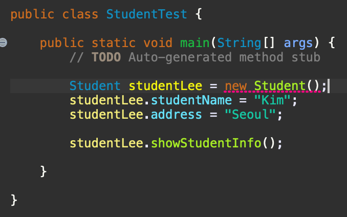

# Introduction

---

객체 지향 프로그래밍 중 생성지에 대해서 알아본다.

# 생성자(Contstructor)

---

- 객체(인스턴스)를 생성할 때 new 키워드를 이용하여 생성하게 되는데 이때 생성자가 호출 된다.

```java
Student student = new Student(); // Student클래스를 이용하여 student 객체가 생성되는데 이때 생성자 호출
```

- 생성자는 객체를 초기화 하는 동작들로 이루어지게 되는데 보통 멤버 변수 초기화에 사용되곤 한다.
- 생성자는 여러개 만들 수 있으며 하나의 클래스에는 반드시 하나 이상의 생성자가 포함되어야 한다.
- 반환 값이 없으며 상속되지 않는 특징이 있고 생성자의 이름은 클래스의 이름과 동일하게 설정해야 한다.

```java
public class Student {
	
	public int studentID;
	public String studentName;
	
	public Student() { 		  						// 생성자
		studentID = 0;										// 멤버 변수 초기화
		studentName = "KSH";							// 멤버 변수 초기화
	}

	public void showStudentInfo() {
		System.out.println(studentName);
	}
	
	public String getStudentName() {
		return studentName;
	}
	
}

```

- 위 코드에서는 Student 클래스의 생성자에서 각 멤버변수들을 초기화 하고 있으며 함수 끝에 반환 값이 없는 것을 확인할 수 있다.
- 만약 new Student(); 를 이용하여 객체를 생성하면 위 생성자가 호출되어 ID가 0이고 Name이 "KSH"인 인스턴스가 생성되는 것이다.

## 기본(디폴트) 생성자

- 위의 생성자 특징을 보면 하나의 클래스에는 반드시 생성자가 하나 이상 있어야 한다고 했는데 만약 아래와 같이 클래스 내에서 생성자를 따로 정의해주지 않으면 어떻게 될까?

````java
public class Student {
	
	public int studentID;
	public String studentName;

	public void showStudentInfo() {
		System.out.println(studentName);
	}
	
	public String getStudentName() {
		return studentName;
	}
	
}
````

```java
Student student = new Student(); // 디폴트 생성자 호출
```

- 클래스 내에서 생성자를 따로 정의해주지 않으면 에러가 날 것으로 예상할 수 있지만 에러가 나지 않는다. 바로 디폴트 생성자 때문이다.
- 디폴트 생성자란 매개 변수가 없고 구현부가 없는 생성자인데 클래스에 아무 생성자가 구현되어있지 않으면 컴파일러가 자동으로 생성자를 생성해 주게 되는데 이를 디폴트 생성자라고 한다.
- 디폴트 생성자를 코드로 표현해보면 아래와 같다.

```java
public class Student {
	
	public int studentID;
	public String studentName;
	
	public Student() { 	// 디폴트 생성자, 해당 코드가 없어도 클래스 내에 생성자가 없으면 컴파일러가 자동으로 생성해준다.
	}

	public void showStudentInfo() {
		System.out.println(studentName);
	}
	
	public String getStudentName() {
		return studentName;
	}
	
}
```

- 주의해야 할 점은 클래스 내에 생성자가 하나라도 있으면 디폴트 생성자가 생성되지 않는다는 점이다.

```java
public class Student {
	
	public int studentID;
	public String studentName;
	public String address;
	
	
	public Student(int id, String name) {
		studentID = id;
		studentName = name;
	}
	
	public void showStudentInfo() {
		System.out.println(studentName + "," + address);
	}
	
	public String getStudentName() {
		return studentName;
	}
	
}
```

- 위 클래스는 생성자가 존재하기 때문에 컴파일러는 디폴트 생성자를 생성하지 못하고 아래와 같이 디폴트 생성자를 이용하여 객체를 만들 시 에러가 나게 된다.

**

## 생성자 오버로딩

- 생성자는 하나 이상 만들 수 있는데 동일한 이름의 함수를 두 개 이상 만드는 것을 ***오버로딩***이라고 하며 아래와 같이 생성자를 두 개 이상 만드는 것을 ***생성자 오버로딩***이라고 한다.

```java
public class Student {
	
	public int studentID;
	public String studentName;
	public String address;
	
	public Student() { 		  						
		studentID = 0;										
		studentName = "KSH";							
	}
  
	public Student(int id, String name) {
		studentID = id;
		studentName = name;
	}
	
	public void showStudentInfo() {
		System.out.println(studentName + "," + address);
	}
	
	public String getStudentName() {
		return studentName;
	}
	
}
```

#  Conclusion

---

이번 포스트에서는 객체 지향 프로그래밍 중 생성자에 대해서 알아보았다.

# Reference

---

Fastcampus JAVA기초 강의 - 박은종 강사님
