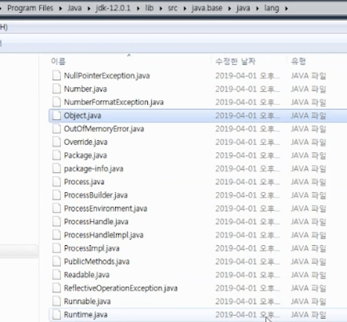
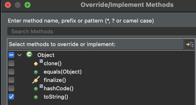

# Introduction

---

Java의 Object class에 대해 알아본다.


# Object class

---

모든 클래스의 최상위 클래스로 java.lang.Object에 위치해있는 기본 클래스이다.

1. ***모든 클래스는 Object 클래스에서 상속 받은 클래스이다.*** 
   - 모든 클래스는 컴파일 과정에서 extends Object가 포함된다
   - 이때 import java.lang.Object를 하지 않아도 컴파일러가 자동으로 생성해준다
   - 모든 클래스는 Object 클래스를 상속받기 때문에 ***모든 클래스의 인스턴스는 Object 클래스로 Upcasting 가능***
2. ***모든 클래스는 Object의 메서드를 사용하거나 오버라이딩하여 사용할 수 있다.***


- window의 경우 JDK폴더의 아래 경로에 Object클래스가 있음
  - {자바가 설치된 폴더} / jdk / lib / src / java.base / java / lang

**


# Object class method

---

### toString()

객체의 정보를 string으로 나타내고 싶을때 사용, 객체를 생성하고 print문으로 출력해도 호출된다.

아래는 toString()의 원형인데 ***class이름 + '@' + 해시코드***로 이루어져 있음을 알 수 있다.

```java
getClass().getName() + '@' + Integer.toHexString(hashCode)
```

toString 메서드를 overriding하면 클래스의 정보를 원하는 문자열로 출력 가능한데 Java의 기본 클래스 중에는 이미 toString 메서드를 오버라이딩하여 사용하고 있는 클래스들이 많다. (String, Integer, Calander 등..)

이클립스에서는 클래스를 정의하고 마우스 오른쪽버튼 -> source -> overriding을 클릭하면 toString 오버라이딩 함수를 자동 생성할 수 있다.

**


아래 예시 코드를 보고 toString의 실행 결과를 살펴보자

```java
class Book{
	String title;
	String author;
	
	public Book(String title, String author) {
		this.title = title;
		this.author = author;
	}
}

public class ToStringTest {

	public static void main(String[] args) {
		// TODO Auto-generated method stub
		
		Book book = new Book("Land", "Park");
		System.out.println(book);					 // 인스턴스의 주소값(해시코드) 출력
		
		String str = new String("Land");
		System.out.println(str);            // 오버라이딩된 str.toString()이 호출됨
		System.out.println(str.toString());

	}

}

----------

object.Book@5674cd4d
Land
Land
```

- 일반 객체에서 인스턴스 변수를 출력하면 ***인스턴스의 주소값이(Hashcode)*** 출력됨 (class이름 + '@' + 해시코드)
- ***String 클래스***의 인스턴스(참조 변수)를 출력하면 ***인스턴스에 저장된 문자열***이 출력되는데 ***Object의 method를 오버라이딩한 toString이 호출***되는 것


```java
class Book{
	String title;
	String author;
	
	public Book(String title, String author) {
		this.title = title;
		this.author = author;
	}

	@Override
	public String toString() {
		// TODO Auto-generated method stub
		return author + "," + title;
	}
	
}

public class ToStringTest {

	public static void main(String[] args) {
		// TODO Auto-generated method stub
		
		Book book = new Book("Land", "Park");
		System.out.println(book);
	}

}

----------

Park,Land
```

- Book 클래스에서 toString을 오버라이딩 하였기 때문에 객체를 print하였을 때, 해시코드가 아닌 원하는 출력 값이 나온다.


### equals()

두 객체가 논리적으로 동일함을 재정의하는 메서드

물리적으로 다른 메모리에 위치한 객체라도 논리적으로 동일함을 구현하기 위해 사용

```java
public class EqualsTest {

	public static void main(String[] args) {
		
		String str1 = new String("abc");
		String str2 = new String("abc");
		
		System.out.println(str1 == str2);				// Object의 equals() 호출, 해시코드(주소, 물리적 위치) 값을 비교
		System.out.println(str1.equals(str2));	// String의 equals() 호출, 논리적 비교(저장된 string값을 비교)

	}
}

----------

false
true
```

- 인스턴스간 == 연산은 Object의 equals함수를 호출함
- Object클래스의 equals함수는 물리적 위치(hashcode)가 같은지를 체크 String 클래스에서 재정의한 equals는 문자열이 같은지의 여부를 체크


```java
class Student{
	int studentNum;
	String studentName;
	
	public Student(int studentNum, String studentName) {
		this.studentNum = studentNum;
		this.studentName = studentName;
	}

	@Override
	public boolean equals(Object obj) {
		
		if(obj instanceof Student) {									// 1. 비교 대상의 타입이 같은 지 비교
			Student std = (Student)obj;
			return (this.studentNum == std.studentNum);	// 2. 비교 대상의 studentNum 비교
		}
		return false;
	}
}

public class EqualsTest {

	public static void main(String[] args) {
		// TODO Auto-generated method stub
		
		Student Lee = new Student(100, "Lee");
		Student Lee2 = Lee;
		Student Shin = new Student(100, "Shin");

		System.out.println(Lee == Lee2);
		System.out.println(Lee == Shin);			 // Object의 equals() 호출, 해시코드 비교 -> Fasle
		System.out.println(Lee.equals(Shin));	 // Student의 equals() 호출, 1. 타입이 같고 2. studentNum이 같음 -> True
	}

}
-----------

true
false
true
```


### hashCode()

가상머신 상에 인스턴스가 저장된 주소를 10진수로 반환

***서로 다른 메모리에 위치한 객체도 hashCode()의 반환 값이 같다면 동일 인스턴스로 취급*** 될 수 있다. (== 연산 결과가 true로 반환됨)

Integer 클래스의 경우 Object의 hashCode 메서드가 오버라이딩되어 인스턴스가 가지고 있는 정수값이 hashCode처럼 쓰인다

- 실제 Integer의 인스턴스가 가지고있는 주소값을 보기 위해서는 System.identifyHashCode 함수를 쓴다

```java
public static void main(String[] args) {
		Integer i1 = 100;		// 해시코드도 100으로 저장됨
		Integer i2 = 100;
		
		System.out.println(i1.equals(i2));
		System.out.println(i1 == i2);					// true
		System.out.println(i1.hashCode());
		System.out.println(i2.hashCode());

		System.out.println(System.identityHashCode(i1));	// 실제 해시코드 리턴
		System.out.println(System.identityHashCode(i2));
}

------

true
true
100
100
698474600
698474600
```

- 위 예시 코드를 보면 i1, i2는 분명 다른 객체로 생성되었음에도 hashCode가 동일하기 때문에 == 연산이 true로 리턴된다.


### clone()

원본 객체와 동일 속성을 가지는 객체를 복사해주는 메서드

이때, OOP의 정보 은닉에 위배될 수 있기 때문에 clone method를 오버라이딩하기 위해서는 ***Cloneable 인터페이스 명시 필요***

- clone()을 호출하려면 ***CloneNotSupportedException throw 추가 필요***

```java
class Book implements Cloneable{ // Clonealbe을 implements해야 clone method 사용 가능 (마크 인터페이스)
	String title;
	String author;
	
	public Book(String title, String author) {
		this.title = title;
		this.author = author;
	}

	@Override
	public String toString() {
		return author + "," + title;
	}

	
	@Override
	protected Object clone() throws CloneNotSupportedException {
		
		return super.clone();
	}
	
	
}

public class ToStringTest {

	public static void main(String[] args) throws CloneNotSupportedException {
		
		Book book = new Book("Land", "Park");
		
		System.out.println(book);
		
		Book book2 = (Book)book.clone(); // "Land", "Park"이 복사됨
		

	}
}
```


### finalize()

```java
class Book implements Cloneable{
		String title;
		String author;
		
		public Book(String title, String author) {
			this.title = title;
			this.author = author;
		}
	
		@Override
		public String toString() {
			return author + "," + title;
		}
	
		@Override
		protected void finalize() throws Throwable {
			super.finalize();
		}
}
```

- Object의 finalize method는 ***인스턴스가 직접 호출하는 method가 아니다.***
- ***인스턴스가 heap 메모리에서 해제될때 garbage collector에서 호출되는 함수***  → resource의 해제나, socket을 닫는 등의 역할


#  Conclusion

---

Java의 Object class와 Object class의 메서드들에 대하여 간략히 알아보았다.

클래스를 좀더 우아하게(?) 설계하기 위해서 알고 가야 하는 내용들이라고 생각된다.


# Reference

---

Fastcampus JAVA기초 강의 - 박은종 강사님
