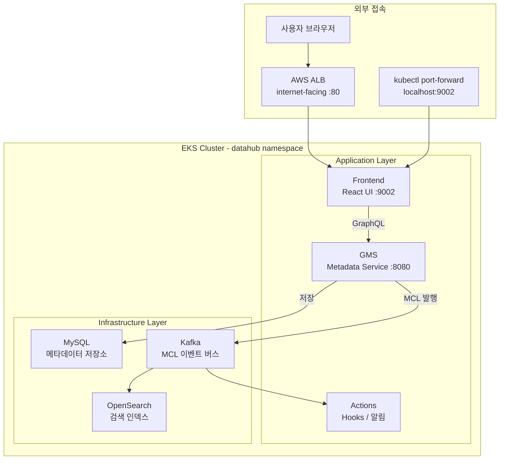
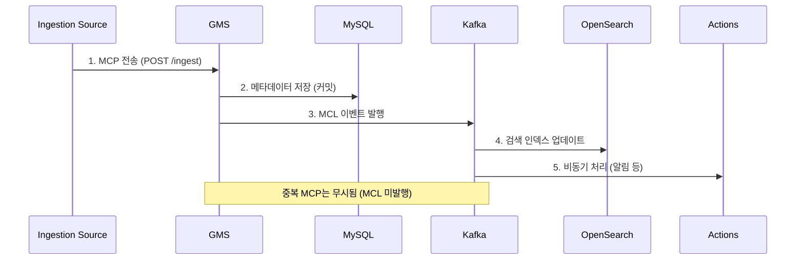
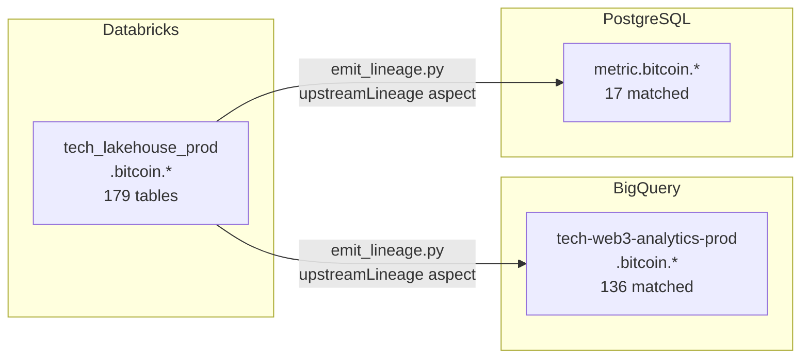

## 들어가며

DataHub를 EKS에 Helm으로 배포하고 Databricks, BigQuery, PostgreSQL 세 플랫폼의 메타데이터를 연결하는 작업을 마무리했습니다. 단순히 "배포 완료"에서 그치지 않고 크로스 플랫폼 lineage까지 구성하는 과정에서 아키텍처 전반을 이해할 필요가 있었습니다.

이 글에서는 다음 내용을 다룹니다.

- DataHub EKS 구성 요소가 각각 어떤 역할을 하는지
- 메타데이터가 어떤 경로로 흘러가는지 (MCP → GMS → MySQL → Kafka → OpenSearch)
- Databricks / BigQuery / PostgreSQL ingestion 시 주의할 점
- 크로스 플랫폼 lineage를 직접 등록하는 방법
- DataHub 텔레메트리 차단 방법

### 사전 지식

이 글은 다음 경험이 있는 독자를 대상으로 합니다.

- EKS 클러스터에서 Helm chart를 배포해 본 경험
- `kubectl`, `port-forward` 등 기본 Kubernetes CLI 사용 경험
- Databricks Unity Catalog, BigQuery, PostgreSQL 중 하나 이상 운영 경험

---

## DataHub EKS 구성 요소

DataHub를 Helm으로 배포하면 크게 **Application Layer**와 **Infrastructure Layer**로 나뉩니다.



### Application Layer

| 컴포넌트 | 역할 | 포트 | 리소스 권장 |
|---|---|---|---|
| **Frontend** | React 기반 UI. 사용자가 직접 접근하는 진입점 | 9002 | 250m CPU / 512Mi |
| **GMS** (Generalized Metadata Service) | 메타데이터 CRUD API 서버. 모든 읽기/쓰기의 중심. MCP를 받아 검증하고 MySQL에 커밋한 뒤 MCL을 Kafka로 발행 | 8080 | 500m CPU / 2Gi (최소) |
| **Actions** | Kafka의 MCL 토픽을 구독해 이벤트 기반 후처리 수행 (Slack 알림, 액세스 제어 등) | - | 300m CPU / 256Mi |

GMS는 DataHub의 핵심입니다. 모든 메타데이터 변경은 GMS의 `/ingest` 엔드포인트를 거칩니다. Ingestion CLI, REST Emitter, Frontend UI 모두 결국 GMS에 MCP를 전송하는 클라이언트입니다.

### Infrastructure Layer

| 컴포넌트 | 역할 | 복구 가능성 |
|---|---|---|
| **MySQL** | 커밋된 메타데이터의 영구 저장소. source of truth | 백업 필수 |
| **Kafka** | MCL(Metadata Change Log) 이벤트 버스. 컴포넌트 디커플링 | 재시작 가능 |
| **OpenSearch** | 검색 및 브라우징용 인덱스. MySQL에서 재생성 가능한 캐시 | 재생성 가능 |
| **ZooKeeper** | Kafka 코디네이터 (KRaft 모드가 아닌 경우) | Kafka와 함께 관리 |

OpenSearch가 죽어도 MySQL만 살아있으면 전체를 복구할 수 있다는 점이 이 아키텍처의 장점입니다. 반대로 MySQL이 유실되면 모든 메타데이터가 사라지므로, MySQL PVC 백업이 가장 중요합니다.

### 비용

기존 EKS 클러스터의 Spot 인스턴스 빈 자리를 활용하면 Pod 추가 비용은 거의 없습니다. 로드 밸런서 비용만 발생합니다.

| 항목 | 비용 |
|---|---|
| ALB (internet-facing, Frontend 노출용) | ~$16/월 |
| NLB (internal, Helm 기본 생성) | ~$16/월 |
| Pod 추가 비용 | ~$0 (기존 Spot 노드 활용) |
| **합계** | **~$32/월** |

---

## 메타데이터 흐름: MCP와 MCL

DataHub의 핵심 설계 개념은 **MCP(Metadata Change Proposal)**와 **MCL(Metadata Change Log)**입니다. 이 두 개념을 이해하면 DataHub의 모든 동작을 설명할 수 있습니다.

- **MCP**: "이 테이블의 스키마를 이렇게 바꿔달라"는 **제안(proposal)**. 아직 커밋되지 않은 상태
- **MCL**: GMS가 MCP를 검증하고 MySQL에 커밋한 후 발행하는 **변경 기록(log)**. 불변의 이벤트

MCL은 DataHub의 공식 public API이므로, 외부 시스템이 Kafka를 구독해 메타데이터 변경에 실시간으로 반응할 수 있습니다 (예: 스키마에 PII 필드가 추가되면 즉시 접근 제어를 강화하는 등).



흐름을 단계별로 정리하면 다음과 같습니다.

1. **Ingestion Source**가 GMS의 `/ingest` 엔드포인트에 MCP를 전송합니다.
2. GMS가 MCP를 검증하고 **MySQL에 커밋**합니다. MySQL이 source of truth입니다.
3. 커밋에 성공하면 GMS가 **Kafka에 MCL 이벤트를 발행**합니다. 동일한 내용의 MCP가 중복 전송되면 변경 사항이 없으므로 MCL은 발행되지 않습니다.
4. Kafka Consumer(MAE Consumer)가 MCL을 읽어 **OpenSearch 인덱스를 업데이트**합니다.
5. **Actions Framework**도 Kafka의 MCL 토픽을 구독해 알림 등 후처리를 수행합니다.

---

## Ingestion 구성

Ingestion은 외부 데이터 소스의 메타데이터를 DataHub에 등록하는 과정입니다. YAML recipe 파일로 source(어디서 읽을지)와 sink(어디에 쓸지)를 정의하고, `datahub ingest -c <recipe>.yml` 명령으로 실행합니다.

### Databricks (Unity Catalog)

```yaml
# recipes/databricks.yml
source:
  type: unity-catalog
  config:
    workspace_url: "https://dbc-xxxxx.cloud.databricks.net"
    token: "${DATABRICKS_TOKEN}"
    include_table_lineage: true
    catalog_pattern:
      allow: ["tech_lakehouse_prod"]

sink:
  type: datahub-rest
  config:
    server: "http://datahub-gms:8080"
```

`datahub ingest -c recipes/databricks.yml`을 실행하면 Unity Catalog를 스캔해서 테이블 스키마, 설명, 소유자 등을 등록합니다. `tech_lakehouse_prod.bitcoin.*` 179개 테이블이 대상이었습니다.

> **참고**: Databricks source type은 `unity-catalog`입니다. Hive Metastore 기반이라면 `databricks` 타입을 사용합니다.

### BigQuery

BigQuery ingestion에서 핵심 포인트는 **`project_ids` 설정**입니다.

```yaml
# recipes/bigquery.yml
source:
  type: bigquery
  config:
    project_ids:
      - tech-web3-analytics-prod    # 테이블이 있는 프로젝트
      - tech-data-warehouse-prod    # dbt가 쿼리를 실행하는 프로젝트 (필수!)
    dataset_pattern:
      allow:
        - "tech-web3-analytics-prod.bitcoin"
        - "tech-web3-analytics-prod.raw_data.*"
        # ... 28개 데이터셋
    include_table_lineage: true
    lineage_parse_view_ddl: true

sink:
  type: datahub-rest
  config:
    server: "http://datahub-gms:8080"
```

**왜 `tech-data-warehouse-prod`가 `project_ids`에 들어가야 하는가?**

DataHub BQ source는 lineage를 추출할 때 `INFORMATION_SCHEMA.JOBS` 테이블에서 최근 쿼리 로그를 읽습니다. 이 조회에는 `bigquery.jobs.listAll` 권한이 필요합니다. dbt는 `execution_project`(여기서는 `tech-data-warehouse-prod`)에서 쿼리를 실행하므로, 쿼리 로그가 이 프로젝트에 남습니다. `project_ids`에 이 프로젝트가 없으면 쿼리 로그를 읽지 못해 **table-to-table lineage가 0건**이 됩니다.

`tech-data-warehouse-prod`를 추가한 후 lineage 결과: **96건 BQ 내부 table-to-table lineage** 추출 성공.

**dataset_pattern 누락 주의**

`dataset_pattern.allow`에 없는 데이터셋은 DataHub에 테이블이 등록되지 않습니다. dbt 모델이 참조하는 테이블이 DataHub에 없으면 lineage가 중간에 끊깁니다. `raw_data_tron`, `abstraction_raw_data`, `raw_data_fantom`, `cohort_metric` 등 누락된 데이터셋을 발견하고 추가했습니다.

### PostgreSQL

```yaml
# recipes/psql.yml
source:
  type: postgres
  config:
    host_port: "localhost:15432"   # kubectl port-forward로 연결
    database: metric
    username: "${PSQL_USER}"
    password: "${PSQL_PASSWORD}"
    schema_pattern:
      allow: ["bitcoin"]
    profiling:
      enabled: true
      profile_table_level_only: true

sink:
  type: datahub-rest
  config:
    server: "http://datahub-gms:8080"
```

PSQL의 경우 클러스터 외부에서 접근하려면 `kubectl port-forward`가 필요합니다. `localhost:15432`로 포트포워딩 후 ingestion을 실행했습니다.

`profile_table_level_only: true`는 테이블 수준의 row count, column count 등만 수집하고 컬럼별 통계(min, max, distinct 등)는 건너뜁니다. 테이블 수가 많을 때 프로파일링 시간을 크게 줄일 수 있습니다.

---

## 크로스 플랫폼 Lineage 등록

DataHub는 기본적으로 같은 플랫폼 내 lineage만 자동 추출합니다. Databricks → BigQuery, Databricks → PostgreSQL 같은 크로스 플랫폼 lineage는 커스텀 스크립트로 직접 등록해야 합니다.



### 동작 원리

1. DataHub에 등록된 Databricks bitcoin 테이블 목록을 검색 (179개)
2. BQ/PSQL bitcoin 테이블 목록과 테이블명 기준 매칭
3. 매칭된 테이블 쌍에 대해 `upstreamLineage` aspect를 GMS에 MCP로 등록

`emit_cross_platform_lineage.py`의 핵심 로직은 다음과 같습니다.

```python
# emit_cross_platform_lineage.py (핵심 부분)
from datahub.emitter.rest_emitter import DatahubRestEmitter
from datahub.emitter.mcp import MetadataChangeProposalWrapper
from datahub.metadata.schema_classes import (
    UpstreamLineageClass,
    UpstreamClass,
    DatasetLineageTypeClass,
)

emitter = DatahubRestEmitter(gms_server="http://datahub-gms:8080")

for table_name in matched_tables:
    upstream_urn = (
        "urn:li:dataset:(urn:li:dataPlatform:databricks,"
        f"tech_lakehouse_prod.bitcoin.{table_name},PROD)"
    )
    downstream_urn = (
        "urn:li:dataset:(urn:li:dataPlatform:bigquery,"
        f"tech-web3-analytics-prod.bitcoin.{table_name},PROD)"
    )

    lineage = UpstreamLineageClass(
        upstreams=[
            UpstreamClass(
                dataset=upstream_urn,
                type=DatasetLineageTypeClass.TRANSFORMED,
            )
        ]
    )
    # MCP를 GMS에 전송 → GMS가 MySQL에 커밋 → MCL 발행
    emitter.emit_mcp(
        MetadataChangeProposalWrapper(
            entityUrn=downstream_urn,
            aspect=lineage,
        )
    )
```

결과: **BQ 136개 + PSQL 17개** 크로스 플랫폼 lineage 등록 완료.

### Lineage 덮어쓰기 주의

BQ나 PSQL ingestion을 다시 실행하면 해당 플랫폼의 lineage aspect가 덮어써질 수 있습니다. 따라서 CronJob 스케줄에서 **ingestion 후 lineage 스크립트를 순서대로 실행**하도록 구성하는 것이 중요합니다.

```
# 실행 순서
1. datahub ingest -c recipes/databricks.yml
2. datahub ingest -c recipes/bigquery.yml
3. datahub ingest -c recipes/psql.yml
4. python emit_cross_platform_lineage.py   # 항상 마지막
```

---

## 텔레메트리 차단

DataHub Frontend에는 Mixpanel 텔레메트리가 하드코딩되어 있습니다. 환경변수로 비활성화를 시도해도 JS 번들에서 직접 호출하기 때문에 막히지 않습니다.

**해결 방법**: ALB 레벨에서 `/track` 경로를 차단하고, `/config` 응답에서 `tracking.isEnabled: false`를 반환하도록 ALB fixed-response를 구성합니다.

```yaml
# ALB Ingress annotations (일부)
# /track 요청을 204 No Content로 응답해 Mixpanel 전송 차단
alb.ingress.kubernetes.io/actions.track-fixed-response: >
  {"type":"fixed-response","fixedResponseConfig":{"statusCode":"204"}}

# /config 응답에서 텔레메트리 비활성화 플래그 반환
alb.ingress.kubernetes.io/actions.config-override: >
  {"type":"fixed-response","fixedResponseConfig":{
    "statusCode":"200",
    "contentType":"application/json",
    "messageBody":"{\"tracking\":{\"isEnabled\":false}}"
  }}
```

이 어노테이션은 AWS Load Balancer Controller의 `fixed-response` 액션을 사용합니다. Ingress spec의 `rules`에서 해당 경로를 `backend.service.name: <action-name>`, `backend.service.port.name: use-annotation`으로 연결하면 동작합니다.

`port-forward`를 사용하는 경우에는 `/track` 요청이 `localhost`로 향하기 때문에 외부로 나가지 않아 이 문제가 없습니다.

---

## 운영 시 주의할 점

### GMS 메모리 부족 (OOM)

Ingestion 중 GMS는 MCP 처리와 SQL 파싱을 동시에 수행해 메모리를 집중적으로 사용합니다. 초기 설정(1Gi request / 2Gi limit)에서 메모리 사용률이 108%에 달했습니다. **2Gi request / 3Gi limit**으로 증설 후 안정화됐습니다.

테이블 수가 수백 개 이상이라면 GMS 메모리를 넉넉하게 잡는 것을 권장합니다.

### OpenSearch 메모리 부족

검색 인덱스와 브라우징이 메모리 의존적입니다. 1Gi / 1Gi에서 검색이 느렸고, **2Gi / 2Gi**로 증설 후 개선됐습니다.

### Spot 노드 주의

Karpenter가 모든 Pod를 Spot 인스턴스에 배치하면 Spot 회수 시 GMS와 OpenSearch가 동시에 재시작될 수 있습니다. MySQL과 Kafka도 Spot에 올라간다면 PVC로 데이터 유실을 어느 정도 방지할 수 있지만, 이상적이지는 않습니다.

프로덕션 운영이라면 stateful 컴포넌트(MySQL, Kafka)는 `nodeSelector` 또는 `nodeAffinity`로 On-Demand 노드에 배치하는 것을 권장합니다.

### port-forward vs ALB 레이턴시

| 접속 방식 | 레이턴시 | 용도 |
|---|---|---|
| `kubectl port-forward` | ~10ms | 개발 중 빠른 확인, 로컬 ingestion 실행 |
| ALB 경유 | ~200ms | 팀 공유, CI/CD 연동, 외부 접근 |

---

## 다음 단계

- **HTTPS 적용**: ACM 인증서 발급 + ALB `alb.ingress.kubernetes.io/certificate-arn` 어노테이션 연결
- **Ingestion CronJob 구성**: Databricks → BQ → PSQL ingestion 후 `emit_cross_platform_lineage.py` 순서 실행
- **Actions 알림 설정**: 스키마 변경 감지 시 Slack 알림 연동
- **dbt 연동**: dbt Cloud / Core 메타데이터를 DataHub에 등록해 dbt 모델 lineage 자동화

---

## Reference

- [DataHub Architecture - Metadata Ingestion](https://datahubproject.io/docs/architecture/metadata-ingestion)
- [DataHub MCP & MCL 심화](https://datahubproject.io/docs/advanced/mcp-mcl)
- [DataHub Kubernetes 배포 가이드](https://datahubproject.io/docs/deploy/kubernetes)
- [DataHub Python SDK - Emitter](https://datahubproject.io/docs/metadata-ingestion/as-a-library)
- [DataHub BigQuery Source 문서](https://datahubproject.io/docs/generated/ingestion/sources/bigquery)
- [AWS Load Balancer Controller - Ingress Annotations](https://kubernetes-sigs.github.io/aws-load-balancer-controller/latest/guide/ingress/annotations/)
- 관련 포스트: [EKS ALB Ingress로 DataHub 외부 접속 설정하기](/devops/2026/03/12/eks-alb-ingress-datahub.html)
