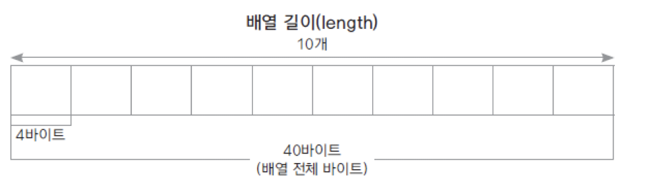
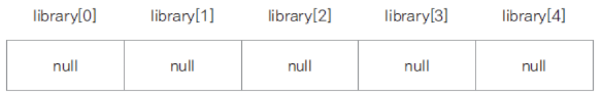
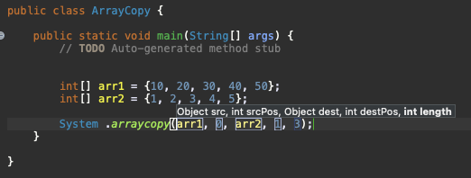
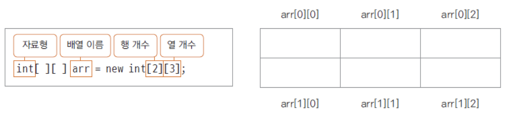

# Introduction

---

Java의 배열에 대하여 알아본다.


# 배열 (Array)

---

배열은 순차적 자료 구조로 동일한 타입의 데이터를 선형으로 넣을 수 있으며 특징은 아래와 같다.

1. 논리적 위치와 물리적 위치가 같음

   - 가령 int array는 각 원소가 4바이트 마다 순차적으로 생성

   - Linked list의 경우 논리적 위치와 물리적 위치가 다름

2. Fixed length로 생성된다. (크기가 고정된 자료 구조)

3. 인덱스 접근 (ex. arr[0]) 속도가 빠르다



```java
public class ArrayTest {

	public static void main(String[] args) {
		// TODO Auto-generated method stub
		
		int[] arr1 = {1,2,3}; // 배열 생성과 동시에 초기화
    int arr2[] = {1,2,3};
    
		int[] arr = new int[] {1,2,3}; // 배열 생성과 동시에 초기화2
		
		int[] arr = new int[10];
		arr = {1,2,3}; // Error, 선언과 동시에 초기화해야함
 	}

}
```


- 배열을 선언하고 초기값을 설정하지 않으면, 데이터들은 0으로 초기화된다. double은 0.0으로 초기화

```java
public class ArrayTest {

	public static void main(String[] args) {
    double[] dArr = new double[5];

    dArr[0] = 1.1;
    dArr[1] = 2.1;
    dArr[2] = 3.1;
    
    // dArr[3], dArr[4]는 0.0으로 초기화됨

    int mtotal = 1;
    // int i = 0; // Error,  for문 전에 선언한 변수와 똑같은 이름의 변수를 for문 안에서 생성하면 에러
    
    for(int i=0; i<dArr.length; i++) {
      mtotal *= dArr[i];
    }

    System.out.println(mtotal); //  0
    
  }
}

```


- 객체 배열의 각 element에는 객체의 주소가 들어간다 

```java
Book library[] = new Book[5];
```

-  위 상태는 Book 클래스의 배열이 생성되었을 뿐, 아직 library의 각 원소들이 인스턴스로 만들어지지는 않는다. (library의 각 원소들은 null을 참조하고 있다)



- 각 인덱스마다 객체를 생성하려면 ***library[0~4] = new Book();*** 으로 각각의 인스턴스들을 만들어줘야한다.


```java
public class BookArrayTest {

	public static void main(String[] args) {
		// TODO Auto-generated method stub
		
		Book[] library = new Book[5];
		
		library[0] = new Book("Mount1", "Jo");
		library[1] = new Book("Mount2", "Jo");
		library[2] = new Book("Mount3", "Jo");
		library[3] = new Book("Mount4", "Jo");
		library[4] = new Book("Mount5", "Jo");
		
		for(int i=0; i<library.length; i++) {
			System.out.println(library[i]);
		}

	}
}

----

array.Book@5674cd4d
array.Book@63961c42
array.Book@65b54208
array.Book@1be6f5c3
array.Book@6b884d57
```


### arraycopy

배열의 복사하는 기능의 시스템 메서드

**

```java
public class ObjectCopy {

	public static void main(String[] args) {
		// TODO Auto-generated method stub
		
		Book[] library = new Book[5];
		Book[] copyLibrary = new Book[5];
		
		library[0] = new Book("Mount1", "Jo");
		library[1] = new Book("Mount2", "Jo");
		library[2] = new Book("Mount3", "Jo");
		library[3] = new Book("Mount4", "Jo");
		library[4] = new Book("Mount5", "Jo");
		
		System.arraycopy(library, 0, copyLibrary, 0, 5);
		
		// 향상된 for문
		// copyLibrary의 모든 인덱스를 돌면서 순차적으로 각 요소들을 book에 대입한다.
		for(Book book : copyLibrary) {
			book.showBookInfo();
		}
	}
}

----

Mount1,Jo
Mount2,Jo
Mount3,Jo
Mount4,Jo
```


### 얕은 복사, 깊은 복사

얕은 복사: 인스턴스의 주소를 복사, 주소가 같아지기 때문에 한 인스턴스의 변경점이 다른 인스턴스에도 반영되는 위험이 있다.

깊은 복사: 인스턴스의 내부 속성(멤버 변수)을 복사, 속성만 같을 뿐 메모리 상 다른 위치에 생성된 인스턴스들이기 때문에 서로 영향을 끼치지 않는다.


- 얕은 복사 예시

```java
public class ObjectCopy {

	public static void main(String[] args) {
		// TODO Auto-generated method stub
		
		Book[] library = new Book[5];
		Book[] copyLibrary = new Book[5];
		
		library[0] = new Book("Mount1", "Jo");
		library[1] = new Book("Mount2", "Jo");
		library[2] = new Book("Mount3", "Jo");
		library[3] = new Book("Mount4", "Jo");
		library[4] = new Book("Mount5", "Jo");
		

		// arraycopy는 얕은 복사이기때문에 객체의 주소가 복사된다
		System.arraycopy(library, 0, copyLibrary, 0, 5);
		
		library[0].setTitle("Tree");
		library[0].setAuthor("Park");

		for(Book book : library) {
			book.showBookInfo();
		}
		
		System.out.println("==============");
		
		for(Book book : copyLibrary) {
			book.showBookInfo();
		}
	}
}

------

Tree,Park
Mount2,Jo
Mount3,Jo
Mount4,Jo
Mount5,Jo
==============
Tree,Park
Mount2,Jo
Mount3,Jo
Mount4,Jo
Mount5,Jo
```


- 깊은 복사 예시

```java
public class ObjectCopy2 {

	public static void main(String[] args) {
		// TODO Auto-generated method stub

		Book[] library = new Book[5];
		Book[] copyLibrary = new Book[5];
		
		library[0] = new Book("Mount1", "Jo");
		library[1] = new Book("Mount2", "Jo");
		library[2] = new Book("Mount3", "Jo");
		library[3] = new Book("Mount4", "Jo");
		library[4] = new Book("Mount5", "Jo");
		
		copyLibrary[0] = new Book();
		copyLibrary[1] = new Book();
		copyLibrary[2] = new Book();
		copyLibrary[3] = new Book();
		copyLibrary[4] = new Book();

	
		for(int i=0; i<library.length; i++) {
			copyLibrary[i].setTitle(library[i].getTitle()); // Deep copy
			copyLibrary[i].setAuthor(library[i].getAuthor()); // Deep copy
		}
		
		library[0].setTitle("Tree"); // Deep copy이기 때문에 copyLibrary에 영향 없음
		library[0].setAuthor("Park"); // Deep copy이기 때문에 copyLibrary에 영향 없음

		for(Book book : library) {
			book.showBookInfo();
		}
		
		System.out.println("==============");

		for(Book book : copyLibrary) {
			book.showBookInfo();
		}
	}
}

----

Tree,Park
Mount2,Jo
Mount3,Jo
Mount4,Jo
Mount5,Jo
==============
Mount1,Jo
Mount2,Jo
Mount3,Jo
Mount4,Jo
Mount5,Jo
```


### 다차원 배열

2차원 이상의 배열로 좌표 등을 나타낼 때 유용하다.



```java
package array;

public class TwoDimension {

	public static void main(String[] args) {
		// TODO Auto-generated method stub
		
		int[][] arr = { {1,2,3}, {4,5,6} };
		
		System.out.println(arr.length);
		System.out.println(arr[0].length);
		System.out.println(arr[1].length);
		
		System.out.println("======");
		
		for(int i=0; i<arr.length; i++) {
			for(int j=0; j<arr[i].length; j++) {
				System.out.print(arr[i][j] + " ");
			}
			System.out.println();
		}
	}
}
----

2
3
3
======
1 2 3 
4 5 6
```


### ArrayList

Java에서 제공하는 기본 클래스로 아래와 같은 다양한 기능이 있다.

| Method                                                       | Description                                                  |
| ------------------------------------------------------------ | ------------------------------------------------------------ |
| boolean **[add](https://docs.oracle.com/javase/8/docs/api/java/util/ArrayList.html#add-E-)**([E](https://docs.oracle.com/javase/8/docs/api/java/util/ArrayList.html) e) | Appends the specified element to the end of this list.       |
| void **[add](https://docs.oracle.com/javase/8/docs/api/java/util/ArrayList.html#add-int-E-)**(int index, [E](https://docs.oracle.com/javase/8/docs/api/java/util/ArrayList.html) element) | Inserts the specified element at the specified position in this list. |
| void **[clear](https://docs.oracle.com/javase/8/docs/api/java/util/ArrayList.html#clear--)**() | Removes all of the elements from this list.                  |
| [E](https://docs.oracle.com/javase/8/docs/api/java/util/ArrayList.html) **[get](https://docs.oracle.com/javase/8/docs/api/java/util/ArrayList.html#get-int-)**(int index) | Returns the element at the specified position in this list.  |
| [E](https://docs.oracle.com/javase/8/docs/api/java/util/ArrayList.html) **[remove](https://docs.oracle.com/javase/8/docs/api/java/util/ArrayList.html#remove-int-)**(int index) | Removes the element at the specified position in this list.  |
| int **[size](https://docs.oracle.com/javase/8/docs/api/java/util/ArrayList.html#size--)**() | Returns the number of elements in this list.                 |
| boolean **[isEmpty](https://docs.oracle.com/javase/8/docs/api/java/util/ArrayList.html#isEmpty--)**() | Returns `true` if this list contains no elements.            |

[^]: 출처: https://docs.oracle.com/javase/8/docs/api/java/util/ArrayList.html


<> 안에 원하는 타입을 넣으면 해당 타입의 형태로 배열이 만들어진다.

```java
ArrayList<String> list = new ArrayList<String>();
```

```java
import java.util.ArrayList;

public class ArrayListTest {

	public static void main(String[] args) {
		
		ArrayList<String> list = new ArrayList<String>();
		
		list.add("aaa");
		list.add("bbb");
		list.add("ccc");
		
		for(int i=0; i<list.size(); i++) {
			String str = list.get(i);
			System.out.println(str);
			
		}
		
		for(String s : list) {
			System.out.println(s);
		}	
	}
}

----

aaa
bbb
ccc
aaa
bbb
ccc
```


- ArrayList에 type을 지정하지 않아도 자동으로 object type으로 생성해주기 때문에 사용하는데 이상은 없지만 가능한 타입을 지정하는 것이 좋다.

```java
import java.util.ArrayList;

public class ArrayListTest {

	public static void main(String[] args) {
		
//	ArrayList<String> list = new ArrayList<String>();
		ArrayList list = new ArrayList(); // object type으로 생성됨
		
		list.add("aaa");
		list.add("bbb");
		list.add("ccc");
		
		for(int i=0; i<list.size(); i++) {
//		String str = list.get(i);
			String str = (String)list.get(i);
			System.out.println(str);
			
		}
		
//	for(String s : list) {
		for(Object s : list) { // object는 모든 class의 최상위 class
			System.out.println(s);
		}
	}
}
```


#  Conclusion

---

프로그래밍의 기초인 리스트의 특성과 얕은 복사, 깊은복사, 나아가서 Java의 ArrayList까지 알아보았다.


# Reference

---

Fastcampus JAVA기초 강의 - 박은종 강사님
