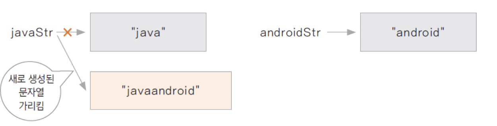
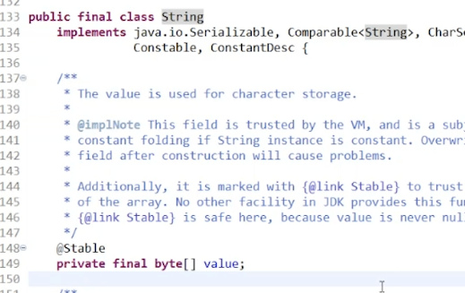
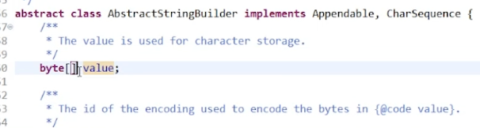

# Introduction

---

Java의 String class와 Wrapper class에 대해 알아본다.


# String class

---

Java에서 사용하는 문자열 클래스로 문자열을 저장하고 조작하는 역할을 한다.

[^ ]: String 클래스의 기능들은 docs에서 확인: https://docs.oracle.com/javase/7/docs/api/java/lang/String.html

String 객체는 선언하는 형태에 따라 다른 메모리 구조를 가진다.

```java
String str1 = new String("abc"); // 힙 메모리에 "abc"를 멤버 변수로 가지는 인스턴스가 생성되며 str1은 힙 메모리의 인스턴스 주소를 가리킨다.
String str2 = "abc";	// 상수 풀에 있는 "abc" 문자열을 가리킨다
```

```java
public class StringTest {

	public static void main(String[] args) {
		
		String str1 = new String("abc"); // 힙 메모리에 인스턴스 생성
		String str2 = new String("abc"); // 힙 메모리에 인스턴스 생성
		
		System.out.println(str1 == str2);	// str1, str2는 각각 다른 인스턴스 주소를 가리킨다.
		System.out.println(str1.equals(str2));	// String 클래스는 equals()을 오버라이딩하여 내부 문자열을 비교하도록 구현하였다. 
		
		String str3 = "abc";	// str3는 상수 풀에 있는 리터럴을 가리킨다.
		String str4 = "abc";  // str4는 상수 풀에 있는 리터럴을 가리킨다.
		
		System.out.println(str3 == str4); // str3, str4는 상수 풀의 같은 리터럴을 가리키기 때문에 둘은 같은 주소를 가리키고 있다.

	}
}

-----

false
true
true
```


String의 ***immutable 속성***: 한번 선언 되거나 생성된 문자열은 변경 불가

String 클래스의 concat() 혹은 '+'을 이용하여 String을 연결하는 경우 문자열은 새로 생성 됨

```java
public class StringTest2 {

	public static void main(String[] args) {
		
		String java = new String("java");
		String android = new String("android");
		
		System.out.println(System.identityHashCode(java));
		
		java = java.concat(android);	// 기존 문자열이 수정되는 것이 아니라 새로운 문자열이 생성됨
		
		System.out.println(System.identityHashCode(java));	// concat의 결과로 리턴된 객체의 해시값이 기존과 달라짐을 확인
	}
}

-----

140435067
1450495309
```

**


아래 String class의 내부 구현을 보면 final로 value가 선언되어 있음을 확인 -> 한번 생성된 string값은 변경 불가

- concat등의 메서드를 사용할때도 기존 문자열이 변경되는 것이 아닌 새로운 문자열이 생성된다

**


### StringBuilder / StringBuffer

final 변수가 아닌 가변적인 char[] 배열을 멤버 변수로 가지고 있는 문자열 클래스

새로운 객체 추가 없이 문자열을 변경하거나 연결하는 것이 가능 클래스

- StringBuffer는 멀티 스레드 프로그래밍의 동기화(Synchronization) 제공
- StringBuilder는 단일 스레드 프로그래밍에서 StringBuffer보다 나은 성능을 가짐
- String class와 달리 value가 final이 아니라 가변적인 문자 배열 사용 가능 
  - append 등으로 문자열을 수정해도 새로운 버퍼가 생성되는 것이 아니라서 주소값이 변경되지 않음

**

```java
public class StringBuilderTest {

	public static void main(String[] args) {
		
		String java = new String("java");
		String android = new String("android");
		
		StringBuilder buffer = new StringBuilder(java);
		System.out.println(System.identityHashCode(buffer));
		
		buffer.append(android);		// String의 concat과 유사하게 문자열을 이어주는 메서드
		System.out.println(System.identityHashCode(buffer));	// append의 결과로 리턴된 객체의 해시값과 기존 객체의 해시값이 동일
		
	}
}

--------

140435067
140435067
```


# Wrapper class

---

기본 자료형들을 클래스화한 클래스

클래스화 하였기 때문에 해당 클래스로 만든 변수들은 기본 자료형이 아닌 ***참조 자료형***이 된다.

| 기본 자료형 | Wrapper class |
| ----------- | ------------- |
| boolean     | Boolean       |
| byte        | Byte          |
| char        | Character     |
| short       | Short         |
| int         | Integer       |
| long        | Long          |
| float       | Float         |
| double      | Double        |

- toString, hascode 등 ***object class 메서드들이 overriding***되어있다
- 기본 자료형을 객체 형태로 사용할 수 있기 때문에 ***상수 풀이 아닌 heap 메모리를 이용***
- 예전 Java에서는 불가능했던 int + Integer의 연산 등도 가능 (Autoboxing, unboxing)

#  Conclusion

---

Java의 String, Wrapper 클래스에 대하여 알아보았다. String 클래스가 final형의 내부 변수를 가지고 있어서 문자열을 수정할 수 없고 문자열을 조작하는 메서드를 호출할 때 새로운 문자열을 생성하여 리턴한다는 사실은 처음 알게 되었다.


# Reference

---

Fastcampus JAVA기초 강의 - 박은종 강사님
