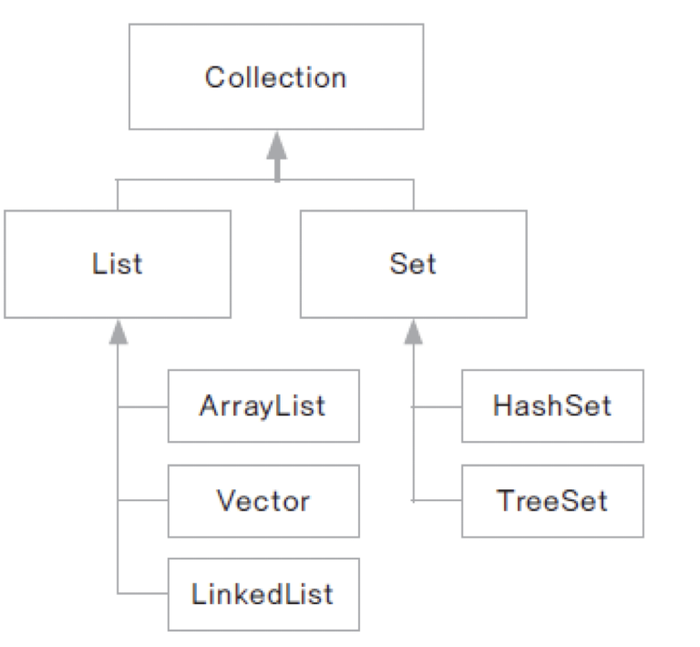
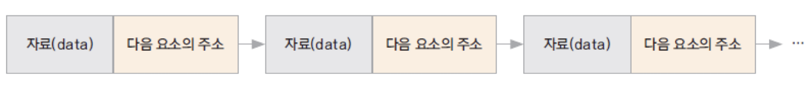
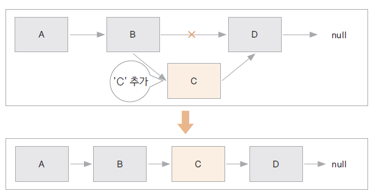
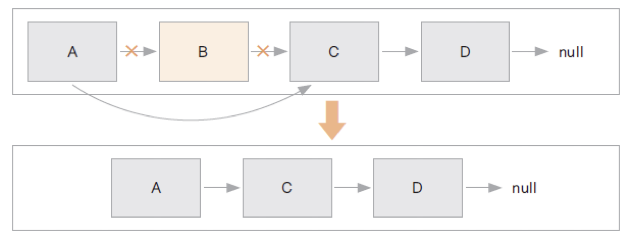
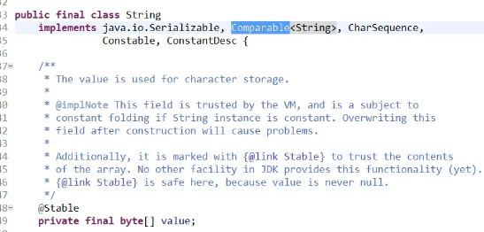
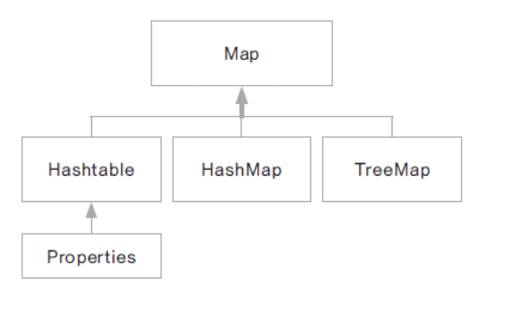

# Introduction

---

Java의 Collection Framework에 대해 알아본다.


# Collection Framework

---

다양한 자료 구조가 구현 되어있는 라이브러리로 여러 알고리즘이 구현된 메서드를 이용하여 효율적인 프로그래밍을 가능하게 해준다. 

- java.util 패키지에 위치

Collection 인터페이스, Map 인터페이스로 구성

# Collection

---

**

하위에 List, Set 인터페이스 나뉘며 List, Set 인터페이스 하위에 각각을 구현한 자료 구조 클래스가 존재한다.

| Interface | Description                                                  |
| --------- | ------------------------------------------------------------ |
| List      | ***순서가 있음, 중복을 허용***. ArrayList, Vector, LinkedList, Stack, Queue등 |
| Set       | ***순서가 없음, 중복을 허용하지 않음***. HashMap, TressSet 등 |


## List

배열과 같이 객체를 삽입한 순서대로 저장하고 관리하기 위한 메서드들이 구현된 인터페이스

해당 인터페이스를 구현한 ArrayList, Vector, LinkedList가 있으며 일반적으로 ArrayList를 많이 사용

### ArrayList / Vector

ArrayList / Vector: 자료의 순차적 구조를 구현한 객체 배열 클래스로 내부적으로 Object[]를 이용하여 구현되어있음

Vector는 Java2부터 지원한 클래스이며ArrayList와 비슷하지만 ***synchronized(multi-thread 동기화)***기능을 제공한다는 특징이 있음

- but 단일스레드 작업에서는 멀티스레드 동기화 기능이 오버헤드

> 동기화(synchronization): ***두 개 이상의 쓰레드가 하나의 리소스에 동시 접근을 시도하는 것을 방지***하여 하나의 쓰레드가 해당 리소스에 접근할 때 나머지 쓰레드는 리소스 접근을 막아 데이터의 오류를 방지하는 것 (Thread-safe라고도 함)


1) Vector 구현 코드: 메서드에 synchronized가 붙어있어 멀티 쓰레드 동기화를 지원

```java
public class Vector<E>
    extends AbstractList<E>
    implements List<E>, RandomAccess, Cloneable, java.io.Serializable
{
    /**
     * The array buffer into which the components of the vector are
     * stored. The capacity of the vector is the length of this array buffer,
     * and is at least large enough to contain all the vector's elements.
     *
     * <p>Any array elements following the last element in the Vector are null.
     *
     * @serial
     */
    @SuppressWarnings("serial") // Conditionally serializable
    protected Object[] elementData;

    /**
     * The number of valid components in this {@code Vector} object.
     * Components {@code elementData[0]} through
     * {@code elementData[elementCount-1]} are the actual items.
     *
     * @serial
     */
    protected int elementCount;

    ...
      
    /**
     * Returns the current capacity of this vector.
     *
     * @return  the current capacity (the length of its internal
     *          data array, kept in the field {@code elementData}
     *          of this vector)
     */
    public synchronized int capacity() {
        return elementData.length;
    }

    /**
     * Returns the number of components in this vector.
     *
     * @return  the number of components in this vector
     */
    public synchronized int size() {
        return elementCount;
    }
}
```


2. ArrayList 구현 코드

```java
public class ArrayList<E> extends AbstractList<E>
        implements List<E>, RandomAccess, Cloneable, java.io.Serializable
{
    @java.io.Serial
    private static final long serialVersionUID = 8683452581122892189L;

    /**
     * Default initial capacity.
     */
    private static final int DEFAULT_CAPACITY = 10;

    /**
     * Shared empty array instance used for empty instances.
     */
    private static final Object[] EMPTY_ELEMENTDATA = {};

    /**
     * Shared empty array instance used for default sized empty instances. We
     * distinguish this from EMPTY_ELEMENTDATA to know how much to inflate when
     * first element is added.
     */
    private static final Object[] DEFAULTCAPACITY_EMPTY_ELEMENTDATA = {};

    /**
     * The array buffer into which the elements of the ArrayList are stored.
     * The capacity of the ArrayList is the length of this array buffer. Any
     * empty ArrayList with elementData == DEFAULTCAPACITY_EMPTY_ELEMENTDATA
     * will be expanded to DEFAULT_CAPACITY when the first element is added.
     */
    transient Object[] elementData; // non-private to simplify nested class access

    /**
     * The size of the ArrayList (the number of elements it contains).
     *
     * @serial
     */
    private int size;
  
 		...
}
```

Vector, ArrayList의 코드르 보면 크기를 나타내는 size와 capacity라는 변수가 있는데 각각의 의미는 아래와 같다.

- capacity: 배열의 전체 크기

- size: 실제 element가 들어있는 배열의 크기 

- capacity가 일정수준 이상 차면 자동으로 capacity를 늘려줘서 전체 크기를 늘려준다.


### LinkedList

Vector, ArrayList와 마찬가지로 자료의 순차적 구조를 구현한 클래스이지만 LinkedList는 논리적 순서와 물리적 순서가 동일하지 않음

LinkedList의 경우 아래와 같이 한 요소(element)가 다음 요소의 주소(해시 코드)를 가지고 있어서 해시 코드를 이용하여 다음 원소에 접근할 수 있는 형태이다.

**


LinkedList에서 추가는 아래와 같이 새로 추가되는 요소의 주소(해시 코드) 연결로 이루어진다.

**


비슷하게 삭제는 삭제할 요소의 해시 코드 연결을 없애는 형태로 이루어진다.

**

```java
import java.util.LinkedList;

public class LinkedListTest {

	public static void main(String[] args) {
		
		LinkedList<String> myList = new LinkedList<String>();
		
		myList.add("A");
		myList.add("B");
		myList.add("C");
		System.out.println(myList);
		
		myList.add(1, "D");
		System.out.println(myList);
		
		myList.removeLast();
		System.out.println(myList);
		
		for(int i=0; i<myList.size(); i++) {
			String s = myList.get(i);
			System.out.println(s);
		}
	}
}

---------

[A, B, C]
[A, D, B, C]
[A, D, B]
A
D
B
```


### Stack / Queue

Stack: Last In First Out (LIFO), 마지막에 추가된 요소가 가장 먼저 꺼내지는 자료 구조

Queue: First in First Out (FIFO), 먼저 추가된 요소가 가장 먼저 꺼내지는 자료 구조

Stack, Queue 모두 ArrayList, Vector, LinkedList를 이용하여 구현할 수 있다.

```java
import java.util.ArrayList;

class MyStack{
	private ArrayList<String> arrayStack = new ArrayList<String>();
	
	public void push(String data) {
		arrayStack.add(data);
	}
	
	public String pop() {
		int len = arrayStack.size();
		if (len == 0) {
			System.out.println("Empty stack");
			return null;
		}
		return arrayStack.remove(len-1);
	}
}

public class StackTest {

	public static void main(String[] args) {
		 MyStack stack = new MyStack();
		 stack.push("A");
		 stack.push("B");
		 stack.push("C");
		 
		 System.out.println(stack.pop());

	}
}
```


## Set

중복을 허용하지 않고 순서가 정해지지 않는 자료 구조 인터페이스, 순서가 없기 때문에 get() 메서드 등을 통한 인덱스 접근이 불가능하다.

- itrator로 순회해가며 요소에 접근해야 함

  > ​	Iterator : collection 객체를 순회하는 기능이 있는 인터페이스, 아래 두가지 메서드가 주로 쓰인다.
  >
  > ​		- boolean hasNext() : 다음 원소가 있는지 체크하여 있으면 True 리턴
  >
  > ​		- E next() : 다음 원소를 리턴

- 저장된 순서와 출력 순서가 다를 수 있음

해당 인터페이스를 구현한 HashSet, TreeSet 클래스가 있으며 유일한 값이나 객체들을 관리할 때 유용하게 사용 된다.


### HashSet

HashSet은 내부 hash방식으로 관리되는 자료 구조 형, 해시 코드를 비교하여 중복 여부를 체크하기 때문에 hashCode(), equals() 메서드를 오버라이딩하여 원하는 형태로 데이터를 관리할 수 있다.

```java
import java.util.HashSet;

public class HashSetTest {

	public static void main(String[] args) {
		
		HashSet<String> set = new HashSet<String>();
		set.add("Lee");
		set.add("Kim");
		set.add("Kang");

		Iterator<String> ir = set.iterator();
		while(ir.hasNext()) {
			String str = ir.next();
			System.out.println(str);
		}
		
		System.out.println(set);

	}
}

------

[Kang, Lee, Kim] // 순서가 보장되지 않음
[Kang, Lee, Kim]
```


아래는 hashCode(), equals()를 오버라이딩한 Member 객체를 이용한 HashSet 테스트 코드이다.

 ***memberId를 hashCode로 설정하였기 때문에Member객체를 원소로 가지는 HashSet은 memberId에 따라 중복 여부***를 정한다.

```java
class Member {
	
	private int memberId;
	private String memberName;
	
	public Member() {}
	public Member(int memberId, String memberName) {
		this.memberId = memberId;
		this.memberName = memberName;
	}
	public int getMemberId() {
		return memberId;
	}
	public void setMemberId(int memberId) {
		this.memberId = memberId;
	}
	public String getMemberName() {
		return memberName;
	}
	public void setMemberName(String memberName) {
		this.memberName = memberName;
	}

	public String toString() {
		return memberName + "'s ID : "+memberId; 
	}

	@Override
	public int hashCode() { // hashCode() 오버라이딩
		return memberId;
	}
	
	@Override
public boolean equals(Object obj) { // equals() 오버라이딩
		
		if (obj instanceof Member) {
			Member member = (Member)obj;
			return this.memberId == member.memberId;
		}
		
		return false;
	}
}
```

```java
import java.util.HashSet;
import java.util.Iterator;


public class MemberHashSet {
	
	private HashSet<Member> hashSet;
	
	public MemberHashSet() {
		hashSet = new HashSet<Member>();
	}
	
	public void addMember(Member member) {
		hashSet.add(member);
	}
	
	public boolean removeMember(int memberId) {
		
		Iterator<Member> ir = hashSet.iterator();
		while(ir.hasNext()) {
			Member member = ir.next();
			if(member.getMemberId() == memberId) {
				hashSet.remove(member);
				return true;
			}
		}
		System.out.println(memberId+" is not found");
		return false;
	}
	
	public void showAllMember() {
		for(Member member : hashSet) {
			System.out.println(member);
		}
		System.out.println();
	}

}
```


아래 예시 코드에서 HashSet에 memberID를 중복해서 넣었다 (memberPark, memberPark2)

- Member 클래스에서 hashCode(), equals() 오버라이딩을 통해 memberID가 같으면 객체라는 의미를 구현하였기 때문에 ***memberId가 중복된 객체는 삽입되지 않는다.***
- 만약 hashCode(), equals() 오버라이딩하지 않았으면 memberPark, memberPark2이 모두 삽입되었을 것이다.

```java
public class MemberHashSetTest {

	public static void main(String[] args) {
		
		MemberHashSet manager = new MemberHashSet();
		
		Member memberLee = new Member(100, "Lee");
		Member memberKim = new Member(200, "Kim");
		Member memberPark = new Member(300, "Park");
		Member memberPark2 = new Member(300, "Park2");
		
		manager.addMember(memberLee);
		manager.addMember(memberKim);
		manager.addMember(memberPark);
		manager.addMember(memberPark2);
		
		manager.showAllMember();
		
		manager.removeMember(100);
		
		manager.showAllMember();

	}
}

----

Lee's ID : 100
Kim's ID : 200
Park2's ID : 300

Kim's ID : 200
Park2's ID : 300
```


### TreeSet

객체의 정렬에 사용되는 클래스로 ***이진 검색 트리(BST, binary search tree)로 구현***되어 있음

***중복을 허용하지 않고 오름차순, 내림차순으로 객체를 정렬***가능

트리에 객체가 저장될 때 객체 간 비교를 통해 저장 위치가 정해지는데 ***객체 비교를 위해 Comparable, Comparator 인터페이스를 구현***해야 함

```java
import java.util.TreeSet;

public class TreeSetTest {

	public static void main(String[] args) {
		
		TreeSet<String> treeSet = new TreeSet<String>();
		
		treeSet.add("lee");
		treeSet.add("kim");
		treeSet.add("hong");
		
		for (String str : treeSet) {
			System.out.println(str);
		}
	}
}

------

hong
kim
lee
```

- 위 예시에서 TreeSet으로 string을 저장하면 자동으로 정렬이 되는데 String 내부에서 이미 Comparable을 구현했기 때문이다

**


아래 예시에서 member를 add할때 ***tree 내부에서 비교할 방법이 구현되어있지 않아서 에러*** 발생

- ***Comparable or Comparator 구현 필요***

>  Comparable, Comparator - 정렬 대상이 되는 클래스가 구현해야 하는 인터페이스, 보통 Comparable을 많이 사용


```java
public class MemberTreeSetTest {

	public static void main(String[] args) {
		
		MemberTreeSet manager = new MemberTreeSet();
		
		Member memberLee = new Member(300, "Lee");
		Member memberKim = new Member(100, "Kim");
		Member memberPark = new Member(200, "Park");
		
		manager.addMember(memberLee);
		manager.addMember(memberKim);
		manager.addMember(memberPark);
		
		manager.showAllMember();
		
		manager.removeMember(100);
		
		manager.showAllMember();
	}
}

------

Exception in thread "main" java.lang.ClassCastException: 
class collection.treeset.Member cannot be cast to class java.lang.Comparable (collection.treeset.Member is in module Chapter11 of loader 'app'; java.lang.Comparable is in module java.base of loader 'bootstrap')
	at java.base/java.util.TreeMap.compare(TreeMap.java:1569)
	at java.base/java.util.TreeMap.addEntryToEmptyMap(TreeMap.java:776)
	at java.base/java.util.TreeMap.put(TreeMap.java:785)
	at java.base/java.util.TreeMap.put(TreeMap.java:534)
	at java.base/java.util.TreeSet.add(TreeSet.java:255)
	at Chapter11/collection.treeset.MemberTreeSet.addMember(MemberTreeSet.java:15)
	at Chapter11/collection.treeset.MemberTreeSetTest.main(MemberTreeSetTest.java:13)
```


1) ***Comparable  구현***

- Comparable을 implements하고 compareTo를 overriding
- compareTo()에서 매개 변수와 메서드를 호출한 객체(this)를 비교

```java
public class Member implements Comparable<Member>{
	
	private int memberId;
	private String memberName;
	
	public Member() {}
	public Member(int memberId, String memberName) {
		this.memberId = memberId;
		this.memberName = memberName;
	}
	public int getMemberId() {
		return memberId;
	}
	public void setMemberId(int memberId) {
		this.memberId = memberId;
	}
	public String getMemberName() {
		return memberName;
	}
  
	...
	
	@Override
	public int compareTo(Member member) {
		// return (this.memberId - member.memberId); // ID 정렬
		return this.memberName.compareTo(member.getMemberName()); // Name 정렬
	}
}
```


2. ***Comparator  구현***

- Comparator를 implements하고 compare를 overriding
- 첫번째 파라미터가 메서드를 호출한 this에 해당한다.
- TreeSet의 생성자에 해당 객체를 매개 변수로 전달 필요 (보통 default constructor를 이용하여 전달)

````java
import java.util.Comparator;

class MemberTreeSet {
	
	private TreeSet<Member> treeSet;
	
	public MemberTreeSet() {
		treeSet = new TreeSet<Member>(new Member()); // Comparator가 구현된 객체(Member)를 TreeSet 생성자에 전달 필요

	}


public class Member implements Comparator<Member>{

	...

	@Override
	public int compare(Member member1, Member member2) {
		return (member1.memberId - member2.memberId);
	}
}
````


- 이미 Comparable이 구현된 클래스(String)도 TreeSet 생성자에 Comparator가 구현된 인스턴스(MyComparable)를 넣으면 Comparator에 구현된 정렬방식을 사용

```java
import java.util.Comparator;
import java.util.TreeSet;

class MyComaprable implements Comparator<String>{

	@Override
	public int compare(String s1, String s2) {
		return s1.compareTo(s2) * (-1);
	}
	
}

public class TreeSetTest {

	public static void main(String[] args) {
		
    // String은 이미 내부적으로 Comparable가 구현되어있기 때문에 정렬 방식이 정해져 있음
    // 이 상황에서도 TreeSet의 생성자에 Comparator가 구현된 클래스 객체를 넣으면 해당 객체의 정렬 방식이 사용됨
		TreeSet<String> treeSet = new TreeSet<String>(new MyComaprable());
		
		treeSet.add("lee");
		treeSet.add("kim");
		treeSet.add("hong");
		
		for (String str : treeSet) {
			System.out.println(str);
		}

	}

}
```


# Map

---

**

***key-value pair 형태로 객체를 관리하는데 유용한 인터페이스***이며 이때 key는 중복될 수 없음

***key는 내부적으로 hash를 이용하여 관리*** 되기 때문에 equals(), hashCode() 메서드를 오버라이딩하여 해당 key의 유일성을 정의한다.

 key를 이용하여 값을 저장, 검색, 삭제하기가 편리한 자료 구조이다.

### 

### HashMap

Map 인터페이스를 구현한 클래스 중 가장 일반적인 클래스, Vector와 같이 Java2부터 지원하며 멀티 쓰레드 동기화 역시 제공

pair 형태의 자료를 쉽고 빠르게 관리 가능

아래 예시 코드는 Integer를 Key로, Member를 Value로 갖는 HashMap 래핑 클래스이다.

- 이때 Integer는 이미 equals(), hashCode()가 구현되어있기 때문에 key 중복 체크가 가능하다.

```java
import java.util.HashMap;
import java.util.Iterator;

public class MemberHashMap {

	private HashMap<Integer, Member> hashMap;
	public MemberHashMap() {
		hashMap = new HashMap<Integer, Member>();
	}
	
	public void addMember(Member member) {
		hashMap.put(member.getMemberId(), member);
	}
	
	public boolean removeMember(int memberId) {
		if (hashMap.containsKey(memberId)) {
			hashMap.remove(memberId);
			return true;
		}
		System.out.println("Empty map");
		return false;
	}
	
	public void showAllMember() {
		
		Iterator<Integer> ir = hashMap.keySet().iterator();
		while(ir.hasNext()) {
			int key = ir.next();
			Member member = hashMap.get(key); 
			System.out.println(member);
		}
		
		System.out.println();
		
		
	}
}
```

```java
public class MemberHashMapTest {

	public static void main(String[] args) {
		
		MemberHashMap manager = new MemberHashMap();
		
		Member memberLee = new Member(100, "Lee");
		Member memberKim = new Member(200, "Kim");
		Member memberPark = new Member(300, "Park"); // key가 중복되기 때문에 둘 중 하나는 저장되지 않음
		Member memberPark2 = new Member(300, "Park2"); // key가 중복되기 때문에 둘 중 하나는 저장되지 않음
		
		manager.addMember(memberLee);
		manager.addMember(memberKim);
		manager.addMember(memberPark);
		manager.addMember(memberPark2);
		
		manager.showAllMember();
		
		manager.removeMember(100);
		
		manager.showAllMember();

	}
}

------

Lee's ID : 100
Kim's ID : 200
Park2's ID : 300

Kim's ID : 200
Park2's ID : 300
```


### TreeMap

***이진 검색 트리(BST, binary search tree)로 Key를 관리***하는 Map 자료 구조

TreeSet과 같이 Comparable, Comparator 인터페이스를 구현하여 Key를 비교, 정렬할 수 있다.

Java의 wrapper 클래스 등 여러 기본 클래스에는 이미 Comparable이 구현되어있기 때문에 이 경우에는 별다른 작업 없이 사용할 수 있다.

```java
public class MemberTreeMapTest {

	public static void main(String[] args) {
		
		MemberTreeMap manager = new MemberTreeMap();
		
		Member memberLee = new Member(100, "Lee");
		Member memberKim = new Member(200, "Kim");
		Member memberPark = new Member(300, "Park");
		Member memberPark2 = new Member(300, "Park2");
		
		manager.addMember(memberLee);
		manager.addMember(memberKim);
		manager.addMember(memberPark);
		manager.addMember(memberPark2);
		
		manager.showAllMember();
		
		manager.removeMember(100);
		
		manager.showAllMember();

	}
}

-----

Lee's ID : 100 // key에 따라 Map이 자동 정렬됨
Kim's ID : 200
Park2's ID : 300

Kim's ID : 200
Park2's ID : 300
```

위 코드에서 key로 사용된 ***Integer class에는 이미 comparable이 구현***되어있다 

- TreeMap에서 key를 Integer class로 생성하면, 자동 정렬가능

#  Conclusion

---

Java의 컬렉션 프레임워크에 대하여 알아보면서 List, Set의 인터페이스를 구현한 여러 자료 구조 형태의 클래스를 알아보았다.

LinkedList, Tree, HashMap 등 자료 구조에서 사용되는 여러 개념들이 나오기 때문에 자료 구조에 대한 개념이 없으면 이해하기 어려울 수 있다.

컬렉션 프레임워크는 여러번 쓰면서 익숙해지지 않으면 금세 잊어버릴 수 있을 것 같다. 자주 접해보도록 하자.

# Reference

---

Fastcampus JAVA기초 강의 - 박은종 강사님
