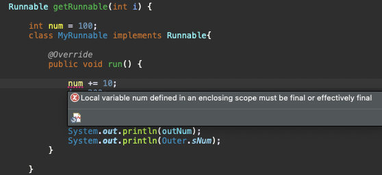

# Introduction

---

Java의 Inner class(내부 클래스)에 대해 알아본다.


# Inner class

---

클래스 내부에서 사용하기 위해 클래스 내부에 구현한 클래스

주로 외부 클래스(Outer class, 내부 클래스를 정의한 클래스) 생성자에서 내부 클래스 인스턴스를 생성한다.

| 종류                     | 위치                               | 접근 가능한 클래스 변수            | 생성                                                         |
| ------------------------ | ---------------------------------- | ---------------------------------- | ------------------------------------------------------------ |
| 인스턴스 내부 클래스     | 외부 클래스 내부, 멤버 변수와 동일 | 외부 인스턴스 변수, 외부 전역 변수 | 외부 클래스가 생성된 뒤 내부 클래스 생성                     |
| 정적(static) 내부 클래스 | 외부 클래스 내부, 멤버 변수와 동일 | 외부 전역 변수                     | 외부 클래스와 무관하게 생성                                  |
| 지역 내부 클래스         | 메서드 내부                        | 외부 인스턴스 변수, 외부 전역 변수 | 메서드 호출 때 생성                                          |
| 익명 내부 클래스         | 메서드 내부                        | 외부 인스턴스 변수, 외부 전역 변수 | 메서드 호출 또는 추상클래스, 인터페이스 타입 변수를 생성할 때 |


### 인스턴스 내부 클래스 / 정적(static) 내부 클래스

```java
class OutClass{
	
	private int num = 10;
	private static int sNum = 20;
	private InClass inClass;
	
	public OutClass() {
		inClass = new InClass(); // 내부 클래스의 인스턴스 생성
	}
	
	class InClass{ 						 // 인스턴스 내부 클래스
		int iNum = 100;
		static int sInNum = 200; // 강의에서는 에러인데 Java17 에서는 정상..
		
		void inTest() {
			System.out.println(num);
			System.out.println(sNum);
		}
	}
	
	public void usingInner() {
		inClass.inTest();
	}
	
	
	static class InStaticClass{ // 정적(static) 내부 클래스
		int inNum = 100;
		static int sInNum = 200;
		
		void inTest() {
			System.out.println(inNum);
			System.out.println(sInNum);
			System.out.println();
		}
		
		static void sTest() {
			// System.out.println(inNum); // Error, static 메소드에는 static 변수만 사용가능
			System.out.println(sInNum);
			System.out.println();
		}
	}
}

public class InnerTest {

	public static void main(String[] args) {
		OutClass outClass = new OutClass();
		outClass.usingInner();
		
		 // 외부 클래스가 아니여도 인스턴스 내부 클래스의 인스턴스 생성 가능, 문법적으로는 가능하지만 적절하지 않은 코딩
		OutClass.InClass myInClass = outClass.new InClass();
		
		System.out.println();
		
		OutClass.InStaticClass sInClass = new OutClass.InStaticClass();
		sInClass.inTest();
		OutClass.InStaticClass.sTest();
	}

}
```

Inner class는 outer class의 생성 이후에 생성된다

- inner class안에 static 변수 선언 불가하다 (inner class를 static으로 선언해야 가능, static class는 outer class생성과 상관없이 사용할 수 있어서)
- but, Java17에서는 정상 동작한다.. 버전 업 되면서 지원 가능해진 듯 하다.


### 지역 내부 클래스

```java
class Outer{
	
	int outNum = 100;
	static int sNum = 200;
	
	Runnable getRunnable(final int i) {
		
		final int num = 100;
		class MyRunnable implements Runnable{ // 지역 내부 클래스, 메서드 내에서 클래스 생성

			@Override
			public void run() {
				
				System.out.println(num);
				System.out.println(i);
				System.out.println(outNum);
				System.out.println(Outer.sNum);
			}
			
		}
		
		return new MyRunnable();	// 내부 클래스의 인스턴스를 생성하여 리턴
	}
}

public class LocalInnerClassTest {

	public static void main(String[] args) {
		Outer outer = new Outer();
		Runnable runnable = outer.getRunnable(50);
		
		runnable.run();

	}

}
```

메소드안의 지역변수들은 메소드가 호출되고 나면 사라지지만 지역 내부 클래스의 메소드는 함수 호출 뒤에도 얼마든지 불릴수 있다

 ***지역 내부 클래스에서 메소드 안의 지역 변수들은 자동으로 상수가 된다*** 

- 예전 버전 Java는 지역 내부 클래스의 멤버 변수에 final 키워드를 붙여야 했는데 요즘에는 final 안붙여도 자동 상수 변환됨

**


### 익명 이너 클래스

```java
class Outer{
	
	int outNum = 100;
	static int sNum = 200;
	
	Runnable getRunnable(final int i) {
		
		final int num = 100;
		
		return new Runnable(){ // 익명 이너 클래스, class 키워드와 클래스 명 없이도 클래스를 생성한다

			@Override
			public void run() {
				
				System.out.println(num);
				System.out.println(i);
				System.out.println(outNum);
				System.out.println(Outer.sNum);
			}
			
		};
	}
  
  Runnable runner = new Runnable() { // 익명 이너 클래스

		@Override
		public void run() {
			System.out.println("Run");
		}
		
	};
}


public class AnonymousInnerClassTest {

	public static void main(String[] args) {
		Outer outer = new Outer();
		outer.runner.run();
    
		Runnable runnable = outer.getRunnable(50);
		runnable.run();

	}

}
```

하나의 추상클래스나 인터페이스를 상속받은 지역 내부 클래스의 경우 ***class name 부분을 명시할 필요 없이 생략할 수 있는데 이를 익명 이너 클래스***라고 한다 (익명 중첩 클래스라고도 함)

- 클래스 이름 부분을 지우고 리턴부분을 앞으로 가져온다
- new + 추상 클래스나 인터페이스의 타입() 의 형태로 생성

#  Conclusion

---

이너 클래스라는 약간 생소한 개념에 대하여 다루었다. 예전에 Java 관련 개발을 할때 사용한 적이 없는 개념이라 익숙치 않은데 외부 라이브러리 코드에는 자주 보이는 구조라 익숙해질 필요가 있다.

# Reference

---

Fastcampus JAVA기초 강의 - 박은종 강사님
