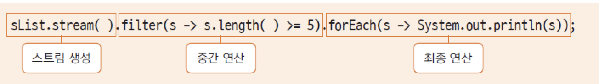
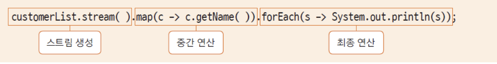
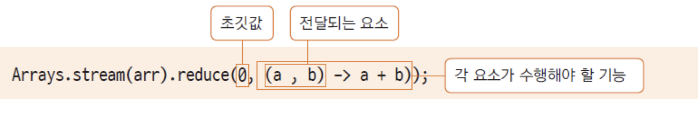

# Introduction

---

Java의 스트림(Stream)에 대해 알아본다.


# 스트림(Stream)

---

자료형과 관계없이 동일한 연산을 수행할 수 있는 기능 (배열, String, 컬렉션 등에 일관성 있는 처리 가능)

스트림을 생성한 뒤 수행할 연산들을 순서대로 연결시키며, 스트림의 대상에 대하여 해당 연산들을 순차적으로 수행하는 방식

-  한번 생성하고 사용된 스트림은 재사용 불가
- 스트림 연산 후에도 기존 input의 값을 변경하지 않음

중간 연산과 최종 연산으로 구분되며 최종 연산이 수행되어야 모든 연산이 적용되는 지연 연산


### 중간 연산

스트림의 최종 연산으로 가기 전에 요소들을 추출, 변환하는 작업

중간 연산은 여러개를 이어서 사용할 수 있음

```java
tmpList.stream().filter().map().sorted().forEach(); // filter, map, sorted의 중간연산 사용
```

아래 예시 외에도 여러 중간 연산이 있음

- ***filter(): 조건에 맞는 원소를 필터링***
- ***distinct(): 중복 제거***
- ***sorted(): 정렬***
- ***map(): 함수 등을 이용하여 원소들을 변환***

1. sList의 원소 중 length >= 5인 경우를 filtering한 뒤 해당 원소들을 출력하는 스트림



2. 아래는 customerList 원소들의 getName을 가져온 뒤 해당 리턴값을 출력하는 스트림




### 최종 연산

중간 연산의 결과물로 최종 연산을 수행하며 최종 연산 후에 스트림은 더 이상 다른 연산 적용 불가

아래 예시 외에도 여러 최종 연산이 있음

- ***forEach(): 원소를 하나씩 꺼냄***
- ***count (): 원소들의 개수 리턴***
- ***sum(): 원소들의 합 리턴***


```java
import java.util.ArrayList;
import java.util.List;
import java.util.stream.Stream;

public class ArrayListStreamTest {

	public static void main(String[] args) {
		
		List<String> sList = new ArrayList<String>();
		
		sList.add("Tomas");
		sList.add("Edward");
		sList.add("Jack");
		
		Stream<String> stream = sList.stream();
		stream.forEach(s->System.out.print(s + " "));
		System.out.println();
		
		sList.stream().sorted().forEach(s->System.out.print(s + " "));
		System.out.println();
		
		sList.stream().map(s->s.length()).forEach(n->System.out.print(n));
	}
}

------

Tomas Edward Jack 
Edward Jack Tomas 
564
```


### reduce()

정의된 연산이 아닌 프로그래머가 직접 지정하는 최종 연산

초기값과 람다식을 통해 스트림의 원소들을 하나씩 소모해가며 ***누적 계산을 수행하고 결과값을 리턴***하는 메서드

```java
Optional<T> reduce(BinaryOperator<T> accumulator);
```



누적 계산을 수행하기 때문에 가령 위와 같이 (a,b) -> a+b의 람다식이 들어오면 아래와 같은 식으로 연산이 수행된다

1. 0(초기값) + arr[0]

2. 1의 결과값 + arr[1]

3. 2의 결과값 + arr[2]

   ...


아래 예시 코드의 경우 reduce를 사용하는 2가지 방법이 나타나 있다

1. BinaryOperator를 implements한 클래스를 생성하고 apply 메서드를 오버라이딩하여 해당 객체를 reduce의 인자로 넣음
2. 람다식을 reduce의 인자로 넣음

```java
package stream;

import java.util.Arrays;
import java.util.function.BinaryOperator;

class CompareString implements BinaryOperator<String>{

	@Override
	public String apply(String s1, String s2) {
    // greetings 문자열 배열의 각 원소들의 길이를 비교해가며 가장 긴 원소를 반환, 출력
		if (s1.getBytes().length >= s2.getBytes().length)
			return s1;
		else
			return s2;
	}
	
}

public class ReduceTest {

	public static void main(String[] args) {
		
		String[] greetings = {"hello", "hi", "greeting"};
		
		
    // greetings 문자열 배열의 각 원소들의 길이를 비교해가며 가장 긴 원소를 반환, 출력
		System.out.println(Arrays.stream(greetings).reduce("",(s1,s2)->
		{ if (s1.getBytes().length >= s2.getBytes().length)
			return s1;
		else
			return s2;
		}
		));
		
		System.out.println(Arrays.stream(greetings).reduce(new CompareString()).get());
 
	}
}

----------

greeting
greeting
```


#  Conclusion

---

자바의 스트림에 대하여 알아보았다. 스트림은 스프링을 공부할때 테스트 코드 작성에 많이 사용했던 기억이 있는데 ORM관련 쿼리 코드에도 사용되는 개념인 것 같아서 제대로 알고 사용하면 보다 좋은 코드를 짤 수 있을 듯 하다. 


# Reference

---

Fastcampus JAVA기초 강의 - 박은종 강사님
