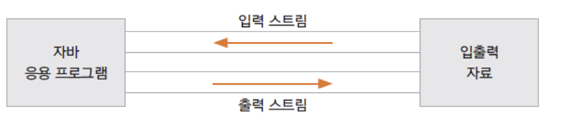
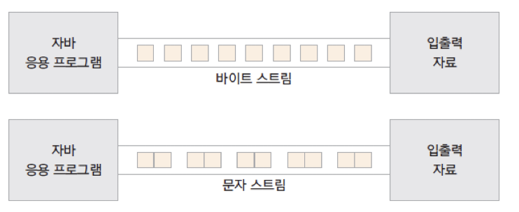
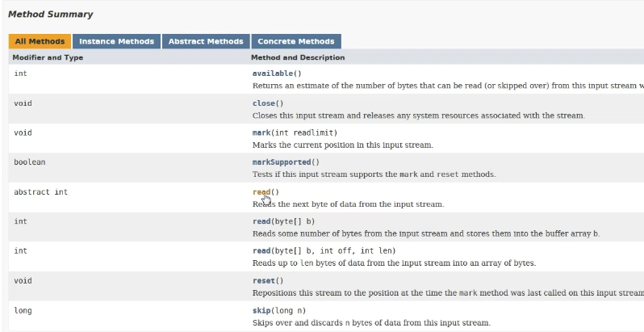
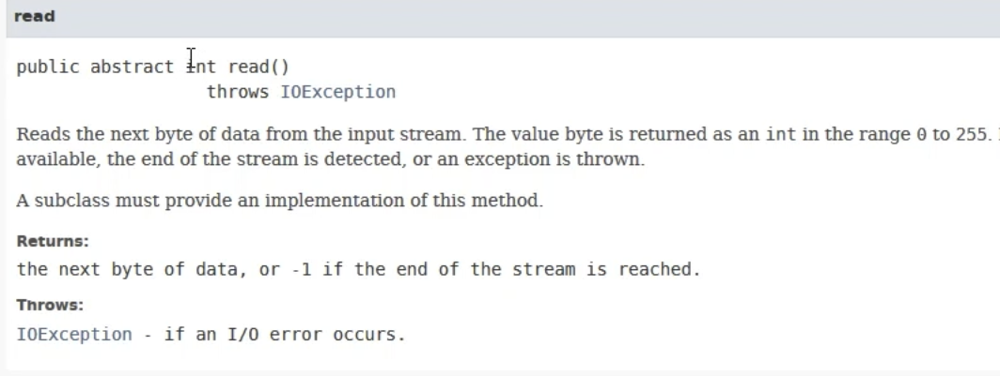
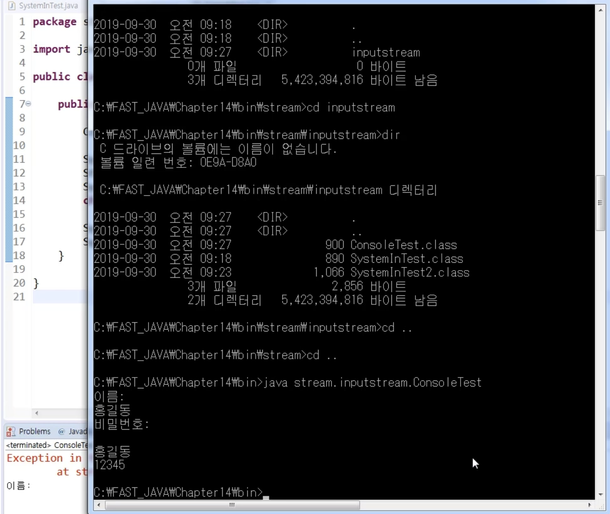
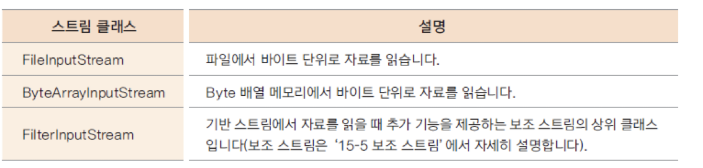
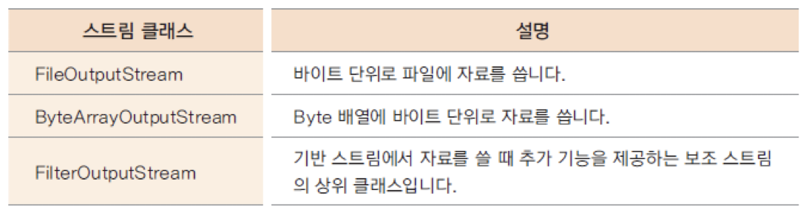

# Introduction

---

Java의 입출력 스트림에 대해 알아본다.


# 입출력 스트림(I/O Stream)

---

`스트림(Stream)`: 네트워크에서 사용하는 스트림은 자료의 흐름을 나타내는 개념으로 자료의 흐름이 물과 같다는 의미에서 유래된 단어이다. 

- 예전 포스트에서 다루었던 스트림 연산과는 다르다.

I/O 스트림을 이용하면 다양한 입출력  장치(키보드, 디스크, 메모리 등)에 일관성 있는 입출력 방식을 제공 가능

입출력  장치(키보드, 디스크, 메모리 등)나 파일 등 입출력이 수행되는 곳에는 모두 I/O 스트림이 사용


### I/O 스트림의 분류

I/O 스트림은 기준에 따라 여러개로 나뉠 수 있는데 아래와 같다.

Java에서 I/O 스트림은 데코레이터 패턴으로 구현되어 있어 다양한 추가 기능을 가지는 파생 클래스들이 존재한다.

> 데코레이터 패턴: 객체의 결합을 통해 기본적인 객체에 추가하고 싶은 기능을 유연하게 확장 할 수 있게 해주는 패턴

| 분류 기준     | 종류                       |
| ------------- | -------------------------- |
| I/O 대상      | 입력 스트림, 출력 스트림   |
| 자료의 종류   | 바이트 스트림, 문자 스트림 |
| 스트림의 기능 | 기반 스트림, 보조 스트림   |


### 입/출력 스트림



`입력 스트림`: 대상으로 부터 자료를 읽어 들이는 스트림 (FileInputStream, FileReader, BufferedInputStream, BufferedReader 등)

`출력 스트림`: 대상으로 자료를 출력하는 스트림 (FileOutputStream, FileWriter, BufferedOutputStream, BufferedWriter 등)


### 바이트/문자 스트림

**

`바이트 스트림`: 바이트 단위로 자료를 입출력, 동영상 파일, 음악 파일 등에도 사용 (FileInputStream, FileOutputStream, BufferedInputStream, BufferedOutputStream 등)

`문자 스트림`: 문자 단위(2바이트)로 자료를 입출력 (FileReader, FileWriter, BufferedReader, BufferedWriter 등)


### 기반/보조 스트림


`기반 스트림`: 대상에 직접 자료를 읽고 쓰는 기능의 스트림 (FileInputStream, FileOutputStream, FileReader, FileWriter 등)

`보조 스트림`: 직접 읽고 쓰는 기능은 없고 기반 스트림이나 다른 보조 스트림에 추가적인 기능을 제공해주는 스트림,  추가적인 기능을 제공해 줄 스트림을 생성자의 매개변수로 포함하는 방식 (InputStreamReader, OutputStreamWriter, BufferedInputStream, BufferedOutputStream 등)


## 표준 입출력

---

아래와 같이 System 클래스의 정적 멤버 형태로 표준 스트림들이 선언되어 있다.

```java
public final class System {
/**
     * The "standard" input stream. This stream is already
     * open and ready to supply input data. Typically this stream
     * corresponds to keyboard input or another input source specified by
     * the host environment or user. In case this stream is wrapped
     * in a {@link java.io.InputStreamReader}, {@link Console#charset()}
     * should be used for the charset, or consider using
     * {@link Console#reader()}.
     *
     * @see Console#charset()
     * @see Console#reader()
     */
    public static final InputStream in = null; // 표준 입력 스트림

    /**
     * The "standard" output stream. This stream is already
     * open and ready to accept output data. Typically this stream
     * corresponds to display output or another output destination
     * specified by the host environment or user. The encoding used
     * in the conversion from characters to bytes is equivalent to
     * {@link Console#charset()} if the {@code Console} exists,
     * {@link Charset#defaultCharset()} otherwise.
     * <p>
     * For simple stand-alone Java applications, a typical way to write
     * a line of output data is:
     * <blockquote><pre>
     *     System.out.println(data)
     * </pre></blockquote>
     * <p>
     * See the {@code println} methods in class {@code PrintStream}.
     *
     * @see     java.io.PrintStream#println()
     * @see     java.io.PrintStream#println(boolean)
     * @see     java.io.PrintStream#println(char)
     * @see     java.io.PrintStream#println(char[])
     * @see     java.io.PrintStream#println(double)
     * @see     java.io.PrintStream#println(float)
     * @see     java.io.PrintStream#println(int)
     * @see     java.io.PrintStream#println(long)
     * @see     java.io.PrintStream#println(java.lang.Object)
     * @see     java.io.PrintStream#println(java.lang.String)
     * @see     Console#charset()
     * @see     Charset#defaultCharset()
     */
    public static final PrintStream out = null; // 표준 출력 스트림

    /**
     * The "standard" error output stream. This stream is already
     * open and ready to accept output data.
     * <p>
     * Typically this stream corresponds to display output or another
     * output destination specified by the host environment or user. By
     * convention, this output stream is used to display error messages
     * or other information that should come to the immediate attention
     * of a user even if the principal output stream, the value of the
     * variable {@code out}, has been redirected to a file or other
     * destination that is typically not continuously monitored.
     * The encoding used in the conversion from characters to bytes is
     * equivalent to {@link Console#charset()} if the {@code Console}
     * exists, {@link Charset#defaultCharset()} otherwise.
     *
     * @see     Console#charset()
     * @see     Charset#defaultCharset()
     */
    public static final PrintStream err = null; // 표준 에러 스트림
 		...	 
}
```


- `System.in`: 한 바이트 씩 데이터를 읽어들일 수 있다. 한글과 같은 ***여러 바이트 문자를 읽기 위해서는 InputStreamReader와 같은 보조 스트림 필요***

- `InputStream`: 파일의 끝에 도달하면 -1 return, 1byte를 읽어서 4byte int를 리턴(아래 이미지 참고)

**

**


아래는 System.in을 이용하여 알파벳 문자를 읽어 들이는 예제 코드이다.

```java
package stream.inputstream;

import java.io.IOException;

public class SystemInTest {

	public static void main(String[] args) {
		
		System.out.println("Input : ");
		
		try {
			int i;
			while ((i = System.in.read()) != '\n'){
				System.out.println((char)i);
			}
		} catch (IOException e) {
			// TODO Auto-generated catch block
			e.printStackTrace(); // 어디에서 에러가 나왔는지 trace해주는 함수
		}

	}
}

-------

Input : 
asdfwef
a
s
d
f
w
e
f
```


아래 예시는 한글도 추가하여 동일한 코드를 수행한 결과인데 정상적이지 않은 결과를 확인할 수 있다.

- InputStream은 1byte씩 읽을 수 있기 때문에 2byte 문자인 ‘끝’을 제대로 인식하지 못한다 

- InputStream이 multi bytes를 읽을 수 있도록 보조 스트림을 이용해야한다 

````java
package stream.inputstream;

import java.io.IOException;

public class SystemInTest {

	public static void main(String[] args) {
		
		System.out.println("Input : ");
		
		try {
			int i;
			while ((i = System.in.read()) != '끝'){
				System.out.println((char)i);
			}
		} catch (IOException e) {
			// TODO Auto-generated catch block
			e.printStackTrace(); // 어디에서 에러가 나왔는지 trace해주는 함수
		}

	}
}

------

Input : 
asdf끝
a
s
d
f
ë		// 식별할 수 없는 문자가 추가됨


````


위 예제 코드에서 보조 스트림(InputStreamReader)을 이용하는 부분을 추가하여 한글 문자도 제대로 읽어 들일 수 있도록 하였다.

```java
package stream.inputstream;

import java.io.IOException;
import java.io.InputStreamReader;

public class SystemInTest {

	public static void main(String[] args) {
		
		System.out.println("Input : ");
		
		try {
			int i;
			InputStreamReader isr = new InputStreamReader(System.in); // 보조 스트림 추가
			while ((i = isr.read()) != '끝'){
				System.out.println((char)i);
			}
		} catch (IOException e) {
			// TODO Auto-generated catch block
			e.printStackTrace();
		}

	}
}

-------

Input : 
asdfasdf끝
a
s
d
f
a
s
d
f
```


### Scanner 클래스

java.util 패키지에 있는 입력 클래스

생성자에 어떤 소스를 넣느냐에 따라 Scanner로 읽을 수 있는 대상이 달라진다.

-  Scanner(File source): 파일을 읽음
-  Scanner(InputStream source): 입력 스트림을 읽음
-  Scanner(String source): 스트링을 읽음

```java
Scanner in = new Scanner(System.in); // 표준 입력을 읽어들이는 Scanner 객체 생성
```


문자 뿐 아니라 정수, 실수 등 다양한 자료형을 읽기 가능

```java
public class main {
	public static void main(String[] args) {
 
		Scanner in = new Scanner(System.in);	// Scanner 객체 생성
 
		byte a = in.nextByte(); 		// byte 형 입력 및 리턴
		short b = in.nextShort(); 		// short 형 입력 및 리턴
		int c = in.nextInt(); 			// int 형 입력 및 리턴
		long d = in.nextLong(); 		// long 형 입력 및 리턴
 
		float e = in.nextFloat(); 		// float 형 입력 및 리턴
		double f = in.nextDouble(); 	// double 형 입력 및 리턴
 
		boolean g = in.nextBoolean(); 	// boolean 형 입력 및 리턴
 
		String h = in.next(); 			// String 형 입력 및 리턴 (공백을 기준으로 한 단어를 읽음)
		String i = in.nextLine(); 		// String 형 입력 및 리턴 (개행을 기준으로 한 줄을 읽음)
	}
 
}
```


### Console 클래스

System.in을 사용하지 않고도 콘솔을 이용하여 표준 입출력을 가능하게 하는 클래스

- String readLine(): 문자열을 읽음
- char[] readPassword(): 사용자에게 문자열을 보여주지 않고 읽음
- Reader reader(): Reader 클래스 반환
- PrintWriter writer(): PrintWriter 클래스 반환

```java
package stream.inputstream;

import java.io.Console;

public class ConsoleTest {

	public static void main(String[] args) {
		
		Console console = System.console();
		
		System.out.println("Name : ");
		String name = console.readLine();
		
		System.out.println("Password : ");
		char[] password = console.readPassword();
		
		System.out.println(name + " / " + password);

	}
}

------

Name : 
Exception in thread "main" java.lang.NullPointerException: Cannot invoke "java.io.Console.readLine()" because "console" is null // Error, 이클립스에서 실행시키면 에러
	at Chapter14/stream.inputstream.ConsoleTest.main(ConsoleTest.java:12)
```

- 이클립스는 콘솔이 연동되지 않기 때문에 해당 클래스를 사용해서 입출력을 진행하기 위해서는 콘솔을 직접 이용해야 함

**


## 바이트 단위 입출력

---

`InputStream`: 바이트 단위 입력 스트림의 최상위 클래스 (추상 클래스)

`OutputStream`: 바이트 단위 출력 스트림의 최상위 클래스 (추상 클래스)


- InputStream의 하위 클래스




- OutputStream의 하위 클래스




### FileInputStream/FileOutputStream

파일에서 한 바이트씩 데이터를 입/출력

- 입력 스트림은 파일이 없는 경우 예외 발생

- 출력 스트림은 파일이 없는 경우 파일 생성 후 출력

```java
package stream.inputstream;

import java.io.FileInputStream;
import java.io.FileNotFoundException;
import java.io.IOException;

public class FileInputTest1 {

	public static void main(String[] args) {
		
		FileInputStream fis = null;
		try {
			fis = new FileInputStream("input.txt"); // 프로젝트 폴더의 최상위에 input.txt가 있지 않으면 FileNotFoundException 예외 발생
			
			int i;
			while ((i = fis.read()) != -1) {
				System.out.println((char)i);
			}

		} catch (IOException e) { // FileNotFoundException는 IOException의 하위 클래스
			e.printStackTrace();
		} finally {
			try {
				fis.close();
			} catch (Exception e) {
				e.printStackTrace(); 
			}
		}
		System.out.println("end");
		
	}

}
```

- 인자로 넣는 파일 경로는 프로젝트 내부가 최상위 경로이기 때문에 위 예제가 제대로 동작하려면 input.txt를 프로젝트 폴더의 최상위에 넣어야함 
- ***FileNotFoundException는 IOException의 하위 클래스**이기 때문에 FileInputStream(), fis.read()를 사용할 때, IOException 하나만 예외처리 해도 된다


위 예제를 try - with - resources로 수정하면 아래와 같다.

```java
package stream.inputstream;

import java.io.FileInputStream;
import java.io.FileNotFoundException;
import java.io.IOException;

public class FileInputTest2 {

	public static void main(String[] args) {
		
		
		try (FileInputStream fis = new FileInputStream("input.txt")){
			
			int i;
			while ((i = fis.read()) != -1) {
				System.out.println((char)i);
			}
						
		} catch (IOException e) {
			e.printStackTrace();
		}	
		System.out.println("end");
		
	}

}
```


#  Conclusion

---

자바의 예외 처리에 대하여 알아보았다. try-catch 구문은 여러 다른 언어들에도 사용되기 때문에 익숙하지만 try-with-resources 구문 같은 경우는 생소하여 이번에 새롭게 알게 되었다. 리소스 해제를 일일이 설정하지 않아도 되는 편리함이 있기 때문에 유용하게 사용할 수 있겠다.

또한 Error, Exception을 구분하는 기준에 대하여도 정확히 설명하기 힘들었는데 이번 기회에 다룰 수 있어서 다행이다.


# Reference

---

Fastcampus JAVA기초 강의 - 박은종 강사님

https://st-lab.tistory.com/92
