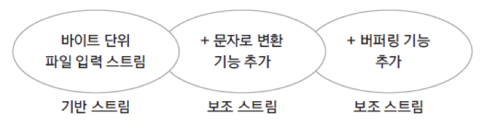

# Introduction

---

Java의 입출력 스트림에 대해 알아본다.


# 입출력 스트림(I/O Stream)

---

`스트림(Stream)`: 네트워크에서 사용하는 스트림은 자료의 흐름을 나타내는 개념으로 자료의 흐름이 물과 같다는 의미에서 유래된 단어이다. 

- 예전 포스트에서 다루었던 스트림 연산과는 다르다.

I/O 스트림을 이용하면 다양한 입출력  장치(키보드, 디스크, 메모리 등)에 일관성 있는 입출력 방식을 제공 가능

입출력  장치(키보드, 디스크, 메모리 등)나 파일 등 입출력이 수행되는 곳에는 모두 I/O 스트림이 사용


### I/O 스트림의 분류

I/O 스트림은 기준에 따라 여러개로 나뉠 수 있는데 아래와 같다.

Java에서 I/O 스트림은 데코레이터 패턴으로 구현되어 있어 다양한 추가 기능을 가지는 파생 클래스들이 존재한다.

> 데코레이터 패턴: 객체의 결합을 통해 기본적인 객체에 추가하고 싶은 기능을 유연하게 확장 할 수 있게 해주는 패턴

| 분류 기준     | 종류                       |
| ------------- | -------------------------- |
| I/O 대상      | 입력 스트림, 출력 스트림   |
| 자료의 종류   | 바이트 스트림, 문자 스트림 |
| 스트림의 기능 | 기반 스트림, 보조 스트림   |


### 입/출력 스트림


`입력 스트림`: 대상으로 부터 자료를 읽어 들이는 스트림 (FileInputStream, FileReader, BufferedInputStream, BufferedReader 등)

`출력 스트림`: 대상으로 자료를 출력하는 스트림 (FileOutputStream, FileWriter, BufferedOutputStream, BufferedWriter 등)


### 바이트/문자 스트림

**

`바이트 스트림`: 바이트 단위로 자료를 입출력, 동영상 파일, 음악 파일 등에도 사용 (FileInputStream, FileOutputStream, BufferedInputStream, BufferedOutputStream 등)

`문자 스트림`: 문자 단위(2바이트)로 자료를 입출력 (FileReader, FileWriter, BufferedReader, BufferedWriter 등)


### 기반/보조 스트림


`기반 스트림`: 대상에 직접 자료를 읽고 쓰는 기능의 스트림 (FileInputStream, FileOutputStream, FileReader, FileWriter 등)

`보조 스트림`: 직접 읽고 쓰는 기능은 없고 기반 스트림이나 다른 보조 스트림에 추가적인 기능을 제공해주는 스트림,  추가적인 기능을 제공해 줄 스트림을 생성자의 매개변수로 포함하는 방식 (InputStreamReader, OutputStreamWriter, BufferedInputStream, BufferedOutputStream 등)


## 표준 입출력

---

아래와 같이 System 클래스의 정적 멤버 형태로 표준 스트림들이 선언되어 있다.

```java
public final class System {
/**
     * The "standard" input stream. This stream is already
     * open and ready to supply input data. Typically this stream
     * corresponds to keyboard input or another input source specified by
     * the host environment or user. In case this stream is wrapped
     * in a {@link java.io.InputStreamReader}, {@link Console#charset()}
     * should be used for the charset, or consider using
     * {@link Console#reader()}.
     *
     * @see Console#charset()
     * @see Console#reader()
     */
    public static final InputStream in = null; // 표준 입력 스트림

    /**
     * The "standard" output stream. This stream is already
     * open and ready to accept output data. Typically this stream
     * corresponds to display output or another output destination
     * specified by the host environment or user. The encoding used
     * in the conversion from characters to bytes is equivalent to
     * {@link Console#charset()} if the {@code Console} exists,
     * {@link Charset#defaultCharset()} otherwise.
     * <p>
     * For simple stand-alone Java applications, a typical way to write
     * a line of output data is:
     * <blockquote><pre>
     *     System.out.println(data)
     * </pre></blockquote>
     * <p>
     * See the {@code println} methods in class {@code PrintStream}.
     *
     * @see     java.io.PrintStream#println()
     * @see     java.io.PrintStream#println(boolean)
     * @see     java.io.PrintStream#println(char)
     * @see     java.io.PrintStream#println(char[])
     * @see     java.io.PrintStream#println(double)
     * @see     java.io.PrintStream#println(float)
     * @see     java.io.PrintStream#println(int)
     * @see     java.io.PrintStream#println(long)
     * @see     java.io.PrintStream#println(java.lang.Object)
     * @see     java.io.PrintStream#println(java.lang.String)
     * @see     Console#charset()
     * @see     Charset#defaultCharset()
     */
    public static final PrintStream out = null; // 표준 출력 스트림

    /**
     * The "standard" error output stream. This stream is already
     * open and ready to accept output data.
     * <p>
     * Typically this stream corresponds to display output or another
     * output destination specified by the host environment or user. By
     * convention, this output stream is used to display error messages
     * or other information that should come to the immediate attention
     * of a user even if the principal output stream, the value of the
     * variable {@code out}, has been redirected to a file or other
     * destination that is typically not continuously monitored.
     * The encoding used in the conversion from characters to bytes is
     * equivalent to {@link Console#charset()} if the {@code Console}
     * exists, {@link Charset#defaultCharset()} otherwise.
     *
     * @see     Console#charset()
     * @see     Charset#defaultCharset()
     */
    public static final PrintStream err = null; // 표준 에러 스트림
 		...	 
}
```


- `System.in`: 한 바이트 씩 데이터를 읽어들일 수 있다. 한글과 같은 ***여러 바이트 문자를 읽기 위해서는 InputStreamReader와 같은 보조 스트림 필요***

- `InputStream`: 파일의 끝에 도달하면 -1 return, 1byte를 읽어서 4byte int를 리턴(아래 이미지 참고)

**

**


아래는 System.in을 이용하여 알파벳 문자를 읽어 들이는 예제 코드이다.

```java
package stream.inputstream;

import java.io.IOException;

public class SystemInTest {

	public static void main(String[] args) {
		
		System.out.println("Input : ");
		
		try {
			int i;
			while ((i = System.in.read()) != '\n'){
				System.out.println((char)i);
			}
		} catch (IOException e) {
			// TODO Auto-generated catch block
			e.printStackTrace(); // 어디에서 에러가 나왔는지 trace해주는 함수
		}

	}
}

-------

Input : 
asdfwef
a
s
d
f
w
e
f
```


아래 예시는 한글도 추가하여 동일한 코드를 수행한 결과인데 정상적이지 않은 결과를 확인할 수 있다.

- InputStream은 1byte씩 읽을 수 있기 때문에 2byte 문자인 ‘끝’을 제대로 인식하지 못한다 

- InputStream이 multi bytes를 읽을 수 있도록 보조 스트림을 이용해야한다 

````java
package stream.inputstream;

import java.io.IOException;

public class SystemInTest {

	public static void main(String[] args) {
		
		System.out.println("Input : ");
		
		try {
			int i;
			while ((i = System.in.read()) != '끝'){
				System.out.println((char)i);
			}
		} catch (IOException e) {
			// TODO Auto-generated catch block
			e.printStackTrace(); // 어디에서 에러가 나왔는지 trace해주는 함수
		}

	}
}

------

Input : 
asdf끝
a
s
d
f
ë		// 식별할 수 없는 문자가 추가됨


````


위 예제 코드에서 보조 스트림(InputStreamReader)을 이용하는 부분을 추가하여 한글 문자도 제대로 읽어 들일 수 있도록 하였다.

```java
package stream.inputstream;

import java.io.IOException;
import java.io.InputStreamReader;

public class SystemInTest {

	public static void main(String[] args) {
		
		System.out.println("Input : ");
		
		try {
			int i;
			InputStreamReader isr = new InputStreamReader(System.in); // 보조 스트림 추가
			while ((i = isr.read()) != '끝'){
				System.out.println((char)i);
			}
		} catch (IOException e) {
			// TODO Auto-generated catch block
			e.printStackTrace();
		}

	}
}

-------

Input : 
asdfasdf끝
a
s
d
f
a
s
d
f
```


### Scanner 클래스

java.util 패키지에 있는 입력 클래스

생성자에 어떤 소스를 넣느냐에 따라 Scanner로 읽을 수 있는 대상이 달라진다.

-  Scanner(File source): 파일을 읽음
-  Scanner(InputStream source): 입력 스트림을 읽음
-  Scanner(String source): 스트링을 읽음

```java
Scanner in = new Scanner(System.in); // 표준 입력을 읽어들이는 Scanner 객체 생성
```


문자 뿐 아니라 정수, 실수 등 다양한 자료형을 읽기 가능

```java
public class main {
	public static void main(String[] args) {
 
		Scanner in = new Scanner(System.in);	// Scanner 객체 생성
 
		byte a = in.nextByte(); 		// byte 형 입력 및 리턴
		short b = in.nextShort(); 		// short 형 입력 및 리턴
		int c = in.nextInt(); 			// int 형 입력 및 리턴
		long d = in.nextLong(); 		// long 형 입력 및 리턴
 
		float e = in.nextFloat(); 		// float 형 입력 및 리턴
		double f = in.nextDouble(); 	// double 형 입력 및 리턴
 
		boolean g = in.nextBoolean(); 	// boolean 형 입력 및 리턴
 
		String h = in.next(); 			// String 형 입력 및 리턴 (공백을 기준으로 한 단어를 읽음)
		String i = in.nextLine(); 		// String 형 입력 및 리턴 (개행을 기준으로 한 줄을 읽음)
	}
 
}
```


### Console 클래스

System.in을 사용하지 않고도 콘솔을 이용하여 표준 입출력을 가능하게 하는 클래스

- String readLine(): 문자열을 읽음
- char[] readPassword(): 사용자에게 문자열을 보여주지 않고 읽음
- Reader reader(): Reader 클래스 반환
- PrintWriter writer(): PrintWriter 클래스 반환

```java
package stream.inputstream;

import java.io.Console;

public class ConsoleTest {

	public static void main(String[] args) {
		
		Console console = System.console();
		
		System.out.println("Name : ");
		String name = console.readLine();
		
		System.out.println("Password : ");
		char[] password = console.readPassword();
		
		System.out.println(name + " / " + password);

	}
}

------

Name : 
Exception in thread "main" java.lang.NullPointerException: Cannot invoke "java.io.Console.readLine()" because "console" is null // Error, 이클립스에서 실행시키면 에러
	at Chapter14/stream.inputstream.ConsoleTest.main(ConsoleTest.java:12)
```

- 이클립스는 콘솔이 연동되지 않기 때문에 해당 클래스를 사용해서 입출력을 진행하기 위해서는 콘솔을 직접 이용해야 함

**


## 바이트 단위 입출력

---

`InputStream`: 바이트 단위 입력 스트림의 최상위 클래스 (추상 클래스)

`OutputStream`: 바이트 단위 출력 스트림의 최상위 클래스 (추상 클래스)


- InputStream의 하위 클래스


- OutputStream의 하위 클래스


### FileInputStream/FileOutputStream

파일에서 한 바이트씩 데이터를 입/출력

- 입력 스트림은 파일이 없는 경우 예외 발생

- 출력 스트림은 파일이 없는 경우 파일 생성 후 출력

```java
package stream.inputstream;

import java.io.FileInputStream;
import java.io.FileNotFoundException;
import java.io.IOException;

public class FileInputTest1 {

	public static void main(String[] args) {
		
		FileInputStream fis = null;
		try {
			fis = new FileInputStream("input.txt"); // 프로젝트 폴더의 최상위에 input.txt가 있지 않으면 FileNotFoundException 예외 발생
			
			int i;
			while ((i = fis.read()) != -1) {
				System.out.println((char)i);
			}

		} catch (IOException e) { // FileNotFoundException는 IOException의 하위 클래스
			e.printStackTrace();
		} finally {
			try {
				fis.close();
			} catch (Exception e) {
				e.printStackTrace(); 
			}
		}
		System.out.println("end");
		
	}

}
```

- 인자로 넣는 파일 경로는 프로젝트 내부가 최상위 경로이기 때문에 위 예제가 제대로 동작하려면 input.txt를 프로젝트 폴더의 최상위에 넣어야함 
- ***FileNotFoundException는 IOException의 하위 클래스**이기 때문에 FileInputStream(), fis.read()를 사용할 때, IOException 하나만 예외처리 해도 된다


위 예제를 try - with - resources로 수정하면 아래와 같다.

```java
package stream.inputstream;

import java.io.FileInputStream;
import java.io.FileNotFoundException;
import java.io.IOException;

public class FileInputTest2 {

	public static void main(String[] args) {
		
		
		try (FileInputStream fis = new FileInputStream("input.txt")){
			
			int i;
			while ((i = fis.read()) != -1) {
				System.out.println((char)i);
			}
						
		} catch (IOException e) {
			e.printStackTrace();
		}	
		System.out.println("end");
		
	}

}
```


아래 예제는 input2.txt를 10바이트씩 byte배열에 입력을 받으면서 입력받은 배열을 출력해주는 예제이다.

- `배열을 인자로 넣은 read()`는 인자로 보내준 배열의 크기만큼 파일을 읽어 들인다.

- `인자를 넣지 않은 read()`는 한 바이트 씩 파일을 읽어 들인다.

- `배열을 인자로 넣은 read()`의 리턴으로는 읽어들인 바이트의 크기가 반환 된다.

- `인자를 넣지 않은 read()`의 리턴으로는 읽어들인 바이트의 값이 반환 된다.

```
// input2 .txt
ABCDEFGHIJKLMNOP
```

```java
package stream.inputstream;

import java.io.FileInputStream;
import java.io.FileNotFoundException;
import java.io.IOException;

public class FileInputTest3 {

	public static void main(String[] args) {
		
		
		try (FileInputStream fis = new FileInputStream("input2.txt")){
			
			int i;
			byte[] bs = new byte[10];
			
			while ((i = fis.read(bs)) != -1) { // 인자로 보내준 배열 bs의 크기만큼 파일을 읽어들인다
				for (byte b : bs) {
					System.out.print((char)b);
				}
				System.out.println();
			}
			
			
		} catch (IOException e) {
			// TODO Auto-generated catch block
			e.printStackTrace();
		} 
		
	}
}

----------

ABCDEFGHIJ
KLMNOPQRST
UVWXYZQRST // UVWXYZ 뒤에 QRST garbage값이 출력됨
```

- 위 예시 결과를 보면 3번째 줄의 QRST는 2번째 loop를 돌때 array에 남아있던 garbage값이 출력됨

  - 배열에 입력을 받은 뒤 10바이트씩 고정으로 출력을 해주고 있기 때문에 마지막 'UVWXYZ' 6바이트의 입력이 들어왔어도 10바이트 출력을 시도 
  - input2.txt의 2번째 줄을 처리할 때 남아있던 array의 값들이 출력되는 문제 발생

  

```java
package stream.inputstream;

import java.io.FileInputStream;
import java.io.FileNotFoundException;
import java.io.IOException;

public class FileInputTest3 {

	public static void main(String[] args) {
		
		
		try (FileInputStream fis = new FileInputStream("input2.txt")){
			
			int i;
			byte[] bs = new byte[10];
			
			while ((i = fis.read(bs)) != -1) { 
//				for (byte b : bs) {
//					System.out.print((char)b);
//				}
//				System.out.println();
				
				for (int k=0; k<i; k++) {
					System.out.print((char)bs[k]);
				}
				System.out.println();
			}
			
			
		} catch (IOException e) {
			// TODO Auto-generated catch block
			e.printStackTrace();
		} 
	}
}

----------

ABCDEFGHIJ
KLMNOPQRST
UVWXYZ
```

- 배열을 인자로 받은 read()의 반환 값에는 읽어들인 바이트 수가 리턴되기 때문에 리턴 값을 이용하여 파일 내용을 정확한 범위까지 출력할 수 있다.


아래는 파일 출력 스트림의 예시이다.

`FileOutputStream(filename, option);`

- option의 디폴트는 false인데 true로 설정하면 write할때마다 append가된다

```java
package stream.outputstream;

import java.io.FileOutputStream;
import java.io.IOException;

public class FileOutputTest1 {

	public static void main(String[] args) {
		
		try(FileOutputStream fos = new FileOutputStream("output.txt", true)){
			
			fos.write(65);
			fos.write(66);
			fos.write(67);
			
		}catch(IOException e) {
			System.out.println(e);
		}

	}

}
```


FileInputStream, FileOutputStream을 동시에 사용하면 파일에서 읽어들인 데이터를 다른 파일로 출력할 수 있다.

```java
package stream.outputstream;

import java.io.FileInputStream;
import java.io.FileOutputStream;
import java.io.IOException;

public class FileOutputTest1 {

	public static void main(String[] args) {
		
		byte[] bs = new byte[26];
		byte data = 65;
		for(int i=0; i<bs.length; i++) {
			bs[i] = data;
			data++;
		}
		
		try(FileOutputStream fos = new FileOutputStream("alpha.txt");
				FileInputStream fis = new FileInputStream("alpha2.txt")){
			
			fos.write(bs);
			int ch;
			while ( (ch = fis.read()) != -1) {
				System.out.print((char)ch);
			}
					
		}catch(IOException e) {
			System.out.println(e);
		}

	}

}
```


## 문자 단위 입출력 스트림

---

`Reader`: 문자 단위 입력 스트림의 최상위 클래스 

`Writer`: 문자 단위 출력 스트림의 최상위 클래스 


- Reader의 하위 클래스


- Writer의 하위 클래스


### FileReader/FileWriter

파일에서 문자를 읽고 쓸때 주로 사용하는 클래스, 문자의 인코딩 방식을 지정하는 것도 가능


1) FileReader 방식 파일 입력

```
// reader.txt
가나다라abc
```

```java
package stream.reader;

import java.io.FileInputStream;
import java.io.FileNotFoundException;
import java.io.FileReader;
import java.io.IOException;
import java.io.InputStreamReader;

public class FileReaderTest {

	public static void main(String[] args) throws IOException {
		
//		FileInputStream fis = new FileInputStream("reader.txt");
//		InputStreamReader isr = new InputStreamReader(fis); 
		FileReader fis = new FileReader("reader.txt");
		
		int i;
		while( (i = fis.read()) != -1 ) {
			System.out.print((char)i);
		}
		
		fis.close();
	}
}

---------

가나다라abc
```


2. FileWriter 방식 파일 출력

````java
package stream.writer;

import java.io.FileWriter;
import java.io.IOException;

public class FileWriterTest {

	public static void main(String[] args) throws IOException {
		
		FileWriter fw = new FileWriter("writer.txt");
		fw.write("A");
		
		char[] buf = {'B','C','D','E','F'};
		fw.write(buf);
		fw.write("안녕하세요");
		fw.write(buf, 2, 2);
		fw.close();
		
		System.out.println("end");
	}

}
````

```
// writer.txt
ABCDEF안녕하세요DE
```


### InputStreamReader

바이트 단위로 읽은 데이터를 문자로 변환해 주는 보조 스트림 클래스

바이트 단위로 데이터를 입력해주는 `FileInputStream` 클래스를 이용하여 문자를 읽어들이면 ***2바이트 이상의 문자를 읽을 때 invalid한 결과*** 값이 나오게 되는데 이때 `InputStreamReader` 보조 클래스를 사용하면 정확한 문자를 읽을 수 있다.


1) FileInputStream를 사용하여 한글 문자를 읽는 경우

```
// reader.txt
가나다라abc
```

```java
package stream.reader;

import java.io.FileInputStream;
import java.io.FileNotFoundException;
import java.io.FileReader;
import java.io.IOException;
import java.io.InputStreamReader;

public class FileReaderTest {

	public static void main(String[] args) throws IOException {
		
		FileInputStream fis = new FileInputStream("reader.txt");
//		InputStreamReader isr = new InputStreamReader(fis); 
//		FileReader fis = new FileReader("reader.txt");
		
		int i;
		while( (i = fis.read()) != -1 ) {
			System.out.print((char)i);
		}
		
		fis.close();
	}
}

----------

가나다라abc // Invalid한 데이터가 입력됨
```

- FileInputStream은 바이트 단위로 읽기 때문에 한글 문자는 제대로 인식 못함


2. InputStreamReader를 이용한 경우

```java
package stream.reader;

import java.io.FileInputStream;
import java.io.FileNotFoundException;
import java.io.FileReader;
import java.io.IOException;
import java.io.InputStreamReader;

public class FileReaderTest {

	public static void main(String[] args) throws IOException {
		
		FileInputStream fis = new FileInputStream("reader.txt");
		InputStreamReader isr = new InputStreamReader(fis); // FileInputStream를 보조하여 바이트 단위 데이터를 문자로 변환
//		FileReader fis = new FileReader("reader.txt");
		
		int i;
		while( (i = isr.read()) != -1 ) {
			System.out.print((char)i);
		}
		
		isr.close(); // 보조 스트림을 close하면 메인 스트림인 FileInputStream도 close됨
	}
}

---------

가나다라abc // Correct result
```

- InputStreamReader로 바이트 단위로 읽은 자료를 문자로 변환 가능


## 보조 스트림

실제 읽고 쓰는 스트림이 아닌 다른 스트림의 기능을 추가해주는(보조하는) 역할을 하는 스트림

**


FilterInputStream, FilterOutputStream이 보조 스트림의 상위 클래스에 해당

**


보조 스트림의 예시로는 BufferedInputStream/BufferedOutputStream, DataInputStream/DataOutputStream 등이 있다.

- `BufferedInputStream`/`BufferedOutputStream`: 내부에 8192 바이트의 버퍼를 가지고 있어 읽고 쓰는 속도가 빠름
- `DataInputStream`/`DataOutputStream`: 데이터의 자료형을 그대로 유지하며 읽고 쓰는 것이 가능


### BufferedInputStream/BufferedOutputStream

아래 예시는 버퍼 보조 스트림을 이용하기 전과 후의 Read/Write 속도를 비교한 코드이다.

1. 버퍼 스트림을 이용하기 전

````java
package stream.decorator;
import java.io.BufferedInputStream;
import java.io.BufferedOutputStream;
import java.io.FileInputStream;
import java.io.FileOutputStream;
import java.io.IOException;

public class FileCopy {

	public static void main(String[] args) {
		
		long miliseconds = 0;
		
		try(FileInputStream fis = new FileInputStream("a.zip");
				FileOutputStream fos = new FileOutputStream("copy.zip")){
			
			miliseconds = System.currentTimeMillis();
			
			int i;
			while ( (i = fis.read()) != -1) {
				fos.write(i);
			}
      
			miliseconds = System.currentTimeMillis() - miliseconds;
      
		}catch(IOException e) {
			System.out.println(e);
		}
		
		System.out.println("시간: " + miliseconds);

	}
}

--------

시간: 2287
````


2. 버퍼 스트림을 이용 

````java
package stream.decorator;
import java.io.BufferedInputStream;
import java.io.BufferedOutputStream;
import java.io.FileInputStream;
import java.io.FileOutputStream;
import java.io.IOException;

public class FileCopy {

	public static void main(String[] args) {
		
		long miliseconds = 0;
		
		try(FileInputStream fis = new FileInputStream("a.zip");
				FileOutputStream fos = new FileOutputStream("copy.zip");
				BufferedInputStream bis = new BufferedInputStream(fis); 	 // 버퍼 스트림
				BufferedOutputStream bos = new BufferedOutputStream(fos)){ // 버퍼 스트림
			
			miliseconds = System.currentTimeMillis();
			
			int i;
			while ( (i = bis.read()) != -1) {
				bos.write(i);
			}
			
			miliseconds = System.currentTimeMillis() - miliseconds;
			
			
		}catch(IOException e) {
			System.out.println(e);
		}
		
		System.out.println("시간: " + miliseconds);

	}
}

--------

시간: 17
````

- ***R/W 시간이 2287 -> 17 로 획기적으로 빨라진 것을 확인***


보조 스트림은 `데코레이터` 패턴으로 구현되어 ***여러번 사용하여 다른 스트림의 기능을 계속 추가해 나갈 수 있음***

`InputStreamReader` : byte단위로 읽는 것을 문자단위로 읽을 수 있게 변경 

`BufferedReader` : 버퍼링기능  

`readLine` : \n 이나 \r 단위로 문자를 읽어들임

```java
package stream.decorator;
import java.io.BufferedInputStream;
import java.io.BufferedOutputStream;
import java.io.FileInputStream;
import java.io.FileOutputStream;
import java.io.IOException;

public class FileCopy {

	public static void main(String[] args) throws IOException {
		Socket socket = new Socket();
		BufferedReader isr = new BufferedReader( new InputStreamReader(socket.getInputStream()));
		isr.readLine();
	}
}
```


### DataInputStream/DataOutputStream

`DataStream` : 데이터가 저장된 ***자료형을 유지***하면서 읽거나 쓰는 기능으로 ***데이터가 쓰여진 순서를 유지하면서 읽어야 함*** (위의 예에선 byte, int, char, utf), 순서가 달라지면 데이터가 깨질 수 있음

- `writeByte` : 1바이트 단위로 write
- `writeChar` : 문자 단위 
- `writeUTF` : string 단위

```java
package stream.decorator;

import java.io.DataInputStream;
import java.io.DataOutputStream;
import java.io.FileInputStream;
import java.io.FileOutputStream;
import java.io.IOException;

public class DataStreamTest {

	public static void main(String[] args) {
		
		try(FileOutputStream fos = new FileOutputStream("data.txt");
				DataOutputStream dos = new DataOutputStream(fos);
				FileInputStream fis = new FileInputStream("data.txt");
				DataInputStream dis = new DataInputStream(fis)){
			
      // byte -> int -> char -> utf 순으로 write
			dos.writeByte(100);
			dos.write(100);
			dos.writeChar('A');
			dos.writeUTF("안녕하세요");
			
      // byte -> int -> char -> utf 순으로 read
			System.out.println(dis.readByte());
			System.out.println(dis.read());
			System.out.println(dis.readChar());
			System.out.println(dis.readUTF());
			
		}catch(IOException e) {
			
		}

	}

}
```


## 직렬화 (Serialization)

---

객체 직렬화란 ***객체의 내용을 바이트 단위로 변환하여 파일 또는 네트워크를 통해서 송수신(스트림)이 가능하게 만들어 주는 것***

- 이때, 객체 ***직렬화의 대상은 멤버 변수***만으로 구성
- 즉, 멤버 변수를 제외한 ***메서드와 생성자는 직렬화에서 제외된다.***

ObjectInputStream, ObjectOutputStream 보조 스트림이 사용된다.

### 

### Serializable 인터페이스

객체의 직렬화 가능 여부를 명시하기 위한 인터페이스, 구현 코드가 없는 Marker Interface

> Marker Interface: 아무 메서드도 담고 있지 않고 단지 자신을 구현하는 클래스가 **특정 속성**을 가짐을 표시해주는 인터페이스를 말한다.

```java
package stream.serialization;

import java.io.FileInputStream;
import java.io.FileOutputStream;
import java.io.IOException;
import java.io.ObjectInputStream;
import java.io.ObjectOutputStream;
import java.io.Serializable;

class Person implements Serializable{ // Serializable 마커 인터페이스를 구현함으로써 직렬화가 가능한 클래스 임을 명시
	String name;
	String job;
	// transient String job; // transient → 이 객체는 직렬화하지 말라는 의미
	
	public Person(String name, String job) {
		this.name = name;
		this.job = job;
		
	}
	
	public String toString() {
		return name + ", " + job;
	}
}

public class SerializationTest {

	public static void main(String[] args) {
		
		Person personLee = new Person("Lee", "Engineer");
		Person personKim = new Person("Kim", "Teacher");

		
		try(FileOutputStream fos = new FileOutputStream("serial.dat");
				ObjectOutputStream oos = new ObjectOutputStream(fos)){
			
			oos.writeObject(personLee);  // 직렬화한 객체 출력
			oos.writeObject(personKim);	 // 직렬화한 객체 출력
			
		}catch(IOException e) {
			System.out.println(e);
		}
		
		try ( FileInputStream fis = new FileInputStream("serial.dat");
				ObjectInputStream ois = new ObjectInputStream(fis)){
			
			Person p1 = (Person)ois.readObject();	 // 직렬화된 객체 입력
			Person p2 = (Person)ois.readObject();	 // 직렬화된 객체 입력
			
			System.out.println(p1);
			System.out.println(p2);
			
		}catch(IOException e) {
			System.out.println(e);
		} catch (ClassNotFoundException e) {
			System.out.println(e);
		}
				
	}
}

---------

// String job; 의 경우
Lee, Engineer
Kim, Teacher


// transient String job; 의 경우
Lee, null
Kim, null
```

```
// serial.dat
��srstream.serialization.Persond�t�>RcLjobtLjava/lang/String;Lnameq~xptEngineertLeesq~tTeachertKim
```


### Externalizable

직렬화를 위해 직접 구현해야 하는 메소드가 있는 인터페이스, Marker Interface가 아니다

`writeExternal`, `readExternal`: 객체 직렬화를 위해 writeObject, readObject이 호출 될 때, 해당 메서드들이 호출되어서 object를 읽고 쓰는 것을 직접 구현 가능

```java
class Person implements Externalizable{
	String name;
	transient String job;
	
	public Person(String name, String job) {
		this.name = name;
		this.job = job;
		
	}
	
	public String toString() {
		return name + ", " + job;
	}

	@Override
	public void writeExternal(ObjectOutput out) throws IOException {
		// TODO Auto-generated method stub
		
	}

	@Override
	public void readExternal(ObjectInput in) throws IOException, ClassNotFoundException {
		// TODO Auto-generated method stub
		
	}
}
```


## 기타 입출력 클래스

---

### File 클래스

파일 개념을 추상화한 클래스, 입출력 기능은 없고 파일의 속성, 경로, 이름등을 알 수 있음

### RandomAccessFile 클래스

입출력 클래스 중 유일하게 객체 하나로 파일 입출력이 동시 가능한 클래스

파일 포인터가 있어 읽고 쓰는 위치 이동(`seek()` 메서드 사용)이 가능, 다양한 자료형에 대한 메서드 제공

```java
package stream.others;

import java.io.FileNotFoundException;
import java.io.IOException;
import java.io.RandomAccessFile;

public class RandomAccessFileTest {

	public static void main(String[] args) throws IOException {
		
		RandomAccessFile rf = new RandomAccessFile("random.txt", "rw");
		rf.writeInt(100);
		System.out.println(rf.getFilePointer());
		rf.writeDouble(3.14);
		rf.writeUTF("안녕");
		
		rf.seek(0);						// 파일의 첫 번째 위치로 이동
		int i = rf.readInt();
		double d = rf.readDouble();
		String str = rf.readUTF();
		
		System.out.println(i);
		System.out.println(d);
		System.out.println(str);
		
		rf.close();

	}
}

----------

4
100
3.14
안녕
```

- ***RandomAccessFile는 write나 read를 할때마다 파일 포인터가 달라지기 때문에 write 후에 rf.seek(0); 을 하지 않으면 정상적인 read가 불가능***


# 데코레이터 패턴

---

위에서 몇번 언급된 데코레이터 패턴에 대하여 간략히 알아보자.

객체의 결합을 통해 ***기본적인 객체(Component)에 추가하고 싶은 기능(Decorater)을 유연하게 확장*** 할 수 있게 해주는 패턴


`Component`

- 기본 기능을 뜻하는 ConcreteComponent와 추가 기능을 뜻하는 Decorator의 공통 기능을 정의
- 즉, 클라이언트는 Component를 통해 실제 객체를 사용함

`ConcreteComponent`

- Component의 기본 기능을 구현하는 클래스

`Decorator`

- 여러 Decorator의 공통 기능을 제공

`ConcreteDecoratorA`, `ConcreteDecoratorB`

- Decorator의 하위 클래스로 기본 기능에 추가되는 개별적인 기능을 뜻함
- ConcreteDecorator 클래스는 ConcreteComponent 객체에 대한 참조가 필요한데, 이는 Decorator 클래스에서 Component 클래스로의 ***합성(composition) 관계***를 통해 표현됨
- 컴포넌트의 기본 기능(위 예시의 Operation 메서드)을 수행한 뒤에 추가 기능(AddedBehavior() 메서드)을 수행하여 컴포넌트를 보조한다.

[^]: 출처: https://gmlwjd9405.github.io/2018/07/09/decorator-pattern.html


Java의 입출력 클래스를 예로 들면 아래와 같다.

- Component: 기반 스트림
- Decorator: 보조 스트림

Decorator의 입장에서 컴포넌트의 입출력 기능을 보조해주기 위해서

1. 컴포넌트를 참조하고 있어야(합성 관계) 한다.
2. 컴포넌트의 기능을 우선적으로 호출하고 보조 기능을 호출하여 컴포넌트의 기능을 보조한다.

가령 아래 DataInputStream 보조 클래스를 보면 InputStream(컴포넌트)를 보조해주고 있는데 readChar() 메서드를 보면 컴포넌트의 메서드를 먼저 호출한 뒤에 보조 기능을 추가한 것을 알 수 있다.

```java
public class DataInputStream extends FilterInputStream implements DataInput {

    /**
     * Creates a DataInputStream that uses the specified
     * underlying InputStream.
     *
     * @param  in   the specified input stream
     */
    public DataInputStream(InputStream in) {
        super(in);
    }
		...
      
    public final char readChar() throws IOException {
        int ch1 = in.read();
        int ch2 = in.read();
        if ((ch1 | ch2) < 0)
            throw new EOFException();
        return (char)((ch1 << 8) + (ch2 << 0));
    }
 	 ...
}

```


#  Conclusion

---

Java의 입출력 스트림에 대하여 꽤 자세히 알아보았다.

입출력 스트림의 개념에서 부터 각 스트림의 의미,기능,종류를 알아보았고 입출력 스트림에 사용된 데코레이터 패턴까지 알아보았다.

입출력 같은 경우 너무 간단하게 생각하여 제대로 알아보지 않고 넘어가는 경우가 많았는데 몰랐던 개념들도 있었고 잘못 알고 있던 개념들도 있었어서 생각보다 공부할 거리가 많았다.


# Reference

---

Fastcampus JAVA기초 강의 - 박은종 강사님

https://st-lab.tistory.com/92

https://blog.naver.com/porshe99/60048101682

https://velog.io/@semi-cloud/Effective-Java-%EC%95%84%EC%9D%B4%ED%85%9C-41-%EC%A0%95%EC%9D%98%ED%95%98%EB%A0%A4%EB%8A%94-%EA%B2%83%EC%9D%B4-%ED%83%80%EC%9E%85%EC%9D%B4%EB%9D%BC%EB%A9%B4-%EB%A7%88%EC%BB%A4-%EC%9D%B8%ED%84%B0%ED%8E%98%EC%9D%B4%EC%8A%A4%EB%A5%BC-%EC%82%AC%EC%9A%A9%ED%95%98%EB%9D%BC

https://gmlwjd9405.github.io/2018/07/09/decorator-pattern.html
