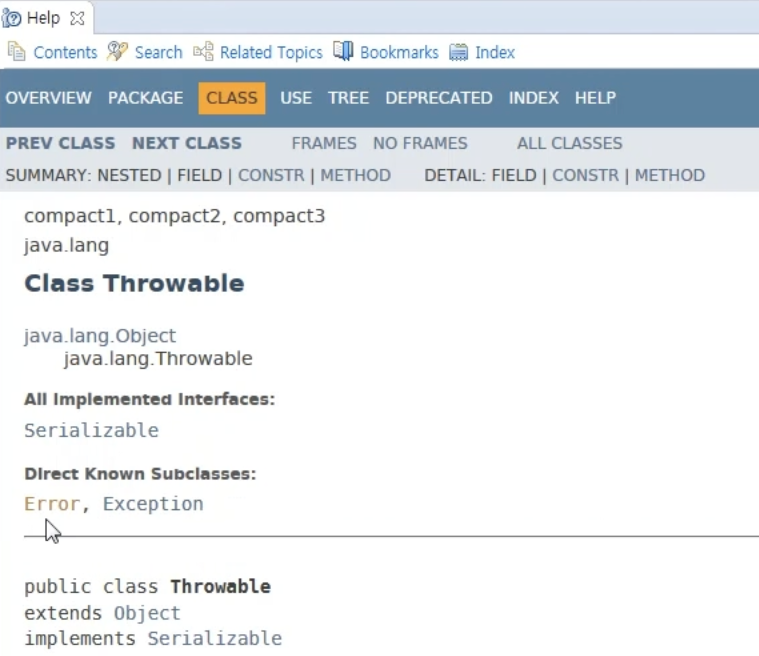
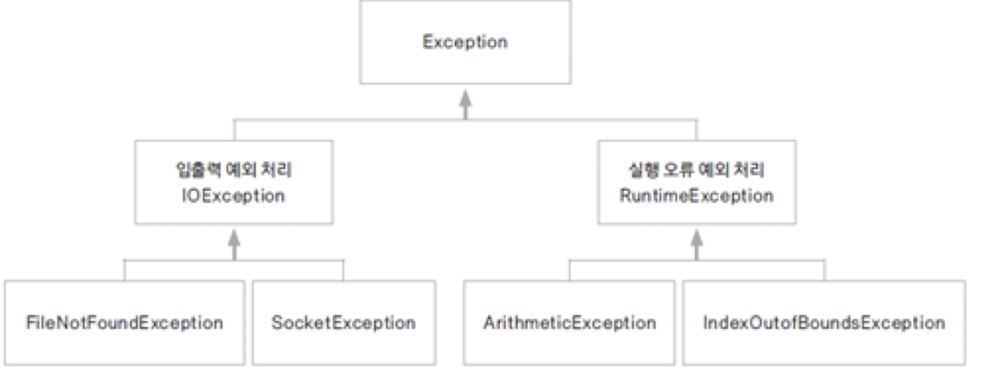
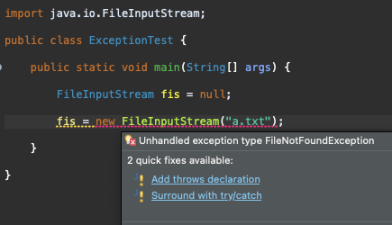
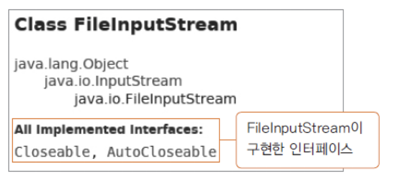

# Introduction

---

Java의 입출력 스트림에 대해 알아본다.


# 입출력 스트림(I/O Stream)

---

네트워크에서의 stream은 자료의 흐름이 물과 같다는 의미에서 생성된 개념

다양한 입출력 장치에 

실행 오류는 다시 아래와 같이 나뉜다.

- `시스템 오류 (Error)`: 가상 머신에서 발생하며 ***프로그래머가 처리 불가*** ex) 동적 메모리를 모두 사용, stack over flow
- `예외 (Execption)`: ***프로그램에서 제어 가능한 오류***, 프로그램 내에서 예외 처리가 가능 ex) file not found, network error 등


Error, Exception은 Java에서 클래스의 형태로 제공되는데 둘 다 Throwable 클래스를 상속 받는다.

**


# 예외(Exception)

---

크게 ***입출력 예외(IOException)***와 ***실행 오류 예외(RuntimeException)***로 나뉘며 모든 예외 클래스의 ***최상위 클래스는 Exception*** 클래스




### try-catch-finally

Java는 try-catch-finally 문으로 예외를 처리한다.

1. `try`: 예외 발생 할 수 있는 코드를 해당 블록 내에 넣는다.
2. `catch`: try 블록 안에서 예외가 발생 할 때 해당 예외를 처리할 코드를 넣는다. 
3. `finally`: 예외 발생 여부와 상관없이 항상 수행되는 부분

```java
try{
		// 예외 발생 할 수 있는 코드
} catch(예외 타입1 e){
 	 	// try 블록 안에서 예외가 발생 할 때 예외를 처리할 부분
}
finally{
  	// 예외 발생 여부와 상관없이 항상 수행되는 부분
  	// 보통 사용한 리소스를 정리하는 코드를 쓴다
}
```


아래 코드는 일부러 예외를 발생시킨 코드이다. 예외를 처리하기 전과 후를 비교해서 살펴보자.

1) 예외 처리 전

- java.lang.ArrayIndexOutOfBoundsException 발생

```java
package exception;

public class ArrayExceptionTest {

	public static void main(String[] args) {
		
		int[] arr = new int[5];
		
		for(int i=0; i<=5; i++) {
			System.out.println(arr[i]);
		}
	}
}

-----

0
0
0
0
0
Exception in thread "main" java.lang.ArrayIndexOutOfBoundsException: Index 5 out of bounds for length 5
	at Chapter13/exception.ArrayExceptionTest.main(ArrayExceptionTest.java:10)
```


2. 예외 처리 후 

- java.lang.ArrayIndexOutOfBoundsException에 대한 처리를 하여 try 블록에서 예외가 발생 후 catch 블록에서 처리

```java
package exception;

public class ArrayExceptionTest {

	public static void main(String[] args) {
		
		int[] arr = new int[5];
		
		try {
			for(int i=0; i<=5; i++) {
				System.out.println(arr[i]);
			}	
		}
		catch(ArrayIndexOutOfBoundsException e) {
			System.out.println(e);
			System.out.println("exception");
		}
		
		System.out.println("exit");	

	}
}

-----

0
0
0
0
0
java.lang.ArrayIndexOutOfBoundsException: Index 5 out of bounds for length 5
exception
exit
```


### 다중 예외 처리

try-catch-finally 구문에서 catch 블록은 여러개 생성할 수 있으며 try 블록에서 예외가 발생하면 제일 위의 catch 블록부터 순서대로 매칭되는 예외가 있는지를 체크하고 매칭되는 예외가 있으면 해당 블록에서 예외를 처리한다.

- 이때 가장 최상위 예외 클래스인 Exception 클래스를 처리하는 블록을 마지막 블록에 위치하여 위 catch 블록들이 처리하지 못한 모든 예외를 처리하도록 한다 -> `default exception`

- `default exception`: catch 블록들의 마지막 순서에 ***catch(Exception e)의 형태로 모든 예외를 받을 수 있는 catch 블록을 추가하여 위에서 처리하지 못한 모든 케이스의 예외를 처리***

```java
try{
		// 예외 발생 할 수 있는 코드
} catch(예외 타입1 e){
 	 	// try 블록 안에서 예외가 발생 할 때 예외를 처리할 부분
} catch(예외 타입2 e){
 	 	// catch 블록은 여러 예외 타입에 대하여 다수를 설정 가능하다.
} catch(Exception e) { 
    // default exception
}
finally{
  	// 예외 발생 여부와 상관없이 항상 수행되는 부분
  	// 보통 사용한 리소스를 정리하는 코드를 쓴다
}
```


아래는 file 입출력 관련 예외 처리 예시 코드인데 아래와 같은 순서로 코드가 진행된다

1. 객체를 생성할 file이 없어 FileNotFoundException 발생
2. FileNotFoundException을 처리할 catch 블록 실행
   - 이때 ***catch에서 return이 호출되는데 이 때도 finally는 실행됨***
   - `finally`: exception에서 무슨 처리를 하던 무조건 실행된다

3. finally block 수행
4. finally block의 try 블록 내에서도 예외 발생
5. finally block의 catch 블록 실행

```java
package exception;

import java.io.FileInputStream;
import java.io.FileNotFoundException;
import java.io.IOException;

public class ExceptionTest {

	public static void main(String[] args) {
		
		FileInputStream fis = null;
		
		try {
			fis = new FileInputStream("a.txt");	// 1. 해당 file이 없어 FileNotFoundException 발생
			
		} catch (FileNotFoundException e) {		// 2. catch 블록 실행
			System.out.println(e);
			return;															// 3. catch 블록 내에서 return 수행
		}
		finally { 														// 4. return이 수행되도 finally block이 실행됨
			try {
       
				fis.close(); 	// 5. 첫번째 try 블록에서 file이 open되지 않은 상태에서 close를 시도하여 NullPointerException 발생
				System.out.println("finally");
			} catch (Exception e) {						  // 6. finally의 catch 블록 실행
				System.out.println(e);
			}
		}
		System.out.println("end"); 

	}
}


-------

java.io.FileNotFoundException: a.txt (No such file or directory)
java.lang.NullPointerException: Cannot invoke "java.io.FileInputStream.close()" because "fis" is null
```

- File 입출력을 코드 작업을 할 때 File을 찾지 못 했을 경우의 처리를 위한 예외 처리가 필수로 필요 (FileNotFoundException)

**


### try-with-resources

Java7부터 지원하는 리소스를 자동으로 해제해주는 구문

사용한 리소스가 `AutoCloseable`을 구현한 경우, 해당 리소스를 `try-with-resources` 구문에서 사용하면 ***try 블록 내에서 리소스 사용 후에 자동으로 리소스 해제를 위해 close()를 호출***해준다. (정상적으로 리소스를 사용한 경우, try 블록 내에서 예외가 발생한 경우 모두 호출해줌)

아래와 같이 ***FileInputStream은 AutoCloseable을 구현***하고 있기 때문에 try-with-resources 구문 내에서 해당 클래스를 사용하여 리소스를 오픈하면 자동으로 리소스 해제까지 해준다.

**


try-with-resources 구문은 아래와 같이 try의 괄호 안에서 리소스를 오픈하는 식으로 구현된다.

```java
package exception;

import java.io.FileInputStream;
import java.io.FileNotFoundException;
import java.io.IOException;

public class ExceptionTest {

	public static void main(String[] args) {
				
		try (FileInputStream fis = new FileInputStream("a.txt")){ // fis로 오픈한 "a.txt" 리소스는 자동으로 해제됨
			
		} catch (FileNotFoundException e) {
			System.out.println(e);
		} catch (IOException e) {
			System.out.println(e);
		}
	}
}

------

java.io.FileNotFoundException: a.txt (No such file or directory)
```


아래와 같이 AutoCloseable 인터페이스를 구현한 클래스를 직접 만들면 close() 호출 테스트를 할 수 있다.

```java
package exception;

public class AutoCloseObj implements AutoCloseable{

	@Override
	public void close() throws Exception {
		System.out.println("Close call");
		
	}
}
```


- try-with-resources은 아래와 같이 세 가지로 사용 가능한데 Java9 이후부터 향상된 try-with-resources 문을 사용 하능하다.

```java
package exception;

public class AutoCloseTest {

	public static void main(String[] args) {
		
    // 1-1) Java9 이전 방식
		try( AutoCloseObj obj = new AutoCloseObj()){ 	// try 블록이 끝나면 자동으로 close()가 호출됨
			
		} catch (Exception e) {
		
		}
    
    // 1-2) Java9 이전 방식
    AutoCloseObj obj = new AutoCloseObj()
    try( AutoCloseObj obj2 = obj){ 			// Java9 이전에는 외부에서 선언한 객체를 사용하기 위해선 다른 참조 변수로 다시 선언해야함
			
		} catch (Exception e) {
		
		}
    
    
    // 2) Java9 이후 방식 (향상된 try-with-resources)
    AutoCloseObj obj = new AutoloseObj();
				
		try(obj){			// Java9 이후부터는 외부에서 선언한 객체를 그대로 사용 가능 
			
			throw new Exception();
			
		} catch (Exception e) {
			System.out.println(e);
		}
	}
}

------

Close call
```


### 예외 처리 미루기

`throws`를 사용하여 예외 처리를 미룰 수 있다.

메서드 내부에서 try 블록을 사용하지 않고 ***메서드 선언부에 throws를 추가하면 메서드에서 예외가 발생해도 메서드 내부에서 예외를 처리하지 않고 해당 메서드가 호출된 곳에서 예외를 처리한다.***

만약 ***main 함수에서 throws를 추가하면 가상 머신에서 처리를 한다.***


아래 예시 코드에서는 loadClass 메서드에 throws를 추가하여 해당 메서드 내부 예외 처리를 메서드를 호출하는 곳(main)으로 위임하였다.

- 이때 해당 메서드를 호출한 ***main함수에서도 throws를 추가하면 이는 JVM에서 해당 예외를 처리하겠다는 의미***이다.

```java
package exception;

import java.io.FileInputStream;
import java.io.FileNotFoundException;

public class ThrowsException {
	
  // loadClass method를 호출하는 곳에서 해당 예외를 처리하겠다는 의미 (예외 처리 미루기)
	public Class loadClass(String fileName, String className) throws FileNotFoundException, ClassNotFoundException {
		FileInputStream fis = new FileInputStream(fileName);
		Class c = Class.forName(className);
		return c;
	}
	public static void main(String[] args) { 
		
		ThrowsException test = new ThrowsException();
		try {
			test.loadClass("b.txt", "java.lang.string"); // loadClass 메서드 내부에서 예외가 발생했지만 loadClass를 호출한 main 함수에서 예외 처리 가능
		} catch (FileNotFoundException e) {
			System.out.println(e);
		} catch (ClassNotFoundException e) {
			System.out.println(e);
		} catch (Exception e) { // default exception, 남은 모든 exception을 처리
			System.out.println(e);
		}
		
		
		try {
			test.loadClass("b.txt", "java.lang.string");
		} catch (FileNotFoundException | ClassNotFoundException e) {  // multi exception으로 exceptions을 한번에 처리
			System.out.println(e);
		}
	}
}
```


### 사용자 정의 예외

위 예시 코드들에 사용된 예외들은 JDK에서 기본적으로 제공하는 예외 클래스들인데 그 외 사용자가 필요에 의해 예외 클래스를 정의하여 사용할 수 있다

- 기존 JDK 예외 클래스를 상속받아 사용자 정의 예외를 만들 수 있다.

```java
package exception;

public class IDFormatException extends Exception{ // Custom exception 생성
	
	public IDFormatException(String message) {
		super(message);
	}
}
```

```java
package exception;

public class IOFormatTest {
	
	private String userID;
	
	
	public String getUserID() {
		return userID;
	}


	public void setUserID(String userID) throws IDFormatException { // Custom exception을 throws
		
		if (userID == null) {
			throw new IDFormatException("ID is not null");
		}
		else if (userID.length() < 8 ||  userID.length() > 20) {
			throw new IDFormatException("ID >= 8 and ID <20");
		}
		
		this.userID = userID;
	}


	public static void main(String[] args) {
		
		IOFormatTest idTest = new IOFormatTest();
		
		String id = null;
		
		try {
			idTest.setUserID(id);
		} catch (IDFormatException e) {  // Custom exception 처리
			System.out.println(e);
		}

		
		id = "12345"; 
		try {
			idTest.setUserID(id);
		} catch (IDFormatException e) {	 // Custom exception 처리
			System.out.println(e);
		}
	}

}

-------

exception.IDFormatException: ID is not null
exception.IDFormatException: ID >= 8 and ID <20
```


#  Conclusion

---

자바의 예외 처리에 대하여 알아보았다. try-catch 구문은 여러 다른 언어들에도 사용되기 때문에 익숙하지만 try-with-resources 구문 같은 경우는 생소하여 이번에 새롭게 알게 되었다. 리소스 해제를 일일이 설정하지 않아도 되는 편리함이 있기 때문에 유용하게 사용할 수 있겠다.

또한 Error, Exception을 구분하는 기준에 대하여도 정확히 설명하기 힘들었는데 이번 기회에 다룰 수 있어서 다행이다.


# Reference

---

Fastcampus JAVA기초 강의 - 박은종 강사님
