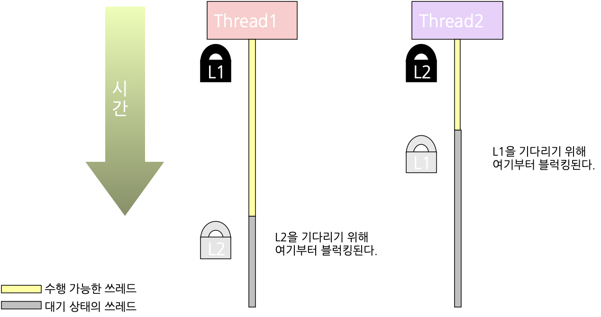
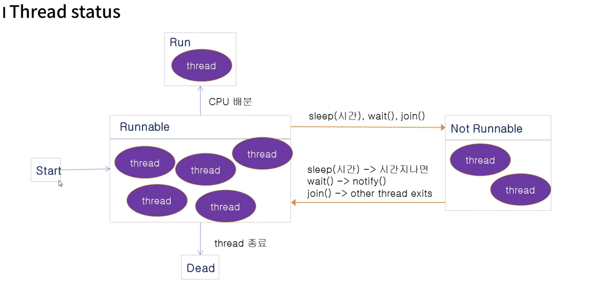
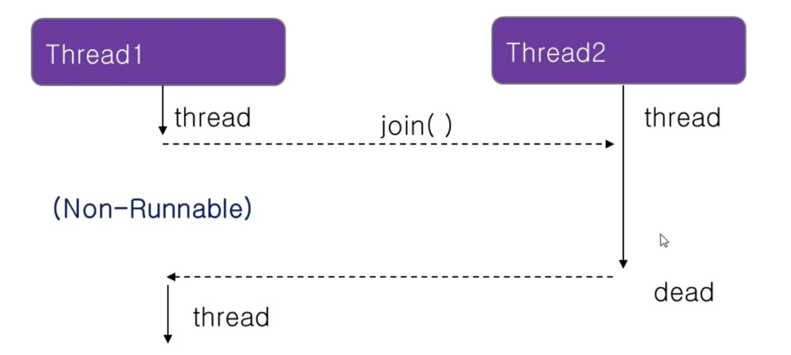

# Introduction

---

Java의 쓰레드(Thread)에 대해 알아본다.


# 쓰레드(Thread)

---

쓰레드는 보통 프로세스와 비교되곤 하는데 각각의 개념은 아래와 같다

`프로세스(Process)`: 실행중인 프로그램을 의미, OS로 각 프로세스마다 메모리를 할당 받는다.

`쓰레드(Thread)`: 프로그램 내에서 수행되는 작업들의 최소 단위, 하나의 프로세스는 하나 이상의 쓰레드를 가진다.

즉, 프로세스 내에 쓰레드들이 존재하며 쓰레드들이 각 프로세스의 작업들을 수행한다.


### Java에서의 쓰레드 구현 방법

쓰레드 구현 방법은 두 가지가 있는데 아래와 같다.

1. `Thread` 클래스 상속
2. `Runnable` 인터페이스를 implements

- 이때, ***Java는 다중 상속이 허용되지 않기 때문에 쓰레드로 사용할 클래스가 이미 다른 클래스를 상속받은 클래스인 경우***, Thread 클래스를 상속 받는 방법은 사용할 수 없으므로 ***Runnable 인터페이스를 이용한 방법을 사용***해야 한다.

  

1) **Thread 클래스를 상속**

```java
// 1) Thread를 상속
package thread;

class MyThread extends Thread{	// Thread 클래스 상속
	
	public void run() {
		// 쓰레드에서 수행할 동작을 정의
	}
}

public class ThreadTest {
	
	public static void main(String[] args) {
	
		MyThread th = new MyThread();	// 쓰레드 생성
		th.start(); 	// start를 호출하여 run에서 정의한 동작 실행
	}
}
```


이를 이용한 예시 코드는 아래와 같다.

```java
// 1) Thread를 상속
package thread;

class MyThread extends Thread{
	
	public void run() {
		int i;
		
		for(i=0; i<20; i++) {
			System.out.print(i+"\t");
			
			try {
				sleep(100);
			} catch (InterruptedException e) {
				// TODO Auto-generated catch block
				e.printStackTrace();
			}
		}
	}
}

public class ThreadTest {
	
	public static void main(String[] args) {
	
		System.out.println("start");
		MyThread th1 = new MyThread();
		MyThread th2 = new MyThread();
		
		th1.start();
		th2.start();
		System.out.println("end");
	}
}

-----------

start
end
0	0	1	1	2	2	3	3	4	4	5	5	6	6	7	7	8	8	9	9	10	10	11	11	12	12	13	13	14	14	15	15	16	16	17	17	18	18	19	19	20	20	21	21	22	22	23	23	24	24	25	25	26	26	27	27	28	28	29	29
```

- 위 코드는 3개의 쓰레드가 실행(main, th1, th2)되며 가장 먼저 main 쓰레드가 종료된다


2. **Runnable 인터페이스 구현**

```java
// 2) Runnalbe interface를 implements
package thread;

class MyThread implements Runnable{	// Runnable 인터페이스 구현
	
	public void run() {
		// 쓰레드에서 수행할 동작을 정의
	}
}

public class ThreadTest {
	
	public static void main(String[] args) {

		MyThread runner = new MyThread();
		Thread th = new Thread(runner);
		th.start();	// start를 호출하여 run에서 정의한 동작 실행
		
	}
}
```


이를 이용한 예시 코드는 아래와 같다.

```java
// 2) Runnalbe interface를 implements
package thread;

class MyThread implements Runnable{
	
	public void run() {
		int i;
		
		for(i=0; i<200; i++) {
			System.out.print(i+"\t");
			
			try {
				Thread.sleep(100); // sleep은 Thread 클래스의 static method, runnable에서 사용하려면 Thread.sleep으로 사용해야 함
			} catch (InterruptedException e) {
				// TODO Auto-generated catch block
				e.printStackTrace();
			}
		}
	}
}

public class ThreadTest {
	
	public static void main(String[] args) {
	
		System.out.println("start");

		MyThread runner1 = new MyThread();
		Thread th1 = new Thread(runner1);
		th1.start();
		
		MyThread runner2 = new MyThread();
		Thread th2 = new Thread(runner2);
		th2.start();
		
		System.out.println("end");
	}
}
```

- 첫 번째 방법과 마찬가지로 3개의 쓰레드가 실행(main, th1, th2)되며 가장 먼저 main 쓰레드가 종료된다


## 멀티 쓰레드(Multi-thread) 프로그래밍  

---

동시에 여러 쓰레드를 수행하는 프로그래밍 방법

- 위 쓰레드 예시 코드도 동시에 3개의 쓰레드가 실행된 멀티 쓰레드 프로그래밍이다.

멀티 쓰레딩을 사용하기 위해서는 아래와 같은 개념들을 이해해야 한다.

`context`: 각 쓰레드, 프로세스의 정보, 작업들이 담긴 공간

`shared resource`: 각 쓰레드들이 공유하는 자원

`critical section`: shared resource들의 영역, 여러 쓰레드가 접근하면 race condition을 유발할 수 있는 영역, 공유 자원에 대한 배타적 접근 필요

`race condition`: 두 개 이상의 쓰레드,프로세스가 공유 자원에 동시에 접근 할 때 자원의 접근 순서에 따라 실행 결과가 달라지는 상태


멀티 쓰레딩에서는 각 쓰레드들이 switching해가면서 작업을 전환

- 쓰레드 switching이 일어날 때 쓰레드의 context역시 switching된다.

- 이때, 쓰레드의 context에 ***공유 자원(shared resource)이 있는 경우 race condition 발생할 위험***이 있다.

- 따라서, ***임계 영역(critical section)에 대한 동기화(synchronization)를 구현***하여 critical section에는 두 개 이상의 쓰레드가 동시에 들어올 수 없고 ***한 번에 한 개의 쓰레드만 들어가도록*** 해야 한다

  > 동기화(synchronization): 임계 영역에 여러 쓰레드가 접근 할 때 한 쓰레드가 접근하는 동안 공유 자원을 lock하여 다른 쓰레드의 접근을 막음, 잘못 구현하면 `deadlock`에 빠질 수 있음.
  >
  > Deadlock: 자원이 lock된 상태에서 lock이 영원이 풀리지 않아 어떤 쓰레드도 자원에 접근할 수 없는 상태


### synchronized

Java에서의 동기화 구현 방법, synchronized block과 synchronized 메서드가 있다

`synchronized block`

```java
synchronized(참조 변수 또는 객체){
  	// 괄호 안에 들어간 객체에 lock을 걸고 block내 코드를 실행
}
```


`synchronized 메서드`

```java
synchronized void test(){
  	 // 이 메서드에 속해있는 객체에 lock을 걸고 메서드를 실행한다.
  	 // synchronized 내에 있는 다른 synchronized 메서드는 호출하지 않는다 (deadlock 방지)
}
```


아래 테스트 코드는 Park, ParkWife의 두 개의 쓰레드를 만들어 Bank.money를 더하거나 빼는 작업을 수행하는 코드이다.

```java
package thread;

class Bank{
	private int money = 10000;
	
	public void saveMoney(int save) {
		int m = this.getMoney();
		
		try {
			Thread.sleep(3000);
		} catch (InterruptedException e) {
			// TODO Auto-generated catch block
			e.printStackTrace();
		}
		
		setMoney(m + save);

	}
	
	public void minusMoney(int save){
		int m = this.getMoney();
		
		try {
			Thread.sleep(200);
		} catch (InterruptedException e) {
			// TODO Auto-generated catch block
			e.printStackTrace();
		}
		
		setMoney(m - save);

	}

	public int getMoney() {
		return money;
	}

	public void setMoney(int money) {
		this.money = money;
	}
}

class Park extends Thread{
	
	public void run() {
		System.out.println("start save");
		SyncTest.mybank.saveMoney(3000);
		System.out.println("save money" + SyncTest.mybank.getMoney());
	}
}

class ParkWife extends Thread{

	public void run() {
		System.out.println("start minus");
		SyncTest.mybank.minusMoney(1000);
		System.out.println("minus money" + SyncTest.mybank.getMoney());
	}

}

public class SyncTest {

	public static Bank mybank = new Bank();
	
	public static void main(String[] args) throws InterruptedException {
		
		Park p = new Park();
		p.start();
		
		Thread.sleep(200);
		ParkWife pw = new ParkWife();
		pw.start();

	}

}

--------------

start save
start minus
minus money9000
save money13000
```

- 위 테스트 코드는 아래와 같은 순서로 수행된다
  1. 10000의 값을 가지는 money가 shared resource로 존재한다.
  2. p 쓰레드가 수행되어 money에서 3000만큼 save
  3. pw 쓰레드가 수행되어 money에서 1000만큼 minus
-  테스트 결과 money가 12000으로 변할 것이라 예상할 수 있지만 제대로 된 값을 얻을 수 없다.
  - p 쓰레드에서 save를 수행하기 위해 getMoney를 하고 sleep에 들어간 동안 pw 쓰레드 역시 getMoney를 호출해서 p 쓰레드와 pw 쓰레드가 둘다 10000의 초기값을 가지고 연산을 수행하기 때문

- 임계 영역의 공유 자원에 두 쓰레드가 동시에 접근함에 따라 잘못된 결과가 나오게 되었다
  - ***synchronized 구현 필요***


위 코드에 synchronized를 적용하여 문제를 해결해 보자.

1. synchronized 메서드를 이용한 구현

```java
package thread;

class Bank{
	private int money = 10000;
	
	public synchronized void saveMoney(int save) { // synchronized 메서드, this에 lock
		int m = this.getMoney();
		
		try {
			Thread.sleep(3000);
		} catch (InterruptedException e) {
			// TODO Auto-generated catch block
			e.printStackTrace();
		}
		
		setMoney(m + save);

	}
	
	public synchronized void minusMoney(int save){ // synchronized 메서드, this에 lock
		int m = this.getMoney();
		
		try {
			Thread.sleep(200);
		} catch (InterruptedException e) {
			// TODO Auto-generated catch block
			e.printStackTrace();
		}
		
		setMoney(m - save);

	}

	public int getMoney() {
		return money;
	}

	public void setMoney(int money) {
		this.money = money;
	}
}

...

public class SyncTest {

	public static Bank mybank = new Bank();
	
	public static void main(String[] args) throws InterruptedException {
		
		Park p = new Park();
		p.start();
		
		Thread.sleep(200);
		ParkWife pw = new ParkWife();
		pw.start();

	}

}

-------------

start save
start minus
save money13000
minus money12000
```


2. synchronized block을 이용한 구현

```java
...
  
class Park extends Thread{
	
	public void run() {
		synchronized (SyncTest.mybank) { // synchronized block, SyncTest.mybank lock
			System.out.println("start save");
			SyncTest.mybank.saveMoney(3000);
			System.out.println("save money" + SyncTest.mybank.getMoney());
		}
	}
}

class ParkWife extends Thread{

	public void run() {
		synchronized (SyncTest.mybank) { // synchronized block, SyncTest.mybank lock
			System.out.println("start minus");
			SyncTest.mybank.minusMoney(1000);
			System.out.println("minus money" + SyncTest.mybank.getMoney());
		}
	}

}

public class SyncTest {

	public static Bank mybank = new Bank();
	
	public static void main(String[] args) throws InterruptedException {
		
		Park p = new Park();
		p.start();
		
		Thread.sleep(200);
		ParkWife pw = new ParkWife();
		pw.start();

	}

}

-------------

start save
start minus
save money13000
minus money12000
```


### Deadlock

두 개 이상의 작업이 서로 상대방의 작업이 끝나기 만을 기다리고 있기 때문에 결과적으로 아무것도 완료되지 못하는 상태

[^]: 출처: 위키피디아 (https://ko.wikipedia.org/wiki/%EA%B5%90%EC%B0%A9_%EC%83%81%ED%83%9C#:~:text=%EA%B5%90%EC%B0%A9%20%EC%83%81%ED%83%9C(%E8%86%A0%E7%9D%80%E7%8B%80%E6%85%8B)%20%EB%98%90%EB%8A%94,%EC%95%84%EB%9E%98%EC%AA%BD%EC%97%90%20%EC%9E%88%EB%8B%A4%EA%B3%A0%20%EA%B0%80%EC%A0%95%ED%95%9C%EB%8B%A4.)



위 이미지에서 L1을 수행하려면 L2를 기다려야하고 L2를 수행하려면 L1을 기다려야 한다.

- 둘다 기다리고만 있는 deadlock상태에 빠짐

deadlock을 방지하기 위해서 synchronized 메서드에서는 다른 synchronized 메서드를 호출하면 안된다.


## Thread status

---

쓰레드의 실행 과정에 따라 status가 어떻게 변하는지를 확인해보자.



쓰레드가 `Start` 되면 `Runnable` 한 상태가 되고 스케쥴러에 의해 각 쓰레드에 cpu가 배분된다.

- runnable한 상태가 아니면 cpu를 점유할 수 없다
- thread가 종료되면 `Dead` 상태가 된다

이때, thread가 cpu를 점유할 수 없는 `Not Runnable` 상태가 되는 경우가 있다.

- not runnable상태에서 다시 runnable상태가 되어야 cpu에서 다시 실행가능
- not runnable상태에서 빠져나오지 못하면 (`좀비 상태` 라고도 함) `interrupt exception`을 날려서 종료시킬 수 있음

Runnable -> Not Runnable 상태로 보내주는 3가지 함수에 대하여 알아보자.

1) `sleep `
   - 인자의 1/1000 sec만큼 sleep
   - 시간이 끝나면 다시 runnable 
2) `wait`
   - notify가 호출될 때 까지 not runnable한 상태로 빠짐
   - notify가 호출되면 다시 runnable  
3) `join`
   - 두개의 thread가 동시 실행 될때 한 thread가 다른 thread에 join을 걸면 해당 thread가 종료될때까지 not runnable상태
   - join을 건 thread가 끝나면 runnable


### wait() / notify()

`wait()`: 보통 공유 자원을 유효하게 사용할 수 있을 때까지 대기하기 위해 사용, notify가 호출될 때 까지 not runnable한 상태로 빠짐

`notify()`: wait()을 호출한 쓰레드를 runnable한 상태로 전환, 특정 쓰레드가 아니라 not runnable한 쓰레드들 중 무작위 쓰레드를 깨움

- notfiy()는 가장 많이 기다린 thread를 깨우는게아니고 무작위로 깨운다

`notifyAll()`: wait()을 호출한 모든 쓰레드들을 runnable한 상태로 전환, 보통 notify보단 notifyAll 사용이 권장됨 (notify는 무작위로 깨우기 때문에 비효율적인 스케쥴링으로 빠질 가능성이 있음)

- 특정 thread가 오랜시간동안 깨어나지 않을 수 있으니 차라리 notifyAll을 하는게 pair할 수 있다


아래 예시 코드는 3의 크기를 가지는 ArrayList(books)에 6개의 쓰레드가 remove를 호출해서 outOfBounds 예외가 발생하였다.

```java
package thread;

import java.util.ArrayList;

class FastLibrary{
	
	public ArrayList<String> books = new ArrayList<String>();
	
	public FastLibrary() {
		books.add("Book1");
		books.add("Book2");
		books.add("Book3");
	}
	
	public synchronized String lendBook() {
		
		Thread t = Thread.currentThread();
		
		
		String title = books.remove(0);
		System.out.println(t.getName() + ": "+title+ " lend");
		return title;
	}
	
	public synchronized void returnBook(String title) {
		Thread t = Thread.currentThread();
		
		books.add(title);
		System.out.println(t.getName() + ": "+title+ " return");
	}
}

class Student extends Thread{
	
	public void run() {
		try {
			String title = LibraryMain.library.lendBook();
			sleep(5000);		
			LibraryMain.library.returnBook(title);
		} catch (InterruptedException e) {
			// TODO Auto-generated catch block
			e.printStackTrace();
		}

	}
}

public class LibraryMain {

	public static FastLibrary library = new FastLibrary();
	
	public static void main(String[] args) {
		
		Student std1 = new Student();
		Student std2 = new Student();
		Student std3 = new Student();

		Student std4 = new Student();
		Student std5 = new Student();
		Student std6 = new Student();
		
		std1.start();
		std2.start();
		std3.start();
		
		std4.start();
		std5.start();
		std6.start();
		
	}
}

------------

Thread-0: Book1 lend
Thread-4: Book2 lend
Thread-2: Book3 lend
Exception in thread "Thread-3" Exception in thread "Thread-1" java.lang.IndexOutOfBoundsException: Index 0 out of bounds for length 0
	at java.base/jdk.internal.util.Preconditions.outOfBounds(Preconditions.java:64)
	at java.base/jdk.internal.util.Preconditions.outOfBoundsCheckIndex(Preconditions.java:70)
	at java.base/jdk.internal.util.Preconditions.checkIndex(Preconditions.java:266)
	at java.base/java.util.Objects.checkIndex(Objects.java:359)
	at java.base/java.util.ArrayList.remove(ArrayList.java:504)
	at Chapter15/thread.FastLibrary.lendBook(LibraryMain.java:20)
	at Chapter15/thread.Student.run(LibraryMain.java:37)
Exception in thread "Thread-5" java.lang.IndexOutOfBoundsException: Index 0 out of bounds for length 0
	at java.base/jdk.internal.util.Preconditions.outOfBounds(Preconditions.java:64)
	at java.base/jdk.internal.util.Preconditions.outOfBoundsCheckIndex(Preconditions.java:70)
	at java.base/jdk.internal.util.Preconditions.checkIndex(Preconditions.java:266)
	at java.base/java.util.Objects.checkIndex(Objects.java:359)
	at java.base/java.util.ArrayList.remove(ArrayList.java:504)
	at Chapter15/thread.FastLibrary.lendBook(LibraryMain.java:20)
	at Chapter15/thread.Student.run(LibraryMain.java:37)
java.lang.IndexOutOfBoundsException: Index 0 out of bounds for length 0
	at java.base/jdk.internal.util.Preconditions.outOfBounds(Preconditions.java:64)
	at java.base/jdk.internal.util.Preconditions.outOfBoundsCheckIndex(Preconditions.java:70)
	at java.base/jdk.internal.util.Preconditions.checkIndex(Preconditions.java:266)
	at java.base/java.util.Objects.checkIndex(Objects.java:359)
	at java.base/java.util.ArrayList.remove(ArrayList.java:504)
	at Chapter15/thread.FastLibrary.lendBook(LibraryMain.java:20)
	at Chapter15/thread.Student.run(LibraryMain.java:37)
Thread-0: Book1 return
Thread-2: Book3 return
Thread-4: Book2 return
```


위 코드에서 wait, notify를 사용하면 예외를 막고 정상적인 프로세스 실행을 할 수 있다.

```java
package thread;

import java.util.ArrayList;

class FastLibrary{
	
	...
	
	public synchronized String lendBook() throws InterruptedException {
		
		Thread t = Thread.currentThread();
		if ( books.size() == 0 ) {
			System.out.println(t.getName() + " waiting start");
			wait();		// books에 원소가 없을 때 wait
			System.out.println(t.getName() + " waiting end");
		}
	
		String title = books.remove(0);
		System.out.println(t.getName() + ": "+title+ " lend");
		return title;
	}
	
	public synchronized void returnBook(String title) {
		Thread t = Thread.currentThread();
		
		books.add(title);
		notify(); 	    // books에 원소가 없어 wait에 들어간 쓰레드를 다시 깨움
    // notifyAll(); // 만약 notify가 아닌 notifyAll을 사용하여 깨우면 모든 쓰레드가 다 깨어나기 때문에 원하지 않는 결과(OutOfBounds 예외 발생)가 나옴
		System.out.println(t.getName() + ": "+title+ " return");
	}
}

...

public class LibraryMain {

	public static FastLibrary library = new FastLibrary();
	
	public static void main(String[] args) {
		
		Student std1 = new Student();
		Student std2 = new Student();
		Student std3 = new Student();

		Student std4 = new Student();
		Student std5 = new Student();
		Student std6 = new Student();
		
		std1.start();
		std2.start();
		std3.start();
		
		std4.start();
		std5.start();
		std6.start();
		
	}
}

-------------

Thread-0: Book1 lend
Thread-3: Book2 lend
Thread-2: Book3 lend
Thread-1 waiting start
Thread-5 waiting start
Thread-4 waiting start
Thread-0: Book1 return
Thread-1 waiting end
Thread-1: Book1 lend
Thread-2: Book3 return
Thread-3: Book2 return
Thread-4 waiting end
Thread-4: Book3 lend
Thread-5 waiting end
Thread-5: Book2 lend
Thread-1: Book1 return
Thread-4: Book3 return
Thread-5: Book2 return
```


위 개선 코드에서  notify가 아닌 notifyAll을 이용하고 싶으면 아래와 같이 while문으로 wait을 빠져나간 후에도 조건문을 타도록 설계

```java
public synchronized String lendBook() throws InterruptedException {
		
		Thread t = Thread.currentThread();
		while ( books.size() == 0 ) {  // if문이 아닌 while문으로 books 사이즈를 체크
			System.out.println(t.getName() + " waiting start");
			wait();
			System.out.println(t.getName() + " waiting end");
		}
	
		String title = books.remove(0);
		System.out.println(t.getName() + ": "+title+ " lend");
		return title;
	}

public synchronized void returnBook(String title) {
		Thread t = Thread.currentThread();
		
		books.add(title);
		notifyAll();
		System.out.println(t.getName() + ": "+title+ " return");
	}

```


### join()

쓰레드(Tread1)가 작업을 수행 중 다른 쓰레드(Thread2)가 종료된 후에 수행해야 하는 작업이 있을 경우 Thread2에 join을 걸어서 Thread2가 dead 상태로 될때 까지 Thread1을 not runnable 상태로 만든다.

**


아래 JoinTest 클래스를 통해  join을 호출할 때와 하지 않을 때를 비교해보자.

```java
public class JoinTest extends Thread {

	int start;
	int end;
	int total;
	
	public JoinTest(int start, int end) {
		this.start = start;
		this.end = end;
	}
	
	public void run() {
		int i;
		for(i=start; i<=end; i++) {
			total += i;
  }
}
```


1. join을 사용하지 않은 쓰레드 테스트

```java

public static void main(String[] args) {

  JoinTest jt1 = new JoinTest(1,50);
  JoinTest jt2 = new JoinTest(51,100);

  jt1.start();
  jt2.start();

  int total = jt1.total + jt2.total;
  System.out.println("jt1.total = "+jt1.total);
  System.out.println("jt2.total = "+jt2.total);

  System.out.println(total);

}


--------------

jt1.total = 1275
jt2.total = 3775
1275
```

- main 쓰레드는 jt1, jt2 쓰레드가 끝나기 전에 total에 변수를 할당했기 때문에 total값이 제대로 계산되지 않았음


2. join을 사용한 쓰레드 테스트

```java

public static void main(String[] args) {
	
	JoinTest jt1 = new JoinTest(1,50);
	JoinTest jt2 = new JoinTest(51,100);
	
	jt1.start();
	jt2.start();
	
	try {
		jt1.join();
		jt2.join();
	} catch (InterruptedException e) {
		// TODO Auto-generated catch block
		e.printStackTrace();
	}
	
	int total = jt1.total + jt2.total;
	System.out.println("jt1.total = "+jt1.total);
	System.out.println("jt2.total = "+jt2.total);
	
	System.out.println(total);

}

---------------

jt1.total = 1275
jt2.total = 3775
5050
```

- main thread에서 jt1, jt2 thread에 join을 걸어서 해당 thread들이 끝날때까지 기다린 후 total을 계산

### 

### interrupt()

쓰레드에 예외를 발생시켜 해당 쓰레드를 종료하거나 runnable한 상태로 만들 수 있다.

- join(), sleep(), wait()에 의해 non-runnable 상태가 된 쓰레드를 runnable하게 변경할 수 있다.

```java
package thread;

public class InterruptTest extends Thread{
	
	public void run() {
		
		int i;
		for(i=0; i<10; i++) {
			System.out.println(i);
		}
		
		try {
			sleep(5000);
		} catch (InterruptedException e) { // InterruptedException, interrupt()에서 발생시킨 예외
			System.out.println(e);
			System.out.println("Wake !!");
		}
	}

	public static void main(String[] args) {
		
		InterruptTest test = new InterruptTest();
		test.start();
		test.interrupt();	// sleep상태에 들어간 쓰레드에 인터럽트 발생
		
		System.out.println("end");
		

	}
}

-------------

end
0
1
2
3
4
5
6
7
8
9
java.lang.InterruptedException: sleep interrupted
Wake !!
```


### Thread 종료

플래그 또는 interrupt 등을 통해 thread를 종료시킬 수 있다. (참고로 Thread.stop() 메서드는 deprecated)

아래 예시는 플래그를 이용한 쓰레드 종료를 구현하였다.

```java
package thread;

import java.io.IOException;

public class TerminateThread extends Thread{

	private boolean flag = false;
	int i;
	
	public TerminateThread(String name) {
		super(name); // Thread 생성자를 이용해서 thread의 이름 설정, getName() thread 이름 리턴
	}
	
	public void run() {
		while( !flag) {
			
			try {
				sleep(100);
			} catch (InterruptedException e) {
				// TODO Auto-generated catch block
				e.printStackTrace();
			}
		}
		
		System.out.println(getName() + " end");
	}
	
	public void setFlag(boolean flag) {
		this.flag = flag;
	}
	
	public static void main(String[] args) throws IOException {
		
		TerminateThread threadA = new TerminateThread("A");
		TerminateThread threadB = new TerminateThread("B");
		
		threadA.start();
		threadB.start();
		
		int in;
		while(true) {
			in = System.in.read();
			if ( in == 'A') {
				threadA.setFlag(true);
			}
			else if ( in == 'B') {
				threadB.setFlag(true);
			}
			else if ( in == 'M') {
				threadA.setFlag(true);
				threadB.setFlag(true);
				break;
			}
			else {
				System.out.println("try again");
			}
		}
		System.out.println("main end");

	}

}

-----------

A
try again
A end
B
try again
B end
M
main end
```

- 위 예시 코드에서 A나 B를 누르면 try again이 무조건 출력되는데 ***엔터를 칠때 new line과 캐리지 리턴이 같이 들어가기 때문***
- 해당 강의에서는 new line, 캐리지 리턴을 둘다 받아서 try again이 두 번씩 출력되던데 필자가 ***java17로 돌리니 try again이 한번만 출력***되는걸 보면 최신 자바에서는 엔터칠때 캐리지 리턴이 들어가지 않는 듯 하다. (좀 더 알아볼 필요가 있다)


## Thread priority(우선 순위)

---

각 쓰레드는 우선 순위를 할당 받는데 1 ~ 10까지의 숫자로 표현되며 디폴트는 5이다.

우선 순위가 높은 쓰레드일 수록 cpu를 배분 받을 확률이 높다.

setPriority를 통해 우선 순위를 설정하고 getPriority로 우선 순위를 리턴받을 수 있다.

```java
public class Thread implements Runnable {
  /**
   * The minimum priority that a thread can have.
   */
  public static final int MIN_PRIORITY = 1;

  /**
   * The default priority that is assigned to a thread.
   */
  public static final int NORM_PRIORITY = 5;

  /**
   * The maximum priority that a thread can have.
   */
  public static final int MAX_PRIORITY = 10;
  ...
  /**
   * Changes the priority of this thread.
   * <p>
   * First the {@code checkAccess} method of this thread is called
   * with no arguments. This may result in throwing a {@code SecurityException}.
   * <p>
   * Otherwise, the priority of this thread is set to the smaller of
   * the specified {@code newPriority} and the maximum permitted
   * priority of the thread's thread group.
   *
   * @param newPriority priority to set this thread to
   * @throws     IllegalArgumentException  If the priority is not in the
   *               range {@code MIN_PRIORITY} to
   *               {@code MAX_PRIORITY}.
   * @throws     SecurityException  if the current thread cannot modify
   *               this thread.
   * @see        #getPriority
   * @see        #checkAccess()
   * @see        #getThreadGroup()
   * @see        #MAX_PRIORITY
   * @see        #MIN_PRIORITY
   * @see        ThreadGroup#getMaxPriority()
   */
  public final void setPriority(int newPriority) {
      ThreadGroup g;
      checkAccess();
      if (newPriority > MAX_PRIORITY || newPriority < MIN_PRIORITY) {
          throw new IllegalArgumentException();
      }
      if((g = getThreadGroup()) != null) {
          if (newPriority > g.getMaxPriority()) {
              newPriority = g.getMaxPriority();
          }
          setPriority0(priority = newPriority);
      }
  }
  ...
}
```

```java
public class ThreadTest {
	
	public static void main(String[] args) {
	
		System.out.println("start");
		
		Thread t = Thread.currentThread(); // currentThread(static 함수) -> thread 이름, 우선순위, thread가 속하는 그룹
		System.out.println(t);
		
		System.out.println("end");
	}
}

-----------

start
Thread[main,5,main] // main 함수는 디폴트 우선순위인 5를 갖는다
end
```


#  Conclusion

---

쓰레드의 기본 개념에 대하여 알아보고 자바의 쓰레드, 멀티 쓰레드 구현 방식에 대하여 다뤄보았다.

쓰레드는 프로그래밍의 기본 지식이면서 실전에도 계속 사용되는 개념인 만큼 정확히 알고 지나가는 것이 중요하다.

사실 필자도 쓰레드의 기본 개념들에 대하여 까먹을 때가 많은데 자주 리마인드를 하고 사용하여 익숙해지도록 하고있다.


# Reference

---

Fastcampus JAVA기초 강의 - 박은종 강사님
