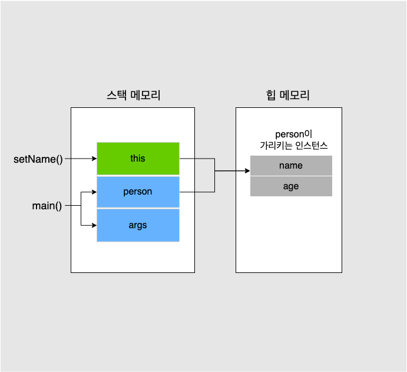
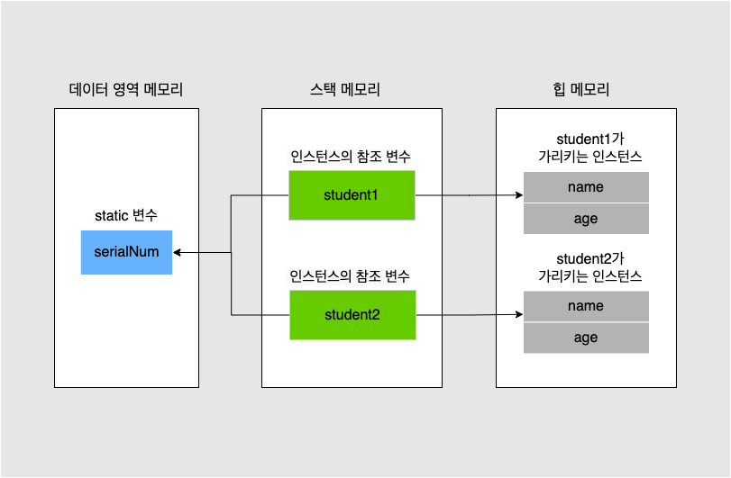

# Introduction

---

Java에서 쓰이는 this, static 키워드에 대해 알아본다.


# this

---

- 클래스 안에서 자기 자신을 가리키는 키워드로 보통 2가지 경우에 많이 사용한다.
  1. 생성자 안에서 다른 생성자를 호출
  2. 메소드의 인자와 멤버 변수의 이름이 같을 시에 멤버 변수를 구별해주기 위해 사용
- 주의할 점은 생성자에서 this를 이용하여 다른 생성자를 호출할때, this 호출은 첫번째 statement여야만 한다는 것이다.

```java
package thisexample;

public class Person {
  
	String name;
	int age;
	
	public Person() {
		this("No name", 1);				// this를 이용하여 생성자 안에서 다른 생성자 호출
	}
  
  public Person(int age) {
    System.out.println("Hi");
		this("No name", age);			// Error, this호출이 첫번째 statement아니기 때문에 에러가 발생
	}
	
	public Person(String name, int age) {
		this.name = name;				// 멤버 변수와 인자의 이름이 같기 때문에 this를 이용하여 구분
		this.age = age;
	}
	
	public String getName() {
		return name;
	}

	public void setName(String name) {
		this.name = name;
	}

	public int getAge() {
		return age;
	}

	public void setAge(int age) {
		this.age = age;
	}
  
	public void showInfo() {
		
		System.out.println(name + "," + age);
	}
}

```

```java
public class PersonTest {

	public static void main(String[] args) {
		
		Person person = new Person();
		person.setName("Shane");

	}

}

```

- 위 코드의 main함수에서 Person 인스턴스(참조 변수)를 생성하고 setName을 호출하면 스택 메모리에 setName 메소드의 segmentation이 생성되고 setYear안의 this는 객체 자신의 hash code를 가리키는 참조 변수이다.

[^]: hash code : 객체의 주소, 객체가 생성될 때 JVM에서 할당해주는 값

- 위 프로그램이 실행될 때의 메모리 구조는 아래 그림으로 표현할 수 있다.




# static

---

Java에서 static은 변수 또는 메서드에 쓰이는데 각각에 대하여 알아보자


### static(정적) 변수

- 프로그램이 메모리에 로드 될 때 ***데이터 영역에 생성***되며 인스턴스를 생성하지 않아도 사용할 수 있다.
- static 변수는 프로그램이 메모리에서 해제될 때까지 유지되며 해당 ***클래스의 모든 인스턴스가 static 변수를 공유***한다.
- ***인스턴스가 아닌 클래스에 종속되는 변수***이며 클래스 변수라고도 한다.
- static 키워드를 붙여 생성한다. 
- 인스턴스가 아닌 클래스 이름으로 참조할 수 있다.
- static 변수는 외부에서 변경되면 다른 인스턴스들에도 영향을 미칠 수 있기 때문에 아래와 같이 private로 만들고 getter / setter로 접근하는 것을 권장한다.

```java
package staticex;

public class Student {
	
	public static int serialNum = 1000; // static 변수	
	int studentID;											// 멤버 변수
	String studentName;									// 멤버 변수
	
	
	public Student(String name) {	
		studentName = name;
		serialNum++;
		studentID = serialNum;
				
	}
	
	public Student(int id, String name) {
		studentName = name;
		serialNum++;
		studentID = serialNum; 
				
	}


	public static int getSerialNum() {
		return serialNum;
	}

	public static void setSerialNum(int serialNum) {
		Student.serialNum = serialNum;
	}	
}

```

```java
public class StudentIDTest {

	public static void main(String[] args) {
		// TODO Auto-generated method stub
		
		Student student1 = new Student("Lee");
		System.out.println(studentLee.serialNum);
		
		Student student2 = new Student("Kim");
		System.out.println(studentKim.serialNum);

	}

}

```


- 위 프로그램이 실행될 때의 메모리 구조는 아래와 같다.
- student1, student2 객체는 모두 하나의 static 변수를 공유한다.




### static(정적) 메서드

- static 변수에 접근하거나 수정이 가능한 메서드
- 멤버(인스턴스) 변수는 사용 불가
- static 변수와 마찬가지로 클래스 이름으로 참조하여 사용
- 클래스 메서드라고도 한다.

```java
public class Student {
	
	public static int serialNum = 1000;
	int studentID;
	String studentName;
	
	
	...
    
  public Student(int id, String name) {
		studentName = name;
		serialNum++;						// OK, 생성자나 일반 메서드 안에서 static 변수 사용 가능
		studentID = serialNum; 
				
	}


	public static int getSerialNum() {
		
		this.studentId = 1;				// Error, static 메소드 안에서 this는 사용 불가 
		studentName = "Shane";		// Error, static 메소드 안에서 인스턴스 변수는 사용 불가 
		
		return serialNum;
	}

	public static void setSerialNum(int serialNum) {
		Student.serialNum = serialNum;
	}
	
}

```

```java
public class StudentTest {

	public static void main(String[] args) {
		// TODO Auto-generated method stub
		
		System.out.println(Student.getSerialNum()); // static 메서드는 Student 인스턴스를 생성하지 않아도 클래스로 접근 가능
	}

}
```


| 변수 유형                 | 선언 위치   | 사용 범위                                  | 메모리      | 생성과 소멸                                                  |
| ------------------------- | ----------- | ------------------------------------------ | ----------- | ------------------------------------------------------------ |
| 지역(로컬) 변수           | 함수 내부   | 함수 내부                                  | 스택        | 함수가 호출될 때 생성, 함수가 끝나면 소멸                    |
| 멤버(인스턴스) 변수       | 클래스 내부 | 클래스 내부의 멤버 메서드 또는 클래스 외부 | 힙          | 인스턴스가 생성될 때 생성, 인스턴스가 메모리에서 해제될 때 소멸 |
| static(정적, 클래스) 변수 | 클래스 내부 | 클래스 내부의 모든 메서드 또는 클래스 외부 | 데이터 영역 | 프로그램이 메모리에 로드 될 때 생성, 프로그램이 메모리에서 해제될 때 소멸 |


### singleton pattern

- static을 이용한 대표적인 디자인 패턴
- 인스턴스를 단 하나만 사용한다는 개념으로 생성자를 private으로 만들어서 외부에서 객체 생성을 막는다.
- 외부에서 객체를 참조할 수 있는 public static getter 메서드를 구현하여 유일한 객체를 생성하고 접근한다.

```java
public class Company {
	
	private static Company instance = new Company();
	
	private Company() {}
	
	public static Company getInstance() {
		
		if (instance == null) {
			instance = new Company();
		}
		return instance;
	}

}
```

```java
public class CompanyTest {

	public static void main(String[] args) {
		// TODO Auto-generated method stub
		
//		Company company = new Company(); // Error
		
		Company company1 = Company.getInstance();
		
		Company company2 = Company.getInstance();
		
		System.out.println(company1); // 같은 인스턴스
		System.out.println(company2);	// 같은 인스턴스

	}
}

* 실행 결과
--------
>> staticex.Company@5674cd4d
>> staticex.Company@5674cd4d
```

- 위 코드를 실행 결과를 보면 company1과 company2는 두개의 객체가 아닌 하나의 객체인 것을 알 수 있다.

- Java의 기본 라이브러리인 Calender도 singleton으로 구현되었다. (아래 예시를 보면 객체를 getInstance로 생성해야 함)

  

*/1.png)*

*/2.png)*


#  Conclusion

---

Java의 this, static 키워드를 알아보았다. Java뿐만 아니라 C++에서도 사용되는 개념이며  아마 객체 지향 프로그래밍을 지원하는 다른 많은 언어들에서도 사용되고 있을 것이라 생각된다.


# Reference

---

Fastcampus JAVA기초 강의 - 박은종 강사님
