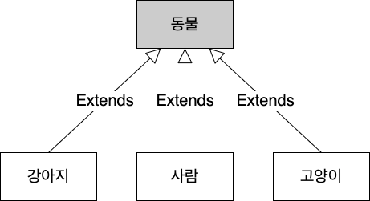
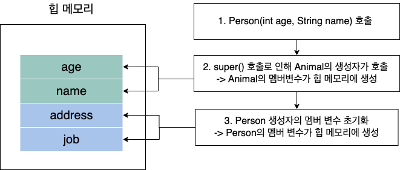

# Introduction

---

Java를 통해 객체 지향 프로그래밍의 기초인 상속에 대하여 알아보고 상속과 관련된 super, 업캐스팅, 메서드 오버라이딩도 추가로 알아본다.


# 상속 (inheritance)

---

- 클래스를 정의할 때 이미 구현된 다른 클래스의 속성(변수)과 기능(메서드)을 상속받아 해당 속성과 기능을 재사용, 확장 할 수 있다.
- Java에서는 extends라는 키워드를 사용하여 클래스의 상속 관계를 구현할 수 있다.
- 상속은 상위 클래스와 하위 클래스라는 개념을 가진다.
  1. 상위 클래스
     - 상속하는 클래스
     - parent class, base class, super class라고도 한다.
     - 하위 클래스보다 일반적인(추상적인) 개념의 클래스
  2. 하위 클래스
     - 상속 받는 클래스
     - child class, derived class, sub class라고도 한다.
     - 상위 클래스보다 구체적인 개념의 클래스

- 동물과 강아지, 사람, 고양이를 각각 클래스로 가정하고 클래스 관계(다이어그램)를 생각해보면 아래와 같다.



- 동물은 가장 일반적인 범주의 개념이기 때문에 4개의 클래스 중 상위 클래스에 위치할 수 있다.
- 강아지, 사람, 고양이는 동물이라는 범주에 포함되는 개념이기 때문에 동물 클래스를 상속받은(extends) 하위 클래스가 될 수 있다.
- 다이어그램에서 상속관계는 위와 같이 하위 클래스에서 상위 클래스로 향하는 화살표를 이용하여 표현한다.
- 위 예시를 Java 코드로 나타내면 아래와 같다.

```java
public class Animal {
	...
}

class Dog extends Animal{
  ...
}

class Person extends Animal{
  ...
}

class Cat extends Animal{
  ...
}

```

- {하위 클래스} extends {상위 클래스}의 형태로 상속 관계를 표현할 수 있으며 extends 뒤에는 하나의 클래스만 사용할 수 있다.
  - C++과 다르게 Java는 단일 상속(single inheritance)만을 지원한다.

- 앞선 포스트에서 접근 제어자에 관하여 다룰 때 protected라는 제어자를 배웠는데 이제 protected의 의미를 이해할 수 있을 것이다.
  - ***protected***: 클래스 내부 또는 상속받은 클래스에서 접근 가능


### IS-A, HAS-A

- 상속은 포함(composition)과 비교되는 경우가 많은데 ***포함 관계***란 아래와 같이 ***한 클래스가 다른 클래스를 가지고 있는 관계를 의미***한다.

```java
class Subject{
  ...
}

class Student{
  Subject math;	// Student가 Subject를 가지고 있는 관계
}
```

- 상속을 보통 IS-A 관계, 포함을 보통 HAS-A 관계라고 하는데 의미는 아래와 같다.

- ***IS-A 관계 (inheritance)***
  - general한 개념의 상위 클래스와 specific한 개념의 하위 클래스의 관계
  - 가령 '동물'이라는 일반적인 개념과 '사람이라는 구체적인 개념과의 관계로 ***사람 is a 동물***로 표현 될 수 있다.
- ***HAS-A 관계 (composition)***
  - 소유 관계를 나타내는 의미
  - 위 예시 코드에서 Student 클래스에서 Subject 클래스 객체를 정의했으므로 ***Student has a Subject***로 표현 될 수 있다.


### super

- 하위 클래스는 상위 클래스가 먼저 생성된 후 생성되어야 한다.

- 이때, 반드시 상위 클래스의 생성자가 호출된 후에 하위 클래스의 생성자가 호출되어야 하는데 만약 하위 클래스 생성자에서 상위 클래스의 생성자를 호출하는 코드를 따로 명시하지 않으면 ***컴파일러가 하위 클래스의 생성자에 자동으로 상위 클래스의 디폴트 생성자 호출 코드인 super()를 추가***한다.

  - super: 상위 클래스의 참조 변수

  - super(): 상위 클래스의 디폴트 생성자 호출 함수


```java
public class Person extends Animal{
	
  private String address;
  private String job;
  
	public Person() {
		//		아무런 상위 클래스의 생성자가 없으면 super()가 pre-complie단계에서 생됨
    
    super(); // 명시하지 않으면 컴파일 단계에서 자동으로 생성
	}
	
	public Person(int age, String name) {
		super(age, name);		// Animal의 생성자 호출
    address = "Korea";
    job = "Developer";
	}
	

}

```

```java
public class CustomerTest {

	public static void main(String[] args) {
		// TODO Auto-generated method stub
		
		Person person = new Person(10, "Shane");
  }
}
```

- 위 코드를 수행할 때 힙 메모의 상태 변화는 아래와 같다.

# 


### 업캐스팅

- ***하위 클래스는 상위 클래스로의 묵시적 형 변환이 가능***한데 이를 업캐스팅이라고 한다.

```java
Animal a = new Person(); // 업캐스팅, 상위 클래스인 Animal타입으로 하위 클래스인 Person의 인스턴스를 생성
```

- 하위 클래스는 상위 클래스의 변수나 메서드를 내포하고 있으므로 상위 클래스로의 묵시적 형변환이 가능
- 하위 클래스 -> 상위 클래스의 묵시적 변환은 가능하지만 ***상위 클래스 -> 하위 클래스의 묵시적 형 변환은 성립하지 않는다.***


### 메서드 오버라이딩 (method overriding)

- 상위 클래스의 메서드를 하위 클래스에서 재정의하는 것
- 상위 클래스의 메서드를 하위 클래스에서 수정하여 수행하고 싶을 때 사용한다.
- @Override annotation을 추가하면 오버라이딩 함수를 제대로 정의하지 않을 경우의 오류를 컴파일 단계에서 미리 걸러낼 수 있다.

*/2.png)*

- 아래는 Java코드로 메서드 오버라이딩을 구현한 예시이다.

```java

public class Customer {

	...
	
	public int calcPrice(int price) {
		bonusPoint += price * bonusRatio;
		return price;
	}

}
```

```java
public class VIPCustomer extends Customer{

	... 
    
	@Override
	public int calcPrice(int price) {							// method overriding
		bonusPoint += price * bonusRatio;
		return price - (int)(price * salesRatio);
	}
	
}
```

```java
public class OverridingTest {

	public static void main(String[] args) {
		// TODO Auto-generated method stub
		
		VIPCustomer customerLee = new VIPCustomer();
		customerLee.bonusPoint = 1000;
		
		int priceLee = customerLee.calcPrice(10000);  // VIPCustomer의 calcPrice 호출
	}
}

```

- 이클립스의 아래와 같은 기능을 이용하여 자동 생성도 가능하다.

*/1.png)*


# 참고) Annotation

---

- @{anntation}의 형태로 컴파일러에게 특정한 정보를 제공해주는 역할을 수행한다.
- 아래는 Java에서 주로 사용하는 annotation이다.

| Annotation           | Description                                                  |
| -------------------- | ------------------------------------------------------------ |
| @Override            | 해당 메서드는 Overriding 메서드라는 의미                     |
| @FunctionalInterface | 해당 인터페이스는 함수형 인터페이스라는 의미                 |
| @Deprecated          | 차기 버전에서 곧 deprecated될 변수, 메서드라는 의미          |
| @SuppressWarnings    | 특정 warning을 나타나지 않게 한다. 가령 @SuppressWarnings("deprecated")는 deprecated관련 warning을 나타나지 않게 한다. |


#  Conclusion

---

상속의 개념과 super, 업캐스팅, 메서드 오버라이딩에 대해 알아보았다. 객체 지향 프로그래밍에서 필수로 사용되어야 하는 개념 중 하나이기 때문에 반드시 알고 넘어가자.


# Reference

---

Fastcampus JAVA기초 강의 - 박은종 강사님
