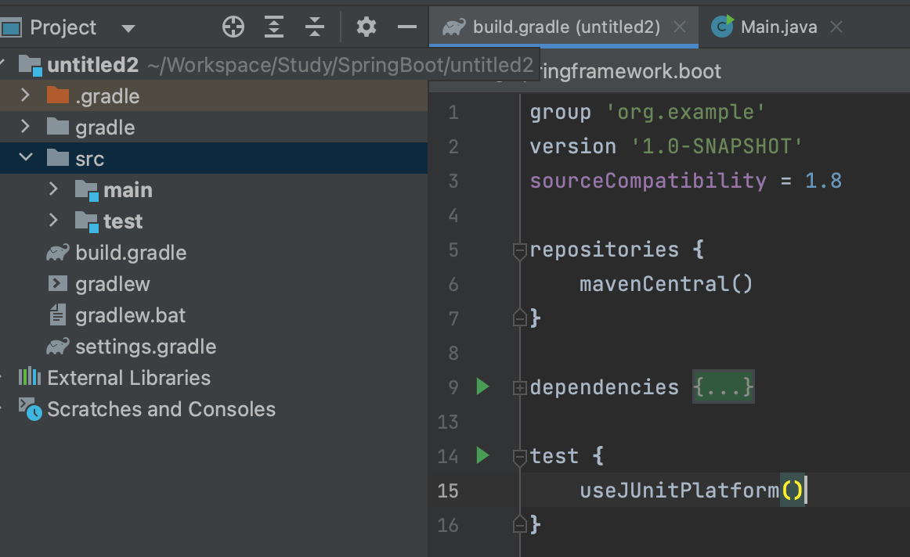
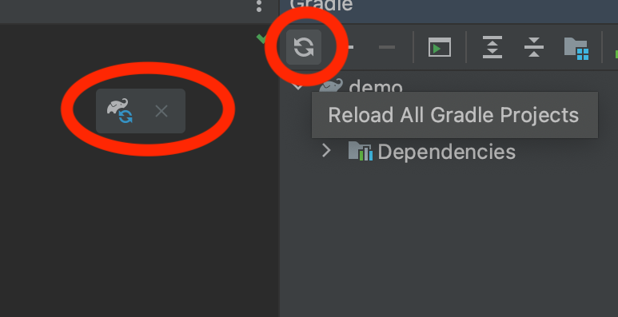
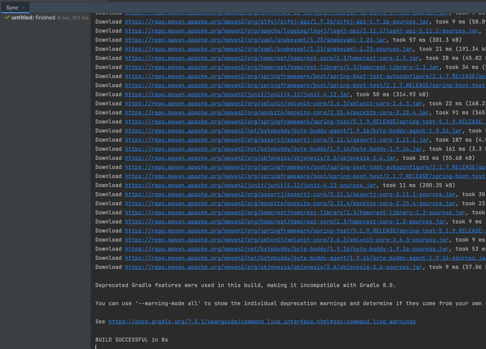

# Introduction

---

gradle의 build.gradle로 의존성을 관리하는 법에 대하여 알아보고 build.gradle을 이용하여 SpringBoot 설정을 해본다.


# build.gradle

---

Java Gradle 프로젝트를 생성하면 아래와 같이 기본적으로 생성되는 파일로, 프로젝트의 플러그인 의존성을 관리하기 위한 설정 파일이다.




이 build.gradle파일에 spring boot에 대한 의존성을 추가하기 위해 아래 코드를 추가한다.

```java
// build.gradle

buildscript {
    ext { // build.gradle 파일의 전역 변수 생성
        springBootVersion = '2.1.7.RELEASE'
    }
    repositories { // dependencies에 설정된 라이브러리를 어떤 원격 저장소에서 가져올 지를 설정
        mavenCentral() 
        jcenter()      
    }
    dependencies { // 프로젝트 개발에 필요한 의존성들 선언
        classpath("org.springframework.boot:spring-boot-gradle-plugin:${springBootVersion}")
    }
}

// 프로젝트에 적용할 플러그인 설정
apply plugin: 'java'
apply plugin: 'eclipse'
apply plugin: 'org.springframework.boot'
apply plugin: 'io.spring.dependency-management' // 스프링 부트의 의존성 관리 플러그인


group 'org.example'
version '1.0-SNAPSHOT'
sourceCompatibility = 1.8

repositories {
    mavenCentral()
}

dependencies {
    compile('org.springframework.boot:spring-boot-starter-web') // main을 수행할 때의 의존성
    testCompile('org.springframework.boot:spring-boot-starter-test') // test를 수행할 때의 의존성
}


```


위 코드를 하나씩 살펴보면 다음과 같다.

`buildscript`: gradle에서 task를 수행할 때 사용되는 빌드 설정, 소스 빌드에 사용되는 스크립트가 아님에 주의

- ext: build.gradle에서의 전역 변수 선언을 위한 키워드

`repository`: 의존성(라이브러리) 들을 어떤 원격 저장소에서 가져올 지를 설정

- mavenCentral: 기본적으로 많이 사용, but 생성한 업그레이드를 업로드하기가 번거로움
- jcenter: 라이브러리 업그레이드 난이도가 간단, jcenter에서 라이브러리 업로드를 하면 mavenCentral에도 자동 업로드가 되도록 설정도 가능

`dependencies`: 사용할 의존성들을 선언

`apply plugin`: 프로젝트에 적용할 플러그인 설정

`group`: 소스 그룹

`version`: 소스 버전

`sourceCompatibility`:  개발에 사용될 Java 버전




위의 버튼을 이용하여 build.gradle을 로드하면 아래 순서로 import가 수행된다.

1. buildscript가 수행되며 `org.springframework.boot`가  `spring-boot-gradle-plugin:2.1.7.RELEASE`를 가리키도록 설정된다.
2. apply plugin에 설정된 플러그인들이 프로젝트에 추가된다.
3. buildscript 외부에 있는 dependencies에 설정된 `org.springframework.boot:spring-boot-starter-web`, `org.springframework.boot:spring-boot-starter-test`가 의존성으로 추가된다.


이때, 아래와 같은 빌드 에러가 발생할 수 있는데 Gradle 버전에 의한 호환성 문제로 발생한 에러이다.

```java
A problem occurred evaluating root project 'untitled2'.
> Could not find method compile() for arguments [org.springframework.boot:spring-boot-starter-web] on object of type org.gradle.api.internal.artifacts.dsl.dependencies.DefaultDependencyHandler.
```

아래 에러를 살펴보면 compile() 함수에서 에러가 발생했는데 구글링을 해보니 Gradle 7.0 (2021.4.9)부터 아래 함수들은 삭제되었다고 한다.

 `compile`, `runtime`, `testCompile`, `testRuntime`

위 함수들을 아래와 같이 수정하고 다시 build.gradle을 load하면 정상적으로 의존성이 추가된다.

`implementation`, `runtimeOnly`, `testImplementation`, `testRuntimeOnly`

```java
// build.gradle
...
dependencies {
    implementation('org.springframework.boot:spring-boot-starter-web') // compile
    testImplementation('org.springframework.boot:spring-boot-starter-test') // testCompile
}
```


build.gradle을 다시 load하여 build가 성공적으로 수행되었다. 



# Conclusion

---

Spring 프로젝트를 시작하기 전에 초기 프로젝트 세팅 방법에 대하여 알아보았다.


# Reference

---

스프링 부트와 AWS로 혼자 구현하는 웹 서비스 - 이동욱님
