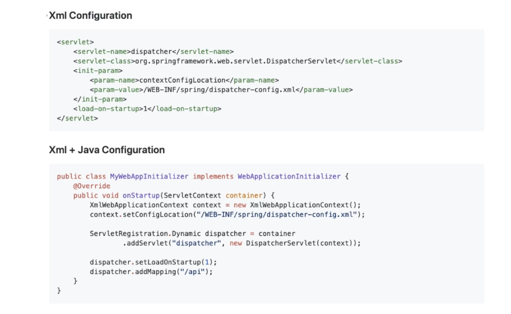
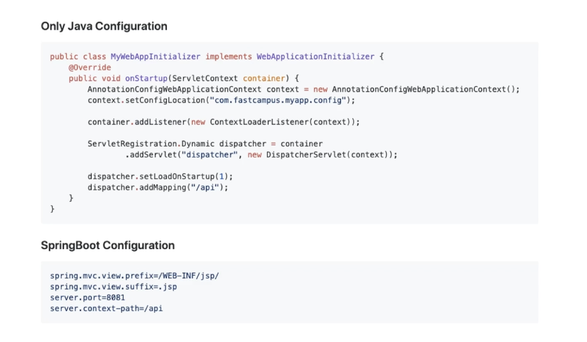

# Introduction

---

Spring과 SpringBoot이 무엇인지 간단하게 알아본다.

# Spring / SpringBoot

---

### `Spring`

- 자바 엔터프라이즈 개발을 편하게해주는 오픈소스 프레임워크
- 예전에는 스프링 프로젝트 설정을 위해서는 여러가지 라이브러리, 설정을 직접 설정해야 했는데 이때 버전 충돌 등 여러 문제가 있어서 설정이 어려웠음.. (생산성이 떨어진다는 의견도 나왔음)

### `SpringBoot`

- 스프링개발을 하며 기본적으로 설정해야 하는 라이브러리 설정들을 미리 내장하고 있고, 간단히 annotation을 통해 설정할 수 있도록 개발된 경량화된 프레임워크
- 스프링과 Embeded 서버인 tomcat을 내장하고 있다.
- Starter를 통한 어플리케이션 자동화된 빌드, 설정 등을 제공

아래 예시는 서블릿(맨 위)부터 스프링부트(맨 아래)까지 발전해가면서 configuration 설정 방법이 변경된 과정인데 스프링부트의 configuration 방법이 다른 방법 들에 비해 얼마나 간소화 되었는 지가 보인다.

# 

스프링부트는 CoC(Convention Over Configuration)의 철학에 맞게 대부분의 설정을 자동으로 디폴트로 제공해주고 있다.

> CoC(Convention Over Configuration, Coding By Convention): 개발자가 설정할 것은 어플리케이션의 관례를 따르지 않는 것들 뿐이다. 

#  Conclusion

---

Spring과 SpringBoot에 대하여 간략하게 알아보았다. 내용이 좀 부실하다고 생각해서 추후 지속 업데이트하도록 하겠다.

# Reference

---

Fastcampus 스프링 부트 프로젝트 강의(어드민 페이지 만들기) - 예상국 강사님

Fastcampus 스프링 부트 프로젝트 강의(지인 정보 관리 시스템 만들기) - 강현호 강사님

Fastcampus 스프링 부트 프로젝트 강의 (레스토랑 예약 사이트 만들기) - 아샬 강사님
