# Introduction

---

SpringBoot의 초기 프로젝트 생성 과정을 알아본다.

# SpringBoot 프로젝트 생성

---

SpringBoot 프로젝트 생성은 크게 두 가지로 나뉜다.

1. `IntelliJ` 등의 IDE를 통한 프로젝트 생성
2. ``start.spring.io`에서 생성

하나씩 살펴보면서 프로젝트를 생성해보자.

## IntelliJ 등의 IDE를 통한 프로젝트 생성

1. File -> new -> project 또는 아래와 같이 IntelliJ의 첫 프로젝트 화면에서 New Project를 선택하면 아래와 같은 화면이 나온다.
2. New Project창의 Generators 탭에서 Spring Initializer를 선택하고 프로젝트 이름, 경로, 언어(Java), 타입(Gradle - Groovy), 버전(Java11) 등을 선택한다.

### *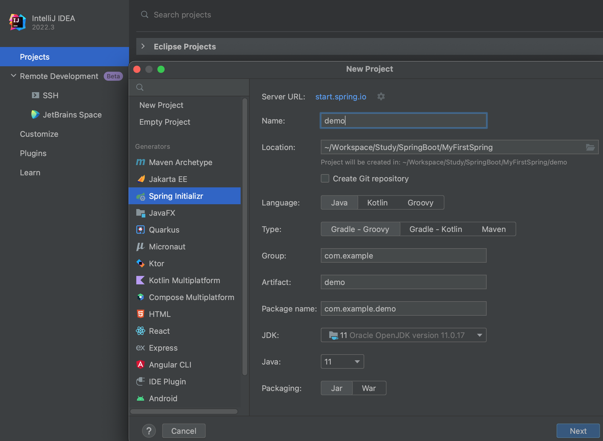*

3. 위 설정을 마치고 Next를 누르면 아래와 같이 디펜던시 설정을 할 수 있는데 Spring Web을 선택하고 Create를 누른다.

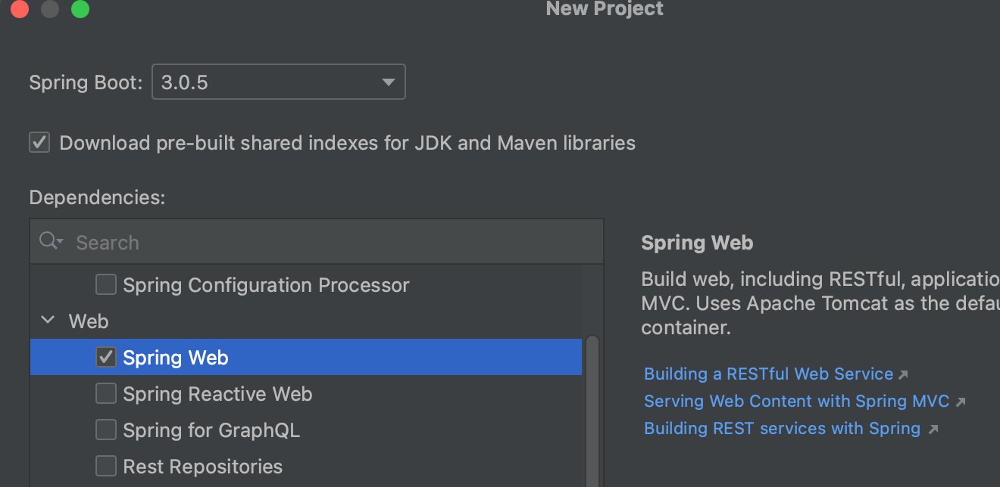

4. 위 상태로 프로젝트가 생성되었는데 아래와 같은 에러가 나온다. (Spring의 버전과 Java 버전이 맞지 않아서 생긴 문제로 보인다.)

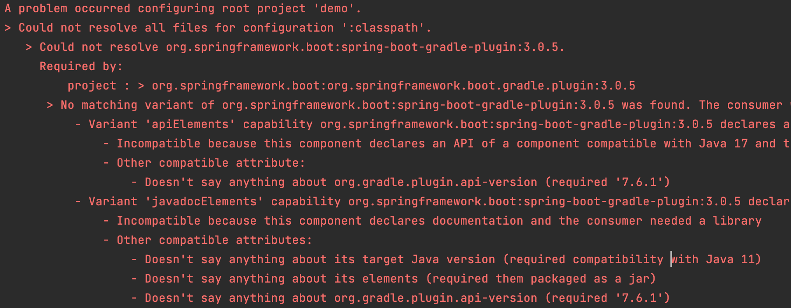

5. 구글링을 해보니 역시 버전 문제가 맞았다 ***스프링부트 3.xx 버전은 Java 17을 필요***로 하는 듯 하다.

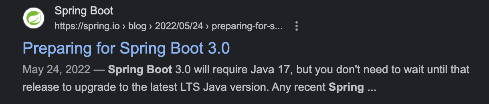

6. 다시 2.7.10버전의 Spring Boot으로 바꿔서 프로젝트를 생성하니 빌드가 성공한다.

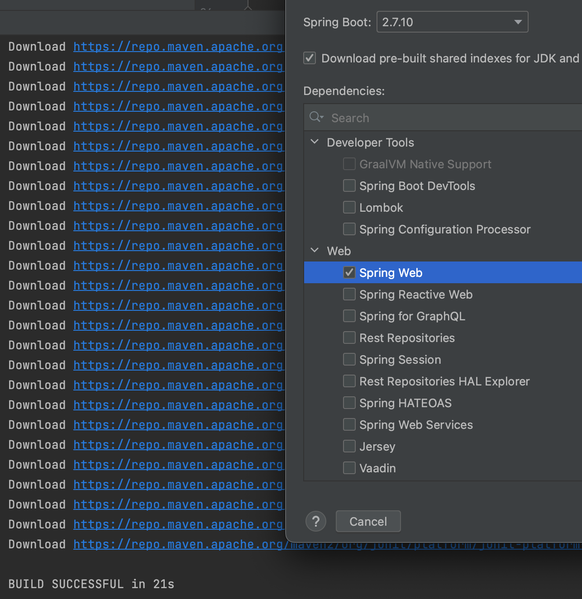

7. 6번과 같이 프로젝트를 다시 생성해도 되지만 `build.gradle`에서 spring boot의 버전을 바꿔서 해결할 수도 있다.

- 아래와 같이 프로젝트 폴더에 보면 build.gradle이라는 설정 파일이 있는데 plugins을 보면 id 'org.springframework.boot' version '3.0.5'의 형태로 스프링 부트의 버전이 설정되어있다.

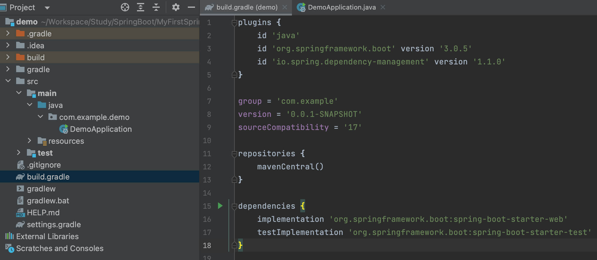

- 아래와 같이 해당 버전은 '2.7.10'으로 바꾸고  sourceCompatibility = '17'로 설정된 부분을 '11'로 바꾸고 아래 두번째 캡처의 코끼리모양의 아이콘 또는 Reload 아이콘을 누르면 해당 프로젝트의 빌드 설정이 바뀌면서 자동으로 빌드가 성공하게 된다.

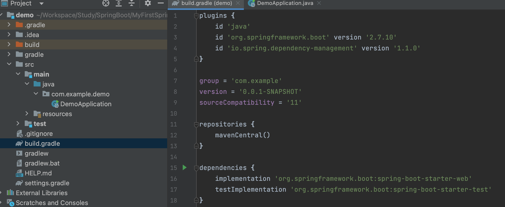

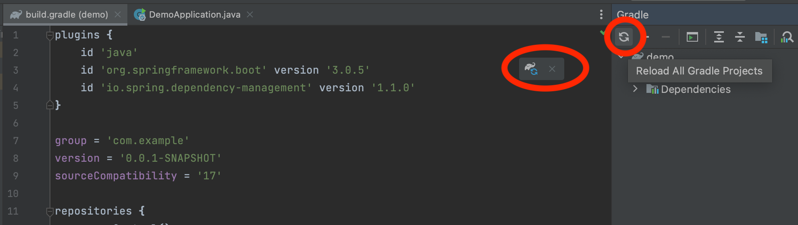

8. 빌드가 성공하고 난 뒤에 스프링 부트에서 기본적으로 제공해주는 Embeded 서버인 tomcat서버를 이용하여 서버를 띄울 수 있다.

- 아래와 같이 src/main/java/{package_name}/ 경로에 스프링 부트 어플리케이션 메인 클래스가 있는데 코드 왼쪽에 보이는 재생 버튼을 누르고 Run을 수행하면 서버가 실행된다.

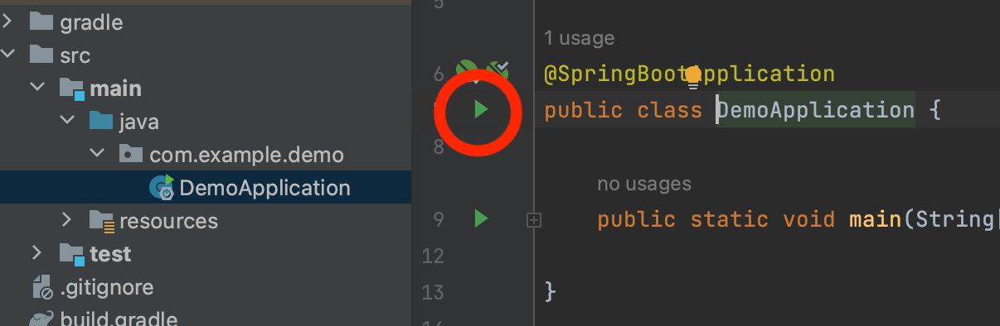

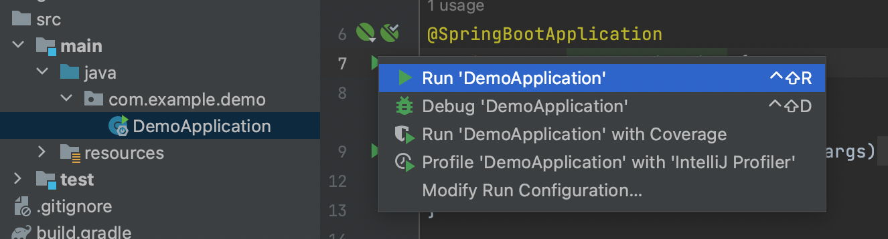

- 서버가 성공적으로 띄워졌을 경우 아래와 같이 Tomcat started on port(s): 8080 로그가 남는 것을 확인할 수 있다.
  - 여기까지 성공적으로 진행하면 localhost:8080에 서버가 띄워진다.

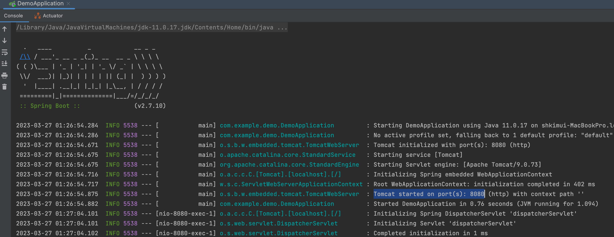

## start.spring.io에서 생성

1. https://start.spring.io/ 링크에 들어가면 아래와 같이 스프링 프로젝트의 초기 설정을 할 수 있는 페이지가 나오게 된다.
2. 아래와 같이 원하는 프로젝트 설정(필자의 경우 gradle, java11, spring boot 2.7을 사용)을 한다.

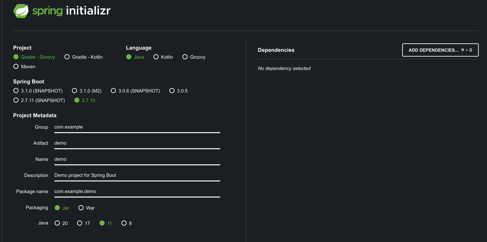

3. 해당 페이지의 오른쪽 탭에서 Dependency를 설정할 수 있는 데 ADD DEPENDENCIES 버튼을 클릭하면 아래 창이 뜨는데 여기서 Spring Web을 선택

4. 이제 왼쪽 아래의 GENERATE버튼을 누르면 프로젝트가 폴더째로 다운로드 된다.

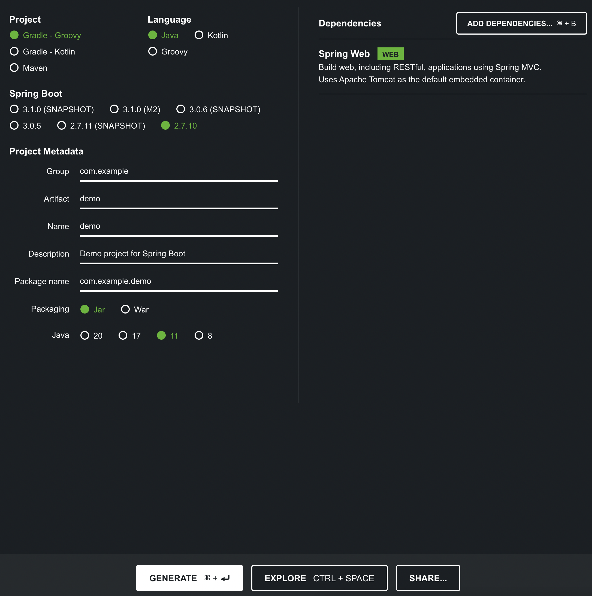

*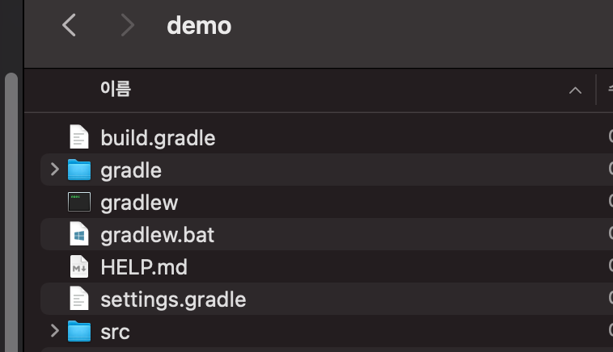*

5. IntelliJ에서 File -> Open 으로 해당 폴더를 선택하면 프로젝트가 Import되고 자동으로 빌드된다.

# Conclusion

---

Spring 프로젝트를 시작하기 전에 초기 프로젝트 세팅 방법에 대하여 알아보았다.

# Reference

---

Fastcampus 스프링 부트 프로젝트(어드민 페이지 만들기) 강의 - 예상국 강사님

Fastcampus 스프링 부트 프로젝트 강의(지인 정보 관리 시스템 만들기) - 강현호 강사님
