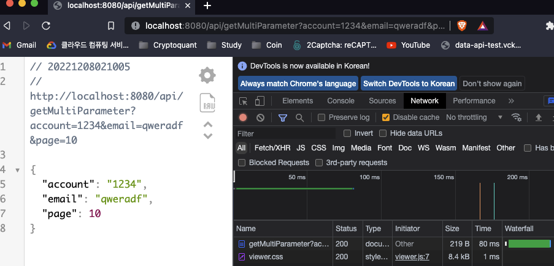

# Introduction

---

SpringBoot의 Controller 설정 방법과 Rest API 구현 과정을 살펴 본다.


# Rest API

---

HTTP 프로토콜에 있는 Method를 활용한 아키텍쳐 스타일

HTTP method를 통해서 Resource에 대한 CRUD 작업을 처리한다.

> CRUD: Create / Read / Update / Delete

여기서 Resource란 Collection, Member로 나뉠 수 있다.

- Collection: 리스트 등의 형태로 여러 개로 이루어진 리소스

- Member: 단일로 이루어진 개별적인 리소스


| HTTP Method | CRUD 동작     | URL 형태 (예시)   |
| ----------- | ------------- | ----------------- |
| GET         | 조회 (Read)   | /user, /user/{id} |
| POST        | 생성 (Create) | /user             |
| PUT / PATCH | 수정 (Update) | /user/{id}        |
| DELETE      | 삭제 (Delete) | user/{id}         |


예를 들어 Rest방식으로 단일 리소스(Member)를 조회를 하고 싶을 때는 아래와 같은 작업이 이루어진다.

1. /user/{id} 형태의 url을 사용하여 서버에 HTTP get method를 보낸다
2. 서버에서는 user의 데이터 중 특정 id에 해당하는 정보를 read하여 리턴해준다.


# Controller 설정

---

웹에서 사용자의 접속을 위해서는 주소가 필요한데 웹 개발에서 ***주소의 모음을 Controller***라고 함

Rest API의 형태로 웹 개발을 하기 위해서는 크게 Get, Post, Put/Patch, Delete를 수행하는 주소를 만들고 주소에 매핑되는 메서드들을 만들어 해당 기능을 수행하도록 개발해야 한다.

프로젝트에서 controller라는 패키지를 별도로 생성하고 controller 패키지 안에서 각 메소드들을 정의하도록 한다.


## Get method

---

컨트롤러의 첫 번째로 리소스를 조회(Read)하는 Get Controller를 생성

```java
package com.example.demo.controller;

import org.springframework.web.bind.annotation.RequestMapping;
import org.springframework.web.bind.annotation.RequestMethod;
import org.springframework.web.bind.annotation.RestController;

@RestController
@RequestMapping(path = "/api") // localhost:8080/api
public class GetController {

    @RequestMapping(method= RequestMethod.GET, path = "/getMethod") // localhost:8080/api/getmethod
    public String getRequest(){
        return "Get!";
    }
}

```

- `@RestController` : 적용된 Class가 rest api 로 동작 하도록 설정, annotation을 사용하여 spring에게 여기는 컨트롤러로 사용할거라는 것을 명시 
- `@RequestMapping` : 외부에 api 주소를 노출 하는 설정 (어떤 주소로 받을 것인지 설정), HTTP Method(GET, POST, PUT, DELETE 등)를 적용 가능하며 method를 지정하지 않으면 전부 동작
- 위 예시에서는 get method가 파라미터를 받는 부분이 없기 때문에 /getMethod 뒤에 어떤 파라미터를 붙여도 동일한 동작을 함 → ex) [localhost:8080/api/getMethod?id=1234](http://localhost:8080/api/getMethod?id=1234) 
- 위 예시 코드를 작성하고 서버를 다시 실행하면 http://localhost:8080/api/getmethod 주소로 getRequest를 호출할 수 있고 아래와 같이 브라우저를 이용하여 테스트가 가능하다.


- 웹 브라우저는 캐싱을 지원하기 때문에 검증을 위한 주소로 접속을 하면 메서드가 호출되는 것이 아니라 캐시 데이터가 리턴될 수 있다.
  - 웹 브라우저의 캐시 끄기: 만든 페이지에서 개발자 모드 -> Network → Disable cache 체크 → refresh 
- 웹 개발에서 개발 코드 검증 : Junit이나 웹브라우저, rest client(Postman 등..) 등을 통해서 가능 

- 만약 Mapping으로 설정한 ***method 단위의 주소***가 똑같은 것이 두 개 이상있으면 스프링 부트 실행 불가
  - method 단위가 아닌 ***class 단위 주소(예를 들어 위 코드의 GetController class에 매핑된 "/api")는 중복되게 설정해도 빌드 에러가 나지 않는다.***


- 위 예시를 보면 getParameter 주소에 매핑되는 함수를 두 개 만들어서 빌드 에러가 나는 것을 확인 가능


### @RequestParam

url의 Query parameter를 parsing 할때 사용

url에 param을 넣어서 request를 할 때가 있는데 이때 메서드가 해당 param을 받기 위해서 @ReqeustParam을 사용한다.

아래 코드는 `localhost:8080/api/getParameter?id=1234&password=abcd`와 같이 주소에 id, password 값을 포함하여 request를 보낼 수 있도록 get method를 작성한 예시이다.

- get method는 url 길이에 제한이 있을 수 있는데 가령 MS에서 제공하는 브라우저는 ***실제 경로의 문자 수를 뺀 최대 2,048자로 제한***한다고 한다.

```java
@GetMapping("/getParameter") // localhost:8080/api/getParameter?id=1234&password=abcd
public String getParameter(@RequestParam String id, @RequestParam(name="password") String pwd){
    String password = "bbbb";

    System.out.println("id : "+id);
    System.out.println("pw : "+pwd);

    return id+pwd;
}
```

- 위 예시에서는 getParameter의 id와 password를 parameter로 받기 위해서 @RequestParam 사용 
- @RequestParam으로 설정된 parameter의 이름은 실제 주소에서 전달할 인자의 이름과 같아야함
  - 가령 위 예시에서 인자를 @RequestParam String pwd로 설정하면 주소에 password=~~를 설정해도 매핑하지 못한다 
  - 이때 ,@RequestParam(name = "password") String pwd 로 주소와 매핑되는 이름을 고정할 수 있다


### 객체 형태의 parameter

만약 param이 `account=abcd&email=study@gmail.com&page=10` 와 같이 복합적인 형태로 들어온다면 이를 일일이 RequestParam에 넣어주긴 번거롭다

- 이럴 때는 객체 형태로 param을 받을 수 있는 방법을 사용하는 것이 좋다.

```java
package com.example.study.model;

public class SearchParam {

    private String account;
    private String email;

    public String getAccount() {
        return account;
    }

    public void setAccount(String account) {
        this.account = account;
    }

    public String getEmail() {
        return email;
    }

    public void setEmail(String email) {
        this.email = email;
    }

    public int getPage() {
        return page;
    }

    public void setPage(int page) {
        this.page = page;
    }

    private int page;

}
```

```java
// localhost:8080/api/multiParameter?account=abcd&email=study@gmail.com&page=10
@GetMapping("/getMultiParameter")
public String getMultiParameter(SearchParam searchParam){

    System.out.println(searchParam.getAccount());
    System.out.println(searchParam.getEmail());
    System.out.println(searchParam.getPage());

    // { "account" : "", "email" : "" , "page" : 0}
    return searchParam;
}
```

위와 같이 인스턴스를 리턴하면 스프링 부트에서 자동으로 json형태로 변환하여 리턴해준다



기존 서블릿이나 spring은 json라이브러리를 직접 marven, gradle을 통해서 가져온 뒤 변환을 시키거나 객체를 직접 json으로 변환시킨 후 리턴했었다

- 요즘 http 통신 규격에서는 json을 표준처럼 사용하기 때문에 스프링 부트에서는 json 라이브러리를 내장하고 있어 특별한 설정 없이 사용 가능하다.


## Post Method

---

리소스를 생성(Create)하는 Post Controller를 생성

주소에 파라미터를 포함하여 request를 보낼 수 있는 get method와는 달리 post method는 주소에 파라미터를 노출시키지 않는다.

- 파라미터가 노출되지 않기 때문에 사용자의 요청 또한 노출되지 않으며 브라우저가 주소를 캐싱하지 못한다.

아래는 Post Controller의 예시 코드

```java
package com.example.study.controller;

import com.example.study.model.SearchParam;
import org.springframework.web.bind.annotation.*;

@RestController
@RequestMapping("/api") // localhost:8080/api/
public class PostController {

  //	아래 1), 2)는 같은 의미
	//  @RequestMapping(method = RequestMethod.POST, path = "/postMethod")  // 1)
	//  @PostMapping(value = "/postMethod",produces = {"application/json"}) // 2)
    @PostMapping(value="/postMethod")
    public SearchParam postMethod(@RequestBody SearchParam searchParam){

        return searchParam;
    }
}
```

`@PostMapping`: ***@RequestMapping의 method 인자를 RequestMethod.POST***로 설정하는 것과 같은 의미를 가짐 

- 마찬가지로 RequestMethod.GET로 설정하는 것과 GetMapping은 같은 의미를 가짐

`@RequestBody`: http통신에서 post의 body에 data를 보내겠다 

@PostMappping의 `produces`인자에서 body의 타입을 설정 가능, 디폴트는 "application/json"

- post에는 json, xml, multipart-form, text-plain등 여러 형식을 지원 

이때, 아래와 같이 controller 폴더에 PostController를 만들고 위에서 생성한 GetController와 같은 주소("/api")를 매핑해도 에러가 나지 않는다

**


### Post 사용 예시

- 아래와 같이 rest client tool(chrome의 restlet 등) 을 통해서 post request 가능
- 이때, https가 아닌 http임에 주의..


## Put/Patch Method

---

Post와 마찬가지로 Body에 데이터를 넣어서 request, CRUD 중 Update에 사용된다.

DB에 특정 자원을 update 시키고 싶을 때 postBody에 해당 데이터를 넣어 업데이트 수행

```java
package com.example.demo.controller;

import com.example.demo.model.SearchParam;
import org.springframework.web.bind.annotation.*;

@RestController
@RequestMapping(path = "/api")
public class PatchController {

    @PatchMapping(path="/patchMethod/{id}")
    public void patchMethod(@PathVariable int id, @RequestBody SearchParam searchParam){
        // id에 해당하는 데이터를 searchParam으로 update하는 logic
    }
}

```

`@PathVariable`: URL 의 Path의 값을 Parsing 할때 사용. 

- ex)  https://foo.co.kr/1 -> @GetMapping("/{id}" public Optional read(@PathVariable Long id)


## Delete Method

---

Get과 마찬가지로 주소에 파라미터를 넣어서 request, CRUD 중 Delete에 사용된다.

DB에 파라미터와 매칭되는 특정 자원을 delete 시킬 때 사용

```java
package com.example.demo.controller;

import org.springframework.web.bind.annotation.DeleteMapping;
import org.springframework.web.bind.annotation.PathVariable;
import org.springframework.web.bind.annotation.RequestMapping;
import org.springframework.web.bind.annotation.RestController;

@RestController
@RequestMapping(path = "/api")
public class DeleteController {

    @DeleteMapping(path = "/deleteMethod/{id}")
    public void deleteMethod(@PathVariable int id){
        // id에 해당하는 데이터를 지우는 delete하는 logic
    }
}

```


# Conclusion

---

Rest API의 개념과 Spring Boot 프로젝트에서 Rest API를 구현하기 위한 controller를 작성해 보았다.


# Reference

---

Fastcampus 스프링 부트 프로젝트(어드민 페이지 만들기) 강의 - 예상국 강사님

Fastcampus 스프링 부트 프로젝트 강의(지인 정보 관리 시스템 만들기) - 강현호 강사님
