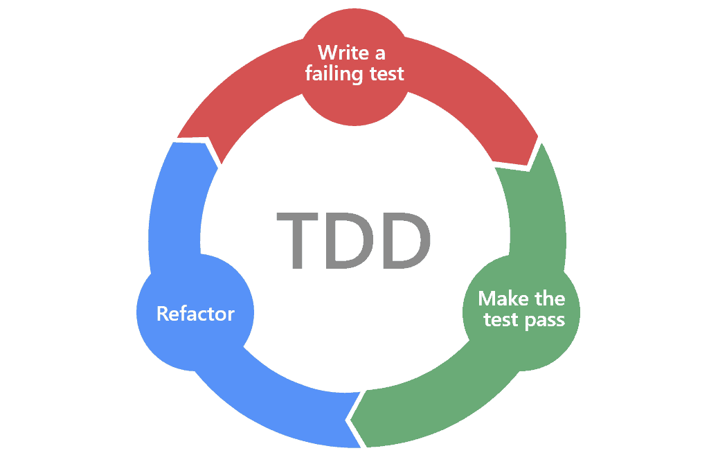
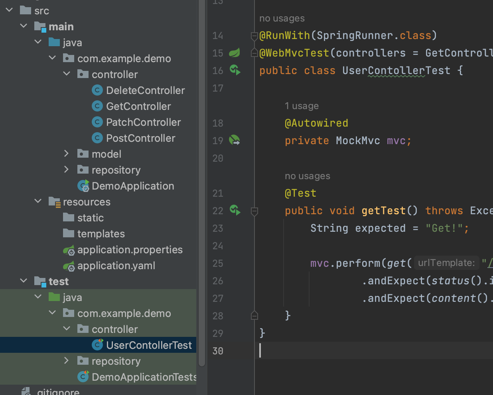
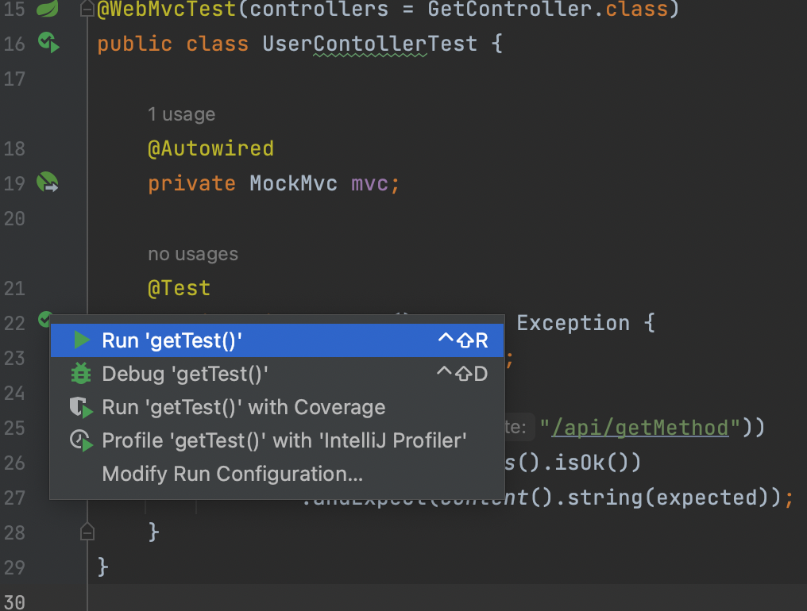
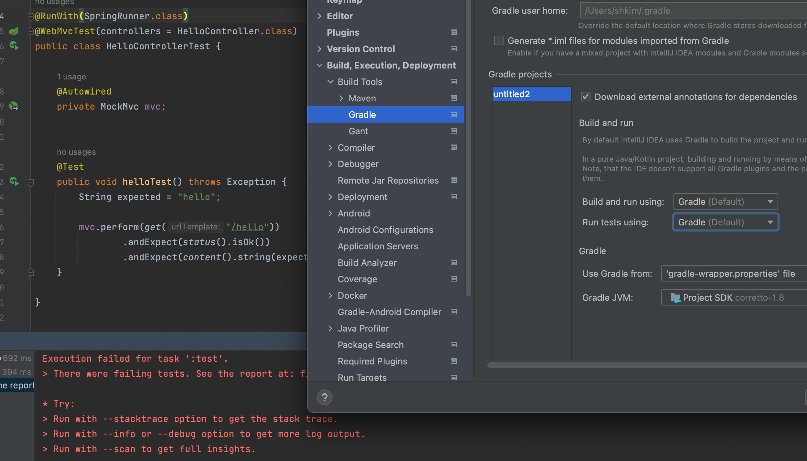
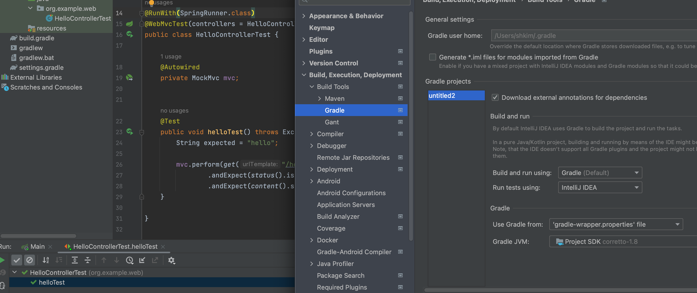

# Introduction

---

기본적인 TDD의 개념과 SpringBoot의 Controller Test 코드 작성 방법 살펴 본다.


# TDD(Test Driven Development)

---

테스트 주도 개발을 의미하며 간략하게 테스트를 진행해가며 개발 코드를 작성하고 개선시켜야 한다는 개념이다.

TDD는 보통 아래 `Red, Green, Refactor` cycle을 통해서 설명되곤 하는데 각각의 의미는 아래와 같다.

- `Red`: 테스트가 실패하는 단계, 특정 문제에 대한 해결이 없는 상태
- `Green`: Red 상태의 문제를 해결하는 프로덕션 코드를 작성한 상태
- `Refactoring`: 문제를 해결한 프로덕션 코드를 제너럴하고 효율적으로 리팩토링



즉, 테스트를 통해 발생한 문제를 해결하고 이를 개선시켜가면서 코드를 작성한다는 의미이다.


# 단위 테스트

---

TDD를 위한 첫 단계로 기능 단위의 테스트 코드를 작성하는 것

1. 개발 초기에 문제를 발견
2. 추후 리팩토링이나 라이브러리 업그레이드 등의 상황에서 기존 기능들의 검증 가능
3. 기능의 불확실성 감소
4. 단위 테스트 자체가 문서로써 기능을 제공


테스트 코드 작성을 위한 대표적인 프레임워크에는 아래와 같다. 

`JUnit` - Java (현재 JUnit5까지 나왔으나 현업에서는 아직 JUnit4를 많이 사용)

`DBUnit` - DB

`CppUnit` - C++

`NUnit` - .net


이번 포스트에서는 `JUnit4`를 이용하여 테스트를 진행한다.

> SpringBoot 2.2.* *버전*이 release 되면서 SpringBoot에서 기본으로 제공되던 JUnit이 ***JUnit4 버전에서 JUnit5으로  변경***되었기 때문에 ***SpringBoot 2.2이상의 버전을 쓰고 있다면 아래와 같이 Junit4에 대한 의존성을 추가***해줘야 한다.

```java
// build.gradle
...
dependencies {
    implementation 'org.springframework.boot:spring-boot-starter-web'
    implementation 'org.springframework.boot:spring-boot-starter-data-jpa'
    testImplementation 'org.springframework.boot:spring-boot-starter-test'
    testImplementation 'junit:junit:4.13.1' // JUnit4 의존성 추가
		...
}
```


### Controller 테스트 코드 작성

이전 Rest API 관련 포스트에서 작성하였던 GetController 코드이다. response로 String타입의 "Get!" 문자열을 리턴해주고 있다.

```java
package com.example.demo.controller;

import org.springframework.web.bind.annotation.RequestMapping;
import org.springframework.web.bind.annotation.RequestMethod;
import org.springframework.web.bind.annotation.RestController;

@RestController
@RequestMapping(path = "/api") // localhost:8080/api
public class GetController {

    @RequestMapping(method= RequestMethod.GET, path = "/getMethod") // localhost:8080/api/getmethod
    public String getRequest(){
        return "Get!";
    }
}

```


이제 JUnit4를 이용하여 위 코드에 대한 기본적인 테스트 코드를 작성해보자.

테스트 코드는 아래 보이는 src/test/java 패키지에서 생성하는데 이때, 테스트할 코드와 같은 경로(com.example.demo.controller)에 코드를 생성한다.



```java
package com.example.demo.controller;

import org.junit.Test;
import org.junit.runner.RunWith;
import org.springframework.beans.factory.annotation.Autowired;
import org.springframework.boot.test.autoconfigure.web.servlet.WebMvcTest;
import org.springframework.test.context.junit4.SpringRunner;
import org.springframework.test.web.servlet.MockMvc;

import static org.springframework.test.web.servlet.request.MockMvcRequestBuilders.get;
import static org.springframework.test.web.servlet.result.MockMvcResultMatchers.content;
import static org.springframework.test.web.servlet.result.MockMvcResultMatchers.status;

@RunWith(SpringRunner.class)
@WebMvcTest(controllers = GetController.class)
public class UserContollerTest {

    @Autowired
    private MockMvc mvc;

    @Test
    public void getTest() throws Exception {
        String expected = "Get!";

        mvc.perform(get("/api/getMethod"))
                .andExpect(status().isOk())
                .andExpect(content().string(expected));
    }
}

```

Contoller에 대한 기본적인 테스트 코드를 작성하였다. 코드에 대한 설명은 아래와 같다.

- `@RunWith`: 테스트를 실행할 때 JUnit의 내장 실행자 외에 추가적인 실행자를 실행하기 위한 어노테이션, 위 `코드에서는SpringRunner` 를 추가하여 스프링 부트 테스트를 JUnit에 연결하였다.
- `@WebMvcTest`: Spring test 어노테이션 중 Web에 특화된 어노테이션, @Controller, @ControllerAdvice 등을 사용하여 테스트가 가능하지만 @Service, @Component, @Repository 등은 사용할 수 없기 때문에 컨트롤러 테스트에 유용하다.

- `@Autowired`: Dependency injection(DI, 의존성 주입)을 위한 어노테이션으로 스프링이 관리하는 Bean을 주입

- `MockMvc`: 모의 request와 response를 만들어서 웹 테스트를 진행하기 위한 객체

- `perform`: 모의로 http request 수행

- `andExpect`: perform의 결과(status, content)를 검증


테스트를 실행하기 위해서는 아래 버튼을 이용한다.




이때, 아래와 같은 에러가 나며 테스트가 실패할 수 있다.

이때, `IntelliJ Preferences -> Build, Execution, Deployment -> Build Tools -> Gradle` 에서 `Run tests using` 설정을 `Gradle -> IntelliJ`로 설정하면 해결할 수 있다.



아래와 같이 설정을 바꾸면 테스트가 성공한다.




# Conclusion

---

TDD의 짧은 설명과 Test 코드 작성을 위해 Controller의 간단한 테스트를 진행해 보았다.


# Reference

---

스프링 부트와 AWS로 혼자 구현하는 웹 서비스 - 이동욱님
