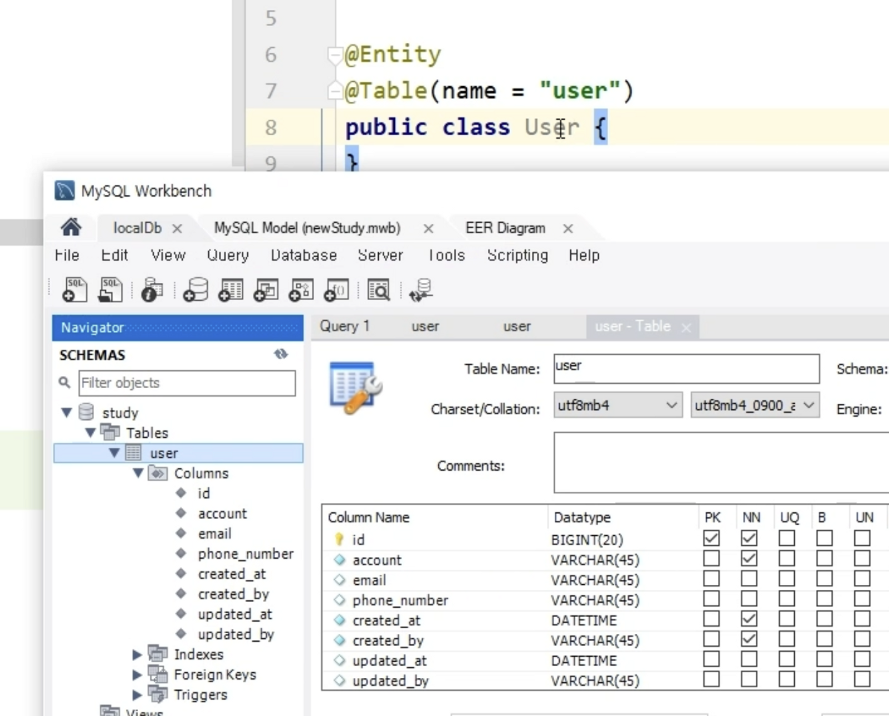
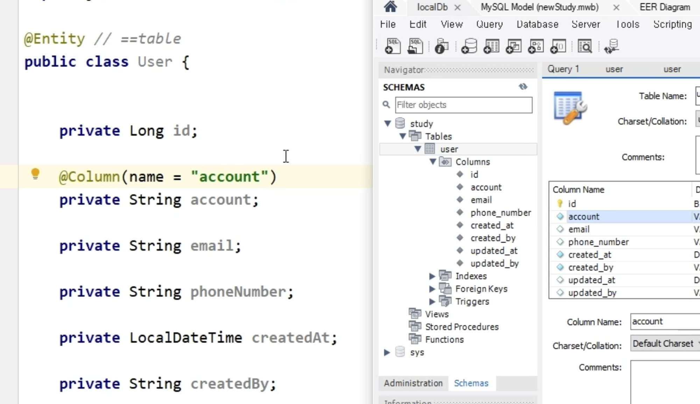

# Introduction

---

SpringBoot의 JPA에 대한 첫 번째 포스트로 JPA 설치와 Entity 설정에 대하여 알아본다.


# JPA

---

`ORM`을 위한 도구로써 ***RDB 사용을 객체 지향적으로 설계, 프로그래밍 할 수 있는 장점***이 있다.

> `ORM(Object Relation Mapping)`: RDB를 객체 지향적으로 활용할 수 있도록 도와주는 기술

예를 들어 JPA를 사용하면 RDB의 테이블을 생성하거나 쿼리를 날리는 등의 작업이 자바 클래스를 정의하거나 메서드 호출 등으로도 가능해진다.


## 설치

build.gradle의 dependencies에 아래 사항을 추가한 뒤 gradle을 reload하면 완료

```yaml
dependencies {
		...
    implementation 'org.springframework.boot:spring-boot-starter-data-jpa'
    ...
}

```


## Entity

JPA에서 ORM을 위한 테이블 클래스를 정의해주는 Annotation

Entity로 설정된 클래스는 아래와 같은 Annotation을 사용하여 ORM 클래스를 구축한다.

| Annotation      | Description                               |
| --------------- | ----------------------------------------- |
| @Entity         | 해당 Class가 ORM에 사용될 Entity임을 명시 |
| @Table          | Class에 mapping할 DB Table의 이름을 명시  |
| @Id             | 해당 변수가 Index primary key임을 명시    |
| @Column         | 표시된 변수가 DB column과 매핑됨을 명시   |
| @GeneratedValue | PK(primary key)의 전략 설정               |


```java
package com.example.demo.model;

import lombok.AllArgsConstructor;
import lombok.Data;
import lombok.NoArgsConstructor;

import javax.persistence.*;
import java.time.LocalDateTime;

@Data
@AllArgsConstructor
@NoArgsConstructor
@Entity
@Table(name = "user") // Table이름과 class이름이 동일하다면 @Table은 생략 가능
public class User {

    @Id
    @GeneratedValue(strategy = GenerationType.IDENTITY)
    private Long id;

    private String account;

    private String email;

    private String phoneNumber;

    private LocalDateTime createdAt;

    private String createdBy;

    private LocalDateTime updatedAt;

    private String updatedBy;
}
```

Table이름과 class이름이 동일하다면 @Table은 생략 가능 (JPA에서 자동 매핑)

자바에서  `camel case로 설정된 클래스(Entity),변수(Field)` 명과 RDS의 `snake case로 설정된 테이블, 컬럼` 명이 같다면  ***JPA에서 자동으로 mapping*** 됨 

- 변수 명에서 camel 규칙이 적용되지 않으면 에러 -> createdby (Error), createdBy (OK)
- 이름 자체가 다르면 에러 -> accounts (Error), account (OK)
- 아래 예시와 같이 User 클래스에 Entity를 설정하면 RDS의 "user" 테이블과 자동으로 매핑된다. (@Table을 생략해도 자동 매핑된다.)



- 아래 예시와 같이 @Column으로 네임을 직접 설정하거나 JPA 내부에서 camel case의 변수 명과 snake case의 컬럼 명을 자동으로 매핑해준다. (아래 예시에서 id, account, email, phoneNumber, createdAt, createdBy가 전부 매핑된다.)




# Conclusion

---

JPA의 첫 번째 단계로 설치와 Entity에 대하여 알아보았다.

Spring boot의 ORM 사용 방법에 대한 것을 다루기 때문에 서버에서 DB를 다루는 작업을 진행하기 위해서 필수로 알고 넘어가야 한다.


# Reference

---

Fastcampus 스프링 부트 프로젝트(어드민 페이지 만들기) 강의 - 예상국 강사님

Fastcampus 스프링 부트 프로젝트 강의(지인 정보 관리 시스템 만들기) - 강현호 강사님
