# Introduction

---

SpringBoot의 JPA에 대한 두 번째 포스트로 JPA를 사용하기 위한 DB 연결&설정에 대하여 알아본다.


# MySQL 설정

---

MySQL을 설치했다는 가정 하에 MySQL DB를 spring boot 프로젝트에 연결하기 위한 설정들을 알아본다.

- 이번 포스트에서는 MySQL WorkBench를 사용한다.

이전 포스트에서 다룬 Repository를 사용 또는 테스트하기 위해서는 MySQL과 같은 db에 연결이 되어있어야 한다.

우선 MySQL을 실행하여 DB 스키마 생성과 테이블 생성을 진행한다.

### Connection 생성

MySQL WorkBench을 이용한 Connection 생성 순서는 아래와 같다.

1. 아래 그림과 같이 MySQL Connections의 오른쪽 + 버튼을 눌러 새로운 connection을 생성 창을 연다.
2. Connection Name, Hostname, Port, Username 등 연결에 필요한 설정을 진행한다 (아래 예시에서는 Connection Name만 설정하고 나머지는 기본 설정으로 진행)
3. Test Connection을 선택하여 연결이 정상적으로 동작하는 지를 테스트한다.

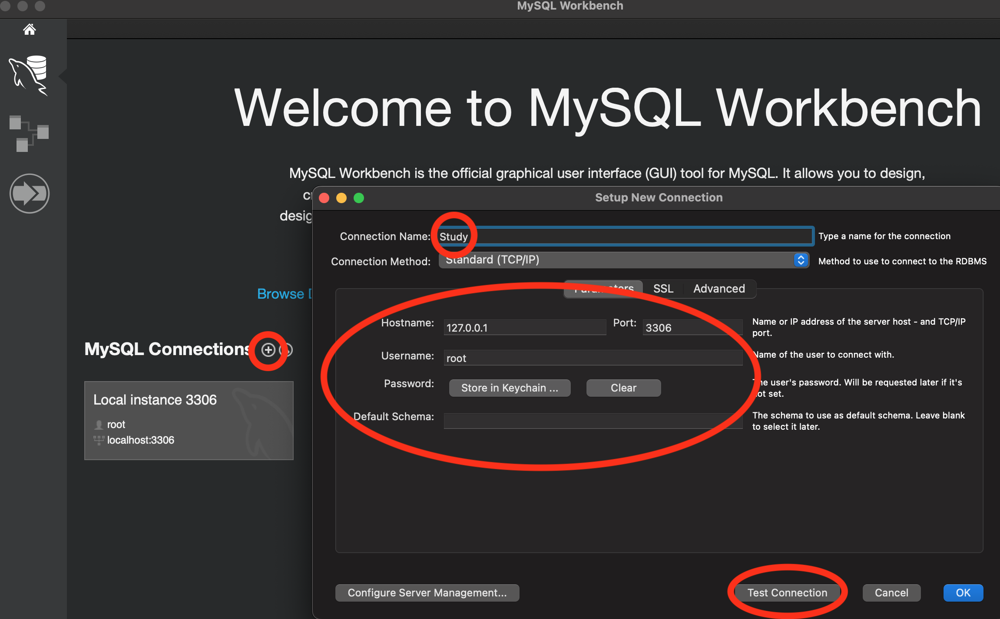

4. 아래와 같은 창이 뜨면 연결 테스트가 성공한 것이므로 OK 버튼을 눌러서 현재 상태로 연결을 생성한다.

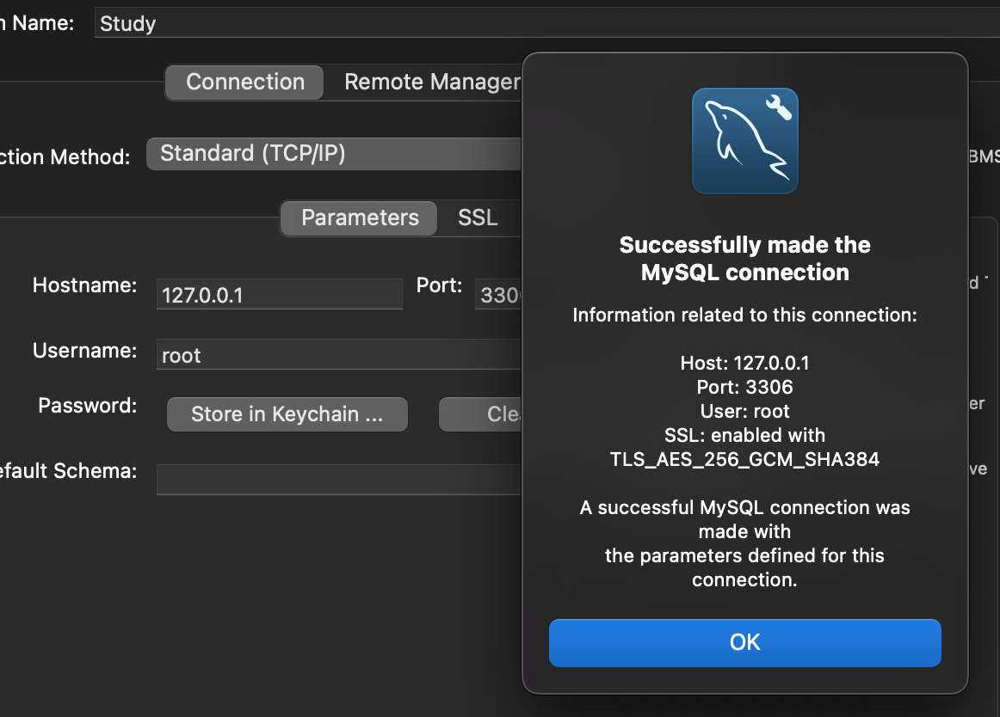

5. 아래와 같이 연결이 생성됨을 확인할 수 있다. 이제 생성한 connection을 선택하여 해당 db에 접속할 수 있다.

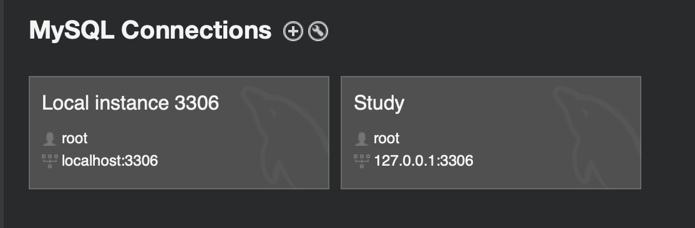


### 스키마 생성

1. db에 들어가면 아래와 같이 Schemas 탭을 선택할 수 있는데, 해당 탭으로 들어가서 탭 창의 아무곳이나 오른쪽 클릭을 하면 Create Schema 버튼을 확인할 수 있다.

*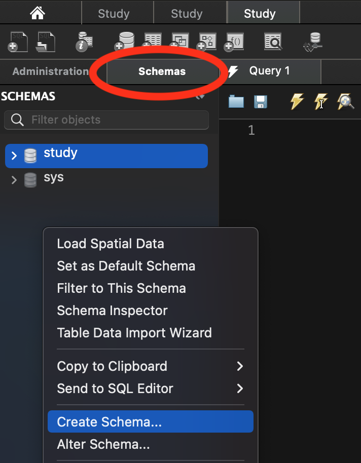*

2. Create Schema를 누르면 아래와 같이 shema name, char set 등을 설정하고 schema를 생성할 수 있다.

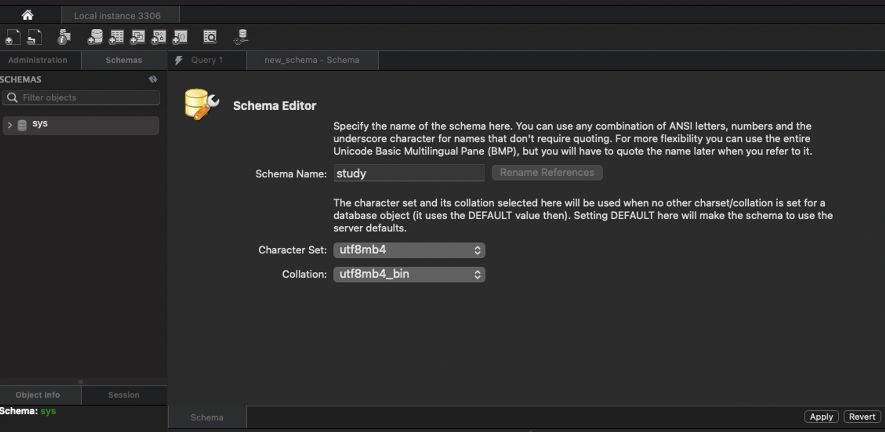

3. 에디터에서 오른쪽 아래의 Apply 버튼을 누르면 아래와 같이 스키마 생성 sql문이 나오는데 여기서 한번 더 Apply버튼을 누르면 스키마가 생성된다.

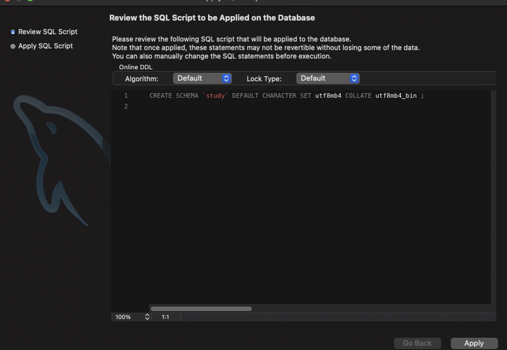


### 테이블 생성

1. 스키마를 생성하면 아래와 같이 Tables 목록에 보이는데 여기서 오른쪽 클릭을 하면 아래와 같이 Create Table 버튼으로 테이블 생성이 가능하다.

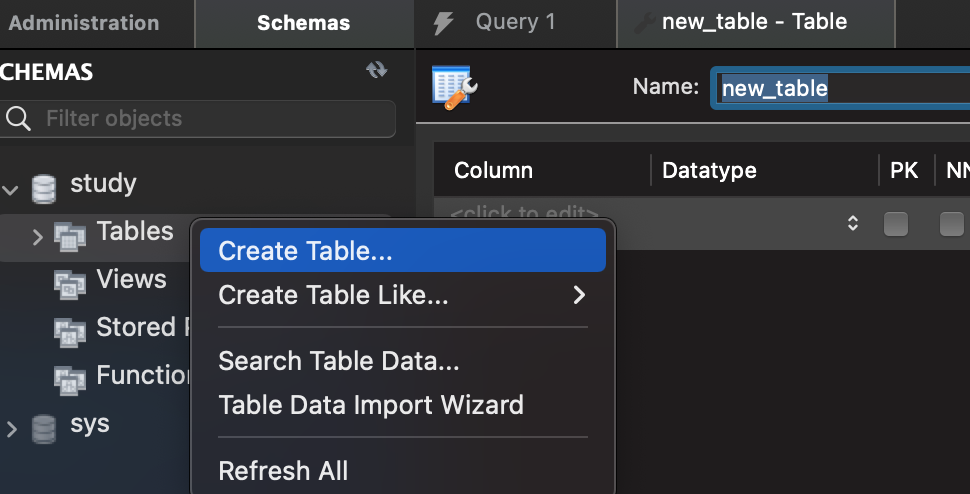

2. 테이블 명과 컬럼 명, 컬럼 타입, 컬럼 옵션 등을 설정한다.

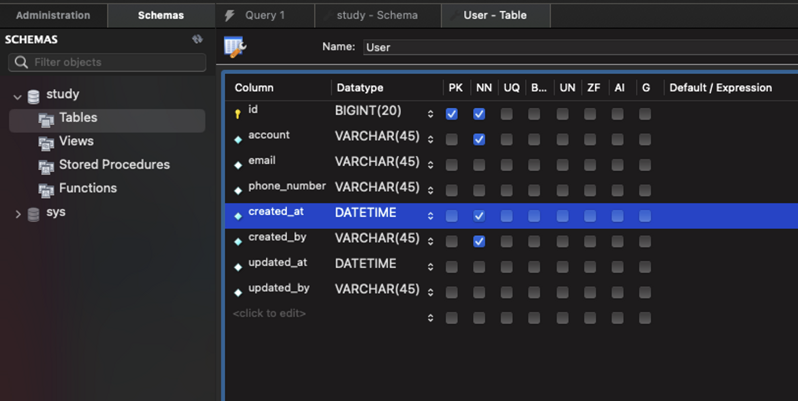

*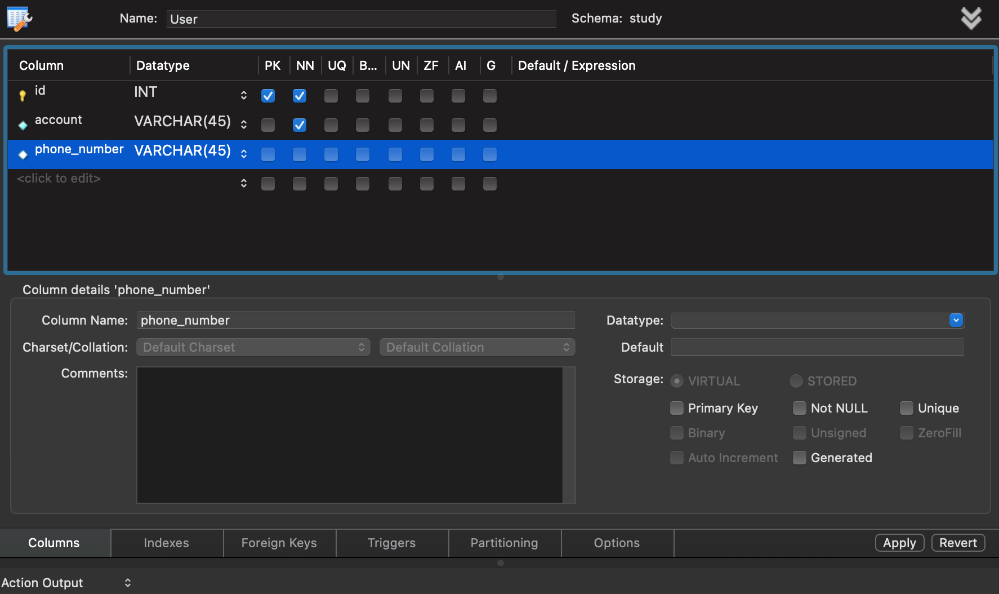*


3. 테이블 구성을 마치고 스키마 생성과 비슷하게 생성에 사용된 sql문이 나오고 다시 한번 Apply를 누르면 테이블이 생성된다.

*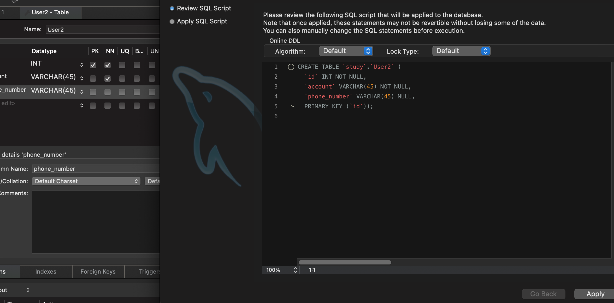*


# Spring boot 프로젝트와 MySQL 연결

---

이제 생성한 db connection과 테이블을 spring boot와 연결시키는 작업을 진행한다.

1. build.gradle의 dependencies 추가

```yaml
dependencies {
    ...
    runtimeOnly 'mysql:mysql-connector-java'
   	...
    }
}

```


2. 아래 경로의 application.properties 또는 application.yaml 파일을 따로 생성하여 연결 설정

*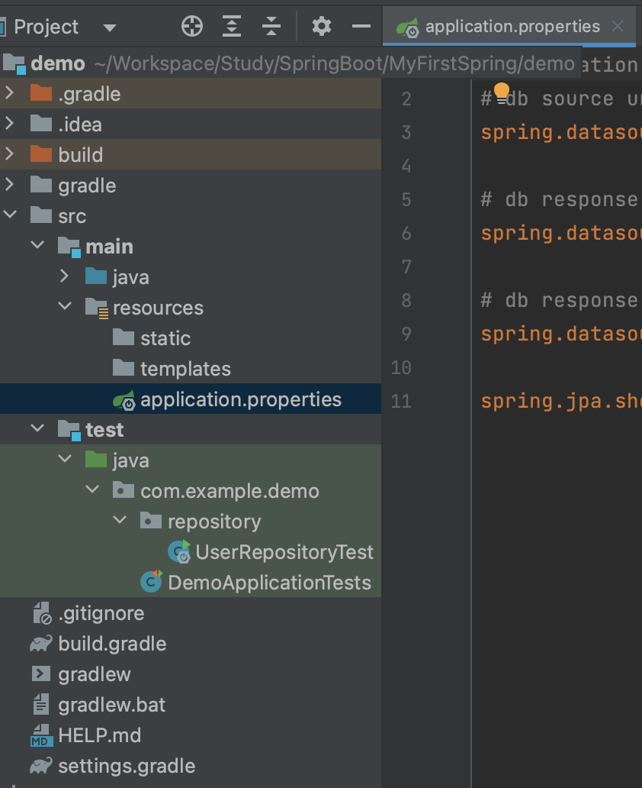*


3. application.yaml 파일 또는 application.properties에는 아래와 같이 url, username, password 등의 설정 값 작성

```yaml
# application.yaml
spring:
  jpa:
    show-sql: true
  datasource:
    url: jdbc:mysql://localhost:3306/study?useSSL=false&useUnicode=true&serverTimezone=Asia/Seoul&allowPublicKeyRetrieval=true&createDatabaseIfNotExist=true # 새로 추가된 옵션 schema 가 없는 경우 생성
    username: root
    password: 1234
    driver-class-name: com.mysql.cj.jdbc.Driver
logging:
  level:
    root: info
    com.zaxxer.hikari.HikariConfig: debug
    org.hibernate.SQL: debug
    hibernate.type.descriptor.sql.BasicBinder: trace
```

```yaml
# application.properties
# db source url
spring.datasource.url=jdbc:mysql://localhost:3306/study?useSSL=false&useUnicode=true&serverTimezone=Asia/Seoul&allowPublicKeyRetrieval=true

# db response name
spring.datasource.username=root

# db response password
spring.datasource.password=root

spring.jpa.show-sql=true
```

- 이때, show-sql=true 설정으로 Hibernate 기능을 활성화하여 로그 상에서 실제 수행된 쿼리문을 출력 가능하다.

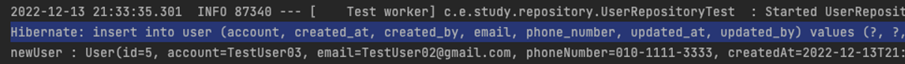


# 에러 케이스

---


MySQL 의존성을 추가하다 보면 아래 두 가지 에러가 날 수 있다.

1) build.gradle load 에러

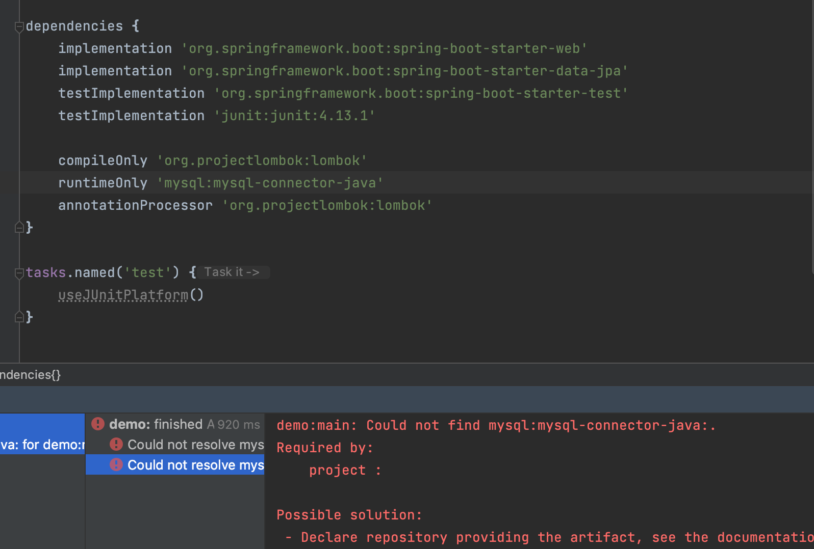

2. application.properties 또는 application.yaml에서의 driver-class-name import 에러 (com. 이후 빨간색 부분을 참조하지 못함)

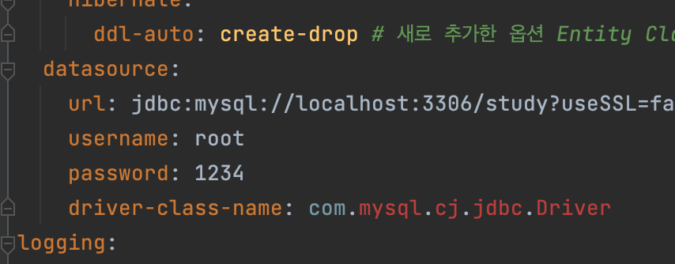


### 해결 방안

MySQL이 정상적으로 dependency에 추가되지 못한 경우인데 ***build.gradle의 dependencies에서 mysql의 세부 버전을 기입***하고 다시 로드 하니 정상적으로 로드 되었다.

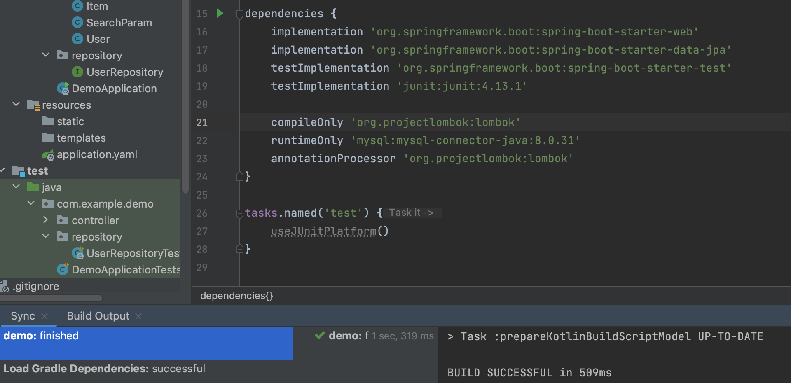


application.yaml에서도 driver-class-name에서 빨간색 표시로 에러가 났던 부분이 정상적으로 import된 것을 확인할 수 있다.

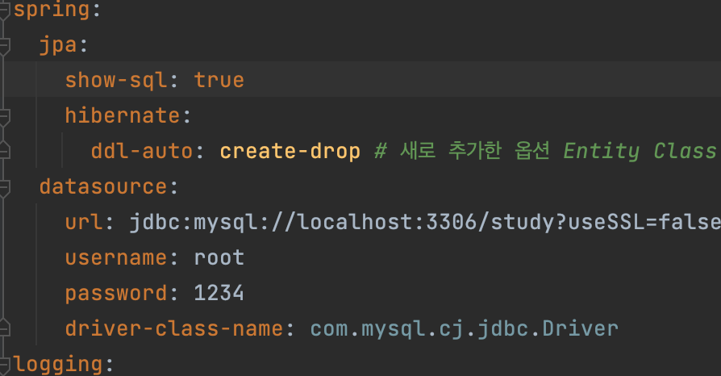


- MySQL 버전은 아래와 같이 확인이 가능하다.

```shell
>> mysql --version
/usr/local/mysql/bin/mysql  Ver 8.0.31 for macos12 on arm64 (MySQL Community Server - GPL)
```


# Conclusion

---

JPA의 두 번째 단계로 Spring boot와 DB 연결을 진행하였다.

MySQL을 의존성 추가하면서 예상치 못한 에러가 발생하여 해결하는 데 좀 애를 먹었다. version을 명시하지 않아서 의존성이 추가되지 못한 케이스는 강의에서 다루지 않기도 했고 구글링을 해도 딱히 해결 방안이 나오지 않아 혼자서 추측성으로 시도해 보았는데 다행히 정상적으로 해결되었다.


# Reference

---

Fastcampus 스프링 부트 프로젝트(어드민 페이지 만들기) 강의 - 예상국 강사님

Fastcampus 스프링 부트 프로젝트 강의(지인 정보 관리 시스템 만들기) - 강현호 강사님
