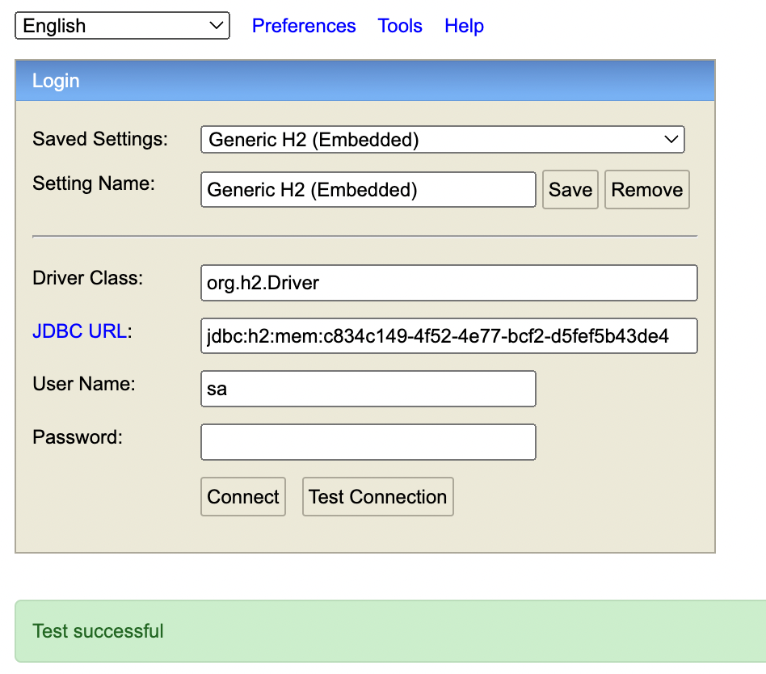
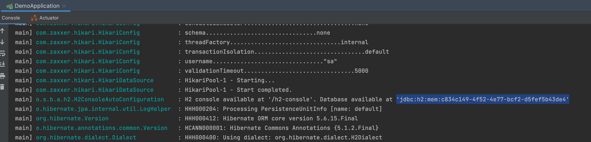
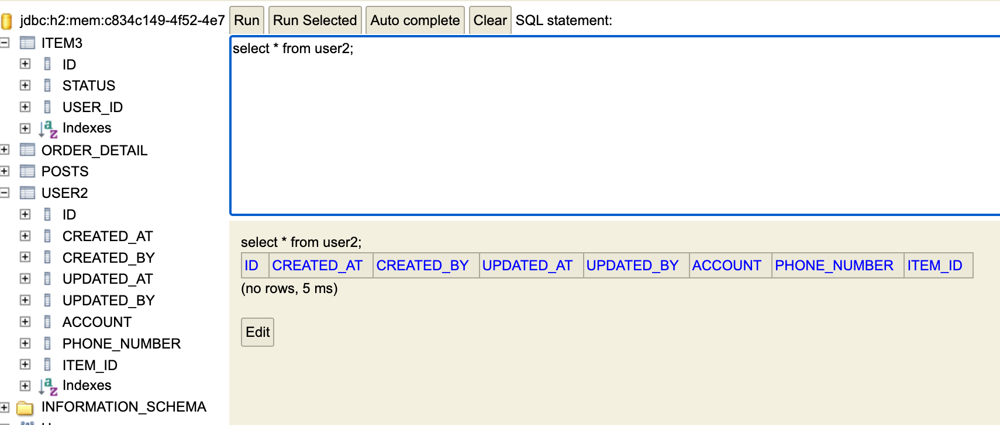

# Introduction

---

JPA를 사용하기 위한 h2 DB 설정에 대하여 알아본다.


# H2

---

In-memory형 RDB

- 메모리에 데이터가 저장되기 때문에 애플리케이션을 재 시작할 때마다 데이터가 초기화 된다.
- 해당 특성 때문에 보통 테스트 용도로 많이 쓰임

별도의 설치가 필요없이 프로젝트 의존성만으로 관리


## 설치

build.gradle의 dependencies에 아래 사항을 추가한 뒤 gradle을 reload하면 완료

```yaml
dependencies {
		...
    implementation('com.h2database:h2')
    ...
}

```


위 의존성만 추가하면 아래 코드와 같이 @SpringBootTest로 설정된 테스트 코드를 실행하면 자동으로 H2 DB가 실행된다

```java
@SpringBootTest
public class UserRepositoryTest{

    @Autowired
    private UserRepository userRepository;

    @Test
    public void create(){
        User user = new User();

        user.setAccount("TestUser01");
        user.setPhoneNumber("010-1111-1111");

        User user2 = new User().setAccount("TestUser01").setPhoneNumber("010-1111-1111");

        Item item = new Item();
        item.setStatus("None");
        user.setItem(item);


        User newUser = userRepository.save(user);
        System.out.println("newUser : "+newUser);
    }
}
```


이때, h2에 직접 접근하여 데이터를 확인하려면 웹 콘솔을 사용할 수 있다.

웹 콘솔을 활성화 하려면 아래와 같이 application.yaml 또는 application.properties에서 아래 항목을 추가한다.

1) application.yaml

```yaml
spring:
  h2:
    console:
      enabled: true
```

2.  application.properties

```java
spring.h2.console.enabled=true
```


H2 콘솔을 활성화 한 채로 애플리케이션을 실행시키면 이제 http://localhost:8080/h2-console/ 주소를 통해서 웹 콘솔에 접속할 수 있는데 JDBC URL을 제대로 입력해야 db에 접근할 수 있다.



아래와 같이 애플리케이션 실행 후 로그를 살펴보면 아래와 같이 JDBC URL이 나온다. 해당 URL을 입력하고 Connect를 눌러서 h2 db에 접속할 수 있다.




웹 콘솔은 아래와 같은 구성으로 이루어져 있으며 @Entity로 생성한 테이블들이 자동으로 생성되어져 있다.

SQL문을 이용하여 데이터를 쿼리하거나 하단에 보이는 `Edit` 버튼으로 데이터를 직접 입력하여 넣을 수도 있다.



# Conclusion

---

H2 DB의 설정 방법과 사용 방법에 대하여 간단히 알아보았다.

# Reference

---

Fastcampus 스프링 부트 프로젝트(어드민 페이지 만들기) 강의 - 예상국 강사님

Fastcampus 스프링 부트 프로젝트 강의(지인 정보 관리 시스템 만들기) - 강현호 강사님
