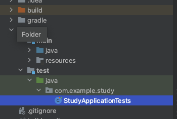
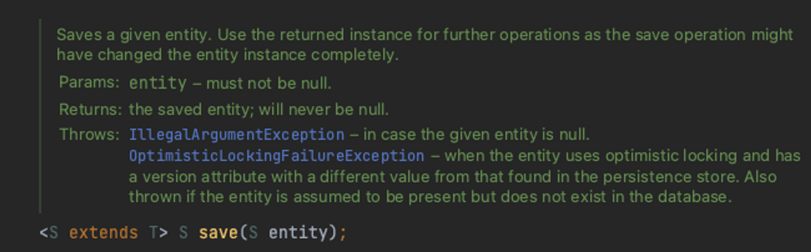
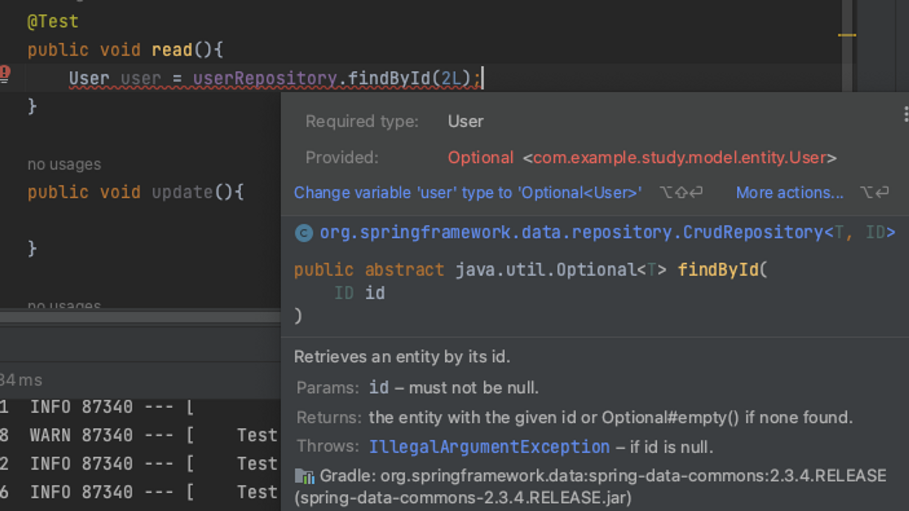
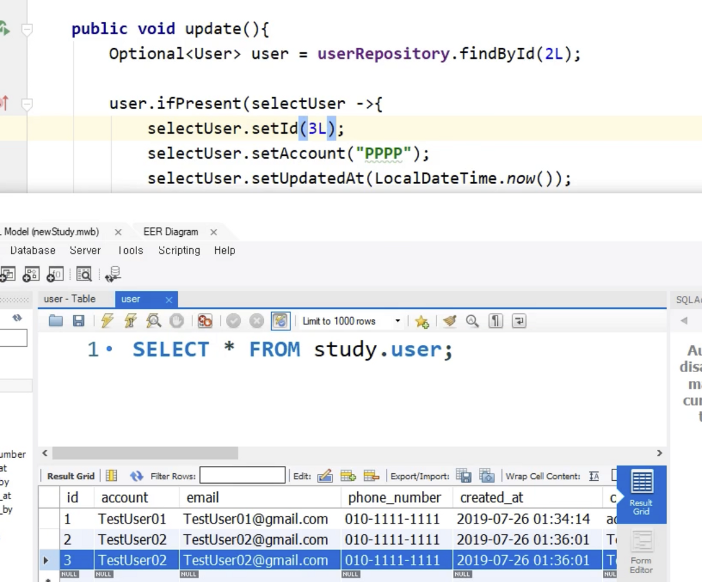

# Introduction

---

SpringBoot의 JPA에 대한 세 번째 포스트로 Repository에 대하여 알아본다.


# Repository

---

ORM 클래스(entity)를 이용하여 ***sql 문을 직접 작성하지 않고도 RDB 데이터의 CRUD 작업을 수행***하게 해주는 기능(annotation)

repository를 사용하여 DB 데이터를 CRUD하기 위해서는 프로젝트에 db가 연결되어있어야 하는데 이전 포스트에서 MySQL과 프로젝트를 연결시켰기 때문에 이제 repository를 이용하여 MySQL db를 조작하는 것이 가능하다.


## 생성 방법

1. 인터페이스 생성, `@Repository` annotation
   - 보통 Repository 인터페이스 명은 entity 명 + Repository으로 설정한다.
2. Repository 인터페이스에 `JpaRepository<Entity의 타입 , PK의 타입>`를 상속받으면 끝
   - 아래와 같이 빈 상태로 인터페이스를 생성하여도 기본적인 crud 메소드가 생성되기 때문에 이 상태로도 RDB 테이블에 데이터를 add하거나 select하는 기능을 사용할 수 있다.

```java
package com.example.demo.repository;

import com.example.demo.model.User;
import org.springframework.data.jpa.repository.JpaRepository;
import org.springframework.stereotype.Repository;

@Repository
public interface UserRepository extends JpaRepository<User, Long> {
}

```


## 테스트 

Spring 프로젝트가 만들어질 때, 자동으로 test 폴더가 상위에 생성되는데 개발 중의 테스트는 이 test 폴더에서 진행한다.

- test 폴더 내에는 main 소스들을 테스트할 수 있는 패키지가 이미 생성되어있음.

**


### Create

Repository에는 기본적으로 entity 데이터를 저장(create)해주는 save함수가 존재한다.

`save()`: 저장할 entity 객체를 받고, DB에 저장된 새로운 entity 객체를 리턴해준다




아래 예시 코드는 Repository를 이용한 create의 테스트 코드이다.

```java
package com.example.study.repository;

import com.example.study.StudyApplication;
import com.example.study.model.entity.User;
import org.junit.jupiter.api.Test;
import org.springframework.beans.factory.annotation.Autowired;

import java.time.LocalDateTime;

public class UserRepositoryTest extends StudyApplication {

    
    @Autowired // Dependency Injection (DI)
    private UserRepository userRepository;

    @Test // Test코드에는 반드시 @Test annotation 필요
    public void create(){
        // String sql = insert into user (%s, %s, %d) value (account, email, age);
        User user = new User();
				// user.setId(); id는 AutoIncrement라서 set할 필요 없음

        user.setAccount("TestUser01");
        user.setEmail("TestUser01@gmail.com");
        user.setPhoneNumber("010-1111-1111");
        user.setCreatedAt(LocalDateTime.now());
        user.setCreatedBy("admin");

        User newUser = userRepository.save(user); // entity 객체를 인자로 받아 DB에 저장하고 DB에 저장된 새로운 entity 객체를 리턴해준다
        System.out.println("newUser : "+newUser);
    }

    public void read(){

    }

    public void update(){

    }

    public void delete(){

    }
}
```

### @Autowired

- spring의 대표적 장점인 디자인 패턴인 Dependency injection(DI, 의존성 주입)을 위한 annotation
- 개발자가 직접 객체를 만들지 않아도 스프링이 직접 객체를 관리해주고 의존성 주입을 해준다
- DI의 기본 핵심은 singleton에 의한 관리 
  - private UserRepository userRepository = new UserRepository(); 할 필요 없이 해당 application 실행될때, spring에서 자동으로 @Autowired를 찾아서 객체를 생성, 관리 해준다.


### Read

Repository를 생성하면 자동으로 findAll, findById 등의 함수를 사용할 수 있는데 이 함수들을 이용하여 entity 데이터를 read하는 것이 가능하다.

`findAll`: 데이터베이스의 테이블 데이터를 리스트로 모두 가져오는 함수

`findById`: 특정 ID값을 가진 row를 가져오는 함수

- 이때, findById는 Optional 리턴이기 때문에 Optional 형식으로 리턴 값을 받아야함 
- `Optional` 제너릭 연산자 ***T에  데이터 또는 Null을 저장***할 수 있는 타입, ifPresent 메서드로 데이터가 있을 경우에만 처리하는 로직이 가능



```java
@Test
public void read(){
	  // userRepository.findAll() // db 전체 데이터를 read
    Optional<User> user = userRepository.findById(2L); // 2의 id를 가지고 있는 row 리턴
		
 	  // ifPresent() -> 객체(user)에 null이 아닌 실제 데이터가 있을 경우에만 처리
    user.ifPresent(selectUser -> {
        System.out.println("user: " + selectUser);
        System.out.println("email: " + selectUser.getEmail());
    });
}
```


### Update

update를 위해서는 db에 업데이트할 데이터가 이미 존재해야 하며 업데이트 할 데이터를 읽기 위해 특정 컬럼이 select가 되어야한다 .

update도 create와 같이 save 함수를 호출하여 update를 진행하는데 이때, JPA가 save()의 동작이 update인지 create인지 판단하는 기준은 save 할 entity 데이터의 pk(예시 코드에서는 Id)가 db상에 이미 존재하는지로 판단

아래 코드는 Repository를 사용한 update의 예시 코드이다.

- 아래 로그를 보면 ***select가 findById에서 1번, update(save 호출)를 하기 전에 1번 총 2번*** 이루어지는 것을 확인 가능

- 이때 update 쿼리문을 보면 account, updated_at, updated_by 외에 ***모든 필드가 업데이트***된 것을 볼 수 있는다
  - update를 시도하면 update할 데이터 외에 기존 데이터들도 같이 업데이트가 된다

```java
@Test
public void update(){
    Optional<User> user = userRepository.findById(2L);

    user.ifPresent(selectUser -> {
        selectUser.setAccount("PPPP");
        selectUser.setUpdatedAt(LocalDateTime.now());
        selectUser.setUpdatedBy("update method()");

        userRepository.save(selectUser);
    });
}

------------

// findById(2L)의 쿼리문
2022-12-13 21:56:41.243 DEBUG 87477 --- [    Test worker] org.hibernate.SQL                        : select user0_.id as id1_0_0_, user0_.account as account2_0_0_, user0_.created_at as created_3_0_0_, user0_.created_by as created_4_0_0_, user0_.email as email5_0_0_, user0_.phone_number as phone_nu6_0_0_, user0_.updated_at as updated_7_0_0_, user0_.updated_by as updated_8_0_0_ from user user0_ where user0_.id=?
Hibernate: select user0_.id as id1_0_0_, user0_.account as account2_0_0_, user0_.created_at as created_3_0_0_, user0_.created_by as created_4_0_0_, user0_.email as email5_0_0_, user0_.phone_number as phone_nu6_0_0_, user0_.updated_at as updated_7_0_0_, user0_.updated_by as updated_8_0_0_ from user user0_ where user0_.id=?

// selectUser 설정의 쿼리문
2022-12-13 21:56:41.270 DEBUG 87477 --- [    Test worker] org.hibernate.SQL                        : select user0_.id as id1_0_0_, user0_.account as account2_0_0_, user0_.created_at as created_3_0_0_, user0_.created_by as created_4_0_0_, user0_.email as email5_0_0_, user0_.phone_number as phone_nu6_0_0_, user0_.updated_at as updated_7_0_0_, user0_.updated_by as updated_8_0_0_ from user user0_ where user0_.id=?
Hibernate: select user0_.id as id1_0_0_, user0_.account as account2_0_0_, user0_.created_at as created_3_0_0_, user0_.created_by as created_4_0_0_, user0_.email as email5_0_0_, user0_.phone_number as phone_nu6_0_0_, user0_.updated_at as updated_7_0_0_, user0_.updated_by as updated_8_0_0_ from user user0_ where user0_.id=?
  
// save 호출의 쿼리문
2022-12-13 21:56:41.278 DEBUG 87477 --- [    Test worker] org.hibernate.SQL                        : update user set account=?, created_at=?, created_by=?, email=?, phone_number=?, updated_at=?, updated_by=? where id=?
Hibernate: update user set account=?, created_at=?, created_by=?, email=?, phone_number=?, updated_at=?, updated_by=? where id=?
```


위 예시 코드를 실행 하면 아래 db에서 3번 id를 가지고 있는 entity 객체가 업데이트 된다. (Account, UpdatedAt 업데이트)




### Delete

update와 마찬가지로 기존에 data가 있어야하며 delete할 데이터를 식별하기 위해 findById() 등을 통해 사전에 데이터 select가 필요

아래는 delete 예시 코드이다.

```java
@Test
public void delete(){
    Optional<User> user = userRepository.findById(2L);

    user.ifPresent(selectUser -> {
        userRepository.delete(selectUser);	// 2번 Id 데이터 삭제
    });

    Optional<User> deleteUser = userRepository.findById(2L); // 삭제한 Id 2번의 데이터 조회

    if(deleteUser.isPresent()){ 
        System.out.println("데이터 존재 : "+deleteUser.get());
    }else{  // 이미 삭제되었기 때문에 해당 로직을 수행
        System.out.println("데이터 삭제");
    }
}

----------------

2022-12-13 22:04:20.943 DEBUG 87508 --- [    Test worker] org.hibernate.SQL                        : select user0_.id as id1_0_0_, user0_.account as account2_0_0_, user0_.created_at as created_3_0_0_, user0_.created_by as created_4_0_0_, user0_.email as email5_0_0_, user0_.phone_number as phone_nu6_0_0_, user0_.updated_at as updated_7_0_0_, user0_.updated_by as updated_8_0_0_ from user user0_ where user0_.id=?
Hibernate: select user0_.id as id1_0_0_, user0_.account as account2_0_0_, user0_.created_at as created_3_0_0_, user0_.created_by as created_4_0_0_, user0_.email as email5_0_0_, user0_.phone_number as phone_nu6_0_0_, user0_.updated_at as updated_7_0_0_, user0_.updated_by as updated_8_0_0_ from user user0_ where user0_.id=?
2022-12-13 22:04:20.967 DEBUG 87508 --- [    Test worker] org.hibernate.SQL                        : select user0_.id as id1_0_0_, user0_.account as account2_0_0_, user0_.created_at as created_3_0_0_, user0_.created_by as created_4_0_0_, user0_.email as email5_0_0_, user0_.phone_number as phone_nu6_0_0_, user0_.updated_at as updated_7_0_0_, user0_.updated_by as updated_8_0_0_ from user user0_ where user0_.id=?
Hibernate: select user0_.id as id1_0_0_, user0_.account as account2_0_0_, user0_.created_at as created_3_0_0_, user0_.created_by as created_4_0_0_, user0_.email as email5_0_0_, user0_.phone_number as phone_nu6_0_0_, user0_.updated_at as updated_7_0_0_, user0_.updated_by as updated_8_0_0_ from user user0_ where user0_.id=?
2022-12-13 22:04:20.979 DEBUG 87508 --- [    Test worker] org.hibernate.SQL                        : delete from user where id=?
Hibernate: delete from user where id=?
2022-12-13 22:04:20.983 DEBUG 87508 --- [    Test worker] org.hibernate.SQL                        : select user0_.id as id1_0_0_, user0_.account as account2_0_0_, user0_.created_at as created_3_0_0_, user0_.created_by as created_4_0_0_, user0_.email as email5_0_0_, user0_.phone_number as phone_nu6_0_0_, user0_.updated_at as updated_7_0_0_, user0_.updated_by as updated_8_0_0_ from user user0_ where user0_.id=?
Hibernate: select user0_.id as id1_0_0_, user0_.account as account2_0_0_, user0_.created_at as created_3_0_0_, user0_.created_by as created_4_0_0_, user0_.email as email5_0_0_, user0_.phone_number as phone_nu6_0_0_, user0_.updated_at as updated_7_0_0_, user0_.updated_by as updated_8_0_0_ from user user0_ where user0_.id=?
데이터 삭제
```


위 테스트 코드를 좀더 정교하게 수정하고 싶으면 아래와 같이 Assertions을 이용할 수 있다.

`Assertions.assertTrue()`: 괄호 안이 무조건 true 

`@Transactional`: 테스트가 끝나면 해당 DB의 내용을 ROLL BACK할때 사용하는 annotation. 이때 DB의 AUTO Increment index의 숫자는 계속 증가하니 주의

```java
import org.junit.jupiter.api.Assertions;
import org.springframework.transaction.annotation.Transactional;

@Test
@Transactional
public void delete(){
    Optional<User> user = userRepository.findById(1L);

    Assertions.assertTrue(user.isPresent()); // must be true

    user.ifPresent(selectUser -> {
        userRepository.delete(selectUser);
    });

    Optional<User> deleteUser = userRepository.findById(1L);

    Assertions.assertFalse(deleteUser.isPresent()); // must be false

}
```


# Conclusion

---

Repository를 이용하여 DB 데이터의 CRUD 작업을 수행해보았다.

request에 맞는 DB 데이터의 CRUD조작은 백엔드의 기본이기 때문에 여러번 관련 코드를 공부해볼 필요가 있다.

# Reference

---

Fastcampus 스프링 부트 프로젝트(어드민 페이지 만들기) 강의 - 예상국 강사님

Fastcampus 스프링 부트 프로젝트 강의(지인 정보 관리 시스템 만들기) - 강현호 강사님
