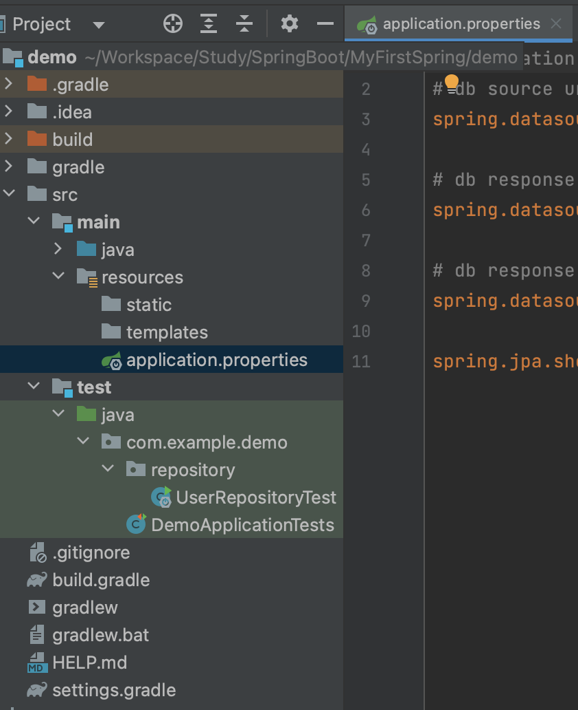

# Introduction

---

SpringBoot의 JPA에 대한 두 번째 포스트로 Repository에 대하여 알아본다.


# Repository

---

ORM 클래스를 이용하여 ***sql 문을 사용하지 않고도 RDB 데이터의 CRUD 작업을 수행***하게 해주는 기능(annotation)


## 생성 방법

1. 인터페이스 생성, `@Repository` annotation
   - 보통 Repository 인터페이스 명은 entity 명 + Repository으로 설정한다.
2. Repository 인터페이스에 `JpaRepository<Entity의 타입 , PK의 타입>`를 상속받으면 끝
   - 아래와 같이 빈 상태로 인터페이스를 생성하여도 RDB 테이블에 데이터를 add하거나 select하는 기능을 사용할 수 있다.

```java
package com.example.demo.repository;

import com.example.demo.model.User;
import org.springframework.data.jpa.repository.JpaRepository;
import org.springframework.stereotype.Repository;

@Repository
public interface UserRepository extends JpaRepository<User, Long> {
}

```


## 테스트 

Spring 프로젝트가 만들어질 때, 자동으로 test 폴더가 상위에 생성되는데 개발 중의 테스트는 이 test 폴더에서 진행한다.

- test 폴더 내에는 main 소스들을 테스트할 수 있는 패키지가 이미 생성되어있음.

**


아래 예시 코드는 Repository를 이용하여 CRUD 중 create()의 테스트 코드이다.

```java
package com.example.study.repository;

import com.example.study.StudyApplication;
import com.example.study.model.entity.User;
import org.junit.jupiter.api.Test;
import org.springframework.beans.factory.annotation.Autowired;

import java.time.LocalDateTime;

public class UserRepositoryTest extends StudyApplication {

    
    @Autowired // Dependency Injection (DI)
    private UserRepository userRepository;

    @Test // Test코드에는 반드시 @Test annotation 필요
    public void create(){
        // String sql = insert into user (%s, %s, %d) value (account, email, age);
        User user = new User();
				// user.setId(); id는 AutoIncrement라서 set할 필요 없음

        user.setAccount("TestUser01");
        user.setEmail("TestUser01@gmail.com");
        user.setPhoneNumber("010-1111-1111");
        user.setCreatedAt(LocalDateTime.now());
        user.setCreatedBy("admin");

        User newUser = userRepository.save(user); // entity 객체를 인자로 받아 DB에 저장하고 DB에 저장된 새로운 entity 객체를 리턴해준다
        System.out.println("newUser : "+newUser);
    }

    public void read(){

    }

    public void update(){

    }

    public void delete(){

    }
}
```

### @`Autowired`

- spring의 대표적 장점인 디자인 패턴인 Dependency injection(DI, 의존성 주입)을 위한 annotation
- 개발자가 직접 객체를 만들지 않아도 스프링이 직접 객체를 관리해주고 의존성 주입을 해준다
- DI의 기본 핵심은 singleton에 의한 관리 
  - private UserRepository userRepository = new UserRepository(); 할 필요 없이 해당 application 실행될때, spring에서 자동으로 @Autowired를 찾아서 의존성 주입


### Save

save 함수는 저장할 entity 객체를 받고, DB에 저장된 새로운 entity 객체를 리턴해준다


위와 같이 repository를 사용 또는 테스트하기 위해서는 MySQL과 같은 db에 연결이 되어있어야 한다.

spring boot 프로젝트에 MySQL을 연결시키기 위해서는 아래 경로의 application.properties 또는 application.yaml 파일을 따로 생성하여 이용한다.

**


application.yaml 파일 또는 application.properties에는 아래와 같은 설정이 필요하다.

```yaml
# application.yaml
spring:
  jpa:
    show-sql: true
  datasource:
    url: jdbc:mysql://localhost:3306/study?useSSL=false&useUnicode=true&serverTimezone=Asia/Seoul&allowPublicKeyRetrieval=true&createDatabaseIfNotExist=true # 새로 추가된 옵션 schema 가 없는 경우 생성
    username: root
    password: wprkffid12
    driver-class-name: com.mysql.cj.jdbc.Driver
logging:
  level:
    root: info
    com.zaxxer.hikari.HikariConfig: debug
    org.hibernate.SQL: debug
    hibernate.type.descriptor.sql.BasicBinder: trace
```

```yaml
# application.properties
# db source url
spring.datasource.url=jdbc:mysql://localhost:3306/study?useSSL=false&useUnicode=true&serverTimezone=Asia/Seoul&allowPublicKeyRetrieval=true

# db response name
spring.datasource.username=root

# db response password
spring.datasource.password=wprkffid12

spring.jpa.show-sql=true
```

- show-sql=true 설정으로 Hibernate 기능을 활성화하여 로그 상에서 실제 수행된 쿼리문을 출력 가능


# Conclusion

---

JPA의 첫 번째 단계로 설치와 Entity에 대하여 알아보았다.

Spring boot의 ORM 사용 방법에 대한 것을 다루기 때문에 서버에서 DB를 다루는 작업을 진행하기 위해서 필수로 알고 넘어가야 한다.


# Reference

---

Fastcampus 스프링 부트 프로젝트(어드민 페이지 만들기) 강의 - 예상국 강사님

Fastcampus 스프링 부트 프로젝트 강의(지인 정보 관리 시스템 만들기) - 강현호 강사님
