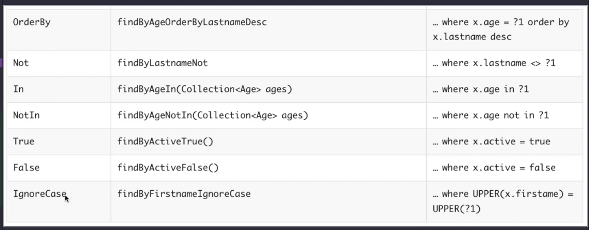

# Introduction

---

SpringBoot의 JPA에 대한 네 번째 포스트로 Query method에 대하여 알아본다.


# Query method

---

`Query method`는 문자 그대로 Repository에서 생성 가능한 ***쿼리를 수행할 수 있는 함수를*** 의미한다.

저번 포스트에서 Repository를 이용한 CRUD 구현에서 read 파트를 아래와 같이 구현하였었다.

이때, repository에서 findByAll, findById 메서드를 이용하여 DB 데이터를 read하였는데 이와 같은 함수들을 쿼리 메서드라고 한다.

- findByAll, findById 등의 쿼리 메서드를 호출하면 내부적으로 쿼리가 수행되며 메서드의 리턴으로 쿼리의 결과물이 반환된다.

- Id를 이용하여 데이터를 read한 findById와 비슷하게 다른 column을 이용해서도 쿼리 메서드를 작성하고 사용할 수 있다.

```java
@Test
public void read(){
    Optional<User> user = userRepository.findById(2L); // 쿼리 메서드
		
    user.ifPresent(selectUser -> {
        System.out.println("user: " + selectUser);
        System.out.println("email: " + selectUser.getEmail());
    });
}
```


쿼리 메서드는 아래와 같이 Repository에서 작성 가능하다.

아래 코드는 User entity의 account, email 데이터를 이용하여 쿼리 메서드 findByAccount, findByEmail, findByAccountAndEmail를 작성한 예이다. 해당 쿼리 메서드를 실행하면 어떤 쿼리문이 수행되는 지를 코드 상 주석으로 나타내었다.

- `findByAccount`: 인자로 받은 account와 매칭되는 row 리턴
- `findByEmail`: 인자로 받은 email과 매칭되는 row 리턴
- `findByAccountAndEmail`: 인자로 받은 account, email과 매칭되는 row 리턴

```java
package com.example.study.repository;
import com.example.study.model.entity.User;
import org.springframework.data.jpa.repository.JpaRepository;
import org.springframework.stereotype.Repository;

import java.util.Optional;

@Repository
public interface UserRepository extends JpaRepository<User,Long>{

    // select * from user where account = ?
    Optional<User> findByAccount(String account);
		
	  // select * from user where email = ?
    Optional<User> findByEmail(String email);

    // select * from user where account = ? and email = ?
    Optional<User> findByAccountAndEmail(String a, String e);
}
```

위 예시 쿼리 메서드를 보면 메서드의 정의만 하고 있는데 ***메서드의 정의만 해도 JPA에서 내부적으로 쿼리 메서드를 자동으로 생성*** 해준다.

쿼리 메서드의 형식을 보면 `findBy{column명}And{colmun명}` 식의 패턴으로 되어있는 것이 보이는데 메서드 명과 매칭되는 쿼리 문은 아래와 같다.

- `find`: select
- `By`: where
- `And`: and

JPA에서는 메서드 이름의 `find`만 보고 query의 select문이라는 것을 추측하고 그 다음 오는 인자(Account)와 db의 컬럼(account)을 매칭한다

- 이때, `And`를 사용하면 여러 컬럼을 이용한 쿼리 메서드를 작성할 수 있다.

 쿼리 메소드의 인자는 꼭 함수명을 따라갈 필요가 없고 정의한 순서만 지키면 된다

- 위 예시에서 findByAccountAndEmail의 인자를 account, email로 하지 않고 a, e로 해도 동작함


아래는 쿼리 메서드에 사용할 수 있는 키워드들과 해당 키워드를 이용하여 만들 수 있는 쿼리 메서드의 예시들이다.





## @Query

JPQL을 이용하여 쿼리 메서드에 수동으로 쿼리 문을 매핑해주는 annotation.

> `JPQL`: entity 기반의 쿼리 문으로 entity 객체를 사용하여 쿼리 문을 작성할 수 있다.

```java
public interface PersonRepository extends JpaRepository<Person, Long> {

    List<Person> findByMonthOfBirthday(int monthOfBirthday);
}
```

위 예시 쿼리 메서드는 아래의 Person entity를 이용한 메서드이다.

쿼리 메서드를 보면 Person의 MonthOfBirthday를 이용한 쿼리가 수행되어야 하는데 Person entity에는 MonthOfBirthday가 없기 때문에 쿼리 메서드가 정상적으로 실행될 수 없다. (MonthOfBirthday는 Person entity의 birthday dto안에 있다.,)

- 위 예시와 같이 쿼리 메서드만으로는 원하는 쿼리 문을 작성할 수 없을 때 `@Query`를 사용하여 해결할 수 있다.

```java
@Entity
@AllArgsConstructor
@NoArgsConstructor
@RequiredArgsConstructor
@Data
public class Person {

    ...

    @Embedded  // entity에 속해있는 dto 클래스라는 의미의 annotation
    private Birthday birthday;

		...
}
```

```java
@Embeddable  	// entity에 속해있는 dto 클래스라는 의미의 annotation
@AllArgsConstructor
@NoArgsConstructor
public class Birthday {

    private int yearOfBirthday;
    private int monthOfBirthday;
    private int dayOfBirthday;
}
```


아래 예시는 `@Query`를 이용하여 해당 쿼리 메서드가 어떤 쿼리 문을 사용할 지를 매핑해주고 있다. value에 `jpql` 쿼리 문이 들어간다.

```java
public interface PersonRepository extends JpaRepository<Person, Long> {

  	@Query(value = "select person from Person person where person.birthday.monthOfBirthday = ?1")    
    List<Person> findByMonthOfBirthday(int monthOfBirthday);
}

```

위 jpql쿼리문을 보면 ***from 절에서 테이블이 아닌 entity***를 불러오고 있으며 ***where 절에서 객체의 멤버 변수에 접근***하듯이 필터링할 데이터에 접근하고 있는 것을 확인할 수 있다.

위 jpql은 Person entity에 속해있는 birthday dto의 monthOfBirthday가 쿼리 메서드의 첫 번째 인자와 매칭되는 데이터를 select하는 쿼리 문이다.

- `?1` → 메서드의 첫 번째 인자라는 의미


아래 예시 코드로 @Query의 아래 세 가지 특징에 대하여 알아보자.

1. ?1 ?2 등 을 이용하면 ***인자의 순서대로 쿼리 파라미터***를 넣을 수 있음
2. `@Param`: 쿼리 문의 변수 명과 파라미터 이름을 매핑
3. `nativeQuery`: value에 jpql 대신 native query로 변경하여 쿼리 문 작성 가능

```java
public interface PersonRepository extends JpaRepository<Person, Long> {

    @Query(value = "select person from Person person where person.birthday.monthOfBirthday = ?1 and person.birthday.dayOfBirthday = ?2") // ?1 ?2 등을 이용하여 여러 파라미터 사용
    List<Person> findByMonthOfBirthday(int monthOfBirthday, int dayOfBirthday);

    @Query(value = "select person from Person person where person.birthday.monthOfBirthday = :monthOfBirthday and person.birthday.dayOfBirthday = :dayOfBirthday")
    List<Person> findByMonthOfBirthday(@Param("monthOfBirthday") int month, @Param("dayOfBirthday") int day); // @Param을 이용하여 파라미터의 이름 매핑
    
    @Query(value = "select * from person where month_of_birthday = :monthOfBirthday and day_of_birthday = :dayOfBirthday", nativeQuery = true) // nativeQuery를 이용하여 native 쿼리 문 사용
    List<Person> findByMonthOfBirthday(@Param("monthOfBirthday") int month, @Param("dayOfBirthday") int day);

}
```


# Conclusion

---

Repository의 주요 기능인 쿼리 메서드에 대하여 알아보고 @Query annotation을 사용하여 쿼리 메서드를 좀 더 유연하게 사용할 수 있는 방법을 알아보았다.

# Reference

---

Fastcampus 스프링 부트 프로젝트(어드민 페이지 만들기) 강의 - 예상국 강사님

Fastcampus 스프링 부트 프로젝트 강의(지인 정보 관리 시스템 만들기) - 강현호 강사님
