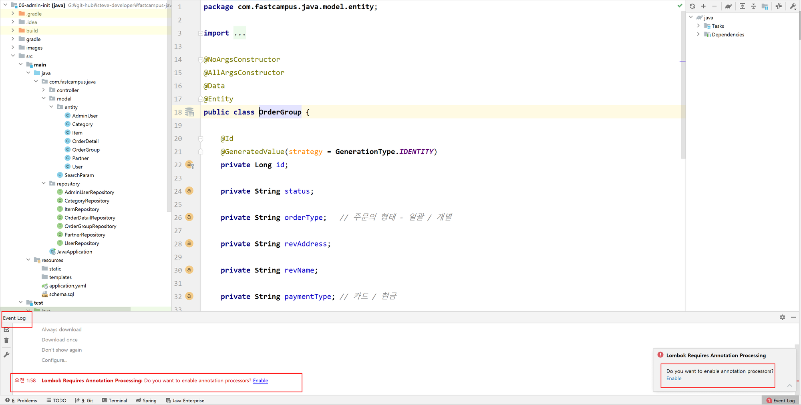

# Introduction

---

SpringBoot의 Plugin인 Lombok에 대하여 알아본다.


# Lombok

---

생성자, getter, setter 등 model class의 기본적인 설정들을 annotation(@Data)으로 간단히 설정할 수 있는 플러그인

`Annotation Processor` 를 이용하여 Lombok의 annotation들을 자동으로 코드를 만들어준다.

클래스를 훨씬 간단하고 짧게 구현 가능하다는 장점이 있다.


1. Lombok 적용 전

```java
package com.example.demo.model;


public class SearchParam {
    private String account;
    private String email;

    public String getAccount() {
        return account;
    }

    public void setAccount(String account) {
        this.account = account;
    }

    public String getEmail() {
        return email;
    }

    public void setEmail(String email) {
        this.email = email;
    }

    public int getPage() {
        return page;
    }

    public void setPage(int page) {
        this.page = page;
    }

    private int page;
}

```


2. Lombok 적용 후

```java
package com.example.demo.model;

import lombok.Data;

@Data
public class SearchParam {
    private String account;
    private String email;
    private int page;
}

```


## Lombok 설치

아래와 같이 IntelliJ에서 IntelliJ IDEA -> Preferences -> Plugins 탭으로 들어간 후. Lombok을 검색하여 설치

**


설치가 끝나도 Lombok을 바로 사용할 수 없는데 IntelliJ에는 Lombok library가 설치되었어도 gradle에는 lombok을 추가해놓지 않았기 때문에 아직 사용할 수 없다.

Lombok 사용을 위해서는 아래와 같은 추가 설정이 필요하다

### 1. Lombok annotation processing 설정

- window : File -> settings -> build, Execution, Deployment -> Compiler > Annotation Processors -> Enable annotation processing 체크 
- macOS : IntelliJ IDEA -> Preferences -> build, Execution, Deployment -> Compiler > Annotation Processors -> Enable annotation processing 체크


또는 아래처럼 프로젝트 진행시에 오른쪽 하단 경고 창을 통해서 설정 할 수 있다.




* Enable annotation prossing 설정을 하지 않으면 아래와 같이 `cannot find `symbol` 에러가 날 수 있다.

```java
error: cannot find symbol
        Posts.builder().title(title).content(content).author("user@example.com").build();
             ^
  symbol:   method builder()
  location: class org.example.domain.posts.Posts
```


### 2. build.gradle의 dependency 추가 필요

```yaml
dependencies {
	...
	compileOnly 'org.projectlombok:lombok'
	annotationProcessor 'org.projectlombok:lombok'
	...
}
```


### 3. Reload gradle

**


## Lombok의 각 기능


### @Getter/@Setter

Lombok을 사용해서 멤버 변수들의 getter setter 자동 생성

멤버 변수 별로 생성할 수도 있고 한꺼번에 생성할 수도 있다.

1) 모든 멤버 변수에 생성

```java
import lombok.Getter;
import lombok.Setter;

@Getter
@Setter
public class SearchParam {
    private String account;
    private String email;
    private int page;
}

```

2) 멤버 변수 별로 생성

```java
package com.example.demo.model;

import lombok.Data;
import lombok.Getter;
import lombok.Setter;


public class SearchParam {
    @Getter
    @Setter
    private String account;
    @Getter
    @Setter
    private String email;
    private int page;
}

```


### @ToString

기본 object method가 아닌 일반적으로 사용하는 방식의 toString()으로 자동으로 오버라딩 해줌

가령 위의 SearchParam클래스에 @ToString을 적용하고 toString 호출 시 "SearchParam(account=null, email=null, page=0)"의 형태로 출력됨

exclude를 통해 toString에서 제외할 변수도 지정가능

- 해당 변수 위에 @ToString.Exclude로 가능

```java
@Entity
@Getter
@Setter
@ToString
public class Person {
    @Id
    @GeneratedValue
    private Long id;

    private String name;

    private int age;

    private String hobby;

    private String bloodType;

    private String address;

    private LocalDate birthday;

    private String job;

    @ToString.Exclude					// toString 호출 시 phoneNumber에 대한 정보는 제외
    private String phoneNumber;
}
```


### @RequiredArgsConstructor/@AllArgsConstructor/@NoArgsConstructor

생성자를 자동으로 생성해주는 annotation


`@RequiredArgsConstructor`: `final` 혹은 `@NotNull` 이 추가된 멤버 변수에 대한 생성자 자동 생성

`@AllArgsConstructor`: 모든 멤버 변수를 초기화하는 생성자 자동 생성

`@NoArgsConstructor`: 디폴트 생성자 자동 생성

```java
package com.example.demo.model;

import lombok.*;

@RequiredArgsConstructor
@AllArgsConstructor
@NoArgsConstructor
@Setter
public class SearchParam {
  
    private String account;
  
    @NonNull
    private String email; // @RequiredArgsConstructor로 인해 email을 초기화 하는 생성자 자동 생성
  
    private int page;
}

```


###  @EqualsAndHashCode

hashCode() 메서드를 오버라이딩 하여 같은 멤버 변수를 같은 객체는 같은 hashCode를 갖도록 설정

```java
void hashCodeAndEquals(){
    Person person1 = new Person("martin",10);
    Person person2 = new Person("martin",10);

    System.out.println(person1.equals(person2)); // hashCode()를 오버라이딩 하지 않으면 False
    System.out.println(person1.hashCode());
    System.out.println(person2.hashCode());

    Map<Person, Integer> map = new HashMap<>();
    map.put(person1, person2.getAge());

    System.out.println(map);
    System.out.println(map.get(person2));

}
```

- 위 예에서 person1, person2는 같은 값의 멤버 변수를 가지는 객체들 이지만 hashcode가 서로 다르다
- 가령, db에서 1분전에 가져온 person과 지금 가져온 person도 서로 다른 hashcode를 가진다
  - db 데이터를 조작해서 사용하려면 같은 데이터에 대해서는 같은 hashcode를 갖게 해야함
- hashcode method를 직접 overriding할 필요 없이 lombok에서 제공하는 annotation 사용


### @Data

@Getter, @Setter, @ToString, @EqualsAndHashCode 등의 기능들이 모여 있는 annotation

@Data 하나만 설정해도 위의 기능들을 모두 사용 가능하다.

1) @Data를 사용하지 않은 경우

```java
import lombok.*;


@AllArgsConstructor
@NoArgsConstructor
@RequiredArgsConstructor
@Setter
@Getter
@EqualsAndHashCode
public class SearchParam {
    private String account;
    private String email;
    private int page;
}
```

2. @Data를 사용한 경우

```java
import lombok.Data;

@Data
public class SearchParam {
    private String account;
    private String email;
    private int page;
}


```


### @Builder

`@AllArgsConstructor`등 을 이용하여 자동으로 생성된 생성자는 매개 변수를 넣을 때 멤버 변수가 생성된 순서대로 인자를 넣어야한다. 또한 일부 멤버 변수만 사용하는 생성자를 사용하려면 `@RequiredArgsConstructor`를 이용 하던가 클래스에 원하는 생성자를 따로 만들어야 하는 불편함이 있다.

@Builder를 사용하면 ***생성자를 만들지 않아도 자유롭게 어떤 형태의 생성자도 호출 가능***해지기 때문에 위의 불편함을 개선할 수 있다.

```java
@AllArgsConstructor
@NoArgsConstructor
@Entity
@Builder // builder 패턴의 생성자 사용
public class User {

    @Id
    @GeneratedValue(strategy = GenerationType.IDENTITY)
    private Long id;

    private String account;

    private String phoneNumber;
    

}
```


아래 테스트 코드를 통해 기존 방식과 @Builder 방식의 생성자 호출의 차이점을 살펴보자.

User 엔티티 클래스를 보면 @AllArgsConstructor, @NoArgsConstructor이 사용되었기 때문에 ***기존 생성자 호출 방식으로는 모든 인자를 사용하는 생성자와 기본 생성자를 사용***할 수 있다.

이때, ***@Builder를 사용하면 어떤 인자를 사용하던 모든 경우의 생성자를 호출***할 수 있으며 멤버 변수나 인자의 순서와 상관 없이 생성자를 호출 할 수 있다. (즉, `builder().account().phoneNumber().build()`나` builder().phoneNumber().account().build()` 모두 사용 가능하다.

```java
@Test
public void create(){
    User user = new User(1L, "TestUser01", "TestUser01"); // @AllArgsConstructor로 생성된 생성자를 이용

    User user2 = new User(); // @NoArgsConstructor로 생성된 생성자를 이용
    user2.setAccount("TestUser01");
    user2.setPhoneNumber("010-1111-1111");

    User user3 = User.builder() // @Builder를 이용하여 생성자 호출
            .account("TestUser01")
            .phoneNumber("010-1111-1111")
            .build();


    User user4 = new User(1L, "TestUser01"); // Error!, Id, phoneNumber만 사용하는 생성자가 없음

    User user5 = User.builder() // @Builder를 이용하면 추가적인 작업 없이 어떤 생성자도 호출 가능
            .phoneNumber("010-1111-1111")
            .build();

    User user6 = User.builder() // @Builder를 이용하면 인자의 순서와 상관없이 자유롭게 생성자 호출 가능
            .phoneNumber("010-1111-1111")
            .account("TestUser01")
            .build();

}
```


### @Accessors

setter를 연쇄적(chain)으로 호출할 수 있는 기능, 아래와 같이 `@Accessors(chain = true)`을 명시하여 사용한다.

```java
@Data
@AllArgsConstructor
@NoArgsConstructor
@Entity
@Builder
@Accessors(chain = true)
public class User {

    @Id
    @GeneratedValue(strategy = GenerationType.IDENTITY)
    private Long id;

    private String account;

    private String phoneNumber;

}
```


아래 예시 코드를 보면 user2를 생성할 때 setAccount, setPhoneNumber를 연쇄적으로 호출한 것을 볼 수 있다.

```java
@Test
public void create(){
    User user = new User(); // @Accessors를 이용하지 않으면 원하는 setter를 각각 호출해야 함
    user.setAccount("TestUser01");
    user.setPhoneNumber("010-1111-1111");

    User user2 = new User().setAccount("TestUser01").setPhoneNumber("010-1111-1111"); // @Accessors를 이용한 setter 연속 호출

}
```


# Conclusion

---

Lombok에 대하여 다뤄보았다. 

Spring boot에서 entity model class를 생성할 때 유용하게 사용할 수 있을 것 같다.

python의 @dataclass의 기능과 유사하던데 dataclass보다는 좀 더 사용성이 좋아보인다.


# Reference

---

Fastcampus 스프링 부트 프로젝트(어드민 페이지 만들기) 강의 - 예상국 강사님

Fastcampus 스프링 부트 프로젝트 강의(지인 정보 관리 시스템 만들기) - 강현호 강사님
