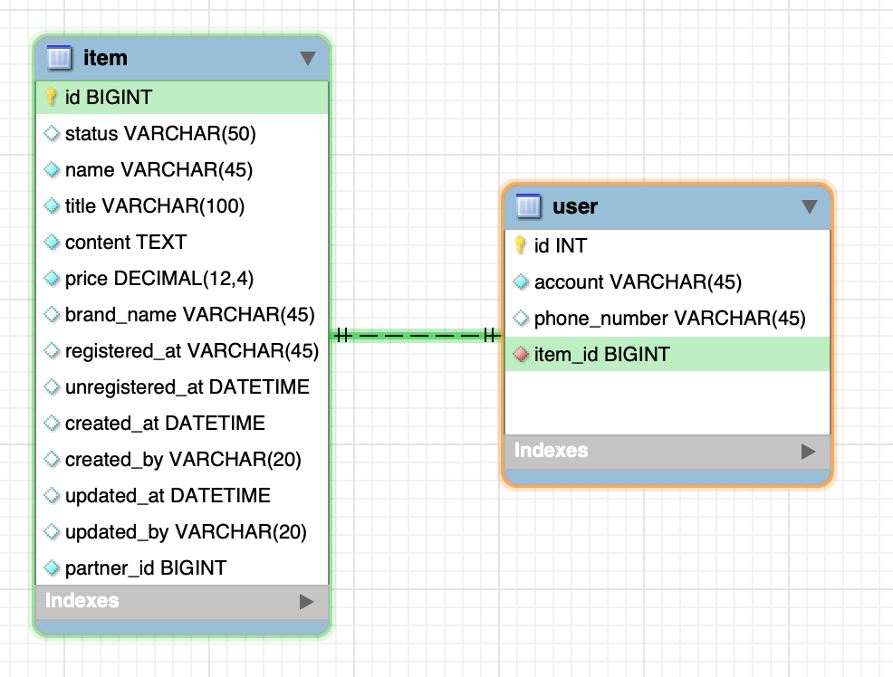
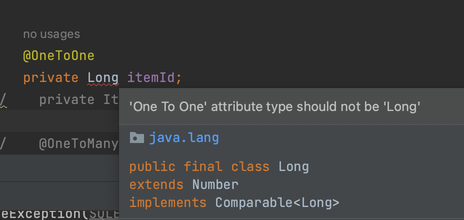
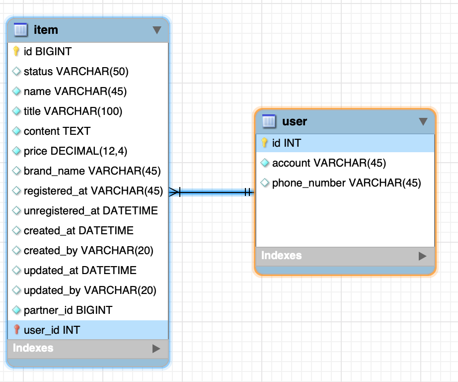
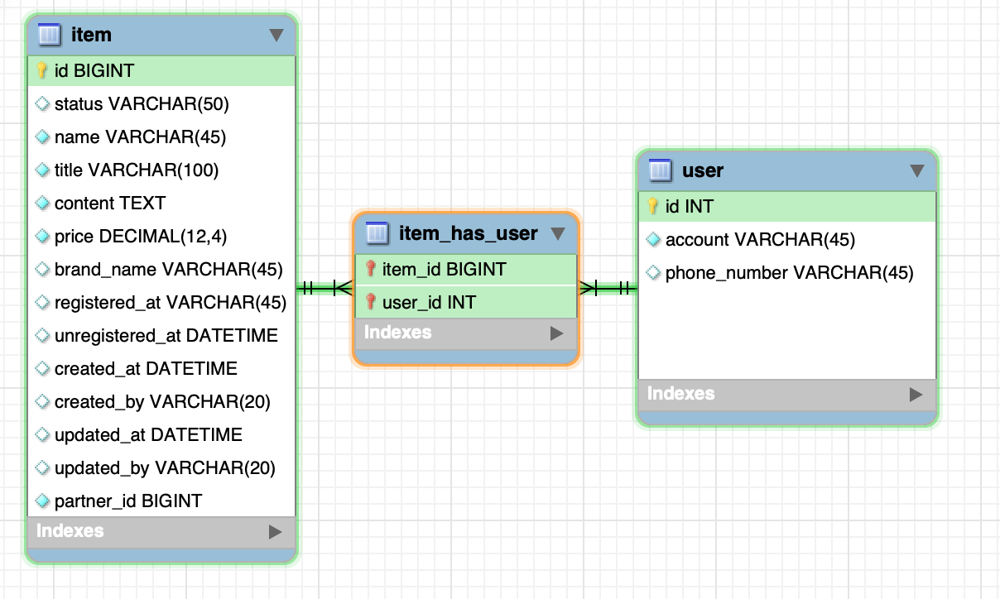
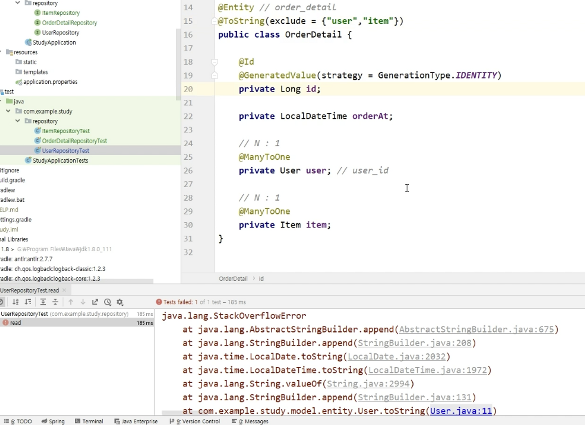

# Introduction

---

SpringBoot의 JPA에 대한 다섯 번째 포스트로 Relation에 대하여 알아본다.


# JPA Relation(연관 관계)

---

JPA의 relation이란 서로 연관되어 있는 엔티티들 사이의 관계를 설정하는 것을 의미하는데 spring 개발에서 연관 관계는 Annotation을 통해 설정이 가능하다.

이때, 연관되어있다는 의미는 DB의 외래 키(FK, Foreign Key)를 이용하여 테이블 데이터를 참조할 수 있는 것을 말한다. 

연관 관계는 크게 네 가지로 나뉘는데 각각은 아래와 같다 (N, M은 하나가 아닌 여러 개를 의미한다.)

| 연관 관계 | Annotation  |
| --------- | ----------- |
| 1:1       | @OneToOne   |
| 1:N       | @OneToMany  |
| N:1       | @ManyToOne  |
| N:M       | @ManyToMany |


### @OneToOne(1:1 관계)

가령 아래와 같이 user 테이블과 item 테이블이 존재할 때, ***user 테이블에 item에 대한 FK를 생성하면 user가 item을 1:1 관계로 참조**할 수 있다.


아래는 user와 item의 1:1 관계를 생성한 후의 다이어그램인데 user 테이블 안에 item_id FK가 생성되어 item 테이블의 id과 이어져 있는 것을 확인할 수 있다.




코드 상으로는 아래와 같이 나타낼 수 있다.

@OneToOne을 이용하여 관계를 설정할 엔티티 객체를 선언하면 자동으로 해당 엔티티에 대한 FK설정까지 추가된다.

```java
@Data
@AllArgsConstructor
@NoArgsConstructor
@Entity
@Table(name = "user") // Table이름과 class이름이 동일하다면 @Table은 생략 가능
public class User {

    @Id
    @GeneratedValue(strategy = GenerationType.IDENTITY)
    private Long id;

    private String account;

    private String phoneNumber;

    @OneToOne
    private Item item;
//    private Long itemId; // Error!
}
```

Hibernate를 통해 sql 로그를 보면 item_id가 FK로 자동 생성 되어있음을 확인할 수 있다.

```java
Hibernate: create table user (id bigint not null auto_increment, account varchar(255), phone_number varchar(255), item_id bigint, primary key (id)) engine=InnoDB
Hibernate: alter table user add constraint FKnuk4vqge6jye5k5005kjnnyl5 foreign key (item_id) references item (id)
```


이때, 엔티티 객체가 아니라 FK와 매칭되는 `private Long itemId` 로 선언해야 하는 것이 아닌지 헷갈릴 수 있는데 만약 정수 형으로 Id를 선언한 경우에는 아래와 같은 에러가 난다.

- 어노테이션을 이용한 JPA 연관 관계 생성은 엔티티 객체를 이용해야 한다.




### @OneToMany, @ManyToOne(1:N, N:1 관계)

가령 user가 여러 item을 포함하고 있는 형태라면 user와 item을 1:N의 관계로 설정할 수 있다.

이때, user는 여러 item과 연관되어 있어야 하기 때문에 user가 하나의 item_id를 가질 수는 없다. 따라서 N에 해당하는 item이 user에 대한 FK를 가지고 있어야 user, item의 1:N 관계가 성립된다. (1:N의 관계에서 연관 관계의 주인은 항상 N에 있다.)



코드 상으로는 아래와 같이 나타낼 수 있다.

```java
@Data
@Entity
public class Item {

    @Id
    @GeneratedValue(strategy = GenerationType.IDENTITY)
    private Long id;

		...
    @ManyToOne
    private User user;

}

```

Hibernate 로그를 보면 user_id FK가 자동 생성됨을 확인 가능하다.

```java
Hibernate: create table item (id bigint not null auto_increment, status varchar(255), user_id bigint, primary key (id)) engine=InnoDB
Hibernate: alter table item add constraint FKj4836srmp2v7x324wkxwnnk47 foreign key (user_id) references user (id)
```


만약 User 엔티티에서도 @OneToMany 관계를 생성하여 Item을 참조할 수 있게 하려면 아래와 같이 관계 생성이 가능하다.

```java
@Data
@AllArgsConstructor
@NoArgsConstructor
@Entity
public class User {

    @Id
    @GeneratedValue(strategy = GenerationType.IDENTITY)
    private Long id;

   	...
    @OneToMany
    private List<Item> ItemList;

}
```

이때, Hibernate 로그를 보면 이상한 점이 있는데 item, user에 대한 FK를 가지고 있는 `user_item_list` 테이블이 자동 생성 된다.

```java
Hibernate: create table user_item_list (user_id bigint not null, item_list_id bigint not null) engine=InnoDB
 Hibernate: alter table user_item_list add constraint FK8uayqb06imqh50ukh7qt4dxux foreign key (item_list_id) references item (id) 
 Hibernate: alter table user_item_list add constraint FKrule99lvscmtsu2sqwy7i2ss foreign key (user_id) references user (id)
```


@OneToMany를 이용하여 관계 매핑 할 때는 `@JoinColumn`을 명시하지 않으면 테이블 간의 연관 관계를 관리하는 중간 테이블이 생성된다 -> `조인 테이블(JoinTable)` 전략

> ***조인 테이블***
>
> @JoinColumn 어노테이션이 없을 경우에 One에 해당하는 엔티티와 Many에 해당하는 엔티티를 연결하기 위한 매핑 테이블이 생성된다. One 엔티티를 이용하여 Many 엔티티의 업데이트나 삭제 시 매핑된 엔티티들에 전부 반영된다. 조인 테이블 전략은 @OneToMany 어노테이션에만 적용되며 @ManyToOne에서는 @JoinColumn을 선언하지 않아도 조인 테이블이 생성되지 않는다. 

[^]: 출처 - https://incheol-jung.gitbook.io/docs/study/jpa/6


이러한 중간 테이블을 거치지 않게 하기 위해서는 `mappedBy` 인자를 설정하여 엔티티 들을 연결(연관 관계 매핑)시킬 수 있는데, @ManyToOne에서 설정했던 엔티티 객체의 이름을 value로 넣어준다.

- 위 Item 클래스에서 @ManyToOne로 user라는 이름으로 엔티티 객체를 선언하였기 때문에  `@OneToMany(mappedBy = "user")`를 넣어준다.

- 이제  User 엔티티와 Item 엔티티는 user 객체(user_id FK)를 이용하여 연결된다.

```java
@Data
@AllArgsConstructor
@NoArgsConstructor
@Entity
public class User {

    @Id
    @GeneratedValue(strategy = GenerationType.IDENTITY)
    private Long id;

    private String account;

    private String phoneNumber;


    @OneToMany(mappedBy = "user")
    private List<Item> ItemList;

}
```


이때, mappedBy가 아닌 @JoinColumn를 이용해도 연관 관계 매핑이 가능하다.

아래 예는 Item의 user_id를 이용하여 User와 Item의 연관 관계를 설정하는 코드이다.

```java
@Data
@AllArgsConstructor
@NoArgsConstructor
@Entity
public class User {

    @Id
    @GeneratedValue(strategy = GenerationType.IDENTITY)
    private Long id;
		
    ...

//    @OneToMany(mappedBy = "user")
    @OneToMany
    @JoinColumn(name = "user_id") // user_id로 Item과 User를 join
    private List<Item> ItemList;

}
```


### @ManyToMany(N:M 관계)

N:M의 관계에서는 user, item 둘 다 다수의 엔티티를 참조하고 있는 형태기 때문에 각 테이블의 FK를 이용한다고 해서 연관 관계를 설정하기가 어렵다.

이때는 위에서 잠깐 다뤘던 `중간 테이블(JoinTable)`을 만들고 양쪽의 테이블을 참조하는 FK를 생성하여 관계를 생성한다.




코드로 나타내면 아래와 같다.

- OrderDetail를 중간 테이블로 구성하고 @ManyToOne로 User, Item을 연결한다.

- User와 Item에서는 @OneToMany로 OrderDetail와 연관 관계를 설정한다.

```java
@Data
@AllArgsConstructor
@NoArgsConstructor
@Entity
public class User {

    @Id
    @GeneratedValue(strategy = GenerationType.IDENTITY)
    private Long id;

    ...

    @OneToMany(mappedBy = "user")
    private List<OrderDetail> orderDetailList;


}
```

```java
@Data
@AllArgsConstructor
@NoArgsConstructor
@Entity
public class Item {


    @Id
    @GeneratedValue(strategy = GenerationType.IDENTITY)
    private Long id;

    ...

    @OneToMany(mappedBy = "item")
    private List<OrderDetail> orderDetailList;

}

```

```java
@Data
@AllArgsConstructor
@NoArgsConstructor
@Entity
public class OrderDetail {

    @Id
    @GeneratedValue(strategy = GenerationType.IDENTITY)
    private Long id;

    @ManyToOne
    private Item item;

    @ManyToOne
    private User user;
}

```


위처럼 Entity를 설정하고 repository를 이용하여 아래와 같이 테스트를 해보자.

아래 코드는 User 테이블에서 id가 1인 row를 불러오고 해당 row에 연관된 Item 엔티티 객체를 불러오는 테스트 코드이다.

```java
public class UserRepositoryTest extends StudyApplicationTests {
		...
		@Test
		@Transactional
		public void read(){
		    Optional<User> user = userRepository.findById(1L); // User 테이블이 id가 1인 데이터가 있는 상태에서 테스트 진행
		
		    user.ifPresent(selectUser -> {
		        selectUser.getOrderDetailList().stream().forEach(detail -> {
		            Item item = detail.getItem();
		            System.out.println(item);
		        });
		    });
		}
}
```


이때, 위 read test를 하면 `overflow error` 가 발생한다.

- Lombok을 사용하면 toString이 자동으로 설정되는데, 이때 ***order_detail과 user가 상호 참조***를 하기 때문에 서로 toString을 계속 호출하면서 오버플로가 발생한다.
- OrderDetail에서 user, item에 대한 toString method를 제외시켜야 한다 -> `@ToString(exclude = {})` 이용



# Conclusion

---

JPA의 연관 관계 설정에 대하여 다루었다.

이번 포스트에서는 연관 관계에 대한 설명과 스프링 부트 코드로 어떻게 구현하는 지에 대하여 다루었고 다음 포스트에서 연관 관계 설정의 세부적인 옵션들에 대하여 다루겠다.

# Reference

---

Fastcampus 스프링 부트 프로젝트(어드민 페이지 만들기) 강의 - 예상국 강사님

Fastcampus 스프링 부트 프로젝트 강의(지인 정보 관리 시스템 만들기) - 강현호 강사님

https://incheol-jung.gitbook.io/docs/study/jpa/6

