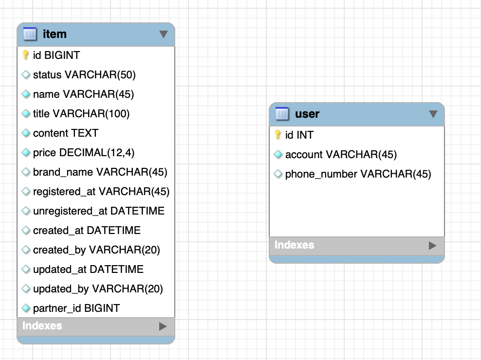

# Introduction

---

SpringBoot의 JPA에 대한 다섯 번째 포스트로 Relation에 대하여 알아본다.


# JPA Relation(연관 관계)

---

JPA의 relation이란 서로 연관되어 있는 엔티티들 사이의 관계를 설정하는 것을 의미하는데 spring 개발에서 연관 관계는 Annotation을 통해 설정이 가능하다.

이때, 연관되어있다는 의미는 DB의 외래 키(FK, Foreign Key)를 이용하여 테이블 데이터를 참조할 수 있는 것을 말한다. 

연관 관계는 크게 네 가지로 나뉘는데 각각은 아래와 같다 (N, M은 하나가 아닌 여러 개를 의미한다.)

| 연관 관계 | Annotation  |
| --------- | ----------- |
| 1:1       | @OneToOne   |
| 1:N       | @OneToMany  |
| N:1       | @ManyToOne  |
| N:M       | @ManyToMany |


### @OneToOne(1:1 관계)

가령 아래와 같이 user 테이블과 item 테이블이 존재할 때, ***user 테이블에 item에 대한 FK를 생성하면 user가 item을 1:1 관계로 참조**할 수 있다.



아래는 user와 item의 1:1 관계를 생성한 후의 다이어그램인데 user 테이블 안에 item_id FK가 생성되어 item 테이블의 id과 이어져 있는 것을 확인할 수 있다.


코드 상으로는 아래와 같이 나타낼 수 있다.

@OneToOne을 이용하여 관계를 설정할 엔티티 객체를 선언하면 자동으로 해당 엔티티에 대한 FK설정까지 추가된다.

```java
@Data
@AllArgsConstructor
@NoArgsConstructor
@Entity
@Table(name = "user") // Table이름과 class이름이 동일하다면 @Table은 생략 가능
public class User {

    @Id
    @GeneratedValue(strategy = GenerationType.IDENTITY)
    private Long id;

    private String account;

    private String phoneNumber;

    @OneToOne
    private Item item;
//    private Long itemId; // Error!
}
```

Hibernate를 통해 sql 로그를 보면 item_id가 FK로 자동 생성 되어있음을 확인할 수 있다.

```java
Hibernate: create table user (id bigint not null auto_increment, account varchar(255), phone_number varchar(255), item_id bigint, primary key (id)) engine=InnoDB
Hibernate: alter table user add constraint FKnuk4vqge6jye5k5005kjnnyl5 foreign key (item_id) references item (id)
```


이때, 엔티티 객체가 아니라 FK와 매칭되는 `private Long itemId` 로 선언해야 하는 것이 아닌지 헷갈릴 수 있는데 만약 정수 형으로 Id를 선언한 경우에는 아래와 같은 에러가 난다.

- 어노테이션을 이용한 JPA 연관 관계 생성은 엔티티 객체를 이용해야 한다.


### @OneToMany, @ManyToOne(1:N, N:1 관계)

가령 user가 여러 item을 포함하고 있는 형태라면 user와 item을 1:N의 관계로 설정할 수 있다.

이때, user는 여러 item과 연관되어 있어야 하기 때문에 user가 하나의 item_id를 가질 수는 없다. 따라서 반대로 item이 user에 대한 FK를 가지고 있어야 user, item의 1:N 관계가 성립된다.


코드 상으로는 아래와 같이 나타낼 수 있다.

```java
@Data
@Entity
public class Item {

    @Id
    @GeneratedValue(strategy = GenerationType.IDENTITY)
    private Long id;

		...
    @ManyToOne
    private User user;

}

```

Hibernate 로그를 보면 user_id FK가 자동 생성됨을 확인 가능하다.

```java
Hibernate: create table item (id bigint not null auto_increment, status varchar(255), user_id bigint, primary key (id)) engine=InnoDB
Hibernate: alter table item add constraint FKj4836srmp2v7x324wkxwnnk47 foreign key (user_id) references user (id)
```


만약 User 엔티티에서도 @OneToMany 관계를 생성하여 Item을 참조할 수 있게 하려면 아래와 같이 관계 생성이 가능하다.

```java
@Data
@AllArgsConstructor
@NoArgsConstructor
@Entity
public class User {

    @Id
    @GeneratedValue(strategy = GenerationType.IDENTITY)
    private Long id;

   	...
    @OneToMany
    private List<Item> ItemList;

}
```

이때, Hibernate 로그를 보면 이상한 점이 있는데 item, user에 대한 FK를 가지고 있는 `user_item_list` 테이블이 자동 생성 된다.

```java
Hibernate: create table user_item_list (user_id bigint not null, item_list_id bigint not null) engine=InnoDB
 Hibernate: alter table user_item_list add constraint FK8uayqb06imqh50ukh7qt4dxux foreign key (item_list_id) references item (id) 
 Hibernate: alter table user_item_list add constraint FKrule99lvscmtsu2sqwy7i2ss foreign key (user_id) references user (id)
```


@OneToMany를 이용하여 관계 매핑 할 때는 `@JoinColumn`을 명시하지 않으면 테이블 간의 연관 관계를 관리하는 중간 테이블이 생성된다 -> `조인 테이블(JoinTable)` 전략

> ***조인 테이블***
>
> @JoinColumn 어노테이션이 없을 경우에 One에 해당하는 엔티티와 Many에 해당하는 엔티티를 연결하기 위한 매핑 테이블이 생성된다. One 엔티티를 이용하여 Many 엔티티의 업데이트나 삭제 시 매핑된 엔티티들에 전부 반영된다. 조인 테이블 전략은 @OneToMany 어노테이션에만 적용되며 @ManyToOne에서는 @JoinColumn을 선언하지 않아도 조인 테이블이 생성되지 않는다. 

[^]: 출처 - https://incheol-jung.gitbook.io/docs/study/jpa/6


이러한 중간 테이블을 거치지 않게 하기 위해서는 `mappedBy` 인자를 설정하여 엔티티 들을 연결시킬 수 있는데, @ManyToOne에서 설정했던 엔티티 객체의 이름을 value로 넣어준다.

- 위 Item 클래스에서 @ManyToOne로 user라는 이름으로 엔티티 객체를 선언하였기 때문에  `@OneToMany(mappedBy = "user")`를 넣어준다.

- 이제  User 엔티티와 Item 엔티티는 user 객체(user_id FK)를 이용하여 연결된다.

```java
@Data
@AllArgsConstructor
@NoArgsConstructor
@Entity
public class User {

    @Id
    @GeneratedValue(strategy = GenerationType.IDENTITY)
    private Long id;

    private String account;

    private String phoneNumber;


    @OneToMany(mappedBy = "user")
    private List<Item> ItemList;

}
```


### @ManyToMany(N:M 관계)

N:M의 관계에서는 user, item 둘 다 다수의 엔티티를 참조하고 있는 형태기 때문에 각 테이블의 FK를 이용한다고 해서 연관 관계를 설정하기가 어렵다.

이때는 아래와 같이 중간 테이블을 만들고 양쪽의 테이블을 참조하는 FK를 생성하여 관계를 생성한다.


쿼리 메서드는 아래와 같이 Repository에서 작성 가능하다.

아래 코드는 User entity의 account, email 데이터를 이용하여 쿼리 메서드 findByAccount, findByEmail, findByAccountAndEmail를 작성한 예이다. 해당 쿼리 메서드를 실행하면 어떤 쿼리문이 수행되는 지를 코드 상 주석으로 나타내었다.

- `findByAccount`: 인자로 받은 account와 매칭되는 row 리턴
- `findByEmail`: 인자로 받은 email과 매칭되는 row 리턴
- `findByAccountAndEmail`: 인자로 받은 account, email과 매칭되는 row 리턴

```java
package com.example.study.repository;
import com.example.study.model.entity.User;
import org.springframework.data.jpa.repository.JpaRepository;
import org.springframework.stereotype.Repository;

import java.util.Optional;

@Repository
public interface UserRepository extends JpaRepository<User,Long>{

    // select * from user where account = ?
    Optional<User> findByAccount(String account);
		
	  // select * from user where email = ?
    Optional<User> findByEmail(String email);

    // select * from user where account = ? and email = ?
    Optional<User> findByAccountAndEmail(String a, String e);
}
```

위 예시 쿼리 메서드를 보면 메서드의 정의만 하고 있는데 ***메서드의 정의만 해도 JPA에서 내부적으로 쿼리 메서드를 자동으로 생성*** 해준다.

쿼리 메서드의 형식을 보면 `findBy{column명}And{colmun명}` 식의 패턴으로 되어있는 것이 보이는데 메서드 명과 매칭되는 쿼리 문은 아래와 같다.

- `find`: select
- `By`: where
- `And`: and

JPA에서는 메서드 이름의 `find`만 보고 query의 select문이라는 것을 추측하고 그 다음 오는 인자(Account)와 db의 컬럼(account)을 매칭한다

- 이때, `And`를 사용하면 여러 컬럼을 이용한 쿼리 메서드를 작성할 수 있다.

 쿼리 메소드의 인자는 꼭 함수명을 따라갈 필요가 없고 정의한 순서만 지키면 된다

- 위 예시에서 findByAccountAndEmail의 인자를 account, email로 하지 않고 a, e로 해도 동작함


아래는 쿼리 메서드에 사용할 수 있는 키워드들과 해당 키워드를 이용하여 만들 수 있는 쿼리 메서드의 예시들이다.


## @Query

jpql을 이용하여 쿼리 메서드에 수동으로 쿼리 문을 매핑해주는 annotation

> `jpql`: entity 기반의 쿼리 문으로 entity 객체를 사용하여 쿼리 문을 작성할 수 있다.

```java
public interface PersonRepository extends JpaRepository<Person, Long> {

    List<Person> findByMonthOfBirthday(int monthOfBirthday);
}
```

위 예시 쿼리 메서드는 아래의 Person entity를 이용한 메서드이다.

쿼리 메서드를 보면 Person의 MonthOfBirthday를 이용한 쿼리가 수행되어야 하는데 Person entity에는 MonthOfBirthday가 없기 때문에 쿼리 메서드가 정상적으로 실행될 수 없다. (MonthOfBirthday는 Person entity의 birthday dto안에 있다.,)

- 위 예시와 같이 쿼리 메서드만으로는 원하는 쿼리 문을 작성할 수 없을 때 `@Query`를 사용하여 해결할 수 있다.

```java
@Entity
@AllArgsConstructor
@NoArgsConstructor
@RequiredArgsConstructor
@Data
public class Person {

    ...

    @Embedded  // entity에 속해있는 dto 클래스라는 의미의 annotation
    private Birthday birthday;

		...
}
```

```java
@Embeddable  	// entity에 속해있는 dto 클래스라는 의미의 annotation
@AllArgsConstructor
@NoArgsConstructor
public class Birthday {

    private int yearOfBirthday;
    private int monthOfBirthday;
    private int dayOfBirthday;
}
```


아래 예시는 `@Query`를 이용하여 해당 쿼리 메서드가 어떤 쿼리 문을 사용할 지를 매핑해주고 있다. value에 `jpql` 쿼리 문이 들어간다.

```java
public interface PersonRepository extends JpaRepository<Person, Long> {

  	@Query(value = "select person from Person person where person.birthday.monthOfBirthday = ?1")    
    List<Person> findByMonthOfBirthday(int monthOfBirthday);
}

```

위 jpql쿼리문을 보면 ***from 절에서 테이블이 아닌 entity***를 불러오고 있으며 ***where 절에서 객체의 멤버 변수에 접근***하듯이 필터링할 데이터에 접근하고 있는 것을 확인할 수 있다.

위 jpql은 Person entity에 속해있는 birthday dto의 monthOfBirthday가 쿼리 메서드의 첫 번째 인자와 매칭되는 데이터를 select하는 쿼리 문이다.

- `?1` → 메서드의 첫 번째 인자라는 의미


아래 예시 코드로 @Query의 아래 세 가지 특징에 대하여 알아보자.

1. ?1 ?2 등 을 이용하면 ***인자의 순서대로 쿼리 파라미터***를 넣을 수 있음
2. `@Param`: 쿼리 문의 변수 명과 파라미터 이름을 매핑
3. `nativeQuery`: value에 jpql 대신 native query로 변경하여 쿼리 문 작성 가능

```java
public interface PersonRepository extends JpaRepository<Person, Long> {

    @Query(value = "select person from Person person where person.birthday.monthOfBirthday = ?1 and person.birthday.dayOfBirthday = ?2") // ?1 ?2 등을 이용하여 여러 파라미터 사용
    List<Person> findByMonthOfBirthday(int monthOfBirthday, int dayOfBirthday);

    @Query(value = "select person from Person person where person.birthday.monthOfBirthday = :monthOfBirthday and person.birthday.dayOfBirthday = :dayOfBirthday")
    List<Person> findByMonthOfBirthday(@Param("monthOfBirthday") int month, @Param("dayOfBirthday") int day); // @Param을 이용하여 파라미터의 이름 매핑
    
    @Query(value = "select * from person where month_of_birthday = :monthOfBirthday and day_of_birthday = :dayOfBirthday", nativeQuery = true) // nativeQuery를 이용하여 native 쿼리 문 사용
    List<Person> findByMonthOfBirthday(@Param("monthOfBirthday") int month, @Param("dayOfBirthday") int day);

}
```


# Conclusion

---

Repository의 주요 기능인 쿼리 메서드에 대하여 알아보고 @Query annotation을 사용하여 쿼리 메서드를 좀 더 유연하게 사용할 수 있는 방법을 알아보았다.

# Reference

---

Fastcampus 스프링 부트 프로젝트(어드민 페이지 만들기) 강의 - 예상국 강사님

Fastcampus 스프링 부트 프로젝트 강의(지인 정보 관리 시스템 만들기) - 강현호 강사님

https://incheol-jung.gitbook.io/docs/study/jpa/6

