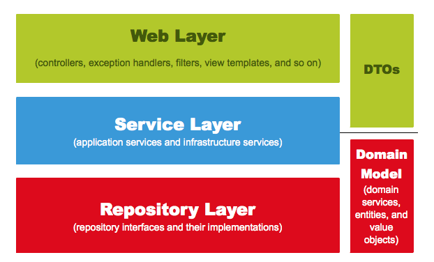

# Introduction

---

SpringBoot 개발의 구조화를 위해 웹 개발의 계층 구조에 대해 알아본다.


# Spring 웹 계층

---



[^]: 출처: 스프링 부트와 AWS로 혼자 구현하는 웹 서비스 - 이동욱님

`Web Layer`

- 컨트롤러(@Controller)와, 뷰 템블릿(JSP/Freemarker 등)으로 이루어진 영역
- 이 외에도 필터, 인터셉터, 컨트롤러 어드바이스 등 외부 요청과 응답에 대한 전반적인 영역

`Service Layer`

- 서비스(@Service) 영역
- Controller와 Dao(Data Access Object)의 중간 영역으로 `@Transactional` 이 사용되는 영역
- transaction, domain 기능의 순서를 보장

> `@Transactional`
>
> 데이터 추가, 갱신, 삭제 등으로 이루어진 작업을 처리하던 중 ***오류가 발생했을 때 모든 작업들을 원상태로 되돌릴 수 있다***. 
>
> 테스트 메서드에 `@Transactional`을 사용하면 트랜잭션으로 감싸지며, ***메서드가 종료될 때 자동으로 해당 트랜잭션이 롤백된다.*** 만약 `WebEnvironment`의 `RANDOM_PORT`, `DEFINED_PORT`를 사용하여 테스트를 진행하면 실제 테스트 서버는 별도의 스레드에서 테스트를 수행하기 때문에 ***트랜잭션이 롤백되지 않는다.***

`Repository Layer`

- DB와 같이 데이터 저장소에 접근하는 영역, Dao(Data Access Object)영역과 동일

`DTOs(Data Transfer Object)`

- 계층 간 데이터 교환을 위한 객체의 영역
- Controller에서 request data를 받는 역할로 많이 사용된다.

`Domain Model`

> Domain: 소프트웨어의 요구 사항이자 개발 대상, 가령 택시 관련 앱에서는 배차, 탑승, 요금이 모두 도메인이 된다.

- 도메인을 모두가 이해하고 공유할 수 있도록 단순화 시킨 모델, @Entity가 사용된 클래스도 도메인 모델이 된다.
- ***비즈니스 로직을 처리하는 영역이 바로 Domain 영역***


이때, 보통 비즈니스 로직을 service 영역에서 처리해야 한다고 생각할 수 있는데 service 영역은 위에서 작성한것 처럼 transaction, domain의 순서를 보장하는 역할만 하지 ***service 영역에서 비즈니스 로직을 처리하지는 않는다. -> 비즈니스 로직은 Domain영역에서 처리***


가령 service 영역에서 비즈니스 로직을 처리한다면 아래와 같은 형식이 된다. 지금은 괜찮아 보일지라도 추후 비즈니스 로직이 더 복잡해지게 되면 아래와 같은 방식의 구현은 코드가 난잡해질 수 있다.

```java
public Order cancelOrder(int orderId){

    // 1) DB로부터 주문정보, 결제정보, 배송 정보 조회
    OrderDto order = orderDao.selectOrders(orderId);
    BillingDto billing = billingDao.selectBilling(orderId);
    DeliveryDto delivery = deliveryDao.selectDelivery(orderId);

    // 2) 배송 취소 여부 확인
    String deliveryStatus = delivery.getStatus();

    // 3) 배송 중이라면 배송 취소
    if("In_PROGRESS".equals(deliveryStatus)){
        delivery.setStatus("CANCEL");
        deliveryDao.update(delivery);
    }

    // 4) 주문, 결제 정보를 취소 상태로 변경
    order.setStatus("CANCEL");
    ordersDao.update(order);
    billing.setStatus("CANCEL");
    deliveryDao.update(billing);

    return order;
}
```


위 코드에서 비즈니스 로직을 도메인 모델에서 처리하도록 바꿀 경우 아래와 같은 코드가 된다.

각 dto 객체들은 내부에서 이벤트 처리를 하고 서비스 메서드는 트랜잭션과 도메인의 순서 만을 보장해주고 있기 때문에 코드가 간결하고 역할이 명확히보인다.

```java
public Order cancelOrder(int orderId){

    // 1) DB로부터 주문정보, 결제정보, 배송 정보 조회
    OrderDto order = ordersRepository.findById(orderId);
    BillingDto billing = billingRepository.findByOrderId(orderId);
    DeliveryDto delivery = deliveryRepository.findByOrderId(orderId);

    // 2) 배송 취소 여부 확인
    // 3) 배송 중이라면 배송 취소
    delivery.cancel();

    // 4) 주문, 결제 정보를 취소 상태로 변경
    order.cancel();
    billing.cancel();

    return order;
}
```


# Conclusion

---

웹 개발의 계층 구조에 대해 알아보았다.

# Reference

---

스프링 부트와 AWS로 혼자 구현하는 웹 서비스 - 이동욱님

https://tecoble.techcourse.co.kr/post/2021-05-25-transactional/
