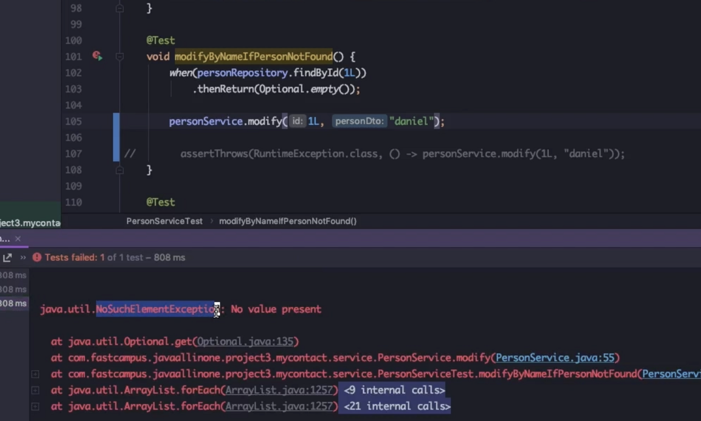
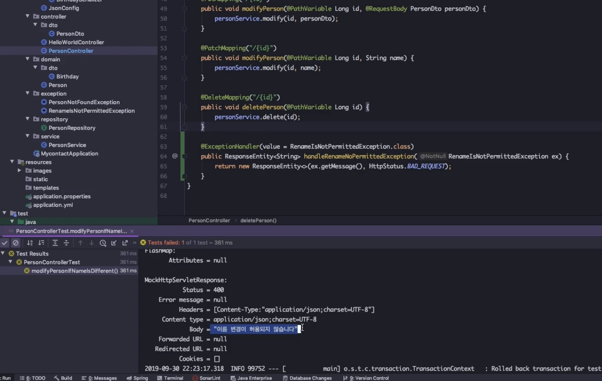
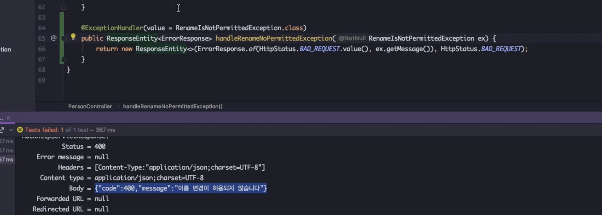
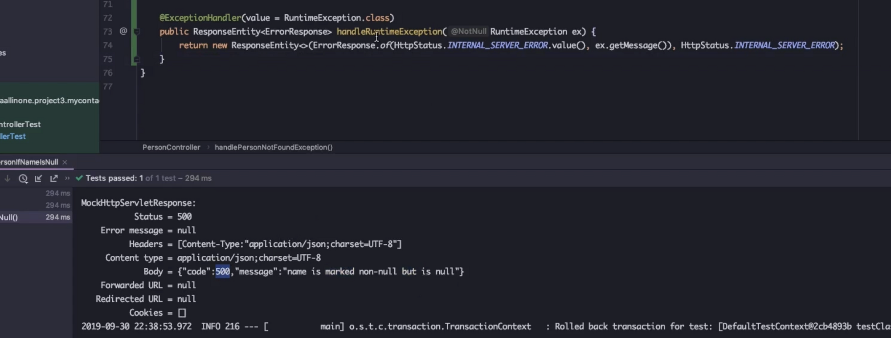

# Introduction

---

SpringBoot 개발에서 Exception처리에 대한 부분을 다룬다.


# Exception

---

Exception은 보통 아래 2가지로 나뉘게 된다.

1. Checked Exception (컴파일 에러)
2. Unchecked Exception (런타임 에러, Runtime Exception)


`RuntimeException`의 하위 클래스들을 `Unchecked Exception` 이라 하고 그 외 Exception 클래스의 하위 클래스들은 `Checked Exception`


Unchecked Exception은 `RuntimeException`의 하위 클래스들이기 때문에 발생할 예외 들에 대해 RuntimeException으로 핸들링을 하면 런타임시 발생하는 에러들에 대해서는 핸들링이 가능하다.

아래 서비스 로직 코드는 의도적으로 런타임 에러를 발생시켰다. 이를 Test 단계에서 검증하기 위해서는 `assertThrows`를 사용한다. 

```java
public class PersonService{
  
    ...
     
    @Transactional
    public void modify(Long id, String name) {
        // Person person = personRepository.findById(id).orElseThrow(() -> new RuntimeException("ID not found"));

        Person person = personRepository.findById(id).get(); // 의도적 에러 발생 (런타임 에러)

        person.setName(name);
        personRepository.save(person);
    }
}
```


아래 테스트 코드에서 `assertThrows`는 modify 메서드를 호출하면 RuntimeException이 발생함을 검증한다.

`assertThrows` 인자에 있는 `personService.modify(1L, "dany")` 를 호출하면 `NoSuchElementsException`가 발생한다.

`NoSuchElementsException`은 `RuntimeException`을 상속받은 exception이기 때문에`assertThrow(RuntimeException.class, () -> personService.modify())` 로도 에러가 핸들링되어 Test가 성공한다.

```java
class PersonServiceTest
{
		...
		@Test
		void modifyByNameIfPersonNotFound(){
		    when(personRepository.findById(1L)).thenReturn(Optional.empty()); // 런타임 에러 발생 (NoSuchElementsException)
				
				// Test success -> RuntimeException는 NoSuchElementsException의 상위 클래스
		    assertThrows(RuntimeException.class, () -> personService.modify(1L, "dany"));
		}
}
```


아래 예시와 같이 `assertThrows`를 호출하지 않고 modify 메서드에서 예외를 발생시키면 아래 로그와 같이 `NoSuchElementsException`에러가 발생함을 알 수 있다.




`RuntimeException`으로 에러를 핸들링하면 어떤 에러가 발생할 지 명확히 알 수 없다는 단점이 있다.

- 개발 중에 예외를 처리할 경우 `custom exception`으로 생성하여 어떤 에러인 지 명확히 정의하는 것이 관리에 효율적이다.

  

아래는 `PersonNotFoundException` custom exception을 생성한 예시 코드이다.

```java
package com.fastcampus.javaallinone.project3.mycontact.exception;
import lombok.extern.slf4j.Slf4j;

@Slf4j
public class PersonNotFoundException extends RuntimeException{
    public PersonNotFoundException(String message){
        super();
        log.error(message);
    }
}
```

```java
public class PersonService{

		...
		@Transactional
		public void modify(Long id, String name) {
		    Person person = personRepository.findById(id).orElseThrow(() -> new PersonNotFoundException("ID not found")); // custom exception 발생
		
		    person.setName(name);
		
		    personRepository.save(person);
		}
}
```


위와 같이 `custom exception` 처리를 한 후에 동일한 테스트를 진행하면 이제 `PersonNotFoundException`클래스로 예외를 처리할 수 있음을 확인할 수 있다.

- 이때 `PersonNotFoundException` 역시 `RuntimeException`을 상속 받은 클래스이기 때문에 `RuntimeException`로도 여전히 예외 처리가 가능하다.

```java
class PersonServiceTest
{
		...
		@Test
		void modifyByNameIfPersonNotFound(){
		    when(personRepository.findById(1L))
		            .thenReturn(Optional.empty());
      
      	// Test success -> 어떤 에러인지 명확히 알 수 있음
				assertThrows(PersonNotFoundException.class, () -> personService.modify(1L, "dany"));
				
				// Test success -> RuntimeException는 PersonNotFoundException의 상위 클래스
		    assertThrows(RuntimeException.class, () -> personService.modify(1L, "dany"));

		}
}
```


아래는 정적 final 변수로 예외 메세지를 고정하여 예외 클래스를 생성하는 예시 코드이다.

에러 메세지가 고정되어있기 때문에 PersonNotFoundException의 ***생성자를 호출할 때 에러 메세지를 넣어줄 필요가 없다.***

```java
package com.fastcampus.javaallinone.project3.mycontact.exception;
import lombok.extern.slf4j.Slf4j;

@Slf4j
public class PersonNotFoundException extends RuntimeException{

    private static final String MESSAGE = "Person Entity가 존재하지 않음"; // Message를 고정해서 exception을 설정하는 방법
    public PersonNotFoundException(){
        super(MESSAGE);
        log.error(MESSAGE);
    }
}
```

```java
@Transactional
public void modify(Long id, String name) {
    Person person = personRepository.findById(id).orElseThrow(PersonNotFoundException::new);

    person.setName(name);

    personRepository.save(person);
}
```


예외 처리를 제대로 하지 않고 잘못된 API호출 시 500 internal server error로 표시되어 어떤 에러인지 명확히 알 수 없다

- 가령 param을 잘못 호출한 경우에도 500 error로 뜰 수 있는데 이는 400 bad request error로 수정하는 것이 좋다


예외 처리를 위해 try catch문으로 exception 처리를하면 웹페이지상에서 200을 리턴하기때문에 정상동작인지 에러인지 판단 어렵다

- `@ExpectedHandler`를 사용하여 해결

```java
@PutMapping("/{id}")
public void modifyPerson(Long id, @RequestBody PersonDto personDto){
    try {
        personService.modify(id, personDto);
    } catch(RuntimeException ex) {
        log.error(ex.getMessage(), ex);
    }
}
```


아래 코드는 `@ExceptionHandler`를 사용하여 Controller단에 예외를 처리한 코드이다. `@ExceptionHandler` 어노테이션의 value 인자에 들어간 `RenameNotPermittedException`에러가 발생하면 해당 메서드를 호출한다.

```java
@RequestMapping(value = "/api/person")
@RestController
@Slf4j
public class PersonController {

    @Autowired
    private PersonService personService;

    @GetMapping("/{id}")
    public Person getPerson(@PathVariable Long id){
        return personService.getPerson(id);
    }
	
  	...

    @ExceptionHandler(value = RenameNotPermittedException.class)
    public ResponseEntity<String> handleRenameNoPermittedException(RenameNotPermittedException ex){
        return new ResponseEntity<>(ex.getMessage(), HttpStatus.BAD_REQUEST); // BAD_REQUEST status의 response 리턴
    }
}
```


아래 캡처를 보면 에러가 발생 시 body에 string 형식의 메세지가 들어가는데 ***client는 보통 body를 json형태로 parsing***하기 때문에 ***body는 string보다 json형식***이 더 좋다




아래 코드와 같이 Response message를 객체 형식으로 전달하기 위해 Response 클래스를 만들고 해당 객체에 code와 message를 포함하여 리턴하여 json 타입의 리턴을 보낼 수 있다.

````java
package com.fastcampus.javaallinone.project3.mycontact.exception.dto;

import lombok.AllArgsConstructor;
import lombok.Data;

@Data
@AllArgsConstructor(staticName = "of")
public class ErrorResponse {
    private int code;
    private String message;

}
````




만약 @ExceptionHandler를 이용하여 여러 예외에 대한 처리를 하고 싶으면 아래와 같이 여러 개의 @ExceptionHandler 메서드를 생성한다.

아래 예시 코드와 같이 RenameNotPermittedException, PersonNotFoundException, RuntimeException에 대한 핸들러가 동시에 존재하면 1. RenameNotPermittedException  2. PersonNotFoundException 순서로 매칭 여부를 확인하여 우선적으로 예외 처리하고 그 외의 경우 RuntimeException로 처리한다.

```java
@ExceptionHandler(value = RenameNotPermittedException.class)
public ResponseEntity<ErrorResponse> handleRenameNoPermittedException(RenameNotPermittedException ex){
    return new ResponseEntity<>(ErrorResponse.of(HttpStatus.BAD_REQUEST.value(), ex.getMessage()), HttpStatus.BAD_REQUEST);
}

@ExceptionHandler(value = PersonNotFoundException.class)
public ResponseEntity<ErrorResponse> handlePersonNotFoundException(PersonNotFoundException ex){
    return new ResponseEntity<>(ErrorResponse.of(HttpStatus.BAD_REQUEST.value(), ex.getMessage()), HttpStatus.BAD_REQUEST);
}

@ExceptionHandler(value = RuntimeException.class)
public ResponseEntity<ErrorResponse> handleRuntimeException(RuntimeException ex){
    return new ResponseEntity<>(ErrorResponse.of(HttpStatus.INTERNAL_SERVER_ERROR.value(), ex.getMessage()), HttpStatus.INTERNAL_SERVER_ERROR);
}
```


아래와 같이 서버의 오류메세지(`ex.getMessage()`)를 client에 보여주는 것은 보안에 위험할 수 있다.




아래와 같이 서버 내부 오류의 경우 `ex.getMessage()`를 제거하고 제너럴한 메세지를 출력하도록 변경

```java
@Data
@AllArgsConstructor(access = AccessLevel.PRIVATE)
public class ErrorResponse {
    private int code;
    private String message;

    public static ErrorResponse of(HttpStatus httpStatus, String message){
        return new ErrorResponse(httpStatus.value(), message); // HttpStatus의 value() 호출을 자동으로 하기 위한 생성자
    }

}
```

```java
@ExceptionHandler(value = RuntimeException.class)
public ResponseEntity<ErrorResponse> handleRuntimeException(RuntimeException ex){
    log.info("서버 오류 -> {}", ex.getMessage(), ex);
    return new ResponseEntity<>(ErrorResponse.of(HttpStatus.INTERNAL_SERVER_ERROR, "알 수 없는 서버 오류가 발생하였습니다"), HttpStatus.INTERNAL_SERVER_ERROR);
}
```


### 전역 예외처리

만약 아래와 같이 다른 controller가 추가된다면 해당 컨트롤러에도 똑같은 handler를 추가해 줘야 한다

- 번거롭고 휴먼 에러를 유발할 수 있다 → `전역 예외처리` 필요

```java
@RestController
public class HelloWorldController {

    @GetMapping(value ="/api/helloWorld")
    public String helloWorld(){
        return "Hello world";
    }

    @GetMapping(value = "/api/helloException")
    public String helloException(){
        throw new RuntimeException("hello RuntimeException");
    }

    @ExceptionHandler(value = RuntimeException.class)
    public ResponseEntity<ErrorResponse> handleRuntimeException(RuntimeException ex){
        return new ResponseEntity<>(ErrorResponse.of(HttpStatus.INTERNAL_SERVER_ERROR, "알 수 없는 서버 오류가 발생하였습니다"), HttpStatus.INTERNAL_SERVER_ERROR);
    }

}
```


`@RestControllerAdvice`: RestController에 전역적으로 동작하는 AOP 어노테이션 

`@ResponseStatus`: Controller에서 응답하는 `Http Response Code`를 지정할 수 있음

- @RestControllerAdvice와 @ExceptionHandler를 조합하여 전체 RestController의 예외에 대해서 처리할 수 있음 

```java
package com.fastcampus.javaallinone.project3.mycontact.exception.handler;

import com.fastcampus.javaallinone.project3.mycontact.exception.PersonNotFoundException;
import com.fastcampus.javaallinone.project3.mycontact.exception.RenameNotPermittedException;
import com.fastcampus.javaallinone.project3.mycontact.exception.dto.ErrorResponse;
import lombok.extern.slf4j.Slf4j;
import org.springframework.http.HttpStatus;
import org.springframework.http.ResponseEntity;
import org.springframework.web.bind.annotation.ExceptionHandler;
import org.springframework.web.bind.annotation.RestControllerAdvice;

@Slf4j
@RestControllerAdvice
public class GlobalExceptionHandler {

    @ExceptionHandler(value = RenameNotPermittedException.class)
    public ResponseEntity<ErrorResponse> handleRenameNoPermittedException(RenameNotPermittedException ex){
        return new ResponseEntity<>(ErrorResponse.of(HttpStatus.BAD_REQUEST, ex.getMessage()), HttpStatus.BAD_REQUEST);
    }

    @ExceptionHandler(value = PersonNotFoundException.class)
    public ResponseEntity<ErrorResponse> handlePersonNotFoundException(PersonNotFoundException ex){
        return new ResponseEntity<>(ErrorResponse.of(HttpStatus.BAD_REQUEST, ex.getMessage()), HttpStatus.BAD_REQUEST);
    }

    @ExceptionHandler(value = RuntimeException.class)
    public ResponseEntity<ErrorResponse> handleRuntimeException(RuntimeException ex){
        log.info("서버 오류 -> {}", ex.getMessage(), ex);
        return new ResponseEntity<>(ErrorResponse.of(HttpStatus.INTERNAL_SERVER_ERROR, "알 수 없는 서버 오류가 발생하였습니다"), HttpStatus.INTERNAL_SERVER_ERROR);
    }
}
```


위 코드에서 `ResponseEntity<ErrorResponse>`를 `@ReponseStatus`으로 대체 가능

```java
@Slf4j
@RestControllerAdvice
public class GlobalExceptionHandler {
    @ExceptionHandler(RenameNotPermittedException.class)
    @ResponseStatus(HttpStatus.BAD_REQUEST)
    public ErrorResponse handleRenameNoPermittedException(RenameNotPermittedException ex){
        return ErrorResponse.of(HttpStatus.BAD_REQUEST, ex.getMessage());
    }

    @ExceptionHandler(PersonNotFoundException.class)
    @ResponseStatus(HttpStatus.BAD_REQUEST)
    public ErrorResponse handlePersonNotFoundException(PersonNotFoundException ex){
        return ErrorResponse.of(HttpStatus.BAD_REQUEST, ex.getMessage());
    }

    @ExceptionHandler(RuntimeException.class)
    @ResponseStatus(HttpStatus.INTERNAL_SERVER_ERROR)
    public ErrorResponse handleRuntimeException(RuntimeException ex){
        log.info("서버 오류 -> {}", ex.getMessage(), ex);
        return ErrorResponse.of(HttpStatus.INTERNAL_SERVER_ERROR, "알 수 없는 서버 오류가 발생하였습니다");
    }
}
```


`MockMvcBuilder`에서 `setControllerAdvice(globalExceptionHandler)`을 설정해줘야 Mock Test시에도 `RestControllerAdvice`적용 가능

```java
@Slf4j
@SpringBootTest
class PersonControllerTest {
    ...
    @Autowired
    private MappingJackson2HttpMessageConverter messageConverter;
    @Autowired
    private GlobalExceptionHandler globalExceptionHandler;
    private MockMvc mockMvc;

    @BeforeEach
    void beforeEach(){
        mockMvc = MockMvcBuilders
                .standaloneSetup(personController)
                .setMessageConverters(messageConverter)
                .setControllerAdvice(globalExceptionHandler) // controller advice 설정
                .alwaysDo(print())
                .build();
    }
		...
}
```


아래와 같이 `WebApplicationContext`를 이용하면 전체 web context를 가져와서 적용할 수 있음

- 일일이 context를 추가할 필요 없이 한꺼번에 추가 가능하다

```java
@Autowired
private WebApplicationContext wac;

private MockMvc mockMvc;

@BeforeEach
void beforeEach(){
//        mockMvc = MockMvcBuilders
//                .standaloneSetup(personController)
//                .setMessageConverters(messageConverter)
//                .setControllerAdvice(globalExceptionHandler)
//                .alwaysDo(print())
//                .build();
    mockMvc = MockMvcBuilders
            .webAppContextSetup(wac)
            .alwaysDo(print())
            .build();
}
```


# Conclusion

---

스프링 부트 개발 시의 예외 처리 방법에 대하여 다루었다.


# Reference

---

Fastcampus 스프링 부트 프로젝트 강의(지인 정보 관리 시스템 만들기) - 강현호 강사님

https://devlog-wjdrbs96.tistory.com/351
