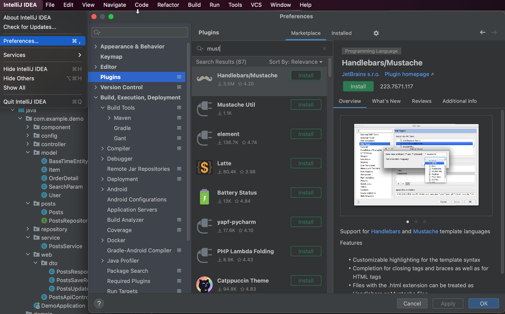
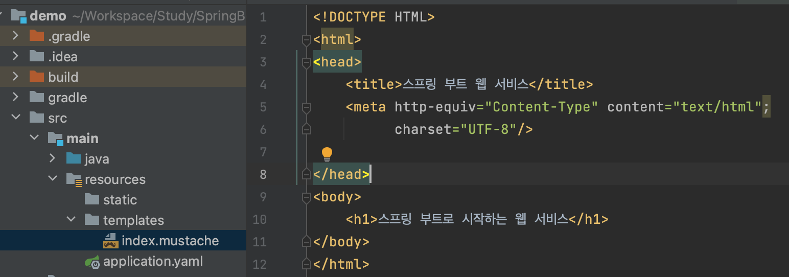
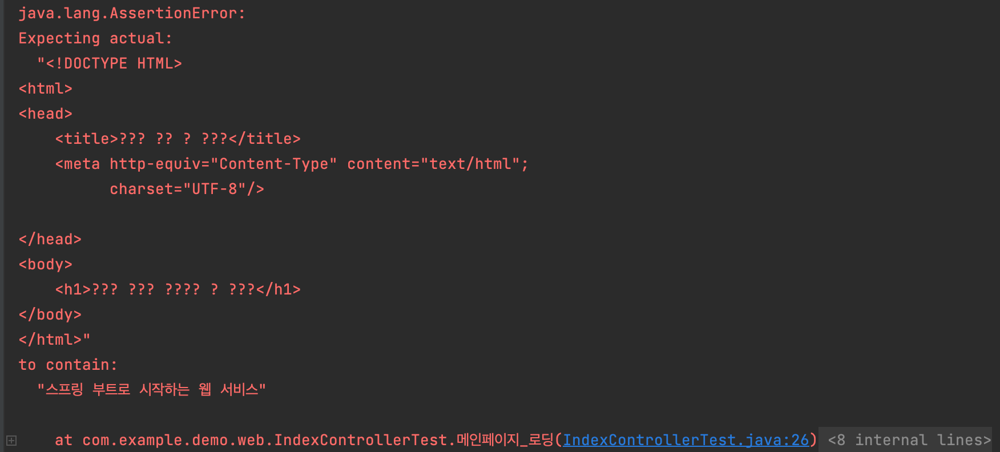

# Introduction

---

SpringBoot 개발에서 화면 구성을 위해 머스테치(Mustache)에 대하여 알아보고 템플릿 엔진에 대해서도 간략하게 다루도록 한다.


# 템플릿 엔진

---

지정된 ```템플릿과 데이터를 합쳐 HTML문서를 출력하는 소프트웨어```로 서버 템플릿 엔진과 클라이언트 템플릿 엔진으로 나뉜다.

`서버 템플릿 엔진`: 서버에서 코드를 문자열로 만든 뒤 이를 HTML로 변환하여 브라우저로 전달. JSP, Freemarker 등

`클라이언트 템플릿 엔진`: 서버에서는 Json, Xml 형식의 데이터만 전달하고 브라우저(클라이언트)에서 데이터를 이용하여 화면을 생성하는 방식. 리액트, 뷰 등


# 머스테치(Mustache)

---

수 많은 언어를 지원하는 가장 심플한 템플릿 엔진. 사용하는 언어에 따라 서버 템플릿 엔진으로도, 클라이언트 템플릿 엔진으로도 사용될 수 있다.

머스테치의 장점으로는 아래와 같다.

1. 문법이 다른 템플릿 엔진보다 쉽다.
2. 로직 코드를 사용할 수 없어 View와 서버의 역할이 명확히 분리된다.
3. Mustache.js, Mustache.java 둘 다 있기 때문에 같은 문법으로 서버 템플릿 엔진, 클라이언트 템플릿 엔진을 모두 사용할 수 있다.

설치는 아래와 같이 plugins을 추가하는 것으로 간단히 가능하다. (인텔리제이 커뮤니티 버전에서도 가능)



설치가 완료되면 build.gradle에 의존성을 추가하여 사용할 수 있다.

```java
dependencies {
		implementation 'org.springframework.boot:spring-boot-starter-mustache'
}
```


간단한 테스트를 위해 아래와 같이 resources/templates 폴더에 index.mustache 파일을 구성한다.



```html
<!DOCTYPE HTML>
<html>
<head>
    <title>스프링 부트 웹 서비스</title>
    <meta http-equiv="Content-Type" content="text/html";
          charset="UTF-8"/>

</head>
<body>
    <h1>스프링 부트로 시작하는 웹 서비스</h1>
</body>
</html>
```


생성한 머스테치 파일에 URL을 매핑하기 위해 아래와 같이 컨트롤러를 구성한다.

```java
package com.example.demo.web;

import org.springframework.stereotype.Controller;
import org.springframework.web.bind.annotation.GetMapping;

@Controller
public class IndexController {

    @GetMapping("/")
    public String index(){
        return "index";
    }
}

```

머스테치 스타터를 설치하면 ***컨트롤러에서 리턴한 문자열 값으로 머스테치 파일의 경로가 지정***되는데 가령 아래 코드에서 "index"를 리턴하면 prefix로 머스테치의 기본 폴더 경로 `src/resources/template/`이 추가되며 postfix로 머스테치 확장자 `.mustache`가 추가된다. 

즉, 아래 index 메서드의 리턴은 `src/resources/template/index.mustache`로 전환되며 index.mustache 파일이 ViewResolver를 통해 view로써 동작한다.

> ViewResolver: 페이지 컨트롤러가 리턴한 뷰 이름에 해당하는 뷰 콤포넌트를 찾는 역할.


 테스트는 애플리케이션을 실행하여 서버를 띄운 뒤에 localhost:8080/ 에 접속하여 직접 뷰를 확인하거나 아래 테스트 코드를 이용하여 진행한다.

```java
package com.example.demo.web;

import org.junit.Test;
import org.junit.runner.RunWith;
import org.springframework.beans.factory.annotation.Autowired;
import org.springframework.boot.test.context.SpringBootTest;
import org.springframework.boot.test.web.client.TestRestTemplate;
import org.springframework.test.context.junit4.SpringRunner;

import static org.junit.Assert.*;
import static org.assertj.core.api.Assertions.assertThat;

@RunWith(SpringRunner.class)
@SpringBootTest(webEnvironment = SpringBootTest.WebEnvironment.RANDOM_PORT)
public class IndexControllerTest {

    @Autowired
    private TestRestTemplate restTemplate;

    @Test
    public void 메인페이지_로딩(){
        //when
        String body = this.restTemplate.getForObject("/",String.class);;

        //then
        assertThat(body).contains("스프링 부트로 시작하는 웹 서비스");
    }

}
```


### 테스트 에러 핸들링

테스트 결과 아래와 같은 에러가 발생할 수 있다.



localhost:8080으로 접속하니 아래와 같은 화면이 뜨며 한글 문자가 깨진다.

**


스프링 부트 2.7.x버전 + 머스테치 조합에서는 한글 깨짐이 발생한다고 하니 아래 `build.gradle` 파일에서 **스프링 부트 버전을 2.6.x 버전으로 내려주면 해결된다.** (필자의 경우 아래와 같이 2.7.10을 사용 중이기에 이러한 에러가 발생하였다.)

```java
plugins {
    id 'java'
    id 'org.springframework.boot' version '2.7.10' // 2.6.x로 변경
    id 'io.spring.dependency-management' version '1.1.0'
}
```


스프링 부트 버전을 내리기 부담스러울 때는 application.properties / application.yaml에서 아래와 같은 설정으로도 해결 가능하다.

1. application.properties

```java
server.servlet.encoding.force-response=true
```

2. application.yaml

```yaml
server:
  servlet:
    encoding:
      force-response: false
```

# Conclusion

---

머스테치가 무엇이고 어떻게 구성하는 지에 대해서 다루었다.

다음 포스트에서는 이어서 머스테치에 자바스크립트, 부트스트랩 등을 적용하여 좀 더 복잡한 화면 구성을 진행해보겠다.

# Reference

---

스프링 부트와 AWS로 혼자 구현하는 웹 서비스 - 이동욱님

https://corin-e.tistory.com/entry/%EC%8A%A4%ED%94%84%EB%A7%81%EB%B6%80%ED%8A%B8-mustache-%ED%95%9C%EA%B8%80-%EA%B9%A8%EC%A7%90
