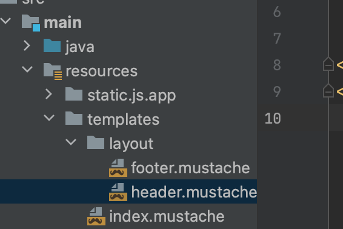
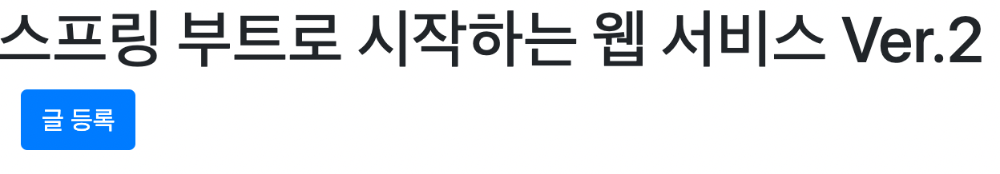
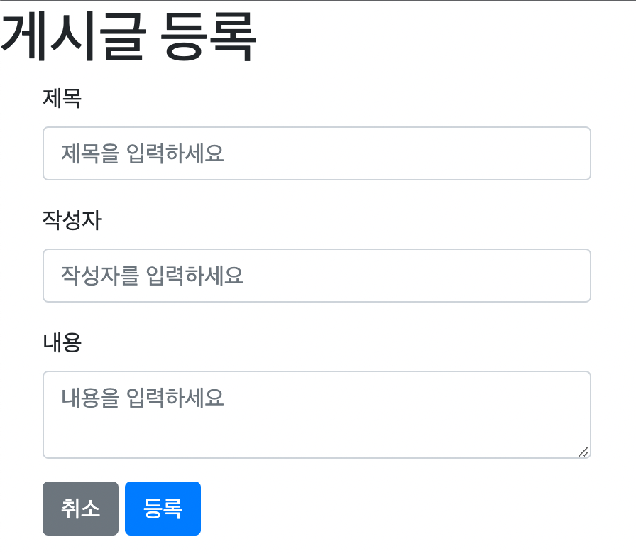
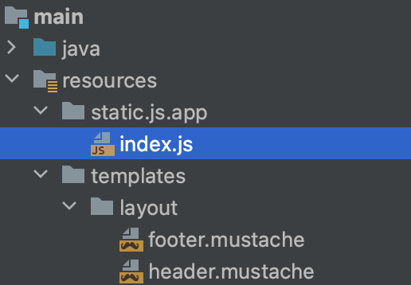
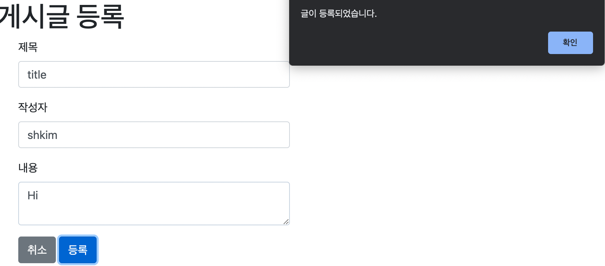
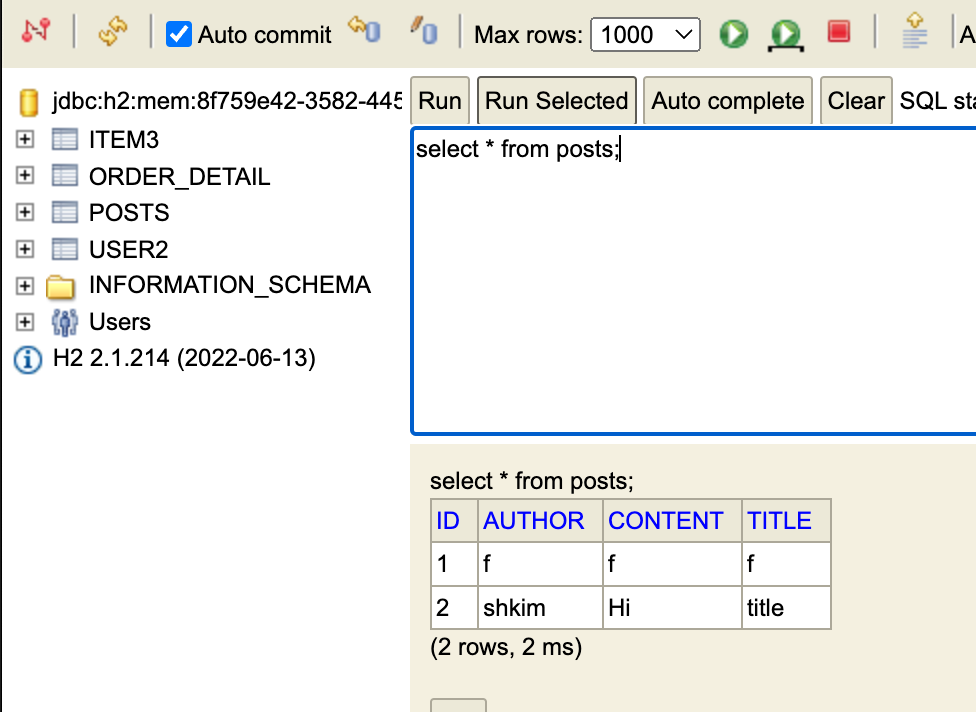

# Introduction

---

이전 포스트에 이어서 머스테치와 JS, 부트스트랩 등을 이용하여 좀 더 복잡한 화면 구성을 해본다.


# 부트스트랩(Bootstrap), 제이쿼리(jQuery) 적용

---

이전 포스트보다 복잡한 화면 구성을 위해 부트스트랩과 제이쿼리를 적용해본다.

>`부트스트랩(Bootstrap)`: 웹 프로젝트 개발을 위한 오픈 소스 `프론트엔드 프레임워크`로 웹 페이지 구성을 위한 CSS, JS 파일을 미리 만들어 놓고 다운로드 또는 CDN 방식으로 링크하는 방식.
>
>[^]: 출처: https://hanamon.kr/%EB%B6%80%ED%8A%B8%EC%8A%A4%ED%8A%B8%EB%9E%A9-bootstrap-%EC%9D%B4%EB%9E%80/

> `제이쿼리(jQuery)`: 오픈 소스 자바스크립트 라이브러리, 쉽고 간편한 API 문법을 제공하여 웹 개발에 자바스크립트를 보다 간편하게 사용할 수 있다.
>
> [^]: 출처: https://namu.wiki/w/jQuery


부트스트랩, 제이쿼리 등 프론트엔드 라이브러리를 적용하는 방법에는 CDN, 다운로드가 있는데 여기서는 CDN 방식을 사용

> `CDN(콘텐츠 전송 네트워크)`
>
> 데이터 사용량이 많은 애플리케이션의 ***웹 페이지 로드 속도를 높이기 위해 상호 연결된 서버 네트워크***를 의미
>
> 사용자가 웹 사이트를 방문할 때 서버의 데이터는 사용자의 컴퓨터에 도달하기 위해 인터넷을 통해 이동해야 하는데 사용자가 해당 서버에서 멀리 떨어져 있는 경우 동영상 또는 웹 사이트 이미지와 같은 대용량 파일을 로드하는 데 시간이 오래 걸린다. 이때, ***웹 사이트 콘텐츠가 지리적으로 사용자와 가까운 CDN 서버에 저장되어 컴퓨터에 훨씬 빨리 도달***할 수 있다.
>
> [^]: 출처: https://aws.amazon.com/ko/what-is/cdn/


이전 포스트에 만들어 놓은 index.mustache에 부트스트랩과 제이쿼리를 적용하는데 해당 라이브러리는 화면 구성에 매번 필요하기 때문에 레이아웃 방식을 이용하여 추가한다.

> 레아이웃 방식: 공통 영역을 별도 파일로 분리하여 필요한 곳에 가져다 쓰는 방식


resource/templates 폴더에 layout 폴더를 별도로 생성하고 footer, header를 생성한다.




header에는 css를 적용하고 footer에는 js를 적용하여 레이아웃을 구성한다.


1) Header

- head와 부트스트랩.css 적용
- css는 화면을 그리는 역할이기 때문에 가장 먼저 로딩하기 위해 head에 위치 (css를 늦게 로딩하면 유저에게 css가 적용되지 않은 깨진 화면을 노출시킬 수 있음)

```html
<!--header-->
<!DOCTYPE HTML>
<html>
<head>
    <title>스프링 부트 웹서비스</title>
    <meta http-equiv="Content-Type" content="text/html; charset=UTF-8" />

    <link rel="stylesheet" href="https://stackpath.bootstrapcdn.com/bootstrap/4.3.1/css/bootstrap.min.css">
</head>
<body>

```

2. Footer

- 제이쿼리와 부트스트랩.js 적용
- js는 용량이 클 경우 body의 실행이 늦어지는 문제가 생기기 때문에 body의 하단에 js를 위치
- bootstrap.js의 경우 jquery에 dependency가 있기 때문에 jquery를 먼저 호출 후 bootstrap 호출

```html
<!--footer-->
<script src="https://code.jquery.com/jquery-3.3.1.min.js"></script>
<script src="https://stackpath.bootstrapcdn.com/bootstrap/4.3.1/js/bootstrap.min.js"></script>

<script src="/js/app/index.js"></script>
</body>
</html>
```


생성한 header, footer를 index.mustache에 앞/뒤로 추가하고 버튼을 생성하여 /posts/save 주소와 연결시킨다.

- `{{> }}`: 현재 머스테치 파일 기준으로 경로를 설정하여 다른 파일을 가져옴

```html
{{>layout/header}}
    <h1>스프링 부트로 시작하는 웹 서비스 Ver.2</h1>
    <div class="col-md-12">
        <div class="row">
            <div class="col-md-6">
                <a href="/posts/save" role="button" class="btn btn-primary">글 등록</a>
            </div>
        </div>
    </div>
{{>layout/footer}}
```


여기까지 작성하고 애플리케이션 실행 후에 localhost에 접속하면 아래와 같은 화면 구성이 완료된다.




이제 `글 등록`버튼과 상호 작용할 컨트롤러를 생성해야 하는데 버튼은 /posts/save 주소와 매핑되어있기 때문에 해당 주소와 매핑되는 컨트롤러를 생성한다.

아래 postsSave 메서드는 /posts/save 주소에 접근하면 `posts-save.mustache`가 동작하도록 설정되어있다.

```java
package com.example.demo.web;

import org.springframework.stereotype.Controller;
import org.springframework.web.bind.annotation.GetMapping;

@Controller
public class IndexController {

    @GetMapping("/")
    public String index(){
        return "index";
    }

    @GetMapping("/posts/save") // 버튼과 연결되는 컨트롤러 메서드
    public String postsSave() {
        return "posts-save"; // /posts/save에 접근하면 posts-save.mustache가 view로써 동작
    }
}

```


버튼 호출 시 동작하는`posts-save.mustache`는 아래와 같이 생성한다.

```html
{{>layout/header}}

<h1>게시글 등록</h1>

<div class="col-md-12">
    <div class="col-md-4">
        <form>
            <div class="form-group">
                <label for="title">제목</label>
                <input type="text" class="form-control" id="title" placeholder="제목을 입력하세요">
            </div>
            <div class="form-group">
                <label for="author"> 작성자 </label>
                <input type="text" class="form-control" id="author" placeholder="작성자를 입력하세요">
            </div>
            <div class="form-group">
                <label for="content"> 내용 </label>
                <textarea class="form-control" id="content" placeholder="내용을 입력하세요"></textarea>
            </div>
        </form>
        <a href="/" role="button" class="btn btn-secondary">취소</a>
        <button type="button" class="btn btn-primary" id="btn-save">등록</button>
    </div>
</div>

{{>layout/footer}}
```


여기까지 구현하면 이제 localhost 접속 후 `글 등록` 버튼을 누르면 아래 화면이 구성된다.




이제 다음 단계로 위 화면에서 제목, 작성자, 내용에 데이터를 채워넣고 `등록` 버튼을 누르면 해당 데이터가 db에 저장되는 기능을 구현해본다.


아래 경로(resource/static)에 js.app 패키지를 생성하고 index.js를 생성한다.

이때 index.js의 폴더 구조가 static/js/app임을 확인하자. 필자는 실수로 static/js.app으로 패키지가 생성되어 js를 인식하지 못하는 에러를 겪었었다. 




index.js는 아래와 같이 구성된다.

```js
var main = {
    init : function () {
        var _this = this;
	      // btn-save의 id를 가진 HTML 원소에 click 이벤트가 발생했을 때, save 함수 호출
        $('#btn-save').on('click', function () {
            _this.save();
        });
    },
    save : function () {
        var data = {
            title: $('#title').val(),
            author: $('#author').val(),
            content: $('#content').val()
        };

        $.ajax({
            type: 'POST',							  // http 메서드 중 POST 호출
            url: '/api/v1/posts',       // 호출할 URL path 설정, ''/api/v1/posts'에 post 요청을 보냄
            dataType: 'json',
            contentType:'application/json; charset=utf-8',
            data: JSON.stringify(data)  // post 요청에 포함할 json 데이터
        }).done(function() {
            alert('글이 등록되었습니다.');   // 팝업 창을 띄움
            window.location.href = '/'; // 함수 호출이 완료되면 '/' 주소로 이동
        }).fail(function (error) {
            alert(JSON.stringify(error));
        });
    }

};

main.init();
```


위 코드를 보면 `/api/v1/posts`에 post 요청을 보내는데 해당 요청을 받기 위한 controller은 아래와 같이 구성할 수 있다. (서비스 단은 생략)

```java
package com.example.demo.web;

import com.example.demo.service.PostsService;
import com.example.demo.web.dto.PostsResponseDto;
import com.example.demo.web.dto.PostsSaveRequestDto;
import com.example.demo.web.dto.PostsUpdateRequestDto;
import lombok.RequiredArgsConstructor;
import org.springframework.web.bind.annotation.*;

@RequiredArgsConstructor
@RestController
public class PostsApiController {

    private final PostsService postsService;

    @PostMapping("/api/v1/posts")
    public Long save(@RequestBody PostsSaveRequestDto requestDto){
        return postsService.save(requestDto);
    }
}

```


여기까지 구성한 상태로 애플리케이션을 실행해보자.

이제 게시글 등록 화면에서 아래와 같이 데이터를 입력 후에 `등록` 버튼을 누르면 팝업 창이 뜨면서 데이터가 db에 저장된다. 




이번 포스트는 h2 db를 이용하였기 때문에 h2-console에서 방금 넣은 데이터를 확인할 수 있다.



# Conclusion

---

머스테치에 부트스트랩과 제이쿼리를 적용하여 보다 복잡한 화면 구성과 기능(post)을 진행하였다.

다음 포스트는 post 동작에 이어서 update, delete, 전체 조회 화면 등의 동작을 구현해본다.

# Reference

---

스프링 부트와 AWS로 혼자 구현하는 웹 서비스 - 이동욱님

https://hanamon.kr/%EB%B6%80%ED%8A%B8%EC%8A%A4%ED%8A%B8%EB%9E%A9-bootstrap-%EC%9D%B4%EB%9E%80/

https://namu.wiki/w/jQuery

https://aws.amazon.com/ko/what-is/cdn/
