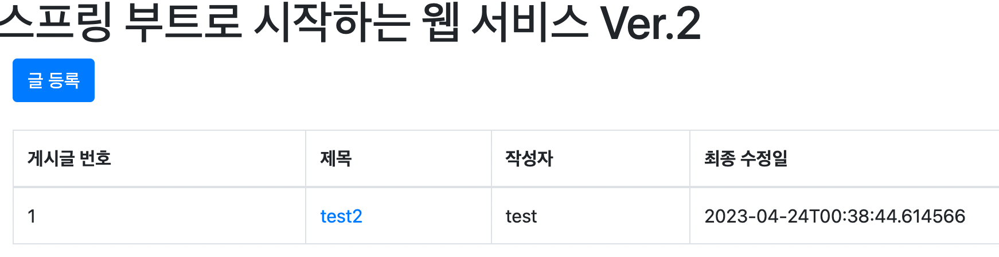

# Introduction

---

이전 포스트에서는 화면 구성과 post 기능을 구현했었는데 이에 추가로 다양한 기능을 구현해보자.


# 전체 화면 조회

---


기존에 만들었던 index 화면에서 위와 같이 테이블 형식으로 전체 데이터를 조회하는 화면을 추가하도록 한다.


## index.mustache

기존에 만든 index.mustache에 table 부분을 추가

```html
{{>layout/header}}
    <h1>스프링 부트로 시작하는 웹 서비스 Ver.2</h1>
    <div class="col-md-12">
        <div class="row">
            <div class="col-md-6">
                <a href="/posts/save" role="button" class="btn btn-primary">글 등록</a>
            </div>
        </div>
        <br>
        <!-- 목록 출력 영역 -->
        <table class="table table-horizontal table-bordered">
            <thead class="thead-strong">
            <tr>
                <th>게시글 번호</th>
                <th>제목</th>
                <th>작성자</th>
                <th>최종 수정일</th>
            </tr>
            </thead>
            <tbody id="tbody">
            {{#posts}}
                <tr>
                    <td>{{id}}</td>
                    <td>{{title}}</td>
                    <td>{{author}}</td>
                    <td>{{modifiedDate}}</td>
                </tr>
            {{/posts}}
            </tbody>
        </table>
    </div>
{{>layout/footer}}
```

위 코드에서 사용된 머스테치 문법은 아래와 같다.

`{{#posts}}`: posts라는 List 순회 (for 문과 동일한 역할)

`{{변수}}`: List의 각 원소 객체가 가진 필드에 접근, 가령 `{{id}}`는 posts 리스트가 포함하고 있는 객체 들의 id 필드에 해당한다.

즉, 위 코드는 posts라는 객체 리스트의 각 원소를 순회하며 각 원소의 id, title, author, modifiedDate 필드를 이용하여 테이블을 생성하는 코드로 해석할 수 있다. 


## Repository / Service

다음은 전체 화면 조회에 사용될 쿼리와 서비스 로직을 생성한다.

1) Repository에 전체 데이터를 조회할 findAllDesc 쿼리 메서드를 생성

```java
package com.example.demo.posts;

import org.springframework.data.jpa.repository.JpaRepository;
import org.springframework.data.jpa.repository.Query;
import org.springframework.stereotype.Repository;

import java.util.List;

@Repository
public interface PostsRepository extends JpaRepository<Posts, Long> {

    @Query("SELECT p FROM Posts p ORDER BY p.id DESC")
    List<Posts> findAllDesc();
}

```


2. Service 단에 위의 쿼리 메서드를 호출하여 결과를 리스트로 리턴하는 메서드를 추가

```java
...
import org.springframework.transaction.annotation.Transactional;
import java.util.List;
import java.util.stream.Collectors;

@RequiredArgsConstructor
@Service
public class PostsService {
    private final PostsRepository postsRepository;

    ...

    @Transactional(readOnly = true)
    public List<PostsListResponseDto> findAllDesc(){
        return postsRepository.findAllDesc().stream()
                .map(PostsListResponseDto::new)
                .collect(Collectors.toList());
    }

}

```

`@Transactional(readOnly = true)`: 해당 범위에 트랜잭션을 유지하지만 조회 기능만을 남겨두기 때문에 조회 속도가 개선된다.


## Controller

Index.mustache의 `{{#posts}}`를 위에서 생성한 서비스 로직과 연결하기 위해 `model.addAttribute` 호출

```java
package com.example.demo.web;

import com.example.demo.service.PostsService;
import lombok.RequiredArgsConstructor;
import org.springframework.stereotype.Controller;
import org.springframework.ui.Model; // 서버 템플릿 엔진과 객체를 연결하기 위한 클래스
import org.springframework.web.bind.annotation.GetMapping;

@@RequiredArgsConstructor
@Controller
public class IndexController {

    private final PostsService postsService;
    
    @GetMapping("/")
    public String index(Model model){
        model.addAttribute("posts", postsService.findAllDesc()); // 서비스와 컨트롤러 연결
        return "index";
    }

    @GetMapping("/posts/save")
    public String postsSave() {
        return "posts-save";
    }
}

```

`Model`: 서버 템플릿 엔진에서 사용할 객체를 저장


위까지 구현하고 애플리케이션 실행하면 아래와 같은 화면이 구성 완료된다.


# 게시글 수정, 삭제 화면 생성

---

이어서 게시글의 수정, 삭제를 구현한다.


## 수정 (update)

`Resource/templates` 경로에 아래와 같이 `posts-update.mustache` 생성 

```html
{{>layout/header}}

<h1>게시글 수정</h1>

<div class="col-md-12">
    <div class="col-md-4">
        <form>
            <div class="form-group">
                <label for="id">글 번호</label>
                <input type="text" class="form-control" id="id" value="{{posts.id}}" readonly>
            </div>
            <div class="form-group">
                <label for="title">제목</label>
                <input type="text" class="form-control" id="title" value="{{posts.title}}">
            </div>
            <div class="form-group">
                <label for="author"> 작성자 </label>
                <input type="text" class="form-control" id="author" value="{{posts.author}}" readonly>
            </div>
            <div class="form-group">
                <label for="content"> 내용 </label>
                <textarea class="form-control" id="content">{{posts.content}}</textarea>
            </div>
        </form>
        <a href="/" role="button" class="btn btn-secondary">취소</a>
        <button type="button" class="btn btn-primary" id="btn-update">수정 완료</button>
    </div>
</div>

{{>layout/footer}}
```

새롭게 사용된 머스테치 문법은 아래와 같다.

`{{post.id}}`: post라는 객체의 id 필드 접근

`readonly`: input 태그에 `읽기` 기능만을 허용하는 속성


위 코드의 의도대로 라면 `btn-update`버튼을 누르면 input 태그에 있는 데이터로 기존 데이터가 update 되게 해야 한다.

index.js에 아래와 같이 update function을 추가하여 `btn-update`의 기능을 구현한다.

```js
var main = {
    init : function () {
        var _this = this;
        ...
        // btn-update`의 id를 가진 HTML 원소에 click 이벤트가 발생했을 때, update 함수 호출
        $('#btn-update').on('click', function () { 
            _this.update();
        });
    },
    ...
    update : function () {
        var data = {
            title: $('#title').val(),
            content: $('#content').val()
        };

        var id = $('#id').val();

        $.ajax({
            type: 'PUT', // http 메서드 중 PUT 호출
            url: '/api/v1/posts/'+id, // 호출할 URL path 설정
            dataType: 'json',
            contentType:'application/json; charset=utf-8',
            data: JSON.stringify(data)
        }).done(function() {
            alert('글이 수정되었습니다.');
            window.location.href = '/';
        }).fail(function (error) {
            alert(JSON.stringify(error));
        });
    },
    ...

};

main.init();
```

위 코드는 update 함수를 호출하면 `/api/v1/posts/{id}` 의 url로 PUT 메서드를 요청하는 구현이 되어있다.

`/api/v1/posts/{id}`은 아래와 같이 구현하였다. (service단의 구현은 생략)

```java
...
@RequiredArgsConstructor
@RestController
public class PostsApiController {

    private final PostsService postsService;

    ...
      
    @PutMapping("/api/v1/posts/{id}")
    public Long update(@PathVariable Long id, @RequestBody PostsUpdateRequestDto requestDto){
        return postsService.update(id, requestDto);
    }

    ...
}

```


이제 `posts-update.mustache`의 구성이 끝났으니 이를 연결해주는 컨트롤러를 생성한다.

```java
...
@RequiredArgsConstructor
@Controller
public class IndexController {

    private final PostsService postsService;

    ...

    @GetMapping("/posts/update/{id}")
    public String postsUpdate(@PathVariable Long id, Model model){
        PostsResponseDto dto = postsService.findById(id);
        model.addAttribute("posts",dto);
        return "posts-update";
    }
}

```

위 코드는 `/posts/update/{id}`를 호출하면 `posts-update.mustache`와 연결되도록 구현되어 있다.

이제 처음에 구성하였던 전체 화면(`index.mustache`)에서 수정을 위한 페이지(`posts-update.mustache`)로 이동할 수 있도록 `index.mustache`를 수정한다.

`index.mustache`에서 아래 title 부분을 수정하여 title을 클릭하면 `/posts/update/{{id}}`로 이동하도록 구현한다.

- 즉, title을 클릭하면 `/posts/update/{{id}}`을 호출하게 되고 해당 url은 컨트롤러 단에서 `posts-update.mustache`와 연결되어있기 때문에 `posts-update.mustache`에서 구성한 수정 페이지로 이동하게 된다.

```html
...
<tbody id="tbody">
{{#posts}}
    <tr>
        <td>{{id}}</td>
        <!-- title을 클릭하면 /posts/update/{{id}}로 이동 -->
        <td><a href="/posts/update/{{id}}">{{title}}</a></td> 
        <td>{{author}}</td>
        <td>{{modifiedDate}}</td>
    </tr>
{{/posts}}
</tbody>
...
```


이제 update 구현이 모두 완료되었으니 애플리케이션을 실행하여 테스트를 진행한다.

1) 아래 미리 생성해놓은 테스트 데이터에서 파란색으로 표시된 `test`를 클릭


2. 클릭하면 아래와 같이 게시글 수정 페이지로 이동하며 `제목(title)`과 `내용(content)`를 수정할 수 있다. 또한 `글 번호(id)`와 `작성자(author)`는 머스테치 파일에서 readonly로 설정했기 때문에 수정이 불가함을 알 수 있다.


3. 제목을 수정하고 `수정 완료`를 누르면 아래와 같이 update가 수행되며 데이터가 업데이트 됨을 확인할 수 있다.




## 삭제 (delete)

삭제 기능은 위의 수정 기능과 거의 유사하게 구현된다.

우선 `posts-update.mustache` 에서 아래와 같이 `삭제` 버튼 (`btn-delete`)을 추가하는 코드를 작성한다.

```html
{{>layout/header}}

<h1>게시글 수정</h1>

<div class="col-md-12">
    <div class="col-md-4">
        <form>
            <div class="form-group">
                <label for="id">글 번호</label>
                <input type="text" class="form-control" id="id" value="{{posts.id}}" readonly>
            </div>
            <div class="form-group">
                <label for="title">제목</label>
                <input type="text" class="form-control" id="title" value="{{posts.title}}">
            </div>
            <div class="form-group">
                <label for="author"> 작성자 </label>
                <input type="text" class="form-control" id="author" value="{{posts.author}}" readonly>
            </div>
            <div class="form-group">
                <label for="content"> 내용 </label>
                <textarea class="form-control" id="content">{{posts.content}}</textarea>
            </div>
        </form>
        <a href="/" role="button" class="btn btn-secondary">취소</a>
        <button type="button" class="btn btn-primary" id="btn-update">수정 완료</button>
        <button type="button" class="btn btn-danger" id="btn-delete">삭제</button>
    </div>
</div>

{{>layout/footer}}
```


이제 `btn-delete`을 클릭하면 삭제 이벤트를 진행할 js 코드를 작성한다.

```js
var main = {
    init : function () {
        var _this = this;
        ...
        $('#btn-delete').on('click', function () {
            _this.delete();
        });
    },
    ...
    delete : function () {
        var id = $('#id').val();

        $.ajax({
            type: 'DELETE',
            url: '/api/v1/posts/'+id,
            dataType: 'json',
            contentType:'application/json; charset=utf-8'
        }).done(function() {
            alert('글이 삭제되었습니다.');
            window.location.href = '/';
        }).fail(function (error) {
            alert(JSON.stringify(error));
        });
    }

};

main.init();
```

위 코드는 `/api/v1/posts/{id}` url에 DELETE http 메서드를 요청하는 기능이 구현되어 있다.


`/api/v1/posts/{id}`의 DELETE 메서드와 매핑되는 컨트롤러를 구현하고 이와 연결되는 서비스 로직을 구현한다.

```java
...
@RequiredArgsConstructor
@RestController
public class PostsApiController {

    private final PostsService postsService;

    ...

    @DeleteMapping("/api/v1/posts/{id}")
    public Long delete(@PathVariable Long id){
        postsService.delete(id);
        return id;
    }
}

```

```java
...
  
@RequiredArgsConstructor
@Service
public class PostsService {
    private final PostsRepository postsRepository;

    ...

    @Transactional
    public Long delete(Long id) {
        Posts posts =  postsRepository.findById(id).orElseThrow(() -> new IllegalArgumentException("해당 게시글 없음 id="+id));
        postsRepository.delete(posts); // JpaRepository에서 기본 제공, deleteById로 id를 이용한 삭제도 가능
        return id;
    }

}

```


이제 애플리케이션을 실행 후 게시글 수정 페이지에 들어가면 아래와 같이 `삭제` 버튼이 추가되었음을 확인할 수 있다. 


`삭제` 버튼을 누르면 팝업 창이 뜨며 아래와 같이 초기 화면으로 돌아가고 삭제한 데이터가 사라진 것을 확인할 수 있다.


# Conclusion

---

머스테치 화면에 전체 데이터 조회, 수정, 삭제 기능을 추가하였다.

이제 기본적인 웹 페이지 구성이 완료되었으니 다음 포스트에서는 로그인과 시큐리티 관련 기능에 대해서 다뤄보도록 하겠다.

# Reference

---

스프링 부트와 AWS로 혼자 구현하는 웹 서비스 - 이동욱님
