# Introduction

---

스프링 시큐리티


# OAuth

---

이번 포스트에서는 로그인 기능을 추가하기 위해 `OAuth2.0`을 사용할 것이다.

> `OAuth`: 인터넷 사용자들이 비밀번호를 제공하지 않고 ***다른 웹사이트 상의 자신들의 정보에 대해 웹사이트나 애플리케이션의 접근 권한을 부여***할 수 있는 공통적인 수단으로서 사용되는, 접근 위임을 위한 개방형 표준이다.
>
> [^]: 출처: 위키백과


요새 웹 사이트에서는 id/pw를 직접 입력하는 것이 아닌 구글, 페이스북, 네이버 등의 소셜 로그인이 많이 보이는데, 이를 위해서는 해당 서비스(구글, 페이스북, 네이버 등)에서 사용자 정보를 가져와야 한다. 이때, `OAuth`를 이용하면 외부 서비스에 저장된 ***사용자 정보 등의 자원에 접근할 수 있는 권한(Authorization)을 부여 받을 수 있다.***


## 스프링부트와 OAuth 연동 

스프링부트 1.5에서 2.0로 업그레이드 되면서 OAuth2의 연동 방식이 달라졌는데 이 포스트에서는 스프링부트 2 방식인 `Spring Security Oauth2 Client` 라이브러리를 사용한다.

- 스프링부트 버전에 따라 연동 방식이 달라졌어도 `spring-security-oauth2-autoconfigure`를 사용하면 스프링부트 2에서도 1.5에서 쓰던 설정 방식을 그대로 사용할 수 있다. 


스프링 부트 1.5 방식 대비 2 방식을 사용하는 이유는 아래와 같다.

1. 기존 1.5 방식에서 사용되던 spring-security-oauth 프로젝트는 유지만 되고 신규 기능을 추가하지 않음

2. 신규 라이브러리가 확장성이 좋게 설계되어 있음

   

아래는 스프링 부트 버전에 따른 application.yaml의 설정 방식을 보여준다.

1. `스프링 부트 1.5`: 인증 관련 URL 주소를 입력해야 함

```yaml
// 스프링 부트 1.5
google :
  client : 인증정보
    clientSecret: 인증정보
    accessTokenUri: https://accounts.google.com/o/oauth2/token
    userAuthorizationUri: https://accounts.google.com/o/oauth2/auth
    clientAuthenticationScheme: form
    scope: email, profile
  resource:
    userInfoUri: https://www.googleapis/com/oauth2/v2/userinfo
```

2. `스프링 부트 2.0`: client 인증 정보 만으로도 설정 가능 (기존 url값들은 모두 enum으로 대체)

```yaml
// 스프링 부트 2.0
spring:
  security:
    oauth2:
     client:
       clientId: 인증정보
       clientSecret: 인증정보
```


스프링부트 2.0부터는 아래와 같이 `CommonOAuth2Provider`가 추가되어 인증 관련 기타 값 들을 여기서 설정할 수 있다.

```java
public enum CommonOAuth2Provider {

    GOOGLE {

        @Override
        public Builder getBuilder(String registrationId) {
            ClientRegistration.Builder builder = getBuilder(registrationId,
                    ClientAuthenticationMethod.BASIC, DEFAULT_REDIRECT_URL);
            builder.scope("openid", "profile", "email");
            builder.authorizationUri("https://accounts.google.com/o/oauth2/v2/auth");
            builder.tokenUri("https://www.googleapis.com/oauth2/v4/token");
            builder.jwkSetUri("https://www.googleapis.com/oauth2/v3/certs");
            builder.userInfoUri("https://www.googleapis.com/oauth2/v3/userinfo");
            builder.userNameAttributeName(IdTokenClaimNames.SUB);
            builder.clientName("Google");
            return builder;
        }
    },
```


### 구글 서비스 등록

이제 실제 적용을 위해 구글에서 `clientId`와 `clientSecret`를 발급하여 보자.


1. 구글 클라우드 -> 콘솔 화면으로 들어간다.

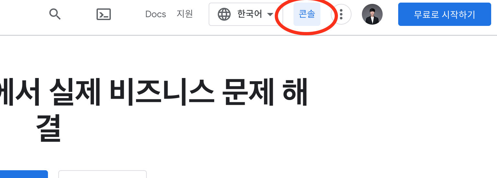

2. 왼쪽 위에 `프로젝트 선택` or `기존 프로젝트 이름(아래 예시의 freelec-springboot2-webservice)`으로 표시된 드롭 다운 버튼을 누르고 `새 프로젝트`를 선택

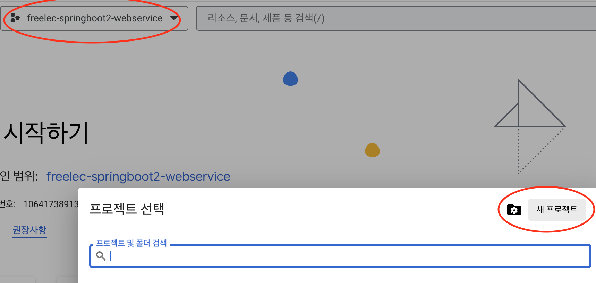

3. 프로젝트 이름을 설정하고 새 프로젝트를 생성

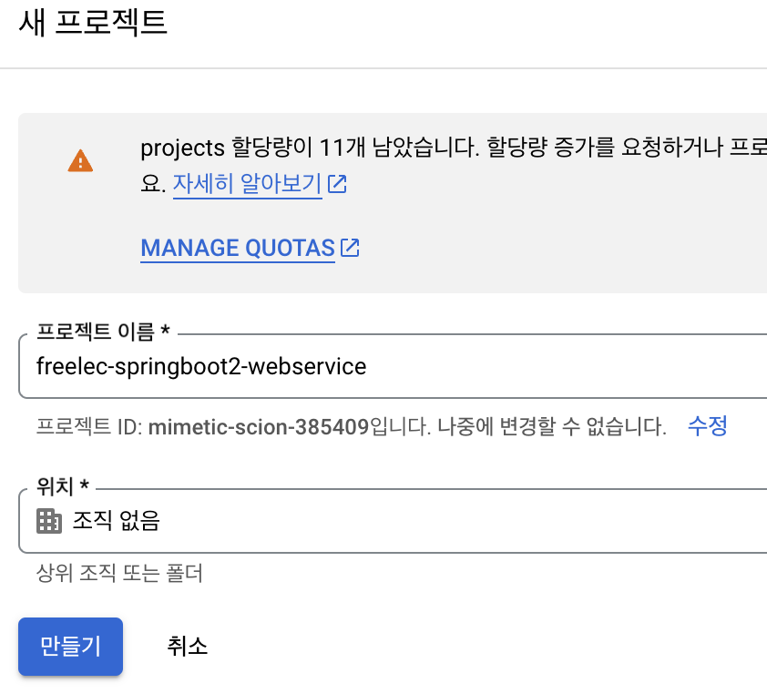

4. `프로젝트 선택` 드롭 다운에서 생성된 프로젝트를 선택하고 `API 및 서비스` / `사용자 인증 정보` 선택

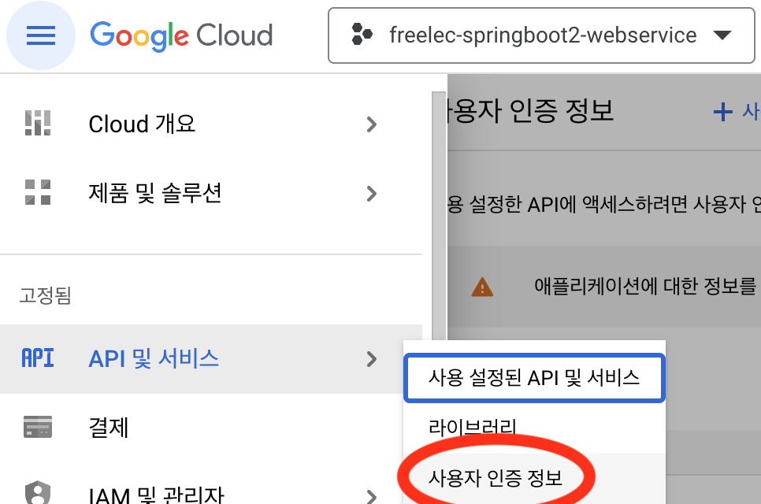

5. `사용자 인증 정보 만들기` -> `OAuth 클라이언트 ID` 선택

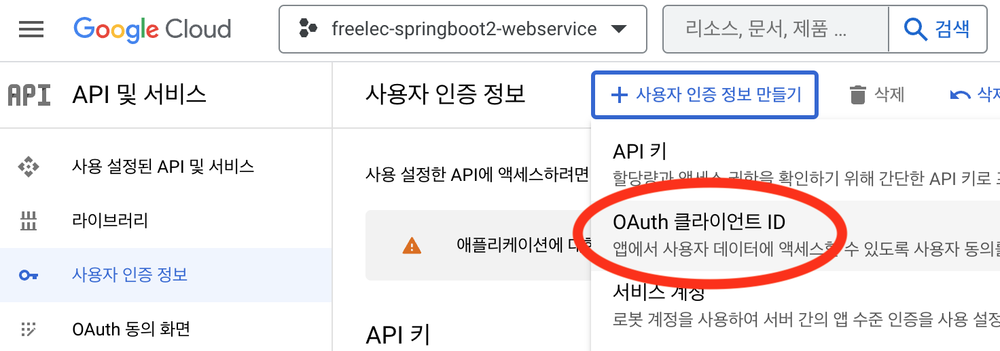

6. `동의 화면 구성` 선택

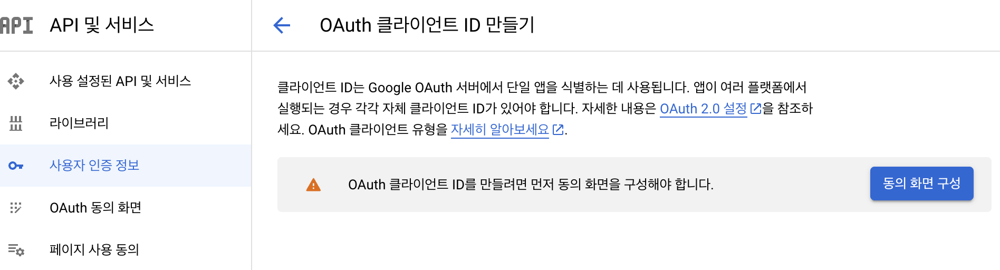

7. 동의 화면을 오픈할 유저 타입 설정 `내부(조직 내 사용자만 허용)` / `외부(모든 구글 계정 사용자)`

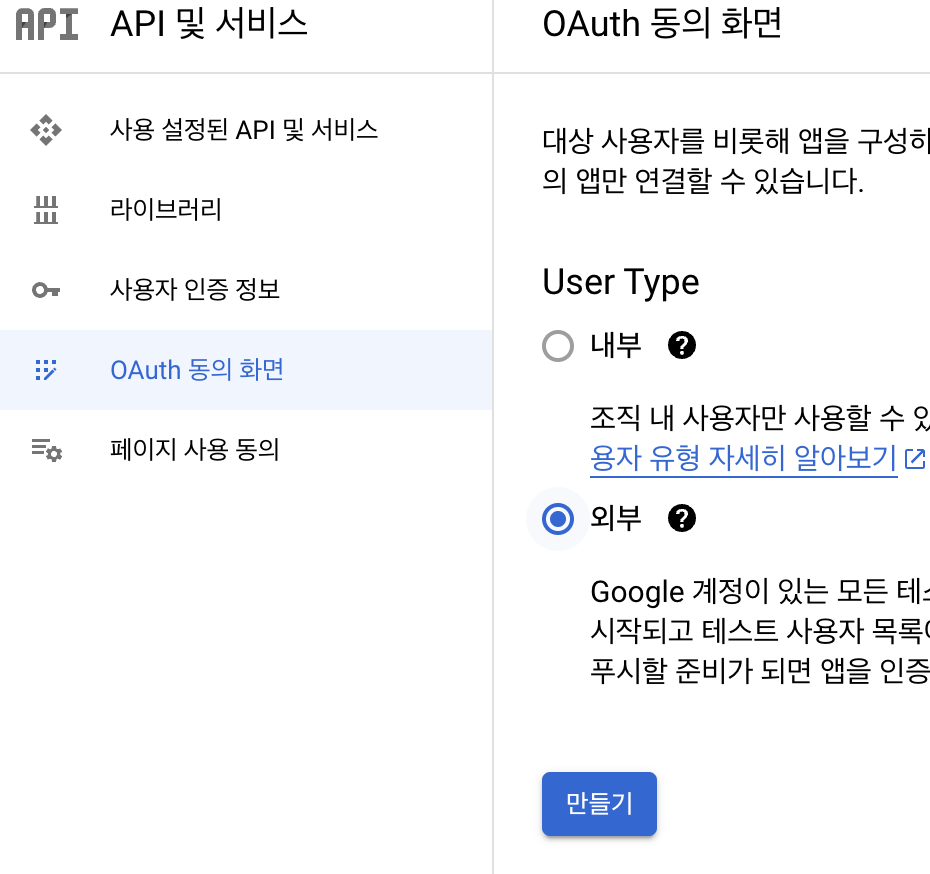

8. `앱 정보`, `개발자 연락차 정보` 설정

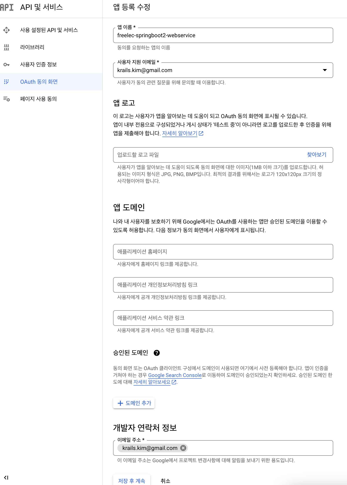

9. `범위 추가 또는 삭제` -> `userinfo.email / userinfo.profile / openid` 업데이트

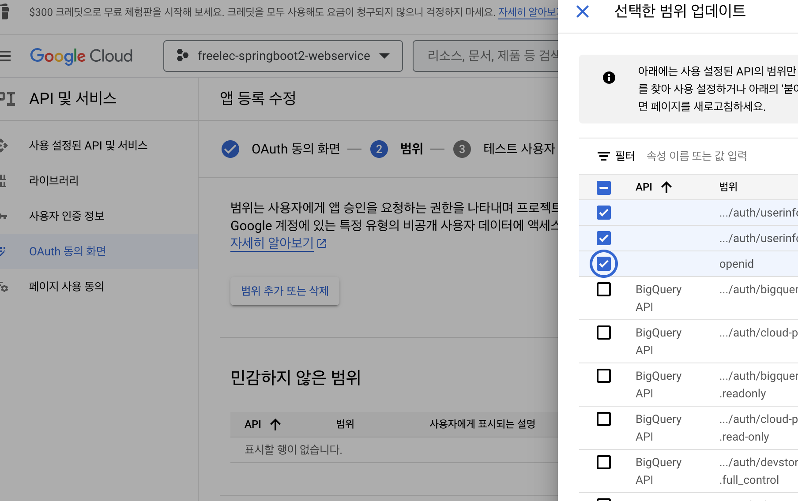

10. 동의 화면 설정 완료

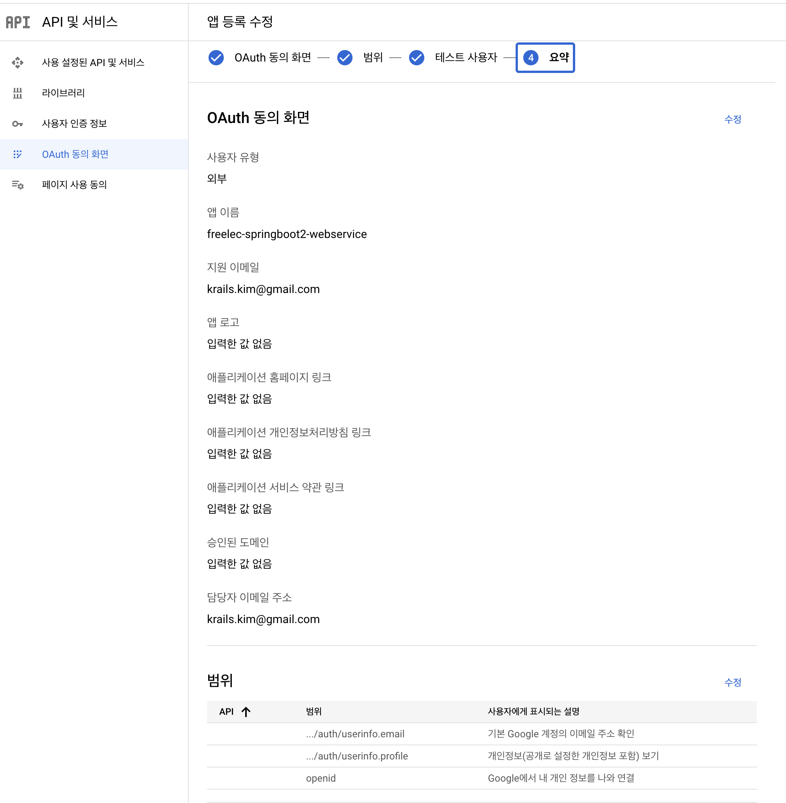

11. `사용자 인증 정보 만들기` -> `OAuth 클라이언트 ID` 선택

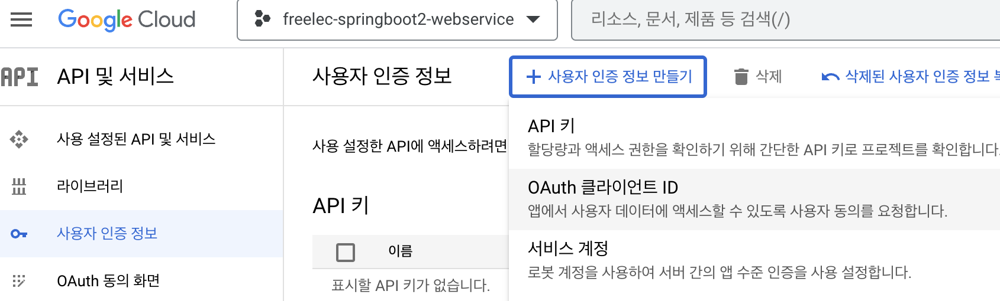

12. `애플리케이션 유형` -> 웹 선택 후, 이름 설정과 리디렉션 URI 설정

> 리디렉션 URI: 인증이 성공한 후에 리다이렉트할 URL로 스프링부트 2 버전의 시큐리티에서는 기본적으로 `{도메인}/login/oauth/code/google`를 기본 URL로 지원

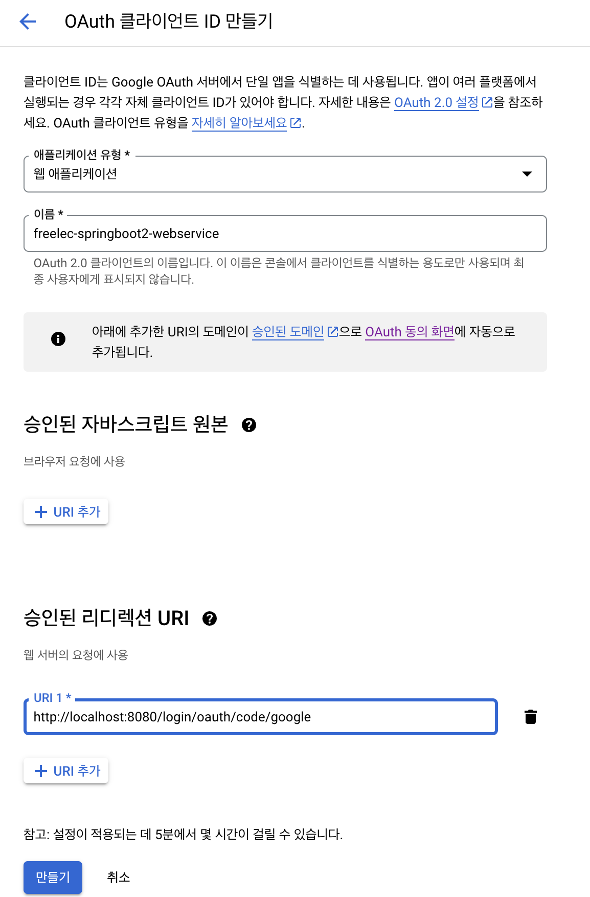

13. 클라이언트 ID 생성 완료

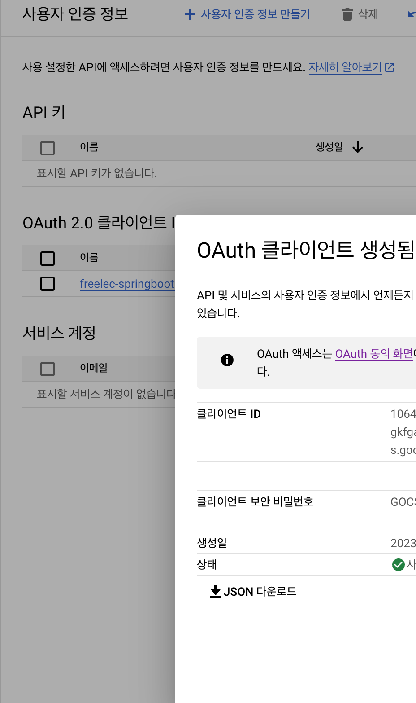

# Conclusion

---

머스테치 화면에 전체 데이터 조회, 수정, 삭제 기능을 추가하였다.

이제 기본적인 웹 페이지 구성이 완료되었으니 다음 포스트에서는 로그인과 시큐리티 관련 기능에 대해서 다뤄보도록 하겠다.

# Reference

---

스프링 부트와 AWS로 혼자 구현하는 웹 서비스 - 이동욱님

https://ko.wikipedia.org/wiki/OAuth
